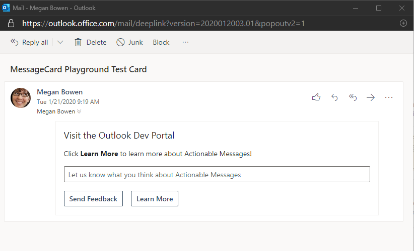

Actionable Messages in Outlook use Adaptive Card JSON to add the actionable card section to an HTML-formatted email message. In this unit, we take a look at how the Adaptive Card JSON is added into the email message.

## Actionable Message card

The key part of an Actionable Message is the message card. The card is displayed prominently at the top of a message, using UI elements that integrate with the native UI of the email client. The prominent placement of the card makes it ideal for communicating key information and requesting action from the recipient.

The card is implemented using standard Adaptive Card syntax and features, with some new Outlook-specific features added on.

Let's take a look at a simple example. The following JSON implements a basic card.

```json
{
  "type": "AdaptiveCard",
  "version": "1.0",
  "originator": "5a53e3ea-f50a-44d2-8855-2b5825d63eb8",
  "hideOriginalBody": "true",
  "body": [
    {
      "type": "TextBlock",
      "text": "Visit the Outlook Dev Portal",
      "size": "large"
    },
    {
      "type": "TextBlock",
      "text": "Click **Learn More** to learn more about Actionable Messages!"
    },
    {
      "type": "Input.Text",
      "id": "feedbackText",
      "placeholder": "Let us know what you think about Actionable Messages"
    }
  ],
  "actions": [
    {
      "type": "Action.Http",
      "title": "Send Feedback",
      "method": "POST",
      "url": "https://...",
      "body": "{{feedbackText.value}}"
    },
    {
      "type": "Action.OpenUrl",
      "title": "Learn More",
      "url": "https://docs.microsoft.com/outlook/actionable-messages"
    }
  ]
}
```

This card uses standard Adaptive Card elements, such as `TextBlock`, `Input.Text`, and `Action.OpenUrl`. It also uses Outlook-specific features, including:

- The `originator` property contains the provider ID assigned during registration of your service. Registration is covered in a later module.
- The `hideOriginalBody` property controls whether the Outlook client displays the HTML body of the email message underneath the card. This gives you the option of using the card to completely replace the body, or to use the card to complement the body. For email clients that do not support Actionable Messages, the HTML body is always displayed.
- The `Action.Http` action sends the recipient's input to the HTTPS endpoint specified in the `url` property. This endpoint is an web API that you've implemented to receive the information from the actionable message and process it.

The above JSON results in a card that looks like this in Outlook on the web.



## Adding a card to an email message

Actionable messages are added to email messages by adding a `<script>` tag in the HTML body's `<head>` tag.

```html
<html>
<head>
  <meta http-equiv="Content-Type" content="text/html; charset=utf-8">
  <script type="application/adaptivecard+json">{
    "type": "AdaptiveCard",
    "version": "1.0",
    ...
  }
  </script>
</head>
<body>
Visit the <a href="https://docs.microsoft.com/outlook/actionable-messages">Outlook Dev Portal</a> to learn more about Actionable Messages.
</body>
</html>
```
