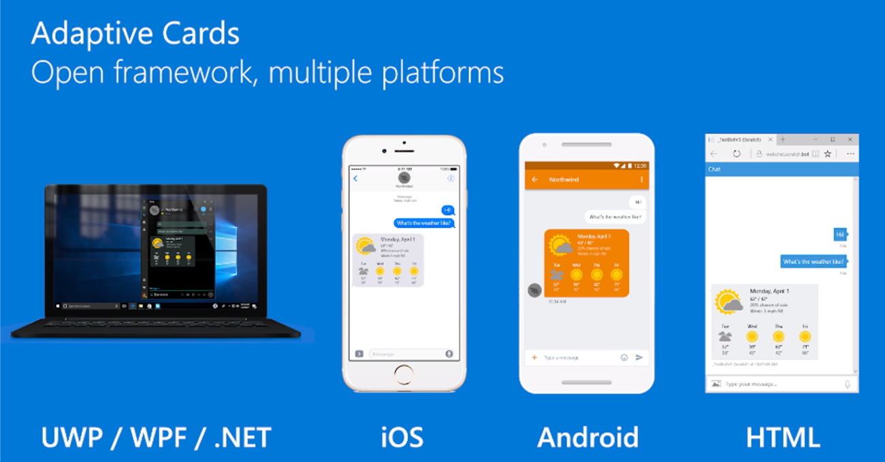
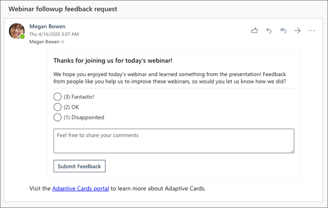

Developers can use Adaptive Cards to create engaging messages that are rendered into a native UI that adapts to the hosted app experience. Adaptive Cards are authored in JSON can be used for Outlook Actionable Messages, Microsoft Teams conversations, and many other host applications.

In this unit, you’ll learn about Adaptive Cards, where they can be used and how to create Adaptive Cards with the online designer.

## Adaptive Cards overview

Adaptive Cards are platform-agnostic snippets of UI, authored in JSON, that apps and services can openly exchange. When delivered to a specific app, the JSON is transformed into native UI that automatically adapts to its surroundings. It helps design and integrate light-weight UI for all major platforms and frameworks.



The cards are created using an open card exchange format enabling developers to exchange UI content in a common and consistent way. Adaptive Cards can be rendered natively in a host application such as Outlook, Microsoft Teams, Microsoft Windows, and even custom applications.

## Goals of Adaptive Cards

The goals for Adaptive Cards are:

- **Portable**: To any app, device, and UI framework
- **Open**: Libraries and schema are open source and shared
- **Low** cost: Easy to define, easy to consume
- **Expressive**: Targeted at the long tail of content that developers want to produce
- **Purely declarative**: No code is needed or allowed
- **Automatically styled**: To the Host application UX and brand guidelines

## Benefits of Adaptive Cards

Adaptive Cards offer plenty of benefits to card authors and experience owners.

### For card authors

Adaptive Cards are great for card authors:

- **One schema**: You get a single format, minimizing the cost of creating a card and maximizing the number of places it can be used.
- **Richer expression**: Your content can more closely align with want you want to say because you have a richer palette to paint with.
- **Broad reach**: Your content will work across a broader set of applications without you having to learn new schemas.
- **Input controls**: Your card can include input controls for gathering information from the user that is viewing the card.
- **Better tooling**: An open card ecosystem means better tooling that is shared by everyone.

### For experience owners

If you're an app developer who wants to tap into an ecosystem of third-party content, you'll love Adaptive Cards because:

- **Consistent user experience**: You guarantee a consistent experience for your users, because you own the style of the rendered card.
- **Native performance**: You get native performance as it targets your UI framework directly.
- **Safe**: Content is delivered in safe payloads so you don't have to open up your UI framework to raw markup and scripting.
- **Easy to implement**: You get libraries to easily integrate on any platform you support
- **Free documentation**: You save time because you don't have to invent, implement, and document a proprietary schema.
- **Shared tooling**: You save time because you don't have to create custom tooling.

## Adaptive Card schema

The current version of the Adaptive Card schema is v1.3. All elements in the [Adaptive Card Schema Explorer](https://adaptivecards.io/explorer/AdaptiveCard.html) display the version when they were introduced to the schema. Developers should note what elements are supported in specific schema versions because some application hosts may not currently support the latest version of the schema.

The schema is broken up into multiple categories:

- Cards
- Card elements
- Containers
- Actions
- Inputs
- Types

Each category contains multiple elements.

### Cards

The Adaptive Card schema evolved from a messaging card format that originated from Microsoft Outlook. Today, Microsoft recommends using Adaptive Cards in new applications.

The basic structure of a card is as follows:

- `AdaptiveCard`: The root object describes the AdaptiveCard itself, including its element makeup, its actions, how it should be spoken, and the schema version required to render it.
- `body`: The body of the card is made up of building-blocks known as elements. Elements can be composed in nearly infinite arrangements to create many types of cards.
- `actions`: Many cards have a set of actions a user may take on it. This property describes those actions, which typically get rendered in an "action bar" at the bottom.

```json
{
  "type": "AdaptiveCard",
  "version": "1.0",
  "body": [
    {
      "type": "TextBlock",
      "text": "Here is a ninja cat"
    },
    {
      "type": "Image",
      "url": "http://adaptivecards.io/content/cats/1.png"
    }
  ]
}
```

Additional properties include:

- `body`: The card elements to show in the primary card region.
- `actions`: The Actions to show in the card’s action bar.
- `selectAction`: An Action that will be invoked when the card is tapped or selected. `Action.ShowCard` isn't supported.
- `fallbackText`: Text shown when the client doesn’t support the version specified (may contain markdown).

### Card elements

Card elements include the different controls that can be added to the `body` property of the card. These include elements such as:

- `TextBlock`: Displays text, allowing control over font sizes, weight, and color.
- `Image`: Displays an image.
- `Media`: Displays a media player for audio or video content.
- `MediaSource`: Defines a source for a Media element
- `RichTextBlock`: Defines an array of inlines, allowing for inline text formatting.
- `TextRun`: Defines a single run of formatted text.

### Containers

The container category contains elements used to group multiple elements together. These include elements such as:

- `ActionSet`: Displays a set of actions.
- `Container`: Containers group items together.
- `ColumnSet` and `Column`: ColumnSet divides a region into Columns, allowing elements to sit side by side. 
- `FactSet` and `Fact`: The FactSet element displays a series of facts (for example, name/value pairs) in a tabular form.
- `ImageSet`: The ImageSet displays a collection of Images similar to a gallery.

### Actions

Actions are used to invoke behaviors such as opening a URL, submitting a card, or displaying a card.

- `Action.OpenUrl`: When invoked, show the given url either by launching it in an external web browser or showing within an embedded web browser.
- `Action.Submit`: Gathers input fields, merges with optional data field, and sends an event to the client. It's up to the client to determine how this data is processed. For example: With BotFramework bots, the client would send an activity through the messaging medium to the bot.
- `Action.ShowCard`: Defines an AdaptiveCard, which is shown to the user when the button or link is clicked.
- `Action.ToggleVisibility`: An action that toggles the visibility of associated card elements.
- `TargetElement`: Represents an entry for Action.ToggleVisibility's targetElements property.

### Inputs

Inputs are used to collect information from users that can be submitted to the host application or different systems.

- `Input.Text`: Lets a user enter text.
- `Input.Number`: Allows a user to enter a number.
- `Input.Date`: Lets a user choose a date.
- `Input.Time`: Lets a user select a time.
- `Input.Toggle`: Lets a user choose between two options.
- `Input.ChoiceSet` and `Input.Choice`: Allows a user to input a Choice.

## Adaptive Card designer

The Adaptive Card Designer provides a rich, interactive design-time experience for authoring adaptive cards.

The designer is available at the following URL: https://adaptivecards.io/designer.


## Adaptive Cards in Outlook

Whether you're filling out a survey, approving an expense report, or updating a CRM sales opportunity, Actionable Messages enable you to take quick actions right from within Outlook. Developers can now embed Adaptive Cards in their emails or notifications, elevating user engagement with their services and increasing organizational productivity.



## Adaptive Cards in Microsoft Teams

Microsoft Teams supports the latest version of the Adaptive Card schema in multiple extensibility points.

Developers can use Adaptive Cards in messages from bots, in messaging extensions and also in task modules.


## Summary

Developers can use Adaptive Cards to create engaging messages that are rendered into a native UI that adapts to the hosted app experience. Adaptive Cards are authored in JSON can be used for Outlook Actionable Messages, Microsoft Teams conversations, and many other host applications.

In this unit, you learned about Adaptive Cards, where they can be used and how to create Adaptive Cards with the online designer.
