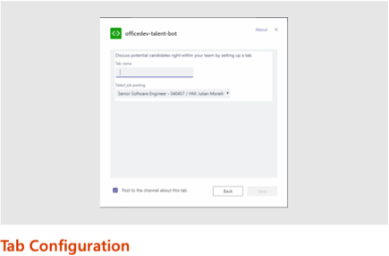
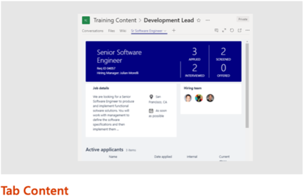
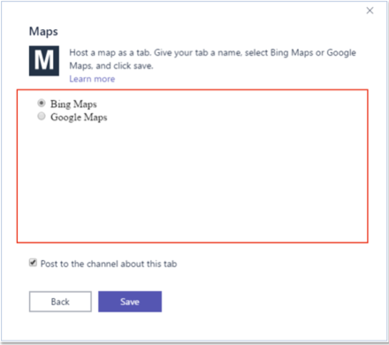
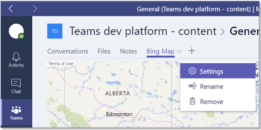

In this unit, you'll learn how to create channel tabs and configuration pages in Microsoft Teams apps.

## Comparing personal & channel tabs

In the previous section, you learned the fundamentals of Microsoft Teams tabs and how to create a custom personal tab. Your Microsoft Teams app can also include channel tabs, formerly referred to as configurable tabs.

Personal and channel tabs differ in both how they're used and their capabilities.

Personal tabs are only supported in the personal scope while channel tabs can be used within the team or group chat scope.

The content displayed within a personal tab is specific to individual user and isn't intended to be shared with others in a team. Channel tabs support all members of a team or channel.

## Tab Configuration and Content

One characteristic of a channel tab that differs from a personal tab is that channel tabs have a configuration experience displayed to the user when the tab is added to a channel. The configuration page defined in the manifest enables the developer to collect any configuration information the web app may need to customize the information show in the tab.



For example, consider a channel tab that displays the contents of a SharePoint list. The configuration page can collect the SharePoint site and list from the user and use that information to retrieve and display the correct list data in the tab.

The configuration page is another web app that the developer must create. The Microsoft Teams SDK allows developers to attach to an event fired when the user saves the configuration information. You're responsible for saving any configuration information your tab will need.

Developers can set the tab’s `contentUrl` and `entityId` from this save method, based on the options specified in the configuration page.



Similar to a personal tab, the content displayed in a channel tab is displayed in an \<iframe\>. The URL loaded in the \<iframe\> is defined by the `contentUrl` specified in the configuration page. The web app can then use the Microsoft Teams JavaScript SDK to obtain the `entityId` and/or `subEntityId` to determine the content to display. These properties can be used to implement tab-to-tab communication using deep linking.

## Channel tab manifest syntax

Channel tabs are defined within the Microsoft Teams app manifest file’s `configurableTabs` collection.

```json
"configurableTabs": [
  {
    "configurationUrl": "https://{{HOSTNAME}}/configMathTab/config.html",
    "canUpdateConfiguration": true,
    "scopes": [
      "team"
    ],
    "sharePointPreviewImage": "https://{{HOSTNAME}}/assets/configMathTab-preview.png",
    "supportedSharePointHosts": [
      "sharePointFullPage",
      "sharePointWebPart"
    ]
  }
],
```

The `configurationUrl` is the https:// URL to use when configuring the tab. This property is required.

The `canUpdateConfiguration` property is the value indicating whether an instance of the tab's configuration can be updated by the user after creation. Default: true.

The scopes property is an array of the scopes the tab supports. Channel tabs can be either **team** and/or **groupchat** for scopes. This property is required.

The `sharePointPreviewImage` and `supportedSharePointHosts` properties are option and used to make the tab available as a web part or full app page within SharePoint sites.

## Channel tab capabilities: configuration page

The configuration page is a web page that you host. When a user chooses to add or update a channel tab, Microsoft Teams will load the `configurationUrl` specified in the app manifest within an \<iframe\> inside the Add Tab dialog.

In this page, you present options and gather information from the user about what they want in your tab. For example, you may let the user select existing app resources (such as files or task lists) or create new resources just for this tab.

You may decide a tab’s configuration can or cannot be changed once it has been added to a team. This can be controlled within the app manifest using the `canUpdateConfiguration` flag. By default, this property is set to true.

## Channel tab capabilities: configuration page

This is an example of the channel tab configuration page experience.



This image is the configuration page that prompts the user which mapping site to use in the custom tab.



This image shows the tab context menu. If the channel tab doesn't have the `canUpdateConfiguration` property set to false, the Settings option is displayed in the menu. Selecting this menu option will display the configuration page again.

## Configuration page - implementation & requirements

Configuration pages, just like personal and channel tabs, are just web pages loaded within an \<iframe\>. The developer is responsible for implementing the user interface. Similar to the content pages for tabs, the web page used as a configuration page must be permitted to load within an \<iframe\>.

One requirement for configuration pages is they must notify Microsoft Teams when the settings have been configured and saved. This is done by registering a save handler using the `registerOnSaveHandler()` event. Within your handler for this event, use the `microsoftTeams.settings.setSettings()` method to update the tab’s settings and the `saveEvent.notifySuccess()` method to make Microsoft Teams aware the settings were successfully saved.

Microsoft Teams tab developers are responsible for saving any configuration information your tab will need.

## Saving settings on configuration page

This code is what you will use to save any settings from the configuration page in your web app and notifies Microsoft Teams the settings were saved successfully.

```ts
microsoftTeams.settings.registerOnSaveHandler((saveEvent: microsoftTeams.settings.SaveEvent) => {
  // Calculate host dynamically to enable local debugging
  const host = "https://" + window.location.host;
  microsoftTeams.settings.setSettings({
    contentUrl: host + "/configMathTab/?data=",
    suggestedDisplayName: "ConfigMathTab",
    removeUrl: host + "/configMathTab/remove.html",
    entityId: `${ this.state.mathOperator }MathPage`
  });
  saveEvent.notifySuccess();
});
```

Register your handler when the save button is clicked in the configuration page by calling the `microsoftTeams.settings.registerOnSaveHandler()` method from the Microsoft Teams JavaScript SDK.

Use the `microsoftTeams.settings.setSettings()` method to save any settings on the channel tab. Finally, notify Microsoft Teams the configuration page completed successfully by calling the `saveEvent.notifySuccess()` method.

## Channel tab capabilities: removal page

Channel tabs can be configured with a removal page. This page is displayed when a channel tab is removed from a channel or group chat. Developers can use this page to clean up any resources that may have been created when adding the tab to the channel.
