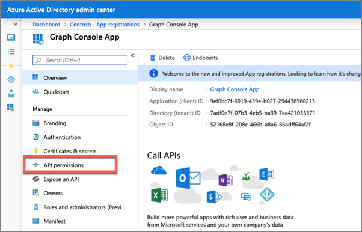
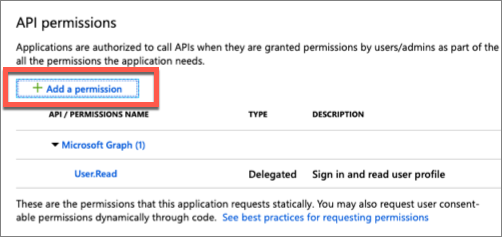
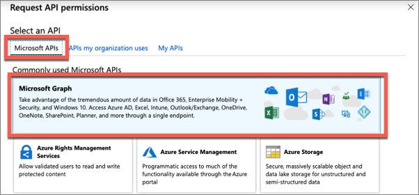
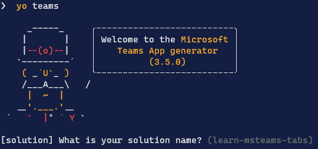
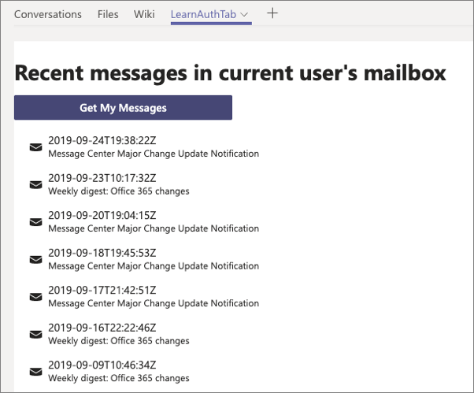

In this exercise, you'll create a custom channel tab that displays information about the current user, which was retrieved from Microsoft Graph.

## Prerequisites

Developing Microsoft Teams apps requires a Microsoft 365 tenant, Microsoft Teams configured for development, and the necessary tools installed on your workstation.

For the Microsoft 365 tenant, follow the instructions in [Microsoft Teams: Prepare your Microsoft 365 tenant](/microsoftteams/platform/get-started/get-started-tenant) to obtain a developer tenant if you don't currently have a Microsoft 365 account. Make sure you've also enabled Microsoft Teams for your organization.

Microsoft Teams must be configured to enable custom apps and allow custom apps to be uploaded to your tenant to build custom apps for Microsoft Teams. Follow the instructions in "Prepare your Microsoft 365 tenant" mentioned previously.

You'll use Node.js to create custom Microsoft Teams tabs in this module. The exercises in this module assume you have the following tools installed on your developer workstation.

> [!IMPORTANT]
> In most cases, installing the latest version of the following tools is the best option. The versions listed here were used when this module was published and last tested.

- [Node.js](https://nodejs.org/) - v12.\* (or higher)
- NPM (installed with Node.js) - v6.\* (or higher)
- [Gulp](https://gulpjs.com/) - v4.\* (or higher)
- [Yeoman](https://yeoman.io/) - v3.\* (or higher)
- [Yeoman Generator for Microsoft Teams](https://github.com/OfficeDev/generator-teams) - v3.0.\* (or higher)
- [Visual Studio Code](https://code.visualstudio.com)

*You must have the minimum versions of these prerequisites installed on your workstation.

## Create an Azure AD application

The tab created in this project submits a request to Microsoft Graph to retrieve email messages. All requests to Microsoft Graph must include an access token as proof of the user's identity and that they have the necessary permissions to call Microsoft Graph. To obtain an access token, you must create an Azure Active Directory (Azure AD) application that has the necessary Microsoft Graph permissions.

Open a browser, and go to the [Azure Active Directory admin center (https://aad.portal.azure.com)](https://aad.portal.azure.com). Sign in by using a Work or School account that has global administrator rights to the tenancy.

Select **Azure Active Directory** in the left pane.

  

Select **Manage** > **App registrations** in the left pane.

On the **App registrations** page, select **New registration**.

  

On the **Register an application** page, set the values as follows:

- **Name**: Teams Calendar Graph Tab
- **Supported account types**: Accounts in this organizational directory only (Contoso only - Single tenant)
- **Redirect URI**: Web = `https://XXXX.ngrok.io/auth-end.html`

    > [!NOTE]
    > Each time ngrok starts, it generates a new random subdomain. Azure AD requires that the redirect URI is specified in the app registration. You'll need to return to this Azure AD app registration to add or change the redirect URI after you start the ngrok utility.

    

    Select **Register**.

On the **Teams Calendar Graph Tab** page, copy the value of the **Application (client) ID**. You'll need it later in this exercise.

  

On the **Teams Calendar Graph Tab** page, select the **1 web, 0 spa, 0 public client** link under the **Redirect URIs**.

Locate the section **Implicit grant**, and select both **Access tokens** and **ID tokens**. This action tells Azure AD to return these tokens to the authenticated user if requested.


Save the settings by selecting **Save** in the toolbar at the top of the page.

### Grant Azure AD application permissions to Microsoft Graph

After you create the application, you need to grant it the necessary permissions to Microsoft Graph.

Select **API Permissions** in the left pane.



Select the **Add a permission** button.



In the **Request API permissions** panel that appears, select **Microsoft Graph** from the **Microsoft APIs** tab.



When you're prompted for the type of permission, select **Delegated permissions**.

Enter *Mail.R* in the **Select permissions** search box, and select the **Mail.Read** permission. Select the **Add permissions** button at the bottom of the panel.

On the **API Permissions** panel, select the **Grant admin consent for [tenant]** button. Select **Yes** to grant all users in your organization this permission.

## Create Microsoft Teams app

Open your command prompt, and go to a directory where you want to save your work. Create a new folder named **auth-tab**, and change the directory into that folder.

Run the Yeoman generator for Microsoft Teams by running the following command:

```console
yo teams
```



Yeoman starts and asks you a series of questions. Answer the questions with the following values:

- **What is your solution name?**: Learn MSTeams Auth Tabs
- **Where do you want to place the files?**: Use the current folder
- **Title of your Microsoft Teams App project**: Learn MSTeams Auth Tabs
- **Your (company) name (max 32 characters)**: Contoso
- **Which manifest version would you like to use?**: v1.8
- **Quick scaffolding**: Yes
- **What features do you want to add to your project?**: A tab
- **The URL where you will host this solution?**: (Accept the default option)
- **Would you like to show a loading indicator when your app/tab loads?** No
- **Default Tab name (max 16 characters)**: LearnAuthTab
- **Do you want to create a configurable or static tab?**: Configurable
- **What scopes do you intend to use for your tab?**: In a Team
- **Do you require Azure AD Single-Sign-On support for the tab?** No
- **Do you want this tab to be available in SharePoint Online?**: No

After you answer the generator's questions, the generator creates the scaffolding for the project. The generator then runs `npm install` that downloads all the dependencies required by the project.

The tab you'll create in this exercise will get the latest emails from the current user's mailbox by using Microsoft Graph. Install the Microsoft Graph JavaScript SDK and associated TypeScript type declarations for Microsoft Graph in the project. To install these packages, run the following commands:

```console
npm install @microsoft/microsoft-graph-client
npm install @types/microsoft-graph --save-dev
```

## Update the tab to use the current Theme

Locate and open the file that contains the React component used in the project: **./src/client/learnAuthTab/LearnAuthTab.tsx**.

Update the `import` statements in this file to include the components used in the configuration tab. Find the following `import` statement that imports the Fluent UI - React library:

```typescript
import { Provider, Flex, Text, Button, Header } from "@fluentui/react-northstar";
```

Replace the previous statement with the following import statement:

```typescript
import { Provider, Flex, Text, Button, Header, List } from "@fluentui/react-northstar";
```

Add the following import statement:

```typescript
import { EmailIcon } from "@fluentui/react-icons-northstar";
```

## Implement the tab's logic and user interface

Now you can implement the user interface for the tab. The simple tab has a basic interface. It presents a list of email messages for the current user and a button to start the request.

Add the following `import` statements after the existing `import` statements in the LearnAuthTab.tsx file. These statements include the Microsoft Graph JavaScript SDK and associated TypeScript type declarations into the file:

```typescript
import * as MicrosoftGraphClient from "@microsoft/microsoft-graph-client";
import * as MicrosoftGraph from "microsoft-graph";
```

Next, update the state of the component to store the email messages returned from Microsoft Graph.

```typescript
const [messages, setMessages] = useState<MicrosoftGraph.Message[]>([]);
```

Locate the `return` statement, and update it to the following code. The component displays a button for the user to select to sign in and request their emails from Microsoft Graph. It then displays the email messages in a list.

```tsx
return (
  <Provider theme={theme}>
    <Flex column gap="gap.small">
      <Header>Recent messages in current user&apos;s mailbox</Header>
      <Button primary
              content="Get My Messages"
              onClick={handleGetMyMessagesOnClick}></Button>
      <List selectable>
        {
          messages.map((message, i) => (
            <List.Item media={<EmailIcon></EmailIcon>}
              header={message.receivedDateTime}
              content={message.subject} index={i}>
            </List.Item>
          ))
        }
      </List>
    </Flex>
  </Provider>
);
```

Add the `onclick` event handler for the button to the `LearnAuthTab` class.

```typescript
const handleGetMyMessagesOnClick = async (event): Promise<void> => {
  await getMessages();
}
```

## Implement the authentication and Microsoft Graph request logic

At this point, the tab is ready to add the logic necessary to request the email messages for the current user. Before you request email messages from Microsoft Graph, you need the user to sign in and obtain an access token from Azure AD. There are multiple steps to do to implement the authentication routine.

Start by adding the following method to the `LearnAuthTab` component:

```typescript
const getMessages = async (promptConsent: boolean = false): Promise<void> => {
  const token = await getAccessToken();

  const msGraphClient: MicrosoftGraphClient.Client = MicrosoftGraphClient.Client.init({
    authProvider: async (done) => {
      done(null, token);
    }
  });

  msGraphClient
    .api("me/messages")
    .select(["receivedDateTime", "subject"])
    .top(15)
    .get(async (error: any, rawMessages: any, rawResponse?: any) => {
      if (!error) {
        setMessages(rawMessages.value);
        Promise.resolve();
      } else {
        console.error("graph error", error);
      }
    });
}
```

The `getMessages()` method first acquires an access token. It then submits the request to Microsoft Graph for the top 15 email messages.

The `getAccessToken()` method uses the Microsoft Teams JavaScript SDK to start the authentication process. It opens a pop-up window that loads the **auth-start.html** page to start the authentication process with Azure AD. Ultimately, the authentication process ends in the pop-up window and results in either a successful or failed authentication process. In either case, the associated callback handlers are registered in the `authenticate()` method in the following code:

```typescript
const getAccessToken = async (promptConsent: boolean = false): Promise < string > => {
  return new Promise<string>((resolve, reject) => {
    microsoftTeams.authentication.authenticate({
      url: window.location.origin + "/auth-start.html",
      width: 600,
      height: 535,
      successCallback: (accessToken: string) => {
        resolve(accessToken);
      },
      failureCallback: (reason) => {
        reject(reason);
      }
    });
  });
}
```

Create the new file **./src/public/auth-start.html** in the project, and add the following code to it. This file uses the Microsoft Teams JavaScript SDK and Azure Active Directory Authentication Library JavaScript (ADAL.js) libraries to configure ADAL for the Azure AD application created previously in this exercise. It then redirects the user to the Azure AD sign-in page and instructs the page to redirect the user back to **auth-end.html** on our site.

```html
<!DOCTYPE html>
<html>
<body>
  <script src="https://statics.teams.cdn.office.net/sdk/v1.9.0/js/MicrosoftTeams.min.js" crossorigin="anonymous"></script>
  <script src="https://secure.aadcdn.microsoftonline-p.com/lib/1.0.17/js/adal.min.js" crossorigin="anonymous"></script>
  <script type="text/javascript">
    microsoftTeams.initialize();
    microsoftTeams.getContext(function (msTeamsContext) {

      // ADAL.js configuration
      let config = {
        clientId: "{{REPLACE_AZUREAD_APP_ID}}",
        redirectUri: window.location.origin + "/auth-end.html",
        cacheLocation: "localStorage",
        endpoints: {
          "https://graph.microsoft.com": "https://graph.microsoft.com"
        }
      };

      // add extra query parameters Azure AD login request
      //  include scope for OpenID connect and log-in hint by using the current Microsoft Teams logged-in user
      config.extraQueryParameters = "scope=open+profile";
      if (msTeamsContext.upn) {
        config.extraQueryParameters += "&login-hint=" + encodeURIComponent(msTeamsContext.userProfileName);
      }
      // check if consent required for new permission
      if (getUrlParameter('prompt') !== "") {
        config.extraQueryParameters += "&prompt=" + getUrlParameter('prompt');
      }

      // override URL to Azure AD auth endpoint to include extra query parameters
      config.displayCall = function (urlNavigate) {
        if (urlNavigate) {
          if (config.extraQueryParameters) {
            urlNavigate += "&" + config.extraQueryParameters;
          }
          window.location.replace(urlNavigate);
        }
      }

      // login
      let authContext = new AuthenticationContext(config);
      authContext.clearCache();
      authContext.login();
    });

    function getUrlParameter(name) {
      name = name.replace(/[\[]/, '\\[').replace(/[\]]/, '\\]');
      var regex = new RegExp('[\\?&]' + name + '=([^&#]*)');
      var results = regex.exec(location.search);
      return results === null ? '' : decodeURIComponent(results[1].replace(/\+/g, ' '));
    };
  </script>
</body>
</html>
```

Create the new file **./src/public/auth-end.html** in the project, and add the following code to it. Like the **auth-start.html** file, this file uses the Microsoft Teams JavaScript SDK and ADAL.js libraries to configure ADAL for the Azure AD application created previously in this exercise. It parses the results received from Azure AD. If the user successfully authenticated, this page requests an access token for Microsoft Graph from Azure AD and then notifies Microsoft Teams that the authentication process succeeded or failed.

The notification process triggers Microsoft Teams to close the pop-up window and run the registered callback handlers in our tab:

```html
<!DOCTYPE html>
<html>
<body>
  <script src="https://statics.teams.cdn.office.net/sdk/v1.9.0/js/MicrosoftTeams.min.js" crossorigin="anonymous"></script>
  <script src="https://secure.aadcdn.microsoftonline-p.com/lib/1.0.17/js/adal.min.js" crossorigin="anonymous"></script>

  <script type="text/javascript">
    microsoftTeams.initialize();

    // ADAL.js configuration
    let config = {
      clientId: "{{REPLACE_AZUREAD_APP_ID}}",
      cacheLocation: "localStorage",
      navigateToLoginRequestUrl: false,
      endpoints: {
        "https://graph.microsoft.com": "https://graph.microsoft.com"
      }
    };

    let authContext = new AuthenticationContext(config);

    // ensure page loaded via Azure AD callback
    if (authContext.isCallback(window.location.hash)) {
      authContext.handleWindowCallback(window.location.hash);

      // Only call notifySuccess or notifyFailure if this page is in the authentication pop-up
      if (window.opener) {
        // if able to retrieve current user...
        if (authContext.getCachedUser()) {
          // get access token for Microsoft Graph
          authContext.acquireToken("https://graph.microsoft.com", function (error, token) {
            if (token) {
              microsoftTeams.authentication.notifySuccess(token);
            } else if (error) {
              microsoftTeams.microsoftTeams.notifyFailure(error);
            } else {
              microsoftTeams.authentication.notifyFailure("UnexpectedFailure");
            }
          });
        } else {
          microsoftTeams.authentication.notifyFailure(authContext.getLoginError());
        }
      }
    }
  </script>
</body>
</html>
```

> [!IMPORTANT]
> Make sure to replace the string `{{REPLACE_AZUREAD_APP_ID}}` in the previous two code listings with the ID of the Azure AD application you created previously in this exercise.

## Install and test the Microsoft Teams app

From the command line, go to the root folder for the project and run the following command:

```console
gulp ngrok-serve
```

Copy the ngrok URL displayed in the console. Go back to Azure AD, and add or update the redirect URI of the Azure AD application previously created in this lab. Otherwise, Azure AD won't redirect you back to the **auth-end.html** page. The URL should be in the form of **https://{ngrok-subdomain}.ngrok.io/auth-end.html**.

In the browser, go to [Microsoft Teams](https://teams.microsoft.com), and sign in with the credentials of a Work and School account.

Using the app bar on the left, select the **More added apps** button. Then select **More apps**.

On the **Browse available apps and services** page, select **Upload a custom app** > **Upload for me or my teams**.

In the file dialog box that appears, select the Microsoft Teams package in your project. This app package is a zip file that can be found in the project's **./package** folder.

After the package is uploaded, Microsoft Teams displays a summary of the app. Select the **Add to a team** button to install the app. Select a team to add the channel to, and select **Save** on the configuration page.

Select the app to go to the new tab.


Select the **Get My Messages** button. Microsoft Teams opens the pop-up window that will be redirected to Azure AD for sign-in. If you're prompted to sign in, enter the credentials of your Work and School account.

> [!NOTE]
> You might not be prompted to sign in because you're already signed in to Microsoft Teams. Azure AD won't require you to sign in again and redirects you to the specified redirect URI for the Azure AD application.

After you've successfully signed in to Azure AD, Microsoft Teams closes the pop-up window and displays the last 15 emails in your mailbox retrieved from Microsoft Graph.



## Summary

In this exercise, you created a custom channel tab that displays information about the current user, which is retrieved from Microsoft Graph.
