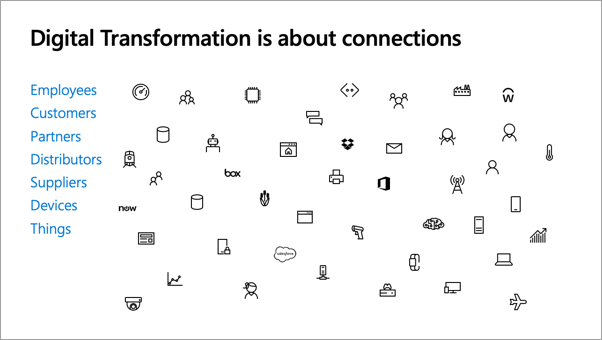
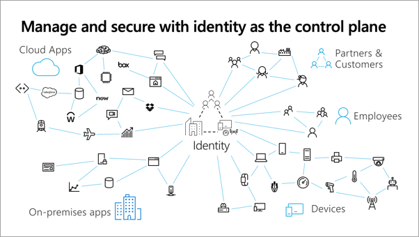
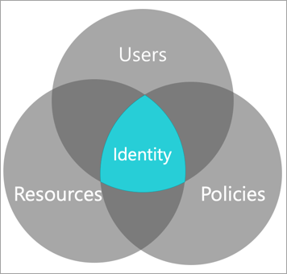
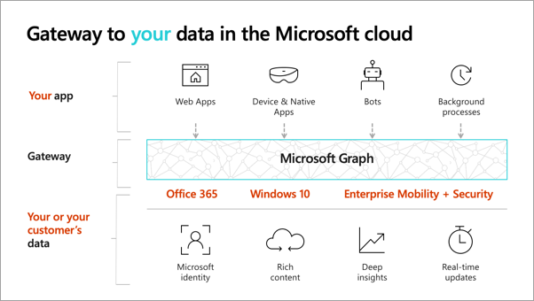

This unit will first provide an overview of Microsoft identity. It will then cover the different types of tokens that are used within the Microsoft identity platform.

## Overview of Microsoft identity

In today's world, physically protected networks aren't as common as they once were. Even your on-premises networks aren't as secure as you think they are. The configuration of today's networks are driven by the needs of users and business that has changed over time.

Organizations can't assume users will be in one place, rather they are on both internal and/or external networks. Users don't access networks with one device either; they have a myriad of devices and types of software architectures they use including on-premises apps, SAAS apps, mobile apps, and so on.

How are you as a developer supposed to properly secure your applications and your user's access to information across so many scenarios?

### Manage and secure with identity as the control plane

The answer is to use an identity provider as your control plane. By using your identity provider, your application and the organization can decide who gets to do what, when they get to do it, how they got to do it.

Access and control are important as well as that they have the level of sophistication available to them.

It might be OK if somebody is working on sensitive financial information when they are on the company network at the office. However, it might not be OK for them to access that information from an internet cafe on the other side of the world where the organization is unaware of the user's environment.

The idea is that your identity provider can help you provide the right control plane for your application.

### Identity: where users, resources and policies intersect

The identity provider is where the users, resources, and policies intersect within your organization.

As a developer, you want your application to be accessible to the highest number of users who should have access to it. Independent software vendors (ISVs) are especially interested in the greatest reach in order to grow their businesses.

You also need access to those resources the users need access to including mail and  information about me. Access to these resources is important in building valuable solutions for your customers.

A problem you need to address is how will all these users access their resources but in a way that complies with whatever policies and security requirements the enterprise demands.

How do you make sure that your application follows the right policies? Each enterprise will have a different point of view on what the policy should be.

This is where an identity platform can help. The goal of Microsoft identity is to make it easy for you to address the largest number of users and the most valuable amount of information in a secure way that satisfies the policies of those enterprises.

Let's look at how Microsoft identity approaches users, resources, and policies.

### Users: Azure AD, B2B and B2C

Microsoft identity includes three solutions for addressing the largest number of users.

All customers of Office 365 and Microsoft Azure use Azure Active Directory (Azure AD). This covers over 20 million organizations with more than 1.2 billion identities.

Microsoft identity offers two additional solutions for partners and customers.

Azure AD business to business (B2B) enables an organization in Azure AD to securely share files and resources with another organization in Azure AD.

Azure AD Business to Customer (B2C) enables an organization to provide customer-facing apps that enable users to sign with an identity they already have, such as a Microsoft Account, Gmail, Facebook, or Twitter account or create an account for the solution.​

### Resources: Gateway to your data in Microsoft cloud

Microsoft Graph is the gateway to all your data in the Microsoft Cloud. From Office 365, Enterprise Mobility + Security to Windows 10, Microsoft Graph enables developers to build applications that provide users access to their data. Developers and users can access their data with Microsoft Graph by authenticating and authorizing users with Microsoft identity.

### Policies

The third element of Microsoft identity is policies. Policies have become complicated with users accessing resources from different networks and devices. The threat matrix depending on how a user is accessing a resource is complex. Various combinations of different users using different devices pose different risks to the organization.

Microsoft identity is built to support this complex and dynamic threat matrix. One policy can be applied when a user is on a trusted corporate network using their company issued laptop, while another policy can apply to the same user when they access the same resource from home on their personal tablet.

By relying on Microsoft identity to handle these complex policies, you don't have to implement the complex logic in your custom applications.

So far, we've looked at what Microsoft identity is from a high level. As a developer, when you build an application, you will ultimately request tokens from Microsoft identity to identify a user and authorize them to use an application with specific permissions. Let's look at the different tokens you will use.

## OpenID Connect and ID token

The first type of token is an ID token that is made available via Microsoft identity's support of the OpenID Connect protocol.

### What is OpenID Connect

OpenID Connect extends the OAuth 2.0 authorization protocol to use as an authentication protocol, so that you can implement single sign-on using OAuth in your applications. It also introduces the concept of an ID token.

An ID token is a security token that allows the client to verify the identity of the user. The ID token also gets basic profile information about the user. Because OpenID Connect extends OAuth 2.0, apps can securely acquire access tokens, which can be used to access resources that are secured by an authorization server.

The claims included within an ID token can be used for the user experience within your application, as keys in a database, and providing access to the client application.

> [!IMPORTANT]
> It is important not to confuse *ID tokens* with *access tokens* that are used for authorization.

ID tokens for Microsoft identity are JSON web tokens (JWT). These ID tokens consist of a header, payload, and signature. The header and signature are used to verify the authenticity of the token, while the payload contains the information about the user requested by your client.

### How do you obtain an ID token

It is important for developers, whenever possible, to use a well-maintained Open ID Connect library. While Microsoft identity is built on open standards like OAuth2 and Open ID Connect, fully implementing these protocols is time consuming and complicated. It is also required that any implementation of these standards be kept up-to-date with the latest recommendations to ensure the implementation is as secure as possible. ​

When your web app needs to authenticate the user, it can direct the user to the Microsoft identity platform `/authorize` endpoint using an Open ID Connect library. ​

At this point, the user is prompted to enter their credentials, enter a multi-factor, use a FIDO2 compatible device, or perhaps use a passwordless experience using Microsoft Authenticator or Windows Hello to complete the authentication. All of these options are handled by the platform without any additional code from the developers. The Microsoft identity platform endpoint verifies that the user has consented to the permissions indicated in the scope parameter. If the user hasn't consented to any of those permissions, the Microsoft identity platform endpoint prompts the user to consent to the required permissions. You can read more about permissions, consent, and multi-tenant apps.​

After the user authenticates and grants consent, the Microsoft identity platform endpoint returns a response to your app at the indicated redirect URI.​

## Access tokens

Many web apps need to not only sign the user in, but also to access a web service on behalf of the user by using OAuth. Applications request access tokens from Microsoft identity to use when calling a web service. ​

*Access tokens* enable clients to securely call APIs protected by Azure AD. Applications should never inspect or validate an access token. Access tokens must only be passed to the API.

Access tokens are created based for the audience of the token, meaning the API that owns the scopes in the token. ​

### How do you obtain an access token

To acquire an access token, use your Open ID Connect/OAuth2 library. For example with MSAL, you always use the following pattern. ​

First you attempt to acquire the access token silently. If MSAL has a token cached, or can silently refresh a token, it will do so.  ​

By including permission scopes in the request, the Microsoft identity platform endpoint ensures that the user has consented to the permissions indicated in the scope query parameter. ​

If MSAL cannot acquire the token silently, it will throw a **UI Required** exception. If this happens, the developer should request the access token interactively. This could happen if consent for the permission has not been granted, the user has not yet authenticated, or perhaps the users is using an unmanaged device to access sensitive data from a location where the user has never been before and an MFA is required. ​

### Difference between user and application access tokens

Your application may receive tokens on behalf of a user or directly from an application as if there is an automated service or daemon application.

These app-only tokens indicate that this call is coming from an application and doesn't have a user backing it. These tokens are handled largely the same as user tokens, with some differences.

## Summary

After an overview of Microsoft identity, in this unit you learned about the different types of tokens that are used within the Microsoft identity platform.
