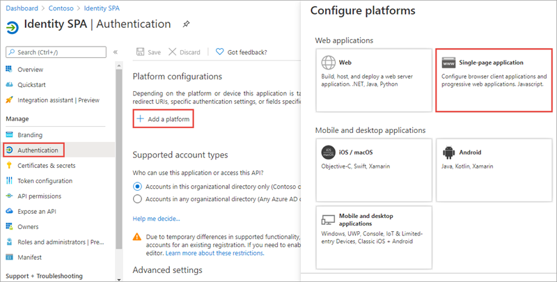

Web standards and modern browsers have advanced considerably in recent years to the point that developers can create sophisticated client-side applications. These client-side applications, also referred to as single-page applications (SPAs), can enable users to authenticate and obtain tokens from Microsoft identity platform that can be used to call secured web APIs.

In this unit, you’ll learn how to create, configure, and use Azure AD applications that use data returned from Microsoft Graph in single-page applications by using the OAuth 2.0 authorization code flow.

## Single-page applications (SPA)

Many modern web applications are built as client-side SPAs written using JavaScript or a SPA framework such as Angular, Vue, or React. These applications have traditionally used the OAuth 2.0 implicit flow to authenticate and obtain an access token to connect to protected services.

The pattern used to implement the implicit flow in SPAs included the use of iframes and cookies for silent single sign-on in the browser. However, many modern browsers now block third-party cookies that breaks that implementation. That fact, along with concerns about the visibility of access tokens when using the implicit grant flow, lead to the decision to move to using the OAuth 2.0 authorization code flow for SPAs.

## Microsoft Authentication Library (MSAL) JS

The easiest way to use Microsoft identity for authentication and to obtain access tokens to authorize requests to secured endpoints in SPAs is to use the Microsoft Authentication Library (MSAL) for JavaScript.

MSAL.js 1.x only supports the use of the implicit flow. However, in July 2020 Microsoft released MSAL.js 2.0 that supports the use of the authorization code flow. The remainder of this unit and the following exercise focus on MSAL.js 2.x and the use of the authorization code flow.

## Azure AD app registration

In order for a SPA to use Microsoft identity to enable users to authenticate and obtain access tokens for use with services such as Microsoft Graph, you must register a new app with Azure AD. You can do this using the Azure AD admin center https://aad.portal.azure.com.

After the application has been created, configure it to use the **Single-page application** platform.



Next, ensure the redirect URI of the app points to the URL of the SPA. This URL must match the redirect URL provided by the SPA when the authentication process is started.


## Code configuration

Load the MSAL.js 2.x library from the Microsoft-hosted content delivery network (CDN):

```html
<script src="https://alcdn.msauth.net/browser/2.4.0/js/msal-browser.js"></script>
```

After adding the script reference to the page, add the following code to obtain an instance of the application:

```javascript
var msalConfig = {
  auth: {
    clientId: '{{AZUREAD_APP_ID}}',
    authority: 'https://login.microsoftonline.com/{{AZUREAD_DIRECTORY_ID}}',
    redirectURI: 'https://localhost:3007'
  },
  cache: {
    cacheLocation: "localStorage",
    storeAuthStateInCookie: isIE || isEdge
  }
};
var msalApplication = new msal.PublicClientApplication(msalConfig);
```

The app ID and directory ID tokens in the code are placeholders for the values from the Azure AD app.

> [!IMPORTANT]
> The preferred experience when using MSAL when signing-in and obtaining access tokens is to use a popup window. However, some browsers have known issues with popup windows. In these cases, you can choose to use MSAL's equivalent methods that use browser redirects.

## Sign in

With the application configured, the next step is for the user to sign in. Do this by calling the `loginPopup()` method and pass in an object with the wanted permissions defined:

```javascript
var graphConfig = {
  requestObj: {
    scopes: ["user.read", "mail.read"]
  }
};
msalApplication.loginPopup(graphConfig.requestObj)
  .then(handleResponse)
  .catch(function (error) {
    console.log(error);
  });
```

This code will open a popup that loads the Azure AD sign-in experience. If the user hasn't signed in previously and granted the app the specified permissions, after a successful sign-in, Azure AD will present the user with the consent experience.


After completing the sign-in experience, MSAL.js will close the sign-in popup and execute the success path of the `loginPopup()` method.

## Acquire token

After the user has signed in, the next step is to obtain an access token to use in the authorization header of the request.

There are two methods on the MSAL.js API that you can use for this task:

- `acquireTokenSilent()`: If the user has already signed in and an interactive sign-in isn't required, this method will return a response that includes the access token:

    ```javascript
    var tokenRequest = {
      scopes: ["user.read", "mail.read"],
      account: msalApplication.getAccountByUsername(userEmail)
    };

    msalApplication.acquireTokenSilent(tokenRequest)
      .then(function(tokenResponse) {
        var accessToken = tokenResponse.accessToken;
      });
    ```

- `acquireTokenPopup()`: if the `acquireTokenSilent()` fails and/or an interactive sign-in is required, you can use this method. It will combine the request to sign in and obtain an access token in one step:

    ```javascript
    var tokenRequest = {
      scopes: ["user.read", "mail.read"],
      account: msalApplication.getAccountByUsername(userEmail)
    };

    msalApplication.acquireTokenPopup(tokenRequest)
      .then(function(tokenResponse) {
        var accessToken = tokenResponse.accessToken;
      });
    ```

## Calling APIs - Microsoft Graph

Once your SPA has an access token, you can use it to call the secured endpoint, such as Microsoft Graph:

```javascript
function getMessagesFromMSGraph(accessToken, callback) {
  var endpoint = "https://graph.microsoft.com/v1.0/me/messages?$top=10&$select=subject";

  var xmlHttp = new XMLHttpRequest();
  xmlHttp.onreadystatechange = function () {
    if (this.readyState == 4 && this.status == 200)
      callback(JSON.parse(this.responseText));
  }
  xmlHttp.open("GET", endpoint, true);
  xmlHttp.setRequestHeader('Authorization', 'Bearer ' + accessToken);
  xmlHttp.send();
}
```

## Summary

In this unit, you learned how to create, configure, and use Azure AD applications that use data returned from Microsoft Graph in single-page applications by using the OAuth 2.0 authorization code flow.
