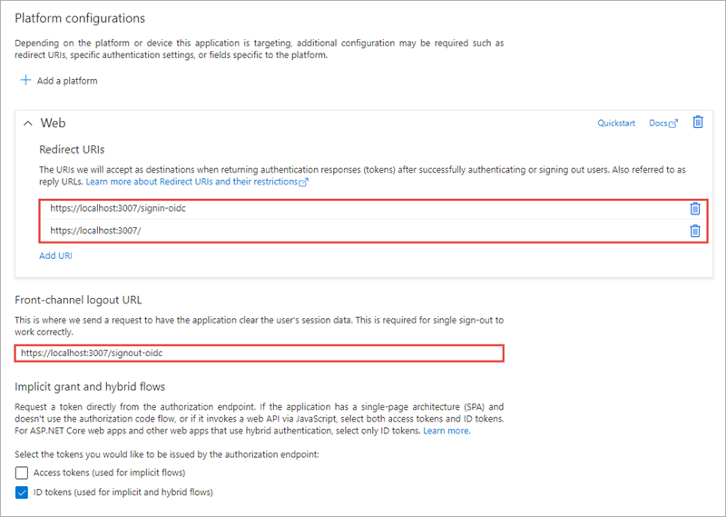
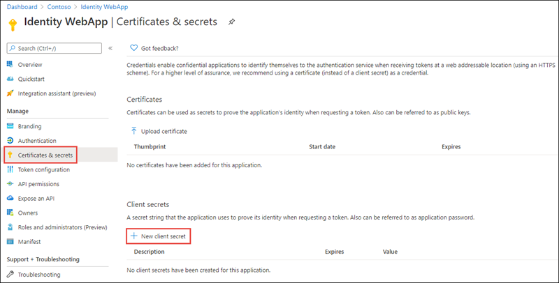

Developers can leverage Microsoft identity to add authentication to web apps to enable users to sign in. Adding authentication enables your web apps to access limited profile information. Once the signed in user grants consent, the web app can obtain a token from Azure AD on behalf of the signed in user and use it to request data from web APIs, such as Microsoft Graph.

In this unit, you’ll learn how to create server-side web apps that allow users to sign in and grant the app permissions to act on the user’s behalf. Once the user has authenticated and granted the app consent to act on their behalf, the web application will use data returned from Microsoft Graph by using the OAuth 2.0 auth code grant flow.

## Web apps that sign in users & call APIs

Adding authentication enables your web app to access limited profile information and customize the experience offered to users. Web apps authenticate a user in a web browser. In this scenario, the web application directs the user to sign in to Microsoft identity. Microsoft identity returns a sign-in response through the user’s browser, which contains claims about the user in an identity token.

As a second phase you can also enable your application to call web APIs on behalf of the signed-in user.

## OAuth 2.0 authorization code grant flow

The OAuth 2.0 authorization code grant flow is common when websites or custom applications leverage Azure AD as a federated authentication provider. When the application needs a user to sign in, or needs an access token to act on their behalf, it redirects the user over to Azure AD’s authorization endpoint to authenticate. The user signs in using their email and password and in turn Azure AD redirects the user upon a successful sign-in back to a specific URL in the app.

When Azure AD redirects the user back to the web app, it includes an authorization code. The authorization code is an encoded string that only Azure AD can read. The web app takes this authorization code, which is valid for a short time, and includes it in a request to the Azure AD token endpoint.

In addition to the authorization code, the request to the token endpoint includes a `grant_type` parameter that tells the endpoint it's exchanging the authorization code to obtain the access token on your behalf.

A benefit of this grant flow is that the web app never sees your username and password. All authentication happens over on Azure AD and the application just gets the authorization code that’s a result of the sign-in process. This aspect to the auth code grant flow makes it secure.

## Azure AD app registration

In order for a web app to use Microsoft identity to enable users to authenticate and obtain access tokens for use with services such as Microsoft Graph, you must register a new app with Azure AD. This can be done using the Azure AD admin center https://aad.portal.azure.com.

When registering the app in Azure AD, ensure the redirect URI of the app points to the callback URL of the web app. This URL must match the redirect URL provided by the app when the authentication process is started. The authorization code will be sent to this endpoint, which means you need to configure any authentication libraries and/or middleware to listen on this endpoint to receive the authorization code.

A sign-out URL should also be specified so the authentication libraries and/or middleware deletes any cached tokens or other data that is only needed for signed in users.



The web app will also need a client secret to sign in with Azure AD to exchange the authorization code for an access token.



There are three things you'll need from the Azure AD app registration:

- **Tenant ID**: ID of your Azure AD directory
- **Client ID**: unique autogenerated ID of the app (*this is also referred to as the application ID*)
- **Client secret**: secret you created during app registration

> [!NOTE]
> While a secret key is used here for purposes of simplicity, Microsoft recommends production apps use certificates with the OAuth 2.0 authorization code grant flow.

## MSAL .NET & code configuration

With the app registered in Azure AD, the next step is to configure the web app. For an ASP.NET Core web application, most of these settings are saved in the **appsettings.json** file.

```json
{
  "AzureAd": {
    "Instance": "https://login.microsoftonline.com/",
    "Domain": "qualified.domain.name",
    "TenantId": "22222222-2222-2222-2222-222222222222",
    "ClientId": "11111111-1111-1111-11111111111111111",
    "ClientSecret": "",
    "CallbackPath": "/signin-oidc"
  }
}
```

Next, you need to modify the web app startup process to configure the support for signing-in with Azure AD and obtaining an ID token.

In an ASP.NET Core web application, locate the `ConfigureServices()` method and replace its contents with the following:

```csharp
// This lambda determines whether user consent for non-essential cookies is needed for a given request.
options.CheckConsentNeeded = context => true;
options.MinimumSameSitePolicy = SameSiteMode.Unspecified;
// Handling SameSite cookie according to https://docs.microsoft.com/en-us/aspnet/core/security/samesite?view=aspnetcore-3.1
options.HandleSameSiteCookieCompatibility();
```

Then add the following code to the end of the `ConfigureServices()` method. This will complete the Azure AD configuration by doing the following steps:

- Configure the web app to use the NuGet package's Microsoft.Identity.Web utility methods
- Set up the controllers
- configure the authentication to use the Microsoft identity UI

```csharp
services.AddOptions();
services.AddMicrosoftIdentityWebAppAuthentication(Configuration)
        .EnableTokenAcquisitionToCallDownstreamApi(new string[] { "User.Read" })
        .AddInMemoryTokenCaches();
services.AddControllersWithViews(options => {
  var policy = new AuthorizationPolicyBuilder()
                .RequireAuthenticatedUser()
                .Build();
  options.Filters.Add(new AuthorizeFilter(policy));
}).AddMicrosoftIdentityUI();
services.AddRazorPages();
```

## Signing-in & acquiring tokens

The sign-in process is handled by redirecting the user to the Azure AD sign-in page. This is set by default for you when you create a new ASP.NET Core web application.

The sign-in process uses the values from the **appsettings.json** file and the configuration defined in the previous setup to create the Azure AD URL to send the user to. This URL specifies things like the Azure AD application's ID, the tenant ID, and the scopes required by the web application.

When a user signs-in to Azure AD and is redirected back to the web application, the web app can use the MSAL.NET library to obtain an access token:

```csharp
List<string> scopes = new List<string>();
IAccount account = {};
var accessToken = await application.AcquireTokenSilent(scopes, account).ExecuteAsync();
```

The account is retrieved from the currently signed-in user. The token can then be used to call a secured endpoint.

## Calling APIs (MS Graph)

The last part of the process is to use the access code in a request to a secured endpoint.

```csharp
[Authorize]
public class UserController : Controller
{
  private readonly ITokenAcquisition _tokenAcquisition;

  public UserController(ITokenAcquisition tokenAcquisition)
  {
    _tokenAcquisition = tokenAcquisition;
  }

  [AuthorizeForScopes(Scopes = new[] { "User.Read" })]
  public async Task<IActionResult> Index()
  {
    var graphServiceClient = new GraphServiceClient(
        new DelegateAuthenticationProvider(async (request) =>
        {
          var accessToken = await _tokenAcquisition.GetAccessTokenForUserAsync(new[] { "User.Read" });
          request.Headers.Authorization = new AuthenticationHeaderValue("Bearer", accessToken);
        }));
    var user = await graphServiceClient.Me.Request().GetAsync();

    return View(user);
  }
}
```

## Summary

In this unit, you learned how to create server-side web apps that allow users to sign in and grant the app permissions to act on the user’s behalf. Once the user has authenticated and granted the app consent to act on their behalf, the web application will use data returned from Microsoft Graph by using the OAuth 2.0 auth code grant flow.
