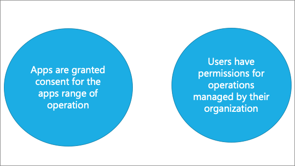
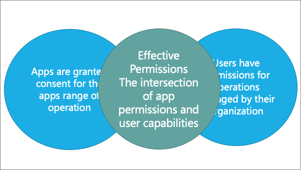

The Microsoft identity platform implements the OAuth 2.0 authorization protocol. This protocol is a method that a third-party app can use to access web-hosted resources on behalf of a user. The web-hosted resources can define a set of permissions that can be used to implement functionality in smaller chunks.

In this unit, you’ll learn about the different types of permissions supported by the Microsoft identity platform and the consent experience that users and admins must go through to grant permission requests to apps.

## Types of permissions

Microsoft identity platform supports two types of permissions: delegated permissions and application permissions.

- Delegated permissions are used by apps that have a signed-in user present. These permissions are provided to the application by the user so the app can perform actions on their behalf. This doesn't give permissions to the app, instead the user is simply allowing the app to act on their behalf using their permissions.
- Application permissions, are used by apps that run without a signed-in user present.

The other units in this module will explore both delegated and application permissions in depth.

## Effective permissions

Effective permissions are the permissions that your app will have when making requests to the target resource. It's important to understand the difference between the delegated and application permissions that your app is granted and its effective permissions when making calls to the target resource.



For delegated permissions, the effective permissions of your app are the intersection of the delegated permissions the app has been granted and the privileges of the currently signed-in user. In other words, the app can never have more privileges than the signed-in user. Within organizations, the privileges of the signed-in user may be determined by policy or by membership in one or more administrator roles.



For example, assume your app has been granted the **User.ReadWrite.All** delegated permission. This permission enables your app to be used to read and update the profile of every user in an organization. If the signed-in user is a global administrator, your app can update the profile of every user in the organization. However, if the signed-in user isn't in an administrator role, your app can update only the profile of the signed-in user. It can't update the profiles of other users in the organization because the user that it has permission to act on behalf of does not have those privileges.

For application permissions, the effective permissions of your app will be the full level of privileges implied by the permission. For example, an app that has the **User.ReadWrite.All** application permission can update the profile of every user in the organization.

## Consent experience (ref)

In an OpenID Connect or OAuth 2.0 authorization request, an app can request the permissions it needs by using the scope query parameter. For example, when a user signs in to an app, the app sends a request like the following example (with line breaks added for legibility):

```http
GET https://login.microsoftonline.com/common/oauth2/v2.0/authorize?
  client_id=6731de76-14a6-49ae-97bc-6eba6914391e
  &response_type=code
  &redirect_uri=http%3A%2F%2Flocalhost%2Fmyapp%2F
  &response_mode=query
  &scope=https%3A%2F%2Fgraph.microsoft.com%2Fcalendars.read%20https%3A%2F%2Fgraph.microsoft.com%2Fmail.send
  &state=12345
```

The scope parameter is a space-separated list of delegated permissions that the app is requesting. Each permission is indicated by appending the permission value to the resource's identifier (the Application ID URI). For example, this sample request is requesting permission to read the user's calendar and send mail as the user.

After the user signs in, the Microsoft identity platform endpoint checks for a matching record of user consent. If the user hasn't consented to any of the requested permissions in the past, nor has an administrator consented to these permissions on behalf of the entire organization, the Microsoft identity platform endpoint prompts the user to grant the requested permissions.


When the user approves the permission request, consent is recorded and the user doesn't have to consent again on later sign-ins to the application.

## Requesting consent for an entire tenant

Often, when an organization purchases a license or subscription for an application, the organization wants to proactively set up the application for use by all members of the organization. As part of this process, an administrator can grant consent for the application to act on behalf of any user in the tenant. If the admin grants consent for the entire tenant, the organization's users won't see a consent page for the application.

To request consent for delegated permissions for all users in a tenant, your app can use the admin consent endpoint:

```http
GET https://login.microsoftonline.com/{tenant}/v2.0/adminconsent?
  client_id=6731de76-14a6-49ae-97bc-6eba6914391e
  &redirect_uri=http://localhost/myapp/permissions
  &scope=https://graph.microsoft.com/calendars.read%20https://graph.microsoft.com/mail.send
  &state=12345
```


## Best practices for requesting permissions

When building an app that uses Azure AD to provide sign-in and access tokens for secured endpoints, there are a few good practices you should follow.

- Only ask for the permissions required for implemented app functionality. Don't request user consent for permissions that you haven't yet implemented for your application.
- In addition, when requesting permissions for app functionality, you should request the least-privileged access. For example, if an app analyzes a user's email but takes no action on the mailbox, you shouldn't request the more permissive **Mail.ReadWrite** when **Mail.Read** will work.
- Apps should gracefully handle scenarios where the user doesn't grant consent to the app when permissions are requested. In the case where an app doesn't receive an access token with the required permissions, it should explain the situation to the user with options on how to remedy the issue.

## Summary

In this unit, you learned about the different types of permissions supported by the Microsoft identity platform and the consent experience that users and admins must go through to grant permission requests to apps.
