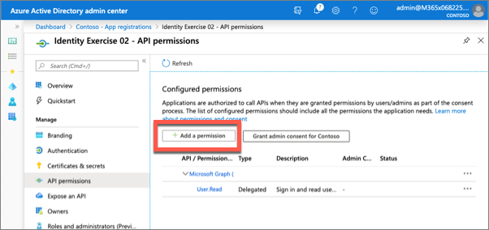

One type of permissions supported by the Microsoft identity platform is the delegated permission, also referred to as on behalf of permissions. Delegated permissions are permissions grated by a user or administrator to an app to allow the app act on behalf of the user.

In this unit, you’ll learn how to request delegated permissions and enable users to grant them to applications with either static or dynamic consent.

## Delegated permissions

Microsoft identity platform supports two types of permissions: delegated permissions and application permissions.

Delegated permissions are used by apps that have a signed-in user present. For these apps, either the user or an administrator consents to the permissions that the app requests, and the app is delegated permission to act as the signed-in user when making calls to the target resource. Some delegated permissions can be consented to by non-administrative users, but some higher-privileged permissions require administrator consent.

For example, a user can grant an app the delegated permissions **User.Read**, that enables the user of the app to sign in and read the user's profile, and **User.ReadBasic.All**, that allows the user of the app to read basic profile information about all users in the organization. Only an administrator can grant the **User.Read.All** permission that allows the user of the app to read the full profile information of all user's in the organization.

## User consent

If the user has not previously granted the permission to the app or an administrator hasn't consented on behalf of all user's in the organization, when a user signs-in to an app they're prompted with the consent dialog.

When the user selects the **Accept** button, the consent settings are saved and the user won't be prompted again.

There are two ways to define the permissions an app needs that drives what permissions are listed in the consent dialog. These two approaches are called static and dynamic consent.

## Static consent

With static consent, the permissions are defined in the app's registration within the Azure AD admin center.

The static consent approach is how the Microsoft identity v1.0 authorize endpoint worked. All permissions an application used needed to be defined ahead of time. When users signed in, they would have to consent to all permission requests.

This approach also enables administrators to consent on behalf of all users in the organization.

### The /.default scope

For developers migrating apps from the Microsoft identity v1.0 endpoint to the v2.0 endpoint, Microsoft introduced the `/.default` scope. This is a built-in scope for every application that refers to the static list of permissions configured on the application registration.

A scope value of **[app id]/.default** requests an access token with the scopes on the App ID that the application has registered for in the Azure portal.

The `/.default` scope should be used with apps that use the OAuth 2.0 client credentials flow.

## Dynamic consent

The other option to static consent is dynamic consent. This was introduced in the Microsoft identity v2.0 endpoint. With this option, permissions don't need to be specified in the app registration in the Azure AD admin center.

Each time the app requests an access token, it specifies the permissions it needs in the `scope` property. If the user hasn't already consented to those permissions, they'll go through the consent experience for the additional permissions.

Dynamic consent enables developers to only ask users for the permissions the app needs at that time. For example, at sign-in the app can request minimal profile information, but later request additional permissions to do more advanced tasks.

## Summary

In this unit, you learned how to request delegated permissions and enable users to grant them to applications with either static or dynamic consent.
