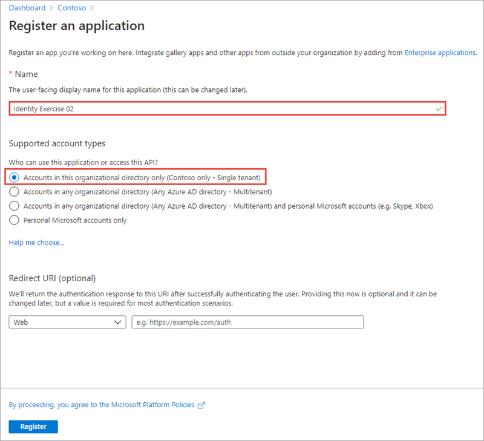
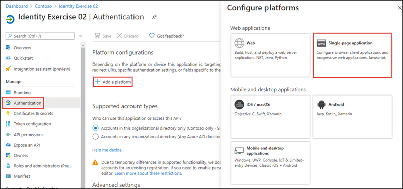
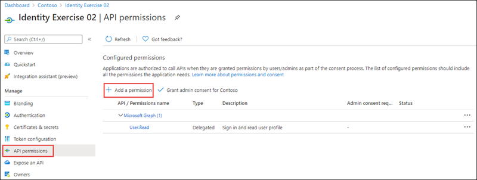
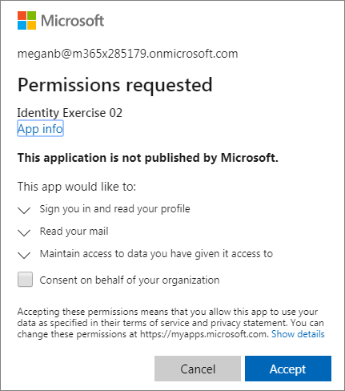

One type of permissions supported by the Microsoft Identity platform is the delegated permission, also referred to as on behalf of permissions. Delegated permissions are permissions granted by a user or administrator to an app to allow the app act on behalf of the user.

In this exercise, you’ll learn how to request delegated permissions and enable users to grant them to applications with either static or dynamic consent.

> [!IMPORTANT]
> This exercise assumes you have created the single page app (SPA) from the previous unit in this module. You'll edit the SPA created in that exercise in this exercise.

The single page app (APP) you created in a previous unit in this module was configured for static permission requests. Let's see how this works before we see how dynamic permissions work.

In the previous exercise, an administrator granted consent to the Azure AD app on behalf of all users in the organization. Let's start with a clean Azure AD app that no one has used or granted consent to.

## Static permissions

### Create an Azure AD application

The web page you created will submit a request to Microsoft Graph to retrieve the user's emails. All requests to Microsoft Graph must include an access token as proof of the user's identity and that they have the necessary permissions to call Microsoft Graph. To obtain an access token, you must create an Azure AD application.

Open a browser and navigate to the [Azure Active Directory admin center](https://aad.portal.azure.com). Sign in using a **Work or School Account** that has global administrator rights to the tenancy.

Select **Azure Active Directory** in the left-hand navigation.

Then select **Manage > App registrations** in the left-hand navigation.

  

On the **App registrations** page, select **New registration**.

  

On the **Register an application** page, set the values as follows:

- **Name**: Identity Exercise 02
- **Supported account types**: Accounts in this organizational directory only (Single tenant)

    

Select **Register** to create the application.

On the **Identity Exercise 02** page, copy the values **Application (client) ID** and **Directory (tenant) ID**; you'll need these values later in this exercise.

  

Select **Manage > Authentication** in the left-hand navigation.

On the **Authentication** page, select **Add a platform**. When the **Configure platforms** panel appears, select **Single-page application**.



In the **Configure single-page application** panel, add **http://localhost:3007** under **Redirect URIs**, and select **Configure**.


#### Add permissions to the Azure AD app

Select **API Permissions** from the left-hand navigation, and then select **Add a permission**:

  

On the **Request API Permissions** page, select **Microsoft APIs**, **Microsoft Graph**, and then select **Delegated permissions**:

  

In the search box in the **Select permissions** section, enter **Mail.R**, select the permission **Mail.Read** permission, and then select **Add permissions**.

### Update the SPA with the Azure AD application details

The last step is to configure the SPA to use the Azure AD application.

Locate the `var msalConfig = {}` code in the **index.html** file. The `auth` object contains three properties you need to set as follows:

- `clientId`: set to the Azure AD application's ID
- `authority`: set to **https://login.microsoftonline.com/{{DIRECTORY_ID}}**, replacing the **{{DIRECTORY_ID}}** with the Azure AD directory ID of the Azure AD application
- `redirectURI`: set to the Azure AD application's redirect URI: **http://localhost:3007**

### Test the web application

To test the web page, first start the local web server. In the command prompt, execute the following command from the root of the project:

```console
node server.js
```

Next, open a browser and navigate to **http://localhost:3007**. The page initially contains a default welcome message and sign-in button.


Select the **Sign In** button.

Depending on the browser, you're using, a popup window will load or the page will redirect to the Azure AD sign-in prompt.

Sign in using a **Work or School Account** of a user in your organization. On the next screen, **don't select** the **Accept** button. Instead, examine the dialog:



This screenshot demonstrates the *user consent experience* in Microsoft identity. It lists all permissions that are being requested. This includes both the statically defined permissions as well permissions dynamically requested.

One way you can see a difference between the static and dynamic permissions is using the admin consent endpoint.

In a new browser window, navigate to the following URL. Make sure you replace the `{{APPLICATION_ID}}` with the ID of the Azure AD application you created

`https://login.microsoftonline.com/common/adminconsent?client_id={{APPLICATION_ID}}&state=12345&redirect_uri=http://localhost:3007`


One permission, *Sign in and read user profile*, is the default one that all apps have: **User.Read**. The other permission, *Read user mail*, was the one that you added in the Azure AD admin center: **Mail.Read**.

Stop the local web server by pressing <kbd>CTRL</kbd>+<kbd>C</kbd> in the console.

## Dynamic permissions

Let's see how this differs from dynamic permissions.

### Update the SPA to show calendar events

In this section, you'll update the existing SPA to display calendar events. To do this, the app needs a new permission to access the currently signed-in user's calendar. However, you won't add the permission to the Azure AD app. Instead, you will add the permission as a demand when the app needs it.

Locate the `var graphConfig = {}` code in the **index.html** file. The `scopes` array contains the permissions the app will request in the access token when the user signs-in. Replace the **mail.read** permission with **calendars.read**.

The `graphConfig` object should now look like the following code:

```javascript
var graphConfig = {
  graphMeEndpoint: "https://graph.microsoft.com/v1.0/me",
  requestObj: {
    scopes: ["user.read", "calendars.read"]
  }
};
```

Now change the Microsoft Graph requests to request calendar items instead of email messages. Search for `/messages?` in the SPA and replace it with `/events?`. The rest of the request can remain as is because both email messages and calendar events have a *subject* property.

### Test the web application

To test the web page, first start the local web server. In the command prompt, execute the following command from the root of the project:

```console
node server.js
```

Next, open a browser and navigate to http://localhost:3007. The page initially contains a default welcome message and sign-in button.

Select the **Sign In** button.

Depending on the browser, you're using, a popup window will load or the page will redirect to the Azure AD sign-in prompt.

Sign in using a **Work or School Account** of a user in your organization. On the next screen, notice how the list of permissions has changed:


This time, you're prompted to grant the application access to your calendar. This is a dynamic permission because it was defined in the SPA's code and included in the list of permissions in the access token request.

Select the **Accept** button.

Depending on the browser you're using, the popup will disappear or you will be redirected back to the web page. When the page loads, MSAL will request an access token and request your information from Microsoft Graph. After the request complete, it will display the results on the page:


Stop the local web server by pressing <kbd>CTRL</kbd>+<kbd>C</kbd> in the console.

Try the admin consent experience. In a new browser window, navigate to the following URL. Make sure you replace the `{{APPLICATION_ID}}` with the ID of the Azure AD application you created

`https://login.microsoftonline.com/common/adminconsent?client_id={{APPLICATION_ID}}&state=12345&redirect_uri=http://localhost:3007`


Notice the list of permissions is the same as it was in the previous section. Only static permissions, defined in the Azure AD admin center, are displayed in the admin consent experience.

## Summary

In this unit, you learned how to request delegated permissions and enable users to grant them to applications with either static or dynamic consent.
