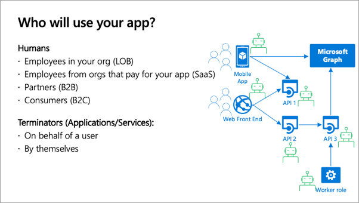
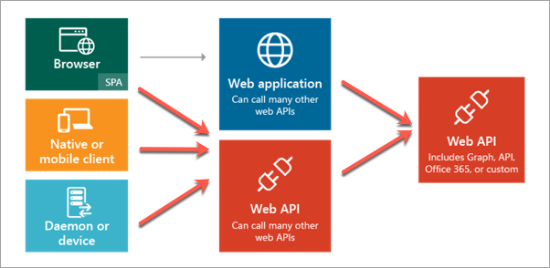
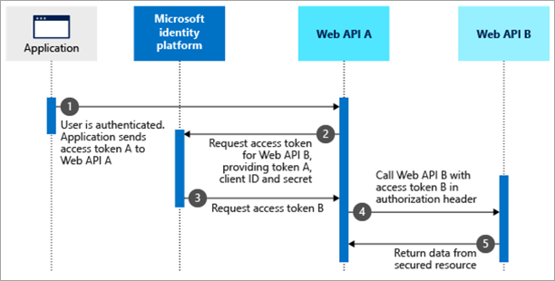

Developers can secure custom web APIs with Microsoft identity to ensure only approved apps can access the web APIs, provided they've been granted the necessary permissions. In this unit, you’ll learn how to register an Azure AD application to use in securing a custom web API.

## Overview

Microsoft identity can be used to secure a custom web API so only authenticated users and applications can access it. You can use custom web APIs to expose line-of-business applications and systems that should be protected with a trustworthy identity platform such as Microsoft identity.

Once an API has been secured with Microsoft identity, you can enable users and apps to authenticate and access the web APIs though many different types of applications including desktop, mobile, web, and services or daemons. The Microsoft identity platform is a great solution for securing APIs especially when your users and their data are secured with Microsoft identity.

For example, consider the scenario where a company in Office 365 sells categories of products to their customers. Your inventory management system needs to allow certain employees read-only access to products while others can create, edit, and discontinue products. The inventory management system can be developed to leverage multiple APIs, from custom APIs to manage the product inventory to Microsoft Graph to look up different employees.

Another option is to create a custom domain-specific web API that abstracts the calls to these different APIs and line-of-business systems from the inventory management system developers. The custom web API should be secured and only grant some users limited permissions while other users can perform more privileged actions.

## Plan for secure web APIs

When securing an app with Microsoft identity, you need to think about who will access the app.



Will the users of your app be employees in your tenancy, partners in a business-to-business (B2B) scenario, customers in a business-to-customer (B2C) scenario?

Or is the primary use case one where you've created a web API, secured using Microsoft identity, that's primarily called by other applications.



### Access web APIs with applications (terminators)

In this module we're focusing on the last option in the figure above: terminators. A terminator is an application or service that communicates with your custom web API secured using Microsoft identity. There are two types of terminator applications: one that acts on behalf of a user, and one that acts on behalf of itself.

The first option, **on behalf of**, is when a user authenticates and uses an application that will then make a request, *on behalf of the user*, to the secured web API.



In the second option, the application acts as a service or daemon where there's no user interaction. In this case, the app acts as itself. Daemon apps authenticate with Microsoft identity, obtain an access token, and include the token in the authorization header value of each HTTP request to the web API.

But, before you can build applications that implement either the on behalf of or daemon scenarios, you must first create and secure the web API.

## Create Microsoft identity-secured web APIs

Securing a web API with Microsoft identity that can be called by other applications involves two main tasks:

- Register & configure an Azure AD application
- Code the web API project, configured to support Microsoft identity

### Register an Azure AD application

The first step is to register the app in Azure AD using the Azure AD admin center located at https://aad.portal.azure.com.


#### Define scopes

Once the app is registered, you can then define the delegated permissions, also called *scopes*, your API exposes.

You then will write the business logic within your web API to determine what is allowed or prohibited based on the scopes and user identity listed in the access token received in the HTTP request.

Each scope has name & description properties for the user consent and admin consent. User consent is when a user grants an app permission to act on their behalf while admin consent is when a global tenant administrator grants the permission on behalf of all users or an application.


After registering the app in the Azure AD admin center, make a copy of the tenant ID and the client ID of the app. You'll need these values when you create configure the web API project.


### Protecting an API with Azure AD

Microsoft identity only returns blobs of text as the access tokens. Your API should always validate the access tokens and ensure they were provided by Microsoft identity. Access tokens are signed with a private key. You can verify their authenticity with the matching public key.

Microsoft identity provides libraries and middleware, available for most platforms, to simplify this process.

Your custom API should also enforce permissions using the scopes included in the provided access tokens. Delegated permissions should never exceed what the signed-in user is allowed to do.

### Code a secure web API

The next step is to code the web API project. Once the project is created, you'll have to do a little configuration to associate the project with the registered Azure AD app.

After configuring the web API project with the registered Azure AD app, you can then code the web API.

Start by creating a new .NET Core web API project using the following command:

```console
dotnet new webapi -o ProductCatalog -au singleorg
```

This command will create a new web API that has most of the code necessary for securing it with Microsoft identity using the Azure AD registered app.

#### Associate the web API with the Azure AD app

First, associate the web API with the Azure AD app by setting the `TenantId` and `ClientId` properties in the **appsettings.json** file.

#### Configure the web API project's authentication schema

Next, use the existing **Startup.cs** file to configure the authentication settings for the web API. Update the `ConfigureServices()` method in the `Startup` class in the root of the project to contain the following code:

```csharp
public void ConfigureServices(IServiceCollection services)
{
  services.AddMicrosoftIdentityWebApiAuthentication(Configuration);
  services.AddControllers();

  services.AddSingleton(SampleData.Initialize());
}
```

This code uses the **Microsoft.Identity.Web** NuGet package to configure the web application to use Microsoft identity and the MSAL.NET SDK.

Finally, use the `VerifyUserHasAnyAcceptedScope()` method within your controller's action methods to verify the current request includes the necessary permissions scopes. If it doesn't, it throws an error. Otherwise, it will continue and execute the desired result.

```csharp
public List<Product> GetAllProducts()
{
  HttpContext.VerifyUserHasAnyAcceptedScope(new string[] { "Product.Read" });
  return data.Products;
}
```

## Summary

Developers can secure custom web APIs with Microsoft identity to ensure only approved apps can access the web APIs, provided they've been granted the necessary permissions. In this unit, you’ll learn how to register an Azure AD application to use in securing a custom web API.
