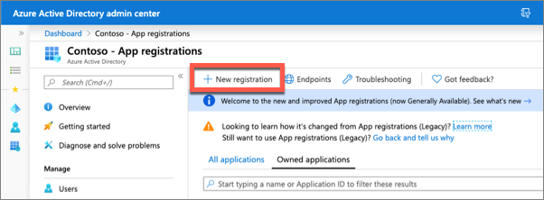
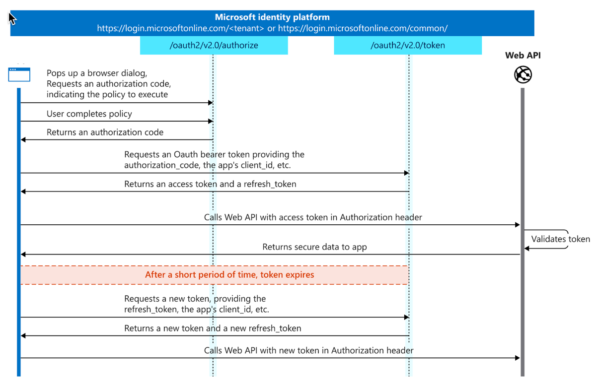

In this unit, you’ll learn how to create server-side web apps that enable users to sign in and grant the app permissions to act on the user’s behalf.

## Overview

Once you've created and secured a web API project with Microsoft identity, the next step is to consume the API. There are two approaches a custom app can implement to call the web API.

One scenario is for an application to act on it's own with no user interaction. In this scenario, the application obtains an access token from Microsoft identity to access the web API without any user involvement.

The other option is to act *on behalf of* an authenticated user. In this scenario, the application obtains an access token from Microsoft identity that is valid for both the application and the user.

## On-behalf-of flow

Let's look at the on-behalf-of flow in more detail.

Assume that the user has authenticated on an application using the OAuth 2.0 authorization code grant flow or another supported login flow. At this point, the application has an access token for a web API "A" (token A) with the user’s claims and consent to access the middle-tier web API (API A). Web API A needs to make an authenticated request to the downstream web API (API B).

The steps that follow make up the on-behalf-of flow and are explained with the help of the following diagram:


1. The client application makes a request to web API A with token A (with an audience claim of API A).
1. Web API A authenticates to the Microsoft identity platform token issuer endpoint and requests a token to access web API B.
1. The Microsoft identity platform token issuer endpoint validates web API A's credentials along with token A and issues the access token for web API B (token B) to web API A.
1. Token B is set by web API A in the authorization header of the request to web API B.
1. Data from the secured resource is returned by web API B to web API A, and from there to the client.

## Create Microsoft identity-secured web apps

Now let's see how to create and configure a web application so that it can access a secured web API on behalf of a signed in user.

The first step is to register a new Azure AD app in the Azure AD admin center that will represent the web application.



The important part of the app registration is the creation of an app secret. This secret, along with the client ID of the app, are used by the web application to authenticate with Microsoft identity when it requests an access token on behalf of the signed in user.


Web apps that call web APIs are *confidential client* applications. That's why they register a secret (an application password or certificate) with Azure AD.

The web app uses the OAuth 2.0 authorization code flow to sign the user in.



This flow has two steps:

1. **Request an authorization code**: This part delegates a private dialogue with the user to the Microsoft identity platform. During that dialogue, the user signs in and consents to the use of web APIs. When the private dialogue ends successfully, the web app receives an authorization code on its redirect URI.
Request an access token for the API by redeeming the authorization code.
1. **Request an access token**: Now that you've acquired an authorization code and have been granted permission by the user, you can redeem the code for an access token to the wanted resource. Do this by sending a POST request to the `/token` endpoint.

## Configure web applications to call secured APIs

The next step is to create the web application that will allow the user to sign in and then access the secured web API on behalf of the user.

Create a new ASP.NET Core MVC application using the following command, followed by installing a few NuGet packages to support and Microsoft identity.

```shell
dotnet new mvc --auth SingleOrg
dotnet add package Microsoft.Identity.Client
dotnet add package Microsoft.Extensions.Configuration
```

### Update web app to support user sign-in for Microsoft identity

Now update the project to associate it with the Azure AD app you registered for the web app. Open the **appsettings.json** file and set the details of the registered Azure AD application you previously created. This includes details such as:

- **Domain**: the domain of your Azure AD tenant where you registered the Azure AD application
- **TenantId**: the ID of your Azure AD tenant where you registered the Azure AD application
- **ClientId**: the ID of your Azure AD application
- **ClientSecret**: the secret of your Azure AD application

Next, configure the web app's authentication by updating the `ConfigureServices()` method in the `Startup` class for the project:

- First, configure the web app to support authentication with Microsoft identity using the details from the **appsettings.file**:

    ```csharp
    services.AddAuthentication(AzureADDefaults.AuthenticationScheme)
        .AddAzureAD(options => Configuration.Bind("AzureAd", options));

    var appSettings = new AzureADOptions();
    Configuration.Bind("AzureAd", appSettings);

    var application = ConfidentialClientApplicationBuilder.Create(appSettings.ClientId)
          .WithAuthority(appSettings.Instance + appSettings.TenantId + "/v2.0/")
          .WithRedirectUri("https://localhost:5001" + appSettings.CallbackPath)
          .WithClientSecret(appSettings.ClientSecret)
          .Build();
    services.AddSingleton(application);
    ```

- Now, configure the app's services to support the user signing in to Azure AD and providing an authorization code to the web app. The web app takes this authorization code and exchanges it for an access token using the Azure AD token issuing endpoint:

    ```csharp
    services.Configure<OpenIdConnectOptions>(AzureADDefaults.OpenIdScheme, options =>
    {
      // configure authority to use v2 endpoint
      options.Authority = options.Authority + "/v2.0/";

      // asking Azure AD for id_token (to establish identity) and authorization code (to get access/refresh tokens for calling services)
      options.ResponseType = OpenIdConnectResponseType.CodeIdToken;

      // add the permission scopes you want the application to use
      options.Scope.Add("offline_access");
      Constants.ProductCatalogAPI.SCOPES.ForEach(s => options.Scope.Add(s));

      // validate the token issuer
      options.TokenValidationParameters.NameClaimType = "preferred_username";

      // wire up event to do second part of code authorization flow (exchanging authorization code for token)
      var handler = options.Events.OnAuthorizationCodeReceived;
      options.Events.OnAuthorizationCodeReceived = async context =>
      {
        // handle the auth code returned post signin
        context.HandleCodeRedemption();
        if (!context.HttpContext.User.Claims.Any())
        {
          (context.HttpContext.User.Identity as ClaimsIdentity).AddClaims(context.Principal.Claims);
        }

        // get token
        var token = await application.AcquireTokenByAuthorizationCode(options.Scope, context.ProtocolMessage.Code).ExecuteAsync();

        context.HandleCodeRedemption(null, token.IdToken);
        await handler(context).ConfigureAwait(false);
      };
    });
    ```

At this point, the web app is associated with the registered Azure AD app and configured to support users signing in with their Microsoft identity account.

### Add on behalf of token acquisition

The next step is to create controllers to implement the pages on the site. Pages that will call the custom web API need to implement the on-behalf-of flow.

When the user requests one of these pages, the web app already has an access token for the user. This token is used, in addition to the web app's Azure AD app details, to obtain a new access token. The resulting access token is intended to be used with the web API but is for the web app to use on behalf of the currently signed in user:

```csharp
private async Task<string> GetTokenForUser()
{
  // get the current user's account ID
  string userObjectId = User.FindFirstValue(Constants.ClaimIds.UserObjectId);
  string tenantId = User.FindFirstValue(Constants.ClaimIds.TenantId);
  var accountIdentifier = $"{userObjectId}.{tenantId}";
  IAccount account = await application.GetAccountAsync(accountIdentifier);

  var authResult = await application.AcquireTokenSilent(scopes, account).ExecuteAsync();
  return authResult.AccessToken;
}
```

Each controller's method, representing a page, can then use this `GetTokenForUser()` method to issue a request to the web API with this new access token:

```csharp
public async Task<ActionResult> Index()
{
  HttpClient client = new HttpClient();
  client.DefaultRequestHeaders.Authorization = new AuthenticationHeaderValue("Bearer", await GetTokenForUser());

  string webApiEndpoint = "https://localhost:5050/api/Categories";
  string json = await client.GetStringAsync(webApiEndpoint);

  var serializerOptions = new JsonSerializerOptions
  {
    PropertyNamingPolicy = JsonNamingPolicy.CamelCase
  };
  var categories = JsonSerializer.Deserialize(json, typeof(List<Category>), serializerOptions) as List<Category>;
  return View(categories);
}
```

## Summary

In this unit, you learned how to create server-side web apps that enable users to sign in and grant the app permissions to act on the user’s behalf.
