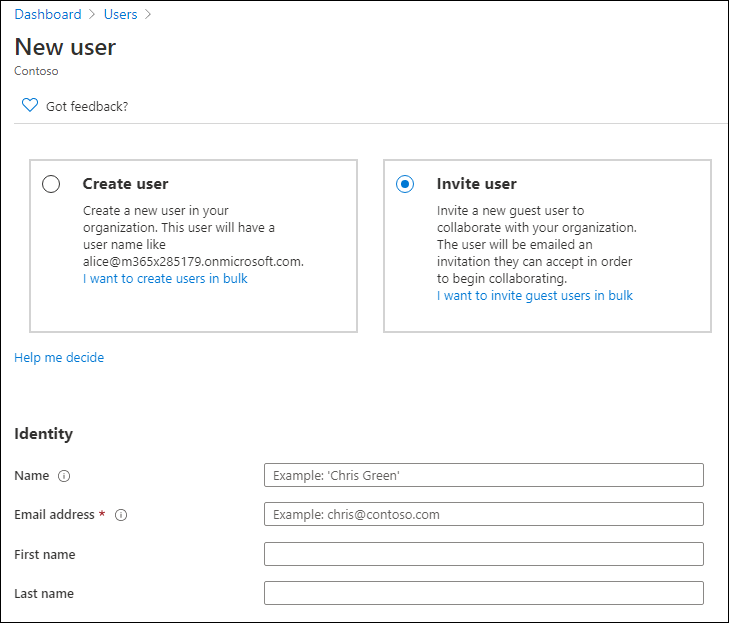
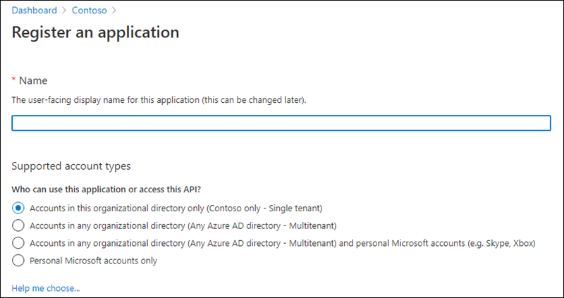
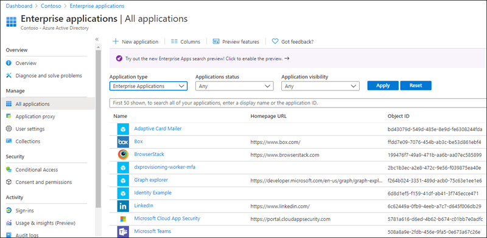
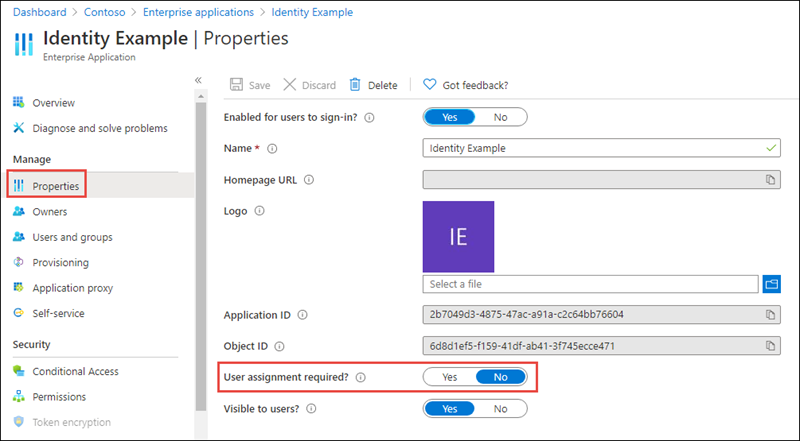

Role-based access control (RBAC) is a popular mechanism to enforce authorization in applications. The administrator then assigns roles to different users and groups to control who have access to what content and functionality.

In this unit, you’ll learn how Microsoft identity enables developers and administrators to secure and grant access to custom apps.

## Overview

Microsoft identity enables developers to build custom applications and secure them in different ways. You can configure your custom apps to support users signing-in using their personal or consumer Microsoft Account or with their Work or School account.

> [!NOTE]
> Users with consumer Microsoft accounts won't be able to have assigned roles nor will they be members of groups.

An app can then grant users the ability to do specific tasks depending who they are, what groups they belong to or what roles they've been granted within the application.

Users are managed from the Azure AD admin center (https://aad.portal.azure.com) including users within your organization and those added as guests in business-to-business (B2B) scenarios.


In addition to users, administrators (*and other people with the appropriate access*), can use the Azure AD admin center to create and manage security groups that contain collections of users, groups, and roles specific to your custom app.

Custom apps that are configured with Microsoft identity to support user's signing-in receive information about the user. This includes profile information such as their name and email address, but can also the groups they belong to or app roles they've been assigned to. Your custom app can use this information and in the cases where the app has the necessary permissions, enable the user to edit their details from within the app.

### Add or delete users

To add a user to your organization, first sign-in to the Azure AD admin center and select the **Users** navigation option to open the **All users** blade.


Select the **New user** button in the navigation to enter the user's information. Some fields are required, such as the name, username, and password, while others are optional such as the groups they belong to and job information.

To add a guest user to your organization, select **New guest user** where you can either create a user or invite an existing user via email.



### Restricting apps to a set of users

When you register an app in Azure AD, you specify what types of accounts it will support.



Each of the account types supported provides slightly different options. However, each of the options includes all users in the organization where the app is registered. This means any user within the **All users** blade can sign in to your custom app.

Microsoft identity does support restricting an app to a certain set of users or security groups within your tenant.

To restrict an application to a subset of users, first enable the setting on the app by selecting the **Enterprise Applications** from the **All applications** menu item within the Azure AD admin center:



Select an app, then select the **Properties** navigation item, enable the toggle for the **User assignment required** property, and save your changes:



Once the property has been set, you can use the **Users and groups** blade within the app to manage the list of users and groups who can sign in and access your app:


### Role-based access control (RBAC)

While administrators can control what users have access to an app using the **User assignment required** property, developers would need to account for specific users within the app.

RBAC helps you manage resources, what areas of an app users have access to and what they can do with those resources.

Developers first create a *role definition* within the app's registration in the Azure AD admin center. The code within the app can check if the user has access to certain resources based on the roles assigned to the user.

This pattern simplifies management as the app developer can define the roles, while administrators can grant users to these roles without requiring updates to the app's code.

## Enabling users to sign-in to custom web apps

In order for a web app to use Microsoft identity to enable users to authenticate and obtain access tokens for use with services such as Microsoft Graph, you must register a new app with Azure AD. This can be done using the Azure AD admin center https://aad.portal.azure.com.

### Azure AD app registration

When registering the app in Azure AD, ensure the redirect URI of the app points to the callback URL of the web app. This URL must match the redirect URL provided by the app when the authentication process is started. The authorization code will be sent to this endpoint, which means you need to configure any authentication libraries and middleware to listen on this endpoint to receive the authorization code.

A sign-out URL should also be specified so the authentication libraries and middleware deletes any cached tokens or other data that is only needed for signed in users.


The web app will also need a client secret to sign in with Azure AD to exchange the authorization code for an access token.


There are three things you'll need from the Azure AD app registration:

- **Tenant ID**: ID of your Azure AD directory
- **Client ID**: unique autogenerated ID of the app (*this is also referred to as the application ID*)
- **Client secret**: secret you created during app registration

> [!NOTE]
> While a secret key is used here for purposes of simplicity, Microsoft recommends production apps use certificates with the OAuth 2.0 authorization code grant flow.

### Code configuration

With the app registered in Azure AD, the next step is to configure the web app. For an ASP.NET Core web application, most of these settings are saved in the **appsettings.json** file.

Open this file and set the three values you collected from registering the Azure AD app. You may have to create a key for the client secret.

```json
{
  "AzureAd": {
    "Instance": "https://login.microsoftonline.com/",
    "Domain": "qualified.domain.name",
    "TenantId": "22222222-2222-2222-2222-222222222222",
    "ClientId": "11111111-1111-1111-11111111111111111",
    "ClientSecret": "",
    "CallbackPath": "/signin-oidc"
  }
}
```

#### Configure web application middleware

Next, you need to modify the web app startup process to configure the support for signing-in with Azure AD and obtaining an ID token.

Within the method `ConfigureServices()` in the **Startup.cs** file, add the following code that configures the web app's middleware to support the v2 tokens from Microsoft identity:

```csharp
services.Configure<OpenIdConnectOptions>(AzureADDefaults.OpenIdScheme, options =>
{
  options.Authority = options.Authority + "/v2.0/";
  options.TokenValidationParameters.NameClaimType = "preferred_username";
});
```

#### Display the user's claims

Finally, update the user experience of the web application to display all the claims in the OpenID Connect ID token that is provided by Azure AD when the user signed in.

```cshtml
@if (User.Identity.IsAuthenticated)
{
<div>
  <table cellpadding="2" cellspacing="2">
    <tr>
      <th>Claim</th>
      <th>Value</th>
    </tr>
    @foreach (var claim in User.Claims)
    {
      <tr>
        <td>@claim.Type</td>
        <td>@claim.Value</td>
      </tr>
    }
  </table>
</div>
}
```

## Summary

In this unit, you’ll learn how Microsoft identity enables developers and administrators to secure and grant access to custom apps.
