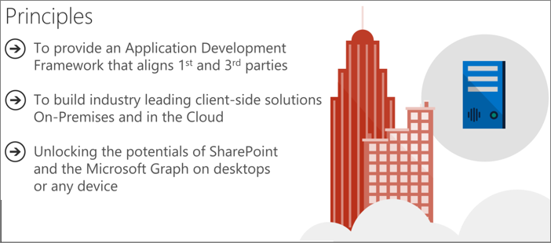
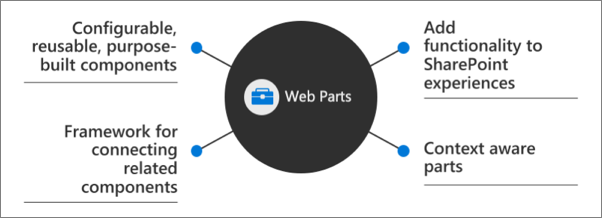
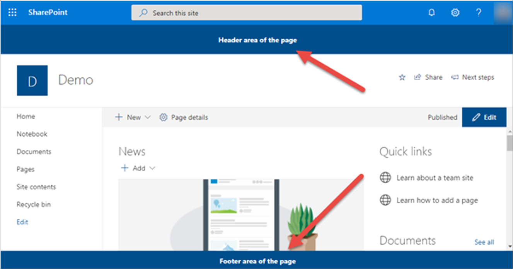

Microsoft introduced the SharePoint Framework as the recommended way to customize and extend SharePoint Online in 2017. On-premises SharePoint customers that have deployed SharePoint Server 2016 and SharePoint Server 2019 can also use the SharePoint Framework to customize and extend their client-side solutions as well.

In this unit, you'll learn what the SharePoint Framework is and the extensibility options that enable developers to customize SharePoint environments.

## SharePoint Framework extensibility principles

Over the past several years, with the evolution of Office 365, development of SharePoint solutions has a new set of challenges: while on one hand IT and Tenant administrators require a new set of tools to control how data get accessed and consumed in their tenancies, developers want to programmatically control the whole lifecycle, experience, and data access capabilities of a Site.

Unfortunately, developers today find themselves constraint around building app parts because of iFrames, a reduced set of APIs, and no integration with cross Office 365 workloads. This in turn limits their ability to develop powerful portals that extend SharePoint.

The client-side development framework will deliver capabilities that will help both first party and third-party developers build powerful, rich applications and provide an enjoyable web experience in Office 365 for end users that are both intuitive and simple to consume.

## SharePoint Framework overview

SharePoint Framework is modern client-side development. All the customizations you create and build are deployed and run in the browser. There's no server-side component in a SharePoint Framework component.

You can create server-side components, but you're going to host that yourself in a location other than SharePoint.

SharePoint Framework components are lightweight and run in both web and mobile experiences because they're client-side solutions. We're relying on JavaScript, HTML, CSS, and images. This means they run the exact same way in the browser as it does in the mobile experiences.

The SharePoint Framework is backwards compatible meaning that it works not just the modern pages, but also on classic and publishing pages as well.

The development tools and platform used in the SharePoint Framework is implemented with open-source tools and common JavaScript web frameworks like React.

## Supported custom component types

The SharePoint Framework enables developers to create different types of custom components that are used to customize and extend SharePoint sites. The custom component types are:

- Client-side web parts
- Extensions
- Libraries

### Client-side web parts

Client-side web parts, built using the SharePoint Framework, are the cornerstone of the vision for innovating, extending, and customizing the SharePoint modern experience.

They're configurable, reusable, and purpose-built components that page designers and site owners can use to create unique experiences for their users.

Client-side web parts are build using the SharePoint Framework that provides extra capabilities, including access to Microsoft Graph for incorporating personal and organizational information into page experiences.

Web parts are also context aware, in the sense that they have access to contextual information about the current page. For instance, at runtime, the web part can get information about the current user and the current page and site the web part is currently running in.

Client-side web parts are flexible as well! Developers can use them to create single page applications (SPAs) as single page app pages, the basis for Microsoft Teams tabs and personal apps, and even as the host for Office Add-ins.

Experienced SharePoint developers who are familiar with server-side web parts developed and deployed using SharePoint features and solutions will find client-side web parts to be familiar. They're just web parts!

The only difference from a server-side web part is client-side web parts are rendered in the browser, not on the server.

Client-side web parts are build for the modern, JavaScript-driven web just as the modern SharePoint experience.

> [!NOTE]
> Client-side web parts are supported in all environments supported by the SharePoint Framework, including SharePoint Server 2016, SharePoint Server 2019 and SharePoint Online.

#### Adding SPFx web parts to pages

Adding a SPFx client-side web part to a page works in very much the same way as adding server-side web parts. However, there are a few things that make working with client-side web parts a bit easier.

Unlike classic pages, when a page is in edit mode, any web parts on the page are also in edit mode. Compared to classic pages where the web part has a different edit mode from the page's edit mode.

To add a web part to a modern page, first put the page in edit mode and then select the **+** icon to open the toolbox. Select a web part from the toolbox to add it to the page.

You can edit the web part by opening the property pane with the edit icon to the left of the web part. By default, any changes made in the property page are immediately reflected in the web part.

### SharePoint Framework extensions

SharePoint Framework extensions enable developers to customize and extend the SharePoint user experience. You can use them to customize notification areas, list toolbars, list menus, and list data views.

Microsoft introduced extensions in the SharePoint Framework to allow customers to implement some of the same customization options available in classic sites. Extensions will only work in the modern SharePoint experience and are intended to serve as the modern option for the following options in the classic experience:

- Delegate controls and `ScriptLink`
- Client-side rendering (CSR) and `JSLink`
- Custom actions

Because they only run in the modern experience, you can only use SharePoint Framework extensions in SharePoint Server 2019 and SharePoint Online.

> [!NOTE]
> Extensions are supported in all environments supported by the SharePoint Framework that also support the modern page experience, including SharePoint Server 2019 and SharePoint Online.

#### Application customizers

Let's look at the first type of extension: the application customizer. This extension is intended to be the modern replacement to the legacy delegate controls and `ScriptLink` property.

Application customizers enable you to do two things:

- Add script to all pages in a site collection
- Set the HTML on two well known `
` elements on the page that serve as headers and footers

#### Field customizer

The next type of extension is the field customizer. This extension is intended to be the modern replacement to the legacy client-side rendering (CSR) framework and **JSLink**.

Field customizers enable you to define the HTML within a cell in the list display form. In the following screenshot, notice the **Percent Complete** column is rendered with custom colored bars instead of plain text:

#### Command sets

The last type of extension is the command set. This extension is intended to be the modern replacement to the legacy custom actions.

Command sets enable you to add buttons to list and library toolbars or to the context menu of items within a list.

### Library components

The other two types of components previously covered, web parts and extensions, enable developers to extend and customize the SharePoint user experience. This third option, the library component, differs from those other types in that it's used to share code across multiple components projects.

The library component is developer tool that enables developers to create a single package of reusable code that's independency versioned & deployed from your other components. These reusable code packages are deployed a single time to SharePoint Online tenant app catalog ad served automatically for SharePoint Framework components.

Library components give developers an alternative option to create shared code, which can be then used and referenced cross all the components in the tenant.

> [!NOTE]
> Library components are only supported in SharePoint Online.

## SharePoint Framework availability

The SharePoint Framework was introduced in 2017 to SharePoint Online. Microsoft is continuously updating and improving the SharePoint Framework in SharePoint Online. Developers can build custom components that use the most recent version of the SharePoint Framework.

SharePoint Online contains not only the latest version of the SharePoint Framework, but it will also load any previously published version of the SharePoint Framework if a component on the page uses an older version. This capability ensures that developers aren't required to always update previously deployed components every time a new version of the SharePoint Framework is released.

### SharePoint Framework and SharePoint on-premises deployments

The SharePoint Framework is supported in both SharePoint Server 2016 and SharePoint Server 2019. Unlike SharePoint Online that is always updated to use the latest version of the SharePoint Framework, the on-premises SharePoint versions only support specific versions.

SharePoint Server 2016 supports the SharePoint Framework v1.1.0, which is the initial version that introduced client-side web parts to SharePoint. This version of SharePoint doesn't support the extensions component type because extensions have a dependency on the modern experience. The modern experience wasn't added to SharePoint Server until SharePoint Server 2019.

SharePoint Server 2019 supports the SharePoint Framework v1.4.0 and all previous versions. This version includes support for client-side web parts and extensions.

## Summary

In this unit, you learned what the SharePoint Framework is and the extensibility options that enable developers to customize SharePoint environments.
