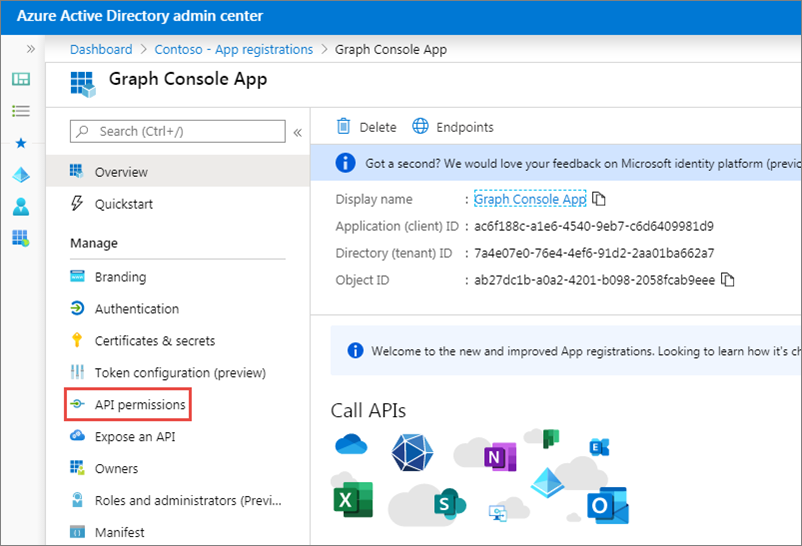
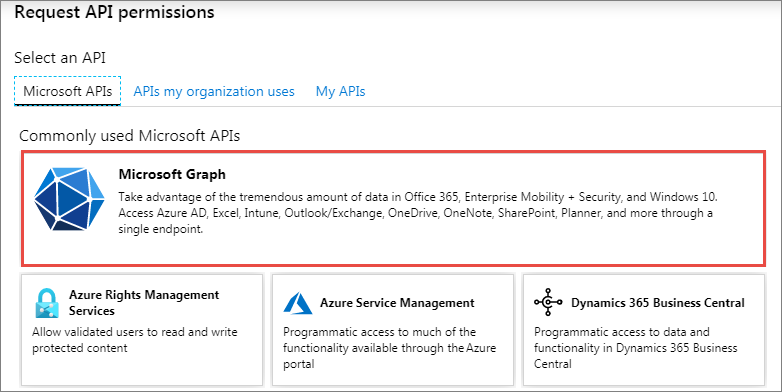
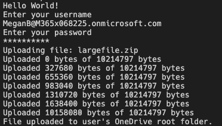

In this exercise, you'll learn how to upload files to OneDrive using Microsoft Graph, including both small and large files.

> [!IMPORTANT]
> This exercise assumes you have created the Azure AD application and .NET console application from the previous unit in this module. You'll edit the existing Azure AD application and .NET console application created in that exercise in this exercise.

## Update the Azure AD application

The first step is to add a permission grant to the Azure AD application that will enable the .NET Core console app to upload files to the signed-in user's OneDrive account.

Open a browser and navigate to the [Azure Active Directory admin center (https://aad.portal.azure.com)](https://aad.portal.azure.com). Sign in using a **Work or School Account** that has global administrator rights to the tenancy.

Select **Azure Active Directory** in the left-hand navigation.

  

Select **Manage > App registrations** in the left-hand navigation.

On the **App registrations** page, select the **Graph Console App**.

Select **API Permissions** in the left-hand navigation panel.



Select the **Add a permission** button.


In the **Request API permissions** panel that appears, select **Microsoft Graph** from the **Microsoft APIs** tab.



When prompted for the type of permission, select **Delegated permissions**.

Enter **Files.Read.W** in the **Select permissions** search box and select the **Files.ReadWrite** permission, followed by the **Add permission** button at the bottom of the panel.


In the **Configured Permissions** panel, select the button **Grant admin consent for [tenant]**, and then select the **Yes** button in the consent dialog to grant all users in your organization this permission.

## Update .NET Core console application to upload a small file

In this section, you'll update the .NET console app to upload a small file to the user's OneDrive account.

Create a text file named **smallfile.txt** and fill it with a few paragraphs of text. Save this file to the root of the .NET Core console app's folder.

Locate the **Program.cs** file from the application you created in a previous unit in this module.

First, update the permission requests to include the new permission added to the app. Locate the `CreateAuthorizationProvider` method. In this method, add the new permission as another scope to the list of existing scopes:

```cs
List<string> scopes = new List<string>();
scopes.Add("User.Read");
scopes.Add("Files.Read");
scopes.Add("Files.ReadWrite");
```

Within the `Main` method, locate the following line:

```cs
var client = GetAuthenticatedGraphClient(config, userName, userPassword);
```

Delete all code within the `Main` method after the above line.

Add the following code to the end of the `Main` method. This code will first get a reference to the file in the project. It will then open the file and upload it using the `PutAsync` method on the Microsoft Graph .NET SDK:

```cs
// request 1 - upload small file to user's onedrive
var fileName = "smallfile.txt";
var filePath = Path.Combine(System.IO.Directory.GetCurrentDirectory(), fileName);
Console.WriteLine("Uploading file: " + fileName);

FileStream fileStream = new FileStream(filePath, FileMode.Open);
var uploadedFile = client.Me.Drive.Root
                              .ItemWithPath("smallfile.txt")
                              .Content
                              .Request()
                              .PutAsync<DriveItem>(fileStream)
                              .Result;
Console.WriteLine("File uploaded to: " + uploadedFile.WebUrl);
```

### Build and test the application

Run the following command in a command prompt to compile and run the console application:

```shell
dotnet build
dotnet run
```

After entering the username and password of a user, the path to the new file will be written to the console:


Open a browser and navigate to the URL written to the console, except omit the filename from the URL. After signing in using the same credentials used when testing the console app, you'll see the file listed in the user's OneDrive:


## Update .NET Core console application to upload a large file

In this section, update the console app upload a large file. 

Obtain a large file, one at least 5 MB, and copy it to the root of the .NET Core console app's folder. Name the file **largefile.zip**.

Locate the code you added above for `// request 1 - upload small file to user's onedrive` and optionally comment it out so it doesn't continue to execute.

Add the following code to the `Main` method of the console application. This will get a reference to the large file you copied to the folder:

```cs
// request 2 - upload large file to user's onedrive
var fileName = "largefile.zip";
var filePath = Path.Combine(System.IO.Directory.GetCurrentDirectory(), fileName);
Console.WriteLine("Uploading file: " + fileName);
```

Add the following code to the end of the `Main` method. This will open the file as a stream and create a new upload session using the Microsoft Graph .NET SDK:

```cs
// load resource as a stream
using (Stream stream = new FileStream(filePath, FileMode.Open))
{
  var uploadSession = client.Me.Drive.Root
                                  .ItemWithPath(fileName)
                                  .CreateUploadSession()
                                  .Request()
                                  .PostAsync()
                                  .Result;

  // create upload task

  // create progress implementation

  // upload file
}
```

Next, add the following code after the comment `// create upload task`. This code will create a new `LargeFileUploadTask` using the existing session and stream:

```cs
var maxChunkSize = 320 * 1024;
var largeUploadTask = new LargeFileUploadTask<DriveItem>(uploadSession, stream, maxChunkSize);
```

> [!NOTE]
> If your app splits a file into multiple byte ranges, the size of each byte range MUST be a multiple of 320 KiB (327,680 bytes). Using a fragment size that does not divide evenly by 320 KiB will result in errors committing some files.

The `LargeFileUploadTask` object will report the progress of the file upload. To use this capability, create an implementation of the `IProgress` interface. Add the following code after the `// create progress implementation` comment:

```cs
IProgress<long> uploadProgress = new Progress<long>(uploadBytes =>
{
  Console.WriteLine($"Uploaded {uploadBytes} bytes of {stream.Length} bytes");
});
```

Finally, upload the file by adding the following code after the `// upload file` comment:

```cs
UploadResult<DriveItem> uploadResult = largeUploadTask.UploadAsync(uploadProgress).Result;
if (uploadResult.UploadSucceeded)
{
  Console.WriteLine("File uploaded to user's OneDrive root folder.");
}
```

### Build and test the application

Run the following command in a command prompt to compile and run the console application:

```shell
dotnet build
dotnet run
```

After entering the username and password of a user, the console app will write the progress of uploading the file until it's complete:



Open a browser and navigate to the user's OneDrive account to see the large file that has been uploaded:


## Summary

In this exercise, you learned how to upload files to OneDrive using Microsoft Graph, including both small and large files.
