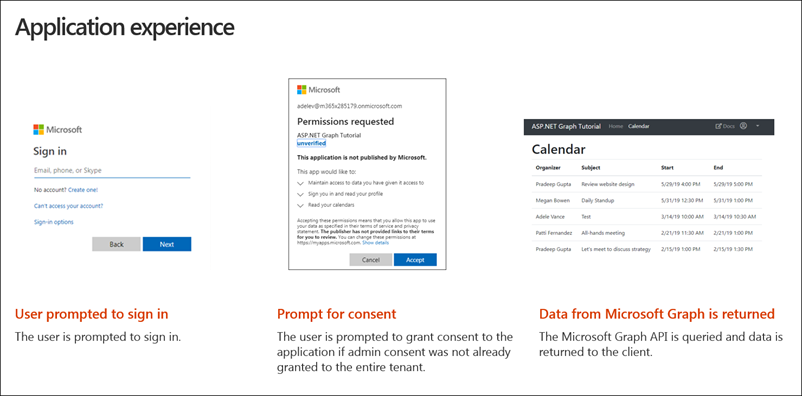
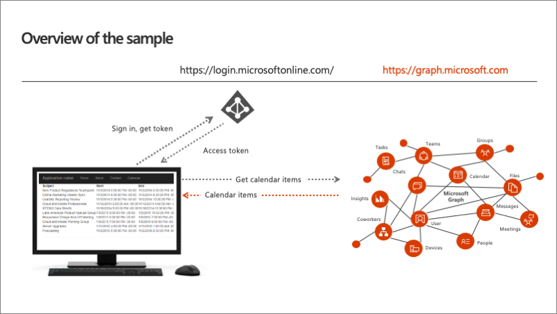

In this unit, you'll learn how to customize and configure an ASP.NET MVC web application to request and integrate data obtained from Microsoft Graph.

## Integrate Microsoft Graph in ASP.NET MVC web applications

Adding Microsoft Graph support to an ASP.NET MVC web application is simple. The Microsoft Graph .NET SDK is distributed through a NuGet package **Microsoft Graph**.

### Obtain an access token for Microsoft Graph

All communication with Microsoft Graph is handled though the `GraphServiceClient`. The `GraphServiceClient` must be configured to include an access token in each request. Therefore, the first step is for the web application to obtain an access token once the user has signed-in. This can be done using following code that demonstrates how to obtain an access token:

```csharp
public async Task<string> GetUserAccessTokenAsync()
{
  var idClient = ConfidentialClientApplicationBuilder.Create(appId)
      .WithRedirectUri(redirectUri)
      .WithClientSecret(appSecret)
      .Build();

  var tokenStore = new SessionTokenStore(idClient.UserTokenCache,
          HttpContext.Current, ClaimsPrincipal.Current);

  var accounts = await idClient.GetAccountsAsync();

  // By calling this here, the token can be refreshed
  // if it's expired right before the Graph call is made
  var result = await idClient.AcquireTokenSilent(graphScopes, accounts.FirstOrDefault())
      .ExecuteAsync();

  return result.AccessToken;
}
```

This method first starts by creating an instance of a confidential client that is defined in the OAuth 2 protocol specification. Confidential clients are those clients that can have an app ID and secret that won't be exposed to the user of the application. Another type, a public client, is used in mobile or desktop apps as the app secret would have to be distributed with the app's executable code to the user's mobile device or desktop.

The confidential client is created using the registered app ID, secret, and configured redirect URI the user should be sent to once they've successfully signed in with Microsoft identity.

Next, the code obtains a reference to the current user and attempts to retrieve a previously obtained access token from the token store using the `AcquireTokenSilent()` method. If the `AcquireTokenSilent()` method fails, the user should be presented with an interactive login.

Now that the application has an access token, it can move onto the next step and create an instance of the `GraphServiceClient`.

### Create a configured instance of GraphServiceClient

Once the application has an access token for Microsoft Graph, create a new instance of the `GraphServiceClient` and configure it to include the access token in each request submitted to Microsoft Graph as shown in the following code:

```csharp
public static GraphServiceClient GetAuthenticatedClient()
{
    DelegateAuthenticationProvider provider = new DelegateAuthenticationProvider(
        async (requestMessage) => {
            string accessToken = await GetUserAccessTokenAsync();
            requestMessage.Headers.Authorization = new AuthenticationHeaderValue("bearer", accessToken);
        });

    GraphServiceClient graphClient = new GraphServiceClient(provider);

    return graphClient;
}
```

The constructor of the `GraphServiceClient` expects an authentication provider as a single parameter. In this method, we're creating an instance of the `DelegateAuthenticationProvider` that is configured to obtain an access token when a new HTTP request is submitted. Once it obtains the access token, it modifies the HTTP request to include the HTTP **Authorization** header with the value of the access token.

Now, the access token will be added to each request to Microsoft Graph.

## End-user experience



So what does the experience look like for our end user?

The user is first prompted to sign in and that's going to redirect them over to the Microsoft identity sign-in page. Once they sign in the first time using the web application, they wouldn't have yet granted this application permission to Microsoft Graph. The may request a new permission that the user hasn't yet to granted consent to.

In this case, the user is prompted to grant consent to the app. Finally, upon a successful sign-in, the user is redirected back to the ASP.NET MVC application what will show the user events from their calendar obtained using the Microsoft Graph .NET SDK.

## Overview of the application experience



Let's look at an overview of the application.

The user first indicates they want to sign in to the web application. The web app redirects them over to the Microsoft identity sign-in page. Once the user authenticates with Microsoft identity, and goes through the consent experience previously covered, is then redirected back to the ASP.NET MVC web app.

The redirect includes an *authorization code*. The authorization code is given to the web app that will use that code to request an access token from Microsoft identity. This request happens server side and is done using the `ConfidentialClient` previously discussed. Once the web app has the access token, it can then make a call to Microsoft Graph to fetch all my calendar items using the .NET SDK.

## Overview of the OAuth v2 authorization code grant flow


Before proceeding to the next unit, let's explore how the OAuth v2 authorization code grant flow works once it obtains the access token? The above diagram is an overview of the entire process from the ASP.NET MVC application on the left, the two Microsoft identity v2 endpoints for authorization and token acquisition, and ultimately Microsoft Graph on the right.

Once the access token is acquired, your application is going to call Microsoft Graph without having to go through the steps to obtain the access token again. Instead, the web application caches the access token locally and it keeps using it until at some point in the future where that token expires.

In this case, a *refresh token* is used to obtain a new access token without requiring the user to sign in again. This is one of the advantages to using the MSAL library because while it's important to understand what is happening, the MSAL library handles this token caching and, when necessary, refreshing the token for you.

Your code follows a simple pattern to acquire a token silently. If that fails, your application will then guide the user through acquiring the interactively. Silently acquiring the token means that MSAL first tries to retrieve the token from cache or by using a refresh token if the token has expired.

## Summary

In this unit, you learned how to customize and configure an ASP.NET MVC web application to request and integrate data obtained from Microsoft Graph.
