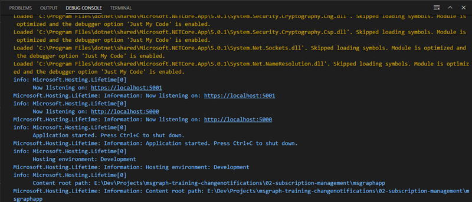
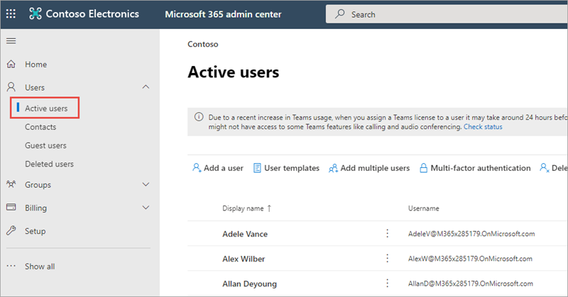
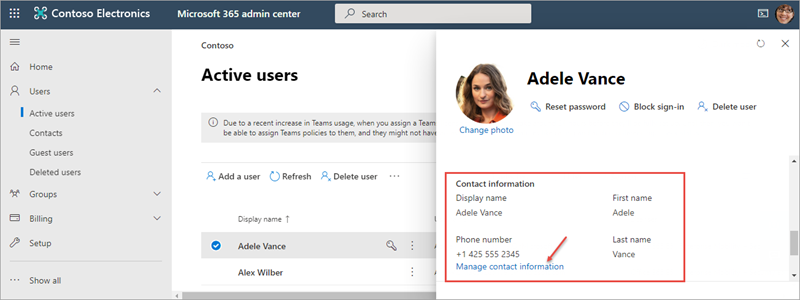

> [!VIDEO https://www.microsoft.com/videoplayer/embed/RE4OO3j]

In this exercise, you'll extend the existing ASP.NET Core web API application to receive notifications from Microsoft Graph subscriptions. The notifications are sent after a subscription is successfully created, requesting Microsoft Graph to notify an endpoint when specified entities are created, updated, or deleted.

> [!IMPORTANT]
> This exercise assumes you have created the Azure AD application and .NET console application from the previous unit in this module. You'll edit the existing Azure AD application and .NET console application created in that exercise in this exercise.

## Update the ASP.NET Core web API project

Open the **Program.cs** file and replace the entire contents with the following code:

```csharp
using System;
using System.Collections.Generic;
using System.Linq;
using System.Threading.Tasks;
using Microsoft.AspNetCore.Hosting;
using Microsoft.Extensions.Configuration;
using Microsoft.Extensions.Hosting;
using Microsoft.Extensions.Logging;

namespace msgraphapp
{
    public class Program
    {
        public static void Main(string[] args)
        {
            CreateHostBuilder(args).Build().Run();
        }

        public static IHostBuilder CreateHostBuilder(string[] args) =>
            Host.CreateDefaultBuilder(args)
                .ConfigureWebHostDefaults(webBuilder =>
                {
                    webBuilder.UseStartup<Startup>();
                });
    }
}
```

If the project doesn't contain a file named **Startup.cs**, then add it in the root of the project. Open the **Startup.cs** file and replace the entire contents with the following code:

```csharp
using System;
using System.Collections.Generic;
using System.Linq;
using System.Threading.Tasks;
using Microsoft.AspNetCore.Builder;
using Microsoft.AspNetCore.Hosting;
using Microsoft.AspNetCore.HttpsPolicy;
using Microsoft.AspNetCore.Mvc;
using Microsoft.Extensions.Configuration;
using Microsoft.Extensions.DependencyInjection;
using Microsoft.Extensions.Hosting;
using Microsoft.Extensions.Logging;
using Microsoft.OpenApi.Models;

namespace msgraphapp
{
    public class Startup
    {
        public Startup(IConfiguration configuration)
        {
            Configuration = configuration;
        }

        public IConfiguration Configuration { get; }

        // This method gets called by the runtime. Use this method to add services to the container.
        public void ConfigureServices(IServiceCollection services)
        {

            services.AddControllers();
            services.AddSwaggerGen(c =>
            {
                c.SwaggerDoc("v1", new OpenApiInfo { Title = "msgraphapp", Version = "v1" });
            });
        }

        // This method gets called by the runtime. Use this method to configure the HTTP request pipeline.
        public void Configure(IApplicationBuilder app, IWebHostEnvironment env)
        {
            if (env.IsDevelopment())
            {
                app.UseDeveloperExceptionPage();
                app.UseSwagger();
                app.UseSwaggerUI(c => c.SwaggerEndpoint("/swagger/v1/swagger.json", "msgraphapp v1"));
            }

            app.UseRouting();

            app.UseAuthorization();

            app.UseEndpoints(endpoints =>
            {
                endpoints.MapControllers();
            });
        }
    }
}
```

### Add model class

The application uses several new model classes for (de)serialization of messages to/from the Microsoft Graph.

Create a new folder named **Models** in the root of the project.

Create a new file named **MyConfig.cs** in the **Models** folder and add the following code:

```csharp
namespace msgraphapp
{
  public class MyConfig
  {
    public string AppId { get; set; } = string.Empty;
    public string AppSecret { get; set; } = string.Empty;
    public string TenantId { get; set; } = string.Empty;
    public string Ngrok { get; set; } = string.Empty;
  }
}
```

Open the **Startup.cs** file. Locate the method `ConfigureServices()` method and add the following code at the end of the method:

```csharp
var config = new MyConfig();
Configuration.Bind("MyConfig", config);
services.AddSingleton(config);
```

Open the **appsettings.json** file and replace the content with the following JSON.

```json
{
  "Logging": {
    "LogLevel": {
      "Default": "Warning"
    }
  },
  "MyConfig":
  {
    "AppId": "<APP ID>",
    "AppSecret": "<APP SECRET>",
    "TenantId": "<TENANT ID>",
    "Ngrok": "<NGROK URL>"
  }
}
```

Replace the following variables with the values you copied earlier:

- `<NGROK URL>`: set to the https ngrok url you copied earlier
- `<TENANT ID>`: set to your Office 365 tenant ID you copied earlier
- `<APP ID>` & `<APP SECRET>`: set to the application ID and secret you copied earlier when you registered the app in the Azure AD admin center

### Add notification controller

The application requires a new controller to process the subscription and notification.

Right-click the **Controllers** folder, select **New File**, and name the controller **NotificationsController.cs**.

Replace the contents of **NotificationsController.cs** with the following code:

```csharp
using System;
using System.Collections.Generic;
using System.IO;
using System.Linq;
using System.Net.Http;
using System.Threading.Tasks;
using Microsoft.AspNetCore.Mvc;
using System.Text.Json;
using System.Net;
using System.Threading;
using Microsoft.Graph;
using Microsoft.Identity.Client;
using System.Net.Http.Headers;

namespace msgraphapp.Controllers
{
  [Route("api/[controller]")]
  [ApiController]
  public class NotificationsController : ControllerBase
  {
    private readonly MyConfig config;

    public NotificationsController(MyConfig config)
    {
      this.config = config;
    }

    [HttpGet]
    public async Task<ActionResult<string>> Get()
    {
      var graphServiceClient = GetGraphClient();

      var sub = new Microsoft.Graph.Subscription();
      sub.ChangeType = "updated";
      sub.NotificationUrl = config.Ngrok + "/api/notifications";
      sub.Resource = "/users";
      sub.ExpirationDateTime = DateTime.UtcNow.AddMinutes(5);
      sub.ClientState = "SecretClientState";

      var newSubscription = await graphServiceClient
        .Subscriptions
        .Request()
        .AddAsync(sub);

      return $"Subscribed. Id: {newSubscription.Id}, Expiration: {newSubscription.ExpirationDateTime}";
    }

    public async Task<ActionResult<string>> Post([FromQuery]string? validationToken = null)
    {
      // handle validation
      if(!string.IsNullOrEmpty(validationToken))
      {
        Console.WriteLine($"Received Token: '{validationToken}'");
        return Ok(validationToken);
      }

      // handle notifications
      using (StreamReader reader = new StreamReader(Request.Body))
      {
        string content = await reader.ReadToEndAsync();

        Console.WriteLine(content);

        var notifications = JsonSerializer.Deserialize<ChangeNotificationCollection>(content);

        if (notifications != null) {
          foreach(var notification in notifications.Value)
          {
            Console.WriteLine($"Received notification: '{notification.Resource}', {notification.ResourceData.AdditionalData["id"]}");
          }
        }
      }

      return Ok();
    }

    private GraphServiceClient GetGraphClient()
    {
      var graphClient = new GraphServiceClient(new DelegateAuthenticationProvider((requestMessage) => {
        // get an access token for Graph
        var accessToken = GetAccessToken().Result;

        requestMessage
            .Headers
            .Authorization = new AuthenticationHeaderValue("bearer", accessToken);

        return Task.FromResult(0);
      }));

      return graphClient;
    }

    private async Task<string> GetAccessToken()
    {
      IConfidentialClientApplication app = ConfidentialClientApplicationBuilder.Create(config.AppId)
        .WithClientSecret(config.AppSecret)
        .WithAuthority($"https://login.microsoftonline.com/{config.TenantId}")
        .WithRedirectUri("https://daemon")
        .Build();

      string[] scopes = new string[] { "https://graph.microsoft.com/.default" };

      var result = await app.AcquireTokenForClient(scopes).ExecuteAsync();

      return result.AccessToken;
    }

  }
}
```

**Save** all files.

### Update the Visual Studio Code debugger launch configuration

By default, the .NET Core launch configuration will open a browser and navigate to the default URL for the application when launching the debugger. For this application, we instead want to navigate to the NGrok URL. If you leave the launch configuration as is, each time you debug the application it will display a broken page. You can just change the URL, or change the launch configuration to not launch the browser.

In Visual Studio Code, open the file **.vscode/launch.json**.

Delete the following section in the default configuration:

```json
// Enable launching a web browser when ASP.NET Core starts. For more information: https://aka.ms/VSCode-CS-LaunchJson-WebBrowser
"serverReadyAction": {
  "action": "openExternally",
  "pattern": "^\\s*Now listening on:\\s+(https?://\\S+)"
},
```

Save your changes.

Ensure the port being used to host the application matches the port that ngrok was configure to use.

Open the file **Properties/launchSettings.json**.

Set the value for **profiles.msgraphapp.applicationUrl** to `https://localhost:5001;http://localhost:5000`.

Save your changes.

### Test the application

In Visual Studio Code, select **Run > Start debugging** to run the application. Visual Studio Code will build and start the application.

Once you see the following in the **Debug Console** window...



Open a browser and navigate to **http://localhost:5000/api/notifications** to subscribe to change notifications. If successful you'll see output that includes a subscription ID like the one below:


Your application is now subscribed to receive notifications from the Microsoft Graph when an update is made on any user in the Office 365 tenant.

Now, test the subscription by updating a user to trigger a notification from Microsoft Graph:

Open a browser and navigate to the [Microsoft 365 admin center (https://admin.microsoft.com/AdminPortal)](https://admin.microsoft.com/AdminPortal).

If you're prompted to sign-in, sign-in using an admin account.

Select **Users > Active users**.



Select an active user and select **Edit** for their **Contact information**.



Update the **Phone number** value with a new number and Select **Save**.

In the Visual Studio Code **Debug Console**, you'll see a notification has been received. Sometimes this may take a few minutes to arrive. An example of the output is below:

```console
Received notification: 'Users/7a7fded6-0269-42c2-a0be-512d58da4463', 7a7fded6-0269-42c2-a0be-512d58da4463
```

This indicates the application successfully received the notification from the Microsoft Graph for the user specified in the output. You can then use this information to query the Microsoft Graph for the users full details if you want to synchronize their details into your application.

### Renew subscriptions

> [!VIDEO https://www.microsoft.com/videoplayer/embed/RE4OATd]

Subscriptions for notifications expire and need to be renewed periodically. The following steps will demonstrate how to renew notifications

Open **Controllers/NotificationsController.cs** file

Add the following two member declarations to the `NotificationsController` class:

```csharp
private static Dictionary<string, Subscription> Subscriptions = new Dictionary<string, Subscription>();
private static Timer? subscriptionTimer = null;
```

Add the following new methods. These will implement a background timer that will run every 15 seconds to check if subscriptions have expired. If they have, they'll be renewed.

```csharp
private void CheckSubscriptions(Object? stateInfo)
{
  AutoResetEvent? autoEvent = stateInfo as AutoResetEvent;

  Console.WriteLine($"Checking subscriptions {DateTime.Now.ToString("h:mm:ss.fff")}");
  Console.WriteLine($"Current subscription count {Subscriptions.Count()}");

  foreach(var subscription in Subscriptions)
  {
    // if the subscription expires in the next 2 min, renew it
    if(subscription.Value.ExpirationDateTime < DateTime.UtcNow.AddMinutes(2))
    {
      RenewSubscription(subscription.Value);
    }
  }
}

private async void RenewSubscription(Subscription subscription)
{
  Console.WriteLine($"Current subscription: {subscription.Id}, Expiration: {subscription.ExpirationDateTime}");

  var graphServiceClient = GetGraphClient();

  var newSubscription = new Subscription
  {
    ExpirationDateTime = DateTime.UtcNow.AddMinutes(5)
  };

  await graphServiceClient
    .Subscriptions[subscription.Id]
    .Request()
    .UpdateAsync(newSubscription);

  subscription.ExpirationDateTime = newSubscription.ExpirationDateTime;
  Console.WriteLine($"Renewed subscription: {subscription.Id}, New Expiration: {subscription.ExpirationDateTime}");
}
```

The `CheckSubscriptions()` method is called every 15 seconds by the timer.

> [!TIP]
> For production use this should be set to a more reasonable value to reduce the number of unnecessary calls to Microsoft Graph.

The `RenewSubscription()` method renews a subscription and is only called if a subscription is going to expire in the next two minutes.

Locate the method `Get()` and replace it with the following code:

```csharp
[HttpGet]
public async Task<ActionResult<string>> Get()
{
  var graphServiceClient = GetGraphClient();

  var sub = new Microsoft.Graph.Subscription();
  sub.ChangeType = "updated";
  sub.NotificationUrl = config.Ngrok + "/api/notifications";
  sub.Resource = "/users";
  sub.ExpirationDateTime = DateTime.UtcNow.AddMinutes(15);
  sub.ClientState = "SecretClientState";

  var newSubscription = await graphServiceClient
    .Subscriptions
    .Request()
    .AddAsync(sub);

  Subscriptions[newSubscription.Id] = newSubscription;

  if (subscriptionTimer == null)
  {
    subscriptionTimer = new Timer(CheckSubscriptions, null, 5000, 15000);
  }

  return $"Subscribed. Id: {newSubscription.Id}, Expiration: {newSubscription.ExpirationDateTime}";
}
```

### Test the changes

Within Visual Studio Code, select **Run > Start debugging** to run the application.

Navigate to the following url: **http://localhost:5000/api/notifications**. This will register a new subscription.

In the Visual Studio Code **Debug Console** window, approximately every 15 seconds, notice the timer checking the subscription for expiration:

```console
Checking subscriptions 12:32:51.882
Current subscription count 1
```

Wait a few minutes and you'll see the following when the subscription needs renewing:

```console
Renewed subscription: 07ca62cd-1a1b-453c-be7b-4d196b3c6b5b, New Expiration: 3/10/2019 7:43:22 PM +00:00
```

This indicates that the subscription was renewed and shows the new expiry time.

## Summary

In this exercise, you extended the existing ASP.NET Core web API application to receive notifications from Microsoft Graph subscriptions. The notifications are sent after a subscription is successfully created, requesting Microsoft Graph to notify an endpoint when specified entities are created, updated, or deleted.
