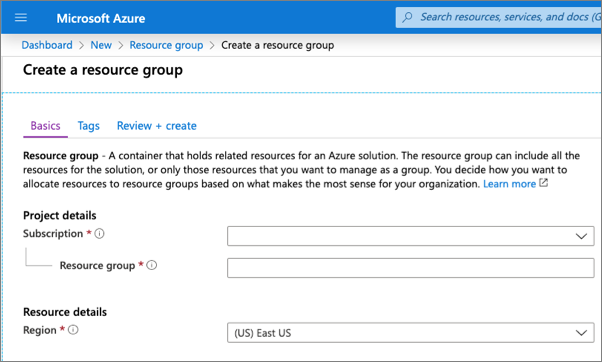
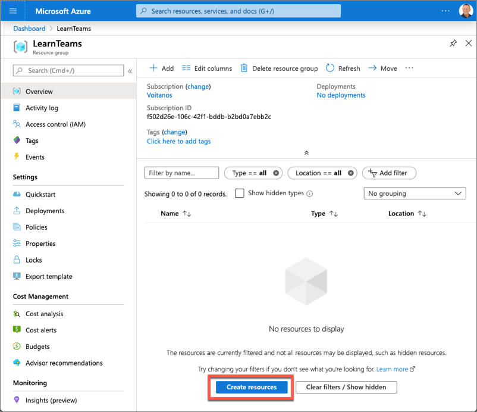
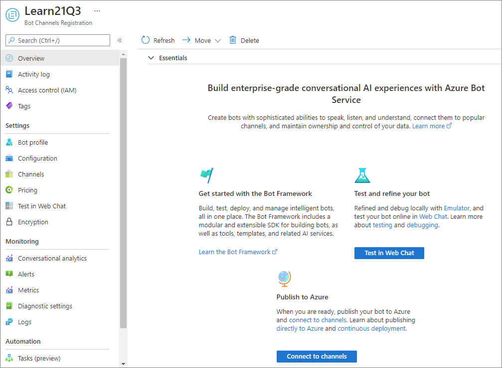
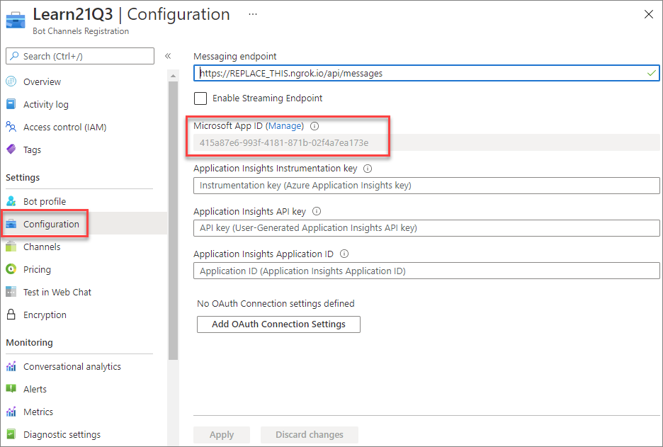
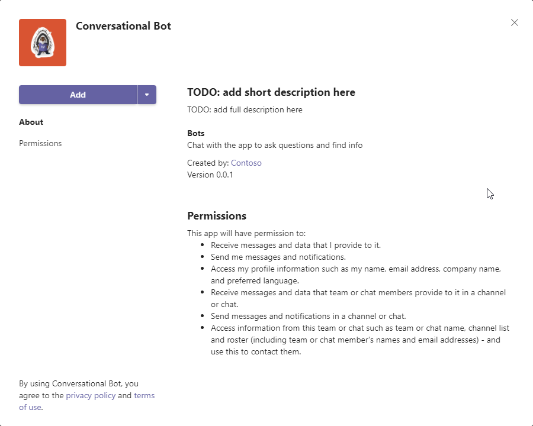
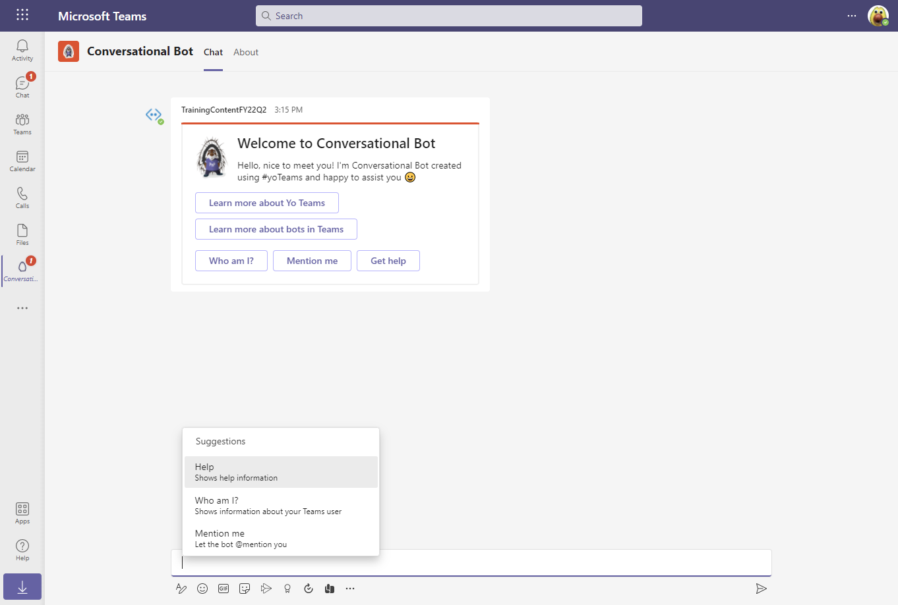

> [!VIDEO https://www.microsoft.com/videoplayer/embed/RE4NzEq]

In this exercise, you’ll learn how to create and add a new bot to a Microsoft Teams app and interact with it from the Microsoft Teams client.

> [!NOTE]
> This exercise requires a valid Azure subscription in order to create a bot using Bot Framework. However, if you do not have an Azure subscription, you can use the legacy Bot Framework Registration Portal. For more information, see [Create a bot for Microsoft Teams](/microsoftteams/platform/bots/how-to/create-a-bot-for-teams).

## Prerequisites

Developing Microsoft Teams apps requires a Microsoft 365 tenant, Microsoft Teams configured for development, and the necessary tools installed on your workstation.

For the Microsoft 365 tenant, follow the instructions on [Microsoft Teams: Prepare your Microsoft 365 tenant](/microsoftteams/platform/get-started/get-started-tenant) for obtaining a developer tenant if you don't currently have a Microsoft 365 account. Make sure you have also enabled Microsoft Teams for your organization.

Microsoft Teams must be configured to enable custom apps and allow custom apps to be uploaded to your tenant to build custom apps for Microsoft Teams. Follow the instructions on the same **Prepare your Microsoft 365 tenant** page mentioned above.

You'll use Node.js to create a custom Microsoft Teams app in this module. The exercises in this module assume you have the following tools installed on your developer workstation.

> [!IMPORTANT]
> In most cases, installing the latest version of the following tools is the best option. The versions listed here were used when this module was published and last tested.

- [Node.js](https://nodejs.org/) - v14.\*
- npm (installed with Node.js) - v7.\*
- [Gulp CLI](https://gulpjs.com/) - v2.3.\*
- [Yeoman](https://yeoman.io/) - v4.3.\*
- [Yeoman Generator for Microsoft Teams](https://github.com/pnp/generator-teams) - v3.5.0
- [Visual Studio Code](https://code.visualstudio.com)

You must have the minimum versions of these prerequisites installed on your workstation.

## Register a new bot in Microsoft Azure

The first step is to create a new Microsoft Teams bot. Adding a bot to the Teams app involves two steps:

1. Register the bot with Microsoft Azure's Bot Framework
1. Add a bot to the project codebase

### Register the bot with Microsoft Azure's Bot Framework

Open a browser and navigate to the [Azure portal](https://portal.azure.com). Sign in using a **Work or School Account** that has rights to create resources in your Azure subscription.

Select **Create a resource** in the left-hand navigation:


Enter **resource group** in the **Search the marketplace** input box, and select **Resource group**.


On the **Resource Group** page, select the **Create** button to create a new resource group.

Select a valid subscription, enter a name for the resource group, and select the wanted region. _None of these choices will impact the bot registration and are up to you._



Complete the wizard to create the resource group. Once Azure has completed the resource group creation process, navigate to the resource group.

From the resource group, select the **Create resources** button.



Enter **bot** in the **Search services and marketplace** input box, and select **Azure Bot** from the list of resources returned. Then select **Create** on the next page to start the process of registering a new bot resource:


In the **Create an Azure Bot** blade, enter the following values and then select **Review + create**:

- **Bot handle**: _Enter a globally unique name for the bot_
- **Subscription**: _Select the subscription you selected previously when creating the resource group_
- **Resource group**: _Select the resource group you created previously_
- **Pricing tier**: _Select a preferred pricing tier; the F0 tier is free_
- **Type of App**: _Select Multi Tenant_
- **Creation type**: _Select Create new Microsoft App ID_

Select **Review + create**, then select **Create**.

Azure will start to provision the new resource. This will take a moment or two. Once it's finished, navigate to the bot resource in the resource group.



### Enable the Microsoft Teams channel for the bot

In order for the bot to interact with Microsoft Teams, you must enable the Teams channel.

From the bot resource in Azure, select **Channels** in the left-hand navigation.

On the **Connect to channels** pane, select the Microsoft Teams channel, then select **Apply** to confirm the action.


Once this process is complete, you should see both the **Web Chat** and **Microsoft Teams** listed in your enabled channels:


### Set Messaging Endpoint and retrieve the bot app ID and password

Select **Configuration** from the left-hand navigation.

On the **Configuration** pane, enter the **Messaging endpoint**: `https://REPLACE_THIS.ngrok.io/api/messages`

Select **Apply**.

When Azure created the bot, it also registered a new Azure AD app for the bot. Generate this new bot app a secret and copy the app's credentials.

Select **Configuration** from the left-hand navigation. Copy the **Microsoft App ID** of the bot as you'll need it later.

Select **Manage** to navigate to the Azure AD app blade:



### Create a client secret for the app

In order for the daemon app to run without user involvement, it will sign in to Azure AD with an application ID and either a certificate or secret. In this exercise, you'll use a secret.

Select the **New client secret** button:


When prompted, give the secret a description and select one of the expiration duration options provided and select **Add**. _What you enter and select doesn't matter for the exercise._

The **Certificate & Secrets** page will display the new secret. It's important you copy this value as it's only shown this one time; if you leave the page and come back, it will only show as a masked value.


Copy the value of the secret as you'll need it later.

## Create Microsoft Teams app

> [!VIDEO https://www.microsoft.com/videoplayer/embed/RE4NCi2]

In this section, you'll create a new Node.js project.

Open your command prompt, navigate to a directory where you want to save your work, create a new folder **learn-msteams-bots**, and change directory into that folder.

Run the Yeoman Generator for Microsoft Teams by running the following command:

```console
yo teams
```

Yeoman will launch and ask you a series of questions. Answer the questions with the following values:

- **What is your solution name?**: ConversationalBot
- **Where do you want to place the files?**: Use the current folder
- **Title of your Microsoft Teams App project?**: Conversational Bot
- **Your (company) name? (max 32 characters)**: Contoso
- **Which manifest version would you like to use?**: v1.11
- **Quick scaffolding**: Yes
- **What features do you want to add to your project?**: A bot
- **The URL where you will host this solution?**: (Accept the default option)
- **Would you like show a loading indicator when your app/tab loads?**: No
- **What type of Bot would you like to use?** A new Bot Framework bot
- **What is the name of your bot?** Conversational Bot
- **What is the Microsoft App ID for the Bot. It's found in the Bot Framework portal (https://dev.botframework.com).** (Enter the application ID of the bot you created in the previous step)
- **Do you want to add a static tab to your bot?** No
- **Do you want to support file upload to the bot?** No
- **Do you want to include bot calling support?** No

> [!NOTE]
> Most of the answers to these questions can be changed after creating the project. For example, the URL where the project will be hosted isn't important at the time of creating or testing the project.

After answering the generator's questions, the generator will create the scaffolding for the project and then execute `npm install` that downloads all the dependencies required by the project.

### Update the project's environment variables

The project contains a file used during development to set environment variables to store secure values, such as the Azure AD application's ID and secret that the bot is associated with.

You need to set these two values for the bot to work:

1. Locate and open the file **./.env**.
1. Locate the following section in the file, and set the values of the two properties that you obtained when registering the bot:

   ```txt
   # App Id and App Password fir the Bot Framework bot
   MICROSOFT_APP_ID=
   MICROSOFT_APP_PASSWORD=
   ```

### Register the bot in the Microsoft Teams app

The last step before you can test bot is to add it to the Microsoft Teams app manifest. You can use App Studio to do this.

In the browser, navigate to **https://teams.microsoft.com** and sign in with the credentials of a Work and School account.

> [!NOTE]
> Microsoft Teams is available for use as a web client, desktop client and a mobile client. In this module, we will use the web client but any of the clients can be used.

Using the app bar navigation menu, select the **More added apps** button. Then select **App Studio**:


Select the **Manifest editor** tab and then the **Create a new app** button:


Provide a short name.

Select Generate for a new App ID.

Provide a Package Name and Version.

Provide a Short Description and Full Description.


From the **(2) Capabilities** > **Bots** page, select **Set up** to add a bot to the manifest.

Because you previously created a bot using the Microsoft Azure's Bot Framework, select **Existing bot** and set the following values and select **Save**:

- **Bot ID**
  - Connect to a different bot ID: `<REPLACE_WITH_MICROSOFT_APP_ID>`
- **Scope**: Personal, Team

Select **Save**.


Within the **Commands** section, select **Add** to add a new command to the bot.

On the **New command** dialog, enter the following values and select **Save**:

- **Command text**: MentionMe
- **Help text**: Sends message with @mention of the sender
- **Scope**: Personal


With the bot added to the Teams app, you need to update the manifest in your project. From the **(3) Finish** > **Test and distribute** section, select the **Download** button from the **Download** section.

This will download the app package as a ZIP. Unpack the zip and open the **manifest.json** file in it. Copy the updated information to your project, updating the existing **./src/manifest/manifest.json** file.

In the **./src/manifest/manifest.json** file, verify `icons` property's values, and update if necessary, file names to match what's in the project

Locate the property `bots`. Verify it contains the following JSON that includes the new command added in App Studio:

```json
"bots": [
  {
    "botId": "{{MICROSOFT_APP_ID}}",
    "supportsFiles": false,
    "isNotificationOnly": false,
    "scopes": [ "team", "personal" ],
    "commandLists": [
      {
        "scopes": [ "team", "personal" ],
        "commands": [
          {
            "title": "Help",
            "description": "Shows help information"
          },
          {
            "title": "MentionMe",
            "description": "Sends message with @mention of the sender"
          }
        ]
      }
    ]
  }
],
```

> [!IMPORTANT]
> Notice the `botId` property value. If you see a GUID, the manifest has already been configured with the Bot App ID. If you see `{{MICROSOFT_APP_ID}}`, then this will be replaced with the value listed in the **./.env** file when you build the project.

At this point, your bot is ready to test!

## Test the conversation bot

From the command line, navigate to the root folder for the project and execute the following command:

```console
gulp ngrok-serve --debug
```

This gulp task will run many other tasks all displayed within the command-line console. The **ngrok-serve** task builds your project and starts a local web server (http://localhost:3007). It then starts ngrok with a random subdomain that creates a secure URL to your local webserver.

> [!NOTE]
> Microsoft Teams requires all content displayed within a tab be loaded from an HTTPS request. In development, can be done using the tool [ngrok](https://www.ngrok.com) that creates a secure rotatable URL to your local HTTP webserver. Ngrok is included as a dependency within the project so there is nothing to setup or configure.


Note the URL of the Ngrok URL displayed in the console. In the previous screenshot, NGrok has created the temporary URL **5f1f02998d18.ngrok.io** that will map to our locally running web server. In order for the Bot Framework to route messages from Microsoft Teams to our locally running bot, you need to update the bot's messaging endpoint in the Azure portal.

Open a browser and navigate to the [Azure portal](https://portal.azure.com) and sign in using a **Work or School Account** that has rights to create resources in your Azure subscription.

Locate the bot by selecting the Azure Resource Group and Bot Channels Registration resource you created at the beginning of this exercise.

Using the left-hand navigation, select **Bot management** > **Settings**.

Locate the property **Configuration** > **Messaging endpoint** and set the domain to the NGrok domain, pointing to the `/api/messages` endpoint. Using the example above, the endpoint will be `https://5f1f02998d18.ngrok.io/api/messages`


Finally, save your changes to the bot configuration using the **Save** button at the top of the page.

> [!IMPORTANT]
> The free version of Ngrok will create a new URL each time you restart the web server. Make sure you update the **Messaging endpoint** of your URL each time you restart the web server when you're testing the app.

### Install the custom app in Microsoft Teams

Now let's install the app in Microsoft Teams. In the browser, navigate to **https://teams.microsoft.com** and sign in with the credentials of a Work and School account.

> [!NOTE]
> Microsoft Teams is available for use as a web client, desktop client and a mobile client. In this module, we will use the web client but any of the clients can be used.

Using the app bar navigation menu, select the **More added apps** button. Then select **More apps**. On the **Apps** page, select **Manage your apps** > **Publish an app** > **Upload a custom app**.

> [!NOTE]
> If Developer Preview is turned on for Teams, the button is labelled **Upload an app** instead of **Publish an app**.


In the file dialog that appears, select the Microsoft Teams package in your project. This app package is a ZIP file that can be found in the project's **./package** folder.

> [!NOTE]
> If the **./package** folder is not present, this means you are affected by a bug in the yoteams-deploy package. To resolve the issue:
> - Stop the local web server by pressing <kbd>CTRL</kbd>+<kbd>C</kbd> in the console.
> - Install the preview version of the **yoteams-deploy** package using the command `npm install yoteams-deploy@preview`
> - Restart the server process: `gulp ngrok-serve`

Once the package is uploaded, Microsoft Teams will display a summary of the app. Here you can see some "todo" items to address. _None of these "todo" items are important to this exercise, so you'll leave them as is._



Select the **Add** button to install the app. Teams will navigate to the chat with the bot:



Notice the commands that the bot supports are shown in the compose box when the app loads. Let's test the bot!

Select the **MentionMe** command, or manually type **mentionme** in the compose box, then press <kbd>enter</kbd>.

After a few seconds, you should see the bot respond mentioning the user you're signed in with:


At this point, we have a working bot that is responding when it's mentioned.

## Summary

In this exercise, you’ll learn how to create and add a new bot to a Microsoft Teams app and interact with it from the Microsoft Teams client.
