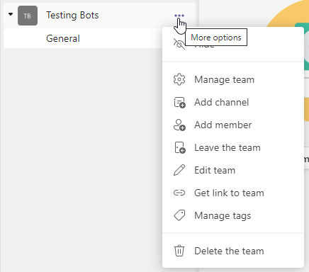
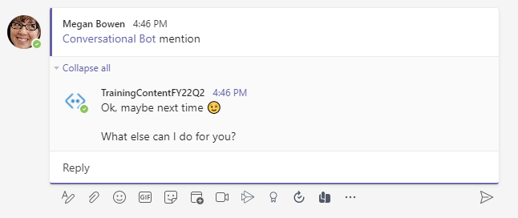
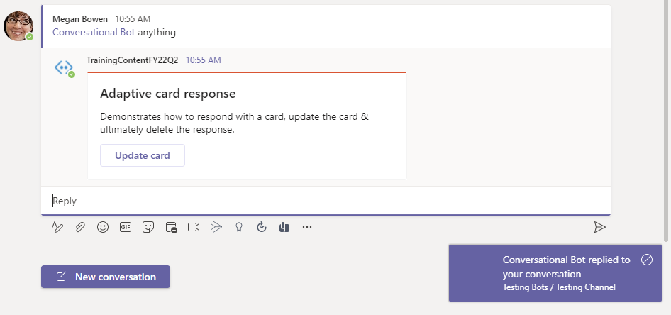

> [!VIDEO https://www.microsoft.com/videoplayer/embed/RE4NHyh]

Conversation bots can do many things within the Microsoft Teams client. They can proactively send a message to a channel or group chat, listen for and act on Microsoft Teams specific events and even update their own messages.

In this exercise, you’ll modify the existing Microsoft Teams app to update your bot to respond to message reactions, and update or delete messages capabilities.

> [!IMPORTANT]
> This exercise assumes you have created the Microsoft Teams app project with the Yeoman generator from the previous exercise in this module.

## Detect conversation in a channel

In this section, you'll modify the existing Microsoft Teams app to properly respond to messages from the **Posts** tab.

From the command line, navigate to the root folder for the project and execute the following command:

```console
gulp ngrok-serve --debug
```

> [!IMPORTANT]
> Recall from a previous exercise, Ngrok will create a new subdomain. You need to update your bot registration's **Messaging endpoint** in the Azure portal (*shown in a previous exercise*) with this new domain before testing it.

### Install the app in a channel

Navigate to (or create) a Team for testing the channel conversation. In the Teams list, select **More options** next to the Team. Then select **Manage team**.



Select the **Apps** tab and then **Upload a custom app**.


In the file dialog that appears, select the Microsoft Teams package in your project. This app package is a ZIP file that can be found in the project's **./package** folder.

After the package is uploaded, Microsoft Teams displays a summary of the app. Select the **Add** button, and select **Add to a team** to install the app.

In a channel of the Team, @ mention the bot, sending the `mention` command. Notice that the response does not mention the user.



### Update the bot code

In the previous exercise, our code was looking for the specific message `MentionMe` to respond. This works in a 1:1 personal chat because the bot isn't mentioned in the conversation.

However, in a channel conversation, a user must @mention the bot to trigger it. This results in a message containing a reference to the bot, not just the message submitted.

While there are multiple ways to address this, let's check the type of conversation the message is from and handle it correctly.

Locate and open the bot in the file **./src/server/conversationalBot/dialogs/mainDialog.ts**. Locate the existing `actStep()` method in the class and find the `switch` statement that checks the activity text. Add the following `if` statement above the `switch` statement:

```typescript
if (stepContext.context.activity.conversation.conversationType === "channel") {
  TurnContext.removeRecipientMention(stepContext.context.activity);
}

// existing switch statement
switch (stepContext.context.activity.text) {
  ...
}
```

In the context of a channel, the repeated prompt "What else can I do for you?" may be too noisy. The prompt can be suppressed when in a channel by updating the `finalStep` method. Replace the `finalStep` method with the following:

```typescript
private async finalStep(stepContext: WaterfallStepContext): Promise<DialogTurnResult> {
  if (stepContext.context.activity.conversation.conversationType !== "channel") {
    return await stepContext.replaceDialog(this.initialDialogId, { restartMsg: "What else can I do for you?" });
  } else {
    return await stepContext.endDialog();
  }
}
```

Save your changes, update, and test the installed app.

The `gulp` task will detect the change and run the **webpack:server** task. 


Once that task completes, @mention the bot again.


## Reply to messages with Adaptive cards

> [!VIDEO https://www.microsoft.com/videoplayer/embed/RE4NHym]

In this section, you'll update the bot to respond to unknown messages using an Adaptive card. The card's single action will trigger the bot to update the existing message with a new Adaptive card. The updated message will include an additional action that will trigger the bot to delete the message.

Run the following command to install the Adaptive Cards SDK and supporting packages:

```shell
npm install adaptivecards-templating adaptive-expressions
```

Create a new file named **responseCard.json** in the **./src/server/conversationalBot/cards** folder. Add the following json which defines an adaptive card:

```json
{
  "$schema": "http://adaptivecards.io/schemas/adaptive-card.json",
  "type": "AdaptiveCard",
  "version": "1.4",
  "body": [
    {
      "type": "Container",
      "items": [
        {
          "type": "TextBlock",
          "text": "Adaptive card response",
          "weight": "bolder",
          "size": "large"
        }
      ]
    },
    {
      "type": "Container",
      "items": [
        {
          "type": "TextBlock",
          "text": "${message}",
          "wrap": true
        }
      ]
    }
    },
    {
      "type": "ActionSet",
      "actions": [
        {
          "type": "Action.Execute",
          "title": "Update card",
          "verb": "update",
          "data": {
            "count":"${count}"
          }
        },
        {
          "type": "Action.Execute",
          "title": "Delete card",
          "verb": "delete",
          "$when": "${showDelete}"
        }
      ]
  ]
}
```

Notice that the card contains binding expressions (`${...}`) used with Adaptive Card templating. The card also contains actions, which contain `verb` and `data` attributes that are sent to the bot when the action is invoked (selected).

Create a new file named **responseCard.ts** in the **./src/server/conversationalBot/cards** folder. Add the following statements to load the card json:

```typescript
const ResponseCard = require("./responseCard.json");
export default ResponseCard;
```

Locate and open the dialog in the file **./src/server/conversationalBot/dialogs/mainDialog.ts**.

Add the following statements to the top of the file:

```typescript
import ResponseCard from "../cards/responseCard";
import * as ACData from "adaptivecards-templating";
```

Update the existing `import` from `botbuilder` to include the `CardFactory` class:

```typescript
import {
  MessageFactory,
  StatePropertyAccessor,
  InputHints,
  TurnContext,
  CardFactory
} from "botbuilder";
```

Locate the existing `actStep()` method in the class and find the `switch` statement that checks the activity text. Replace the `default` case statements with a call to a method that will load and send the response card:

```typescript
switch (stepContext.context.activity.text) {
  // existing case statements
  default: {
    await this.sendResponseCard(stepContext.context);
    return await stepContext.next();
  }
}
```

Add the following method to send an adaptive card if the bot receives an unknown command:

```typescript
private async sendResponseCard(turnContext: TurnContext): Promise<void> {
  const cardData = {
    message: "Demonstrates how to respond with a card, update the card & ultimately delete the response.",
    count: 0
  };
  const template = new ACData.Template(ResponseCard);
  const context: ACData.IEvaluationContext = {
    $root: cardData
  };
  const acCard = template.expand(context);
  const attachment = CardFactory.adaptiveCard(acCard);
  await turnContext.sendActivity({ attachments: [attachment] });
}
```

When the use selects the button that represents an action, the bot will receive an `onAdaptiveCardInvoke` event. This event is part of the `TeamsActivityHandler` which is the base class for the `ConversationalBot` class. The event can be handled by implementing the handler in our class.

Open the file **./src/server/conversationalBot/ConversationalBot.ts**.

Add the following `import` statements to the top of the file:

```typescript
import ResponseCard from "./cards/responseCard";
import * as ACData from "adaptivecards-templating";
```

Update the existing `import` from `botbuilder` to include the `CardFactory` class:

```typescript
import {
	AdaptiveCardInvokeValue,
	AdaptiveCardInvokeResponse,
	StatusCodes,
  // existing imports omitted for clarity
} from "botbuilder";
```

Add the following method to the `ConversationalBot` class:

```typescript
protected async onAdaptiveCardInvoke(context: TurnContext, invokeValue: AdaptiveCardInvokeValue): Promise<any> {
  let cardResponse: AdaptiveCardInvokeResponse;

  try {
    const verb = invokeValue.action.verb;
    switch (verb) {
      case "update":
        {
          let clickCount: number = invokeValue.action.data.count as number;
          const cardData = {
            message: `Updated count: ${++clickCount}`,
            count: clickCount,
            showDelete: true
          };
          const template = new ACData.Template(ResponseCard);
          const context: ACData.IEvaluationContext = {
            $root: cardData
          };
          const acCard = template.expand(context);

          cardResponse = {
            statusCode: StatusCodes.OK,
            type: "application/vnd.microsoft.card.adaptive",
            value: acCard
          } as unknown as AdaptiveCardInvokeResponse;

        }
        break;

      case "delete":
        await context.deleteActivity(context!.activity!.replyToId!);
        return Promise.resolve({
          statusCode: 200,
          type: "application/vnd.microsoft.activity.message",
          value: "Deleting activity..."
        });

      default:
        return Promise.resolve({
          statusCode: 200,
          type: "application/vnd.microsoft.activity.message",
          value: "I don't know how to process that verb"
        });
    }
    return Promise.resolve(cardResponse);
  } catch (error) {
    return Promise.reject(error);
  }
}
```

In the code you've added, notice the `update` code block retrieves and increments the `count` property it received. It then creates a new cardData object with an updated message and boolean property that will render an additional action to delete the card. The method returns an `AdaptiveCardInvokeResponse` object containing an updated card to render inplace of the original.

The `delete` code block deletes the card using the `deleteActivity()` method.

### Test the bot updating existing messages

Save your changes. The `gulp` task will detect the change and run the **webpack:server** task. Wait for that task to complete.


In the Microsoft Teams client, go to the channel you installed the bot in the previous section. From the **Conversations** tab, @mention the bot with a random string to trigger the `else` condition.

The bot will reply to the message with a card:



Select the button **Update card**. After a few seconds, the card should be updated with a new card containing an incremented counter value and a new button:


Select the **Update card** button a few more times to see the counter get updated.

Finally, select the **Delete card** button. After a few seconds, the card will be removed by the bot.

## Reply to message reactions

In this section, you'll update the bot to respond when someone likes a message from the bot.

Locate and open the bot in the file **./src/server/conversationalBot/ConversationalBot.ts**.

Add the following `this.onMessageReaction()` handler to the class constructor method:

```typescript
if (context.activity.reactionsAdded) {
  context.activity.reactionsAdded.forEach(async (reaction) => {
    if (reaction.type === "like") {
      await context.sendActivity("Thank you!");
    }
  });
}
```

This code will execute when a user adds a reaction to a message from the bot. If the reaction is a *like*, the bot will reply with a *"Thank you!"* message

### Test the bot reacting to message reactions

From the command line, navigate to the root folder for the project and execute the following command:

```console
gulp ngrok-serve
```

> [!IMPORTANT]
> Recall from a previous exercise, Ngrok will create a new subdomain. You need to update your bot registration's **Messaging endpoint** in the Azure portal (*shown in a previous exercise*) with this new domain before testing it.

In the Microsoft Teams client, go to the channel you installed the bot in the previous section. From the **Conversations** tab, find a message from the bot and apply a *like* reaction to it. After a few seconds, the bot will reply with a message, thanking them for liking the reaction:


## Summary

In this exercise, you modified the existing Microsoft Teams app to update your bot to respond to message reactions, and update or delete messages capabilities.
