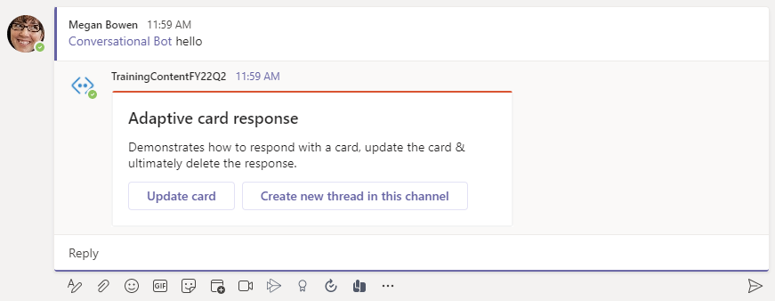
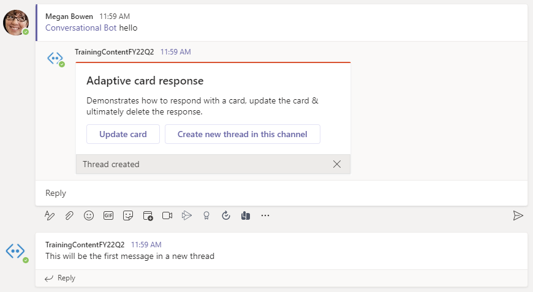

In this exercise, you’ll update the existing Teams app to send a proactive message from your bot.

> [!IMPORTANT]
> This exercise assumes you have created the Microsoft Teams app project with the Yeoman generator that contains a personal tab from the previous exercise in this module. You'll update the project to add a new task module that uses an Adaptive Card.

## Initiate a proactive message from the bot

Locate and open the bot in the file **./src/app/convoBot/convoBot.ts**.

Add the following objects to the existing `import {...} from "botbuilder";` statement you'll need:

```ts
import {
  ChannelInfo, TeamsChannelData, ConversationParameters, teamsGetChannelId
  Activity, BotFrameworkAdapter, ConversationReference, ConversationResourceResponse
} from "botbuilder";
```

Locate the card in the `else` statement in the `onMessage() handler you added in the previous section. Add a second action button to the card that will trigger the creation of a new message:

```ts
{
  type: ActionTypes.MessageBack,
  title: "Create new thread in this channel",
  value: value,
  text: "newconversation"
}
```

The card should now look like the following:

```ts
const card = CardFactory.heroCard(
  "Adaptive card response",
  "Demonstrates how to respond with a card, update the card & ultimately delete the response.",
  [],
  [
    {
      type: ActionTypes.MessageBack,
      title: "Update card",
      value: value,
      text: "UpdateCardAction"
    },
    {
      type: ActionTypes.MessageBack,
      title: "Create new thread in this channel",
      value: value,
      text: "newconversation"
    }
  ]
);
```

Next, add another `else if` block to in the `onMessage()` handler to detect this new action:

```ts
} else if (botMessageText === "newconversation") {
  const channelId = teamsGetChannelId(context.activity);
  const message = MessageFactory.text("This will be the first message in a new thread");
  const newConversation = await this.createConversationInChannel(context, channelId, message);
}
```

The last step is to add the `createConversationInChannel()` method that will create the new conversation. Add the following method to the `ConvoBot` class:

```ts
private async createConversationInChannel(context: TurnContext, teamsChannelId: string, message: Partial<Activity>): Promise<[ConversationReference, string]> {
  // create parameters for the new conversation
  const conversationParameters = <ConversationParameters>{
    isGroup: true,
    channelData: <TeamsChannelData>{
      channel: <ChannelInfo>{
        id: teamsChannelId
      }
    },
    activity: message
  };

  // get a reference to the bot adapter & create a connection to the Teams API
  const adapter = <BotFrameworkAdapter>context.adapter;
  const connectorClient = adapter.createConnectorClient(context.activity.serviceUrl);

  // create a new conversation and get a reference to it
  const conversationResourceResponse: ConversationResourceResponse = await connectorClient.conversations.createConversation(conversationParameters);
  const conversationReference = <ConversationReference>TurnContext.getConversationReference(context.activity);
  conversationReference.conversation.id = conversationResourceResponse.id;

  return [conversationReference, conversationResourceResponse.activityId];
}
```

### Test the bot sending new messages

From the command line, navigate to the root folder for the project and execute the following command:

```shell
gulp ngrok-serve
```

> [!IMPORTANT]
> Recall from a previous exercise, Ngrok will create a new subdomain. You need to update your bot registration's **Messaging endpoint** in the Azure portal (*shown in a previous exercise*) with this new domain before testing it.

In the Microsoft Teams client, go to the channel you installed the bot in the previous section. From the **Conversations** tab, @mention the bot with a random string to trigger the `else` condition.

The bot will reply to the message with the updated card that contains two buttons:



Select the second button, **Create new thread in this channel**. Within a few seconds, you should see a new conversation appear in the channel:



## Summary

In this exercise, you’ll modify the existing Microsoft Teams app update the bot to send a proactive message from your bot.
