> [!VIDEO https://www.microsoft.com/videoplayer/embed/RWUJEV]

In this exercise, you'll create a Microsoft Teams meetings app, install it into a new meeting, and interact with it before the meeting starts. This app will be used to organize and manage a product team's stand-up presentations to the rest of the team.

## Prerequisites

Developing Microsoft Teams apps requires a Microsoft 365 tenant, Microsoft Teams configured for development, and the necessary tools installed on your workstation.

For the Microsoft 365 tenant, follow the instructions in [Microsoft Teams: Prepare your Microsoft 365 tenant](/microsoftteams/platform/get-started/get-started-tenant) to obtain a developer tenant if you don't currently have a Microsoft 365 account. Make sure you've also enabled Microsoft Teams for your organization.

Microsoft Teams must be configured to enable custom apps and allow custom apps to be uploaded to your tenant to build custom apps for Microsoft Teams. Follow the instructions in "Prepare your Microsoft 365 tenant" mentioned previously.

You'll use Node.js to create a custom Microsoft Teams app in this module. The exercises in this module assume you've the following tools installed on your developer workstation.

> [!IMPORTANT]
> In most cases, installing the latest version of the following tools is the best option. The versions listed here were used when this module was published and last tested.

- [Node.js](https://nodejs.org/) - v12.\* (or higher)
- [NPM](https://www.npmjs.com/package/npm) (installed with Node.js) - v6.\* (or higher)
- [Gulp-cli](https://www.npmjs.com/package/gulp-cli) - v2.3.\* (or higher)
- [Yeoman](https://yeoman.io/) - v3.\* (or higher)
- [Yeoman Generator for Microsoft Teams](https://github.com/pnp/generator-teams) - v3.5.\* (or higher)
- [Visual Studio Code](https://code.visualstudio.com)

*You must have the minimum versions of these prerequisites installed on your workstation.*

## Register an Azure AD application to support single sign-on (SSO)

The meetings app you'll create in this module is going to use Microsoft Graph to obtain the meeting details. In order to do this, the app will use an Azure AD application with the necessary permissions and configured to support single sign-on.

Open a browser and navigate to the [Azure Active Directory admin center (https://aad.portal.azure.com)](https://aad.portal.azure.com). Sign in using a **Work or School Account** that has global administrator rights to the tenancy.

Select **Azure Active Directory > Manage > App registrations** in the left-hand navigation and then select **New registration**.

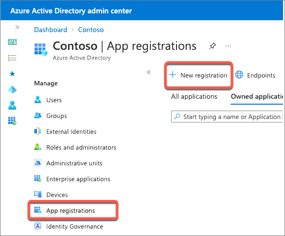

On the **Register an application** page, set the values as follows, and then select **Register**:

- **Name**: My Teams SSO App
- **Supported account types**: Accounts in any organizational directory (Any Azure AD directory - Multitenant)
- **Redirect URI**: Web & `https://REPLACE.ngrok.io/auth-end`

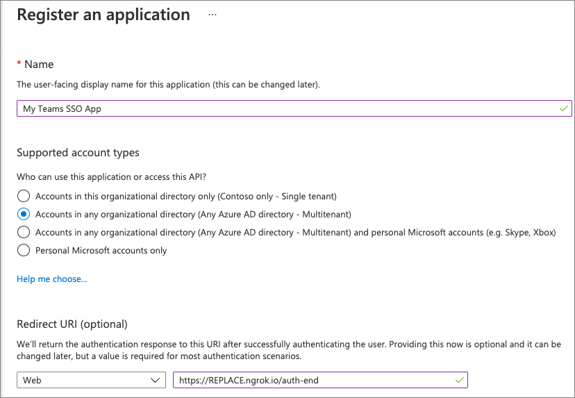

> [!NOTE]
> The **Redirect URL** will need to be updated once you know the dynamic subdomain of the proxy URL created by ngrok, a tool you'll use to simplify testing and debugging your Microsoft Teams app.
>
> In fact, you'll need to come back and update the Azure AD app registration in a few places where you'll enter the **REPLACE.ngrok.io** domain.
>
> For now, we'll just use this temporary domain.

On the **My Teams SSO App** page, copy the value of the **Application (client) ID** and **Directory (tenant) ID**; you'll need these later when you create the Microsoft Teams app later in this exercise.

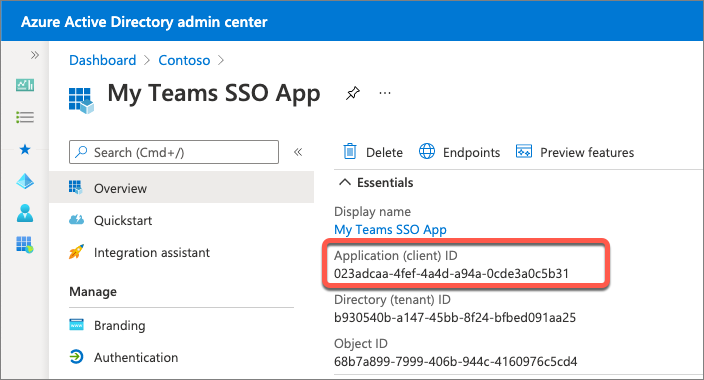

### Configure authentication

Next, configure the app's authentication settings. Select **Manage > Authentication** from the left-hand navigation.

In the **Implicit grant and hybrid flows** section, select both of the following options, and then select **Save** at the top of the screen:


### Create a client secret

For an app to authenticate with Azure AD, it needs both the client ID and a client secret.

Select **Manage > Certificates & secrets** from the left-hand navigation.

In the **Client Secrets** section, select **New client secret**. Add a description and select an expiration duration, then select **Add**.

When the secret is created, it will be shown one time so make sure you copy this for use in a later exercise. If you don't copy this value, you'll have to create a new secret as you can't ever view a previously created secret.

### Configure API permissions

Now configure the API permissions the app will need. Select **Manage > API permissions** from the left-hand navigation.

By default, the app has the **User.Read** permission. When Microsoft Teams requests an access token from Azure AD for the currently signed in user, it can only get basic permissions that identify who the user is. To enable this, you'll need to add the basic OpenID permissions.

- Select **Add a permission > Microsoft Graph > Delegated permissions**.
- Find and select the following permissions and then select **Add permissions** to add them to the app:
  - email
  - offline_access
  - openid
  - profile
  - Chat.Read
  - OnlineMeetings.Read

Once you've added the permissions, select the **Grant admin consent for ...** to consent these permissions for all users in the tenant.

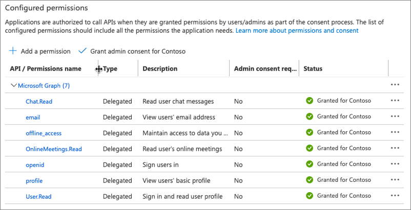

To simplify the process of testing our app, let's grant user consent to the permissions for all users in our organization.

On the **API Permissions** page, select the **Enterprise applications** link below the list of permissions.

On the **Permissions** page, select the **User consent** tab, then select the **Grant admin consent for Contoso** button.

Microsoft identity will prompt you to grant permissions on behalf of all users in the organization. Select the **Accept** button to allow this:

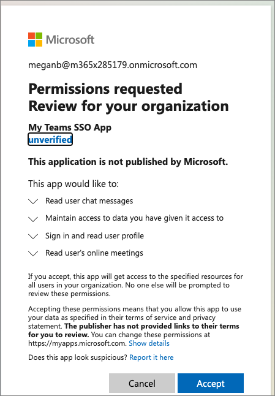

### Expose an API for the app

The next step is to configure the app's API for Microsoft Teams. Select **Manage > Expose an API** from the left-hand navigation.

On the **Expose an API** page, select the **Set** link next to the **Application ID URI**. This will default the app's ID to `api://<app-id>`. This needs to include the domain where the Microsoft Teams app will be hosted. Add `REPLACE.ngrok.io/` to the start of the address after the protocol and select **Save**

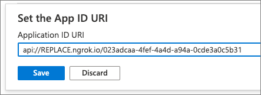

Next, select **Add a scope** to add a new permission for the app. Create a new scope using the following settings and then select **Add scope**:

- **Scope name:** access_as_user
- **Who can consent?** Admins and users
- **Admin consent title:** Teams can access the user’s profile.
- **Admin consent description:** Teams can call the app’s web APIs as the current user.
- **User consent title:** Teams can access the user profile and make requests on the user's behalf.
- **User consent description:** Teams can call this app’s APIs with the same rights as the user.
- **State**: Enabled


The last step is to preauthorize the Microsoft Teams clients that the app's API will trust. This means users won't be asked to consent to specific permissions, or scopes, exposed by the API.

Add the following client applications by selecting the **Add a client application** link. For each, select the **api://REPLACE.ngrok.io/{app-id}/access_as_user** scope you previously created:

- `1fec8e78-bce4-4aaf-ab1b-5451cc387264`
  - *Microsoft Teams mobile & desktop clients*
- `5e3ce6c0-2b1f-4285-8d4b-75ee78787346`
  - *Microsoft Teams web client*

## Review

At this point, you've now registered an Azure AD application that can be used by Microsoft Teams apps to support SSO for your users.

While the application has been registered, you'll need to come back and make a few changes depending on the features of your custom Microsoft Teams app.

### Update the app's URL

When you create the Microsoft Teams app, you'll need to revisit this Azure AD application to update the places where you entered the URL where the application is hosted. This is true both during development and when the application is deployed to production.

Anywhere you entered **REPLACE.ngrok.io** will need to be updated with the location of the web app that implements the custom Microsoft Teams app.

### Add more API permissions

The Azure AD app you've registered only has the most basic permissions to identify the user and permissions for the meeting.

It also contains Microsoft Graph permissions to obtain basic information about the user and the meeting. If your custom Microsoft Teams app needs extra permissions to Microsoft Graph or another app, you'll need to add them to the Azure AD app's registration.

## Create Microsoft Teams app

> [!VIDEO https://www.microsoft.com/videoplayer/embed/RWUJEW]

Open your command prompt, and go to a directory where you want to save your work. Create a new folder named **learn-msteams-meetings**, and change the directory into that folder.

Run the Yeoman generator for Microsoft Teams by running the following command:

```console
yo teams
```

Yeoman starts and asks you a series of questions. Answer the questions with the following values:

- **What is your solution name?**: Learn MSTeams Meetings Apps
- **Where do you want to place the files?**: Use the current folder
- **Title of your Microsoft Teams App project**: Stand-up Agenda
- **Your (company) name (max 32 characters)**: Contoso
- **Which manifest version would you like to use?**: v1.11
- **Quick scaffolding**: Yes
- **What features do you want to add to your project?**: A tab
- **The URL where you will host this solution?**: *(Accept the default option)*
- **Would you like to show a loading indicator when your app/tab loads?**: No
- **Default Tab name? (max 16 characters)**: Stand-up Agenda
- **What kind of Tab would you like to create?**: Configurable
- **What scopes do you intend to use for your Tab**: In a group chat
- **Do you require Azure AD Single-Sign-On support for the tab?**: Yes
- **What is the Application ID to associate with the SSO Tab?**: *(Accept the default option)*
- **What is the Application ID URI to associate with the SSO Tab?**: *(Accept the default option)*
- **Do you want this tab to be available in SharePoint Online?**: No

> [!NOTE]
> Most of the answers to these questions can be changed after you create the project. For example, the URL where the project will be hosted isn't important at the time of creating or testing the project.

After you answer the generator's questions, the generator creates the scaffolding for the project. The generator then runs `npm install` that downloads all the dependencies required by the project.

### Update project settings

Open the **./.env** file that contains the environment variables used by the project. Take note of the following properties that were set from the project creation process:

- **PUBLIC_HOSTNAME**: This is the fully qualified URL, excluding the protocol, you specified where the app would be hosted.
- **APPLICATION_ID**: This is the unique ID of the Microsoft Teams application.
- **MICROSOFT_APP_ID** & **TAB_APP_ID**: This is the Azure AD application (client) ID that you specified.
- **TAB_APP_URI** This is the Azure AD application ID URI you specified.

> [!NOTE]
> The prefix of the last two items in the above list is generated using the name of the tab you specified during the project creation process.

> [!IMPORTANT]
> Each time ngrok starts, it generates a new dynamic subdomain for the URL. If you have to restart ngrok, you will need to repackage and and update the app in Microsoft Teams to make the installed app aware of the new URL. The optional licensed version of ngrok allows you to define and reuse the same subdomain.

Let's make a few changes to these environment variables.

1. Locate the **MICROSOFT_APP_ID** & **MICROSOFT_APP_PASSWORD** properties. Add another property **MICROSOFT_APP_TID** before these two properties, and set the values that you copied when registering the Azure AD application:

    - **MICROSOFT_APP_TID**: this is the *Directory (tenant) ID*
    - **MICROSOFT_APP_ID**: this is the *Application (client) ID*
    - **MICROSOFT_APP_PASSWORD**: this is the *client secret*

1. Verify the URL of the ID listed in the **TAB_APP_ID** property matches the value of the **MICROSOFT_APP_ID** property.
1. Verity the full **TAB_APP_URI** matches the Azure AD application ID URI you specified when exposing the API for the Azure AD application.

## Update app manifest

Before working on the code in the project, you need to make some changes to the Microsoft Teams app manifest. These changes are necessary to enable our app to interact with meetings.

Locate and open the **./src/manifest/manifest.json** file.

Locate the section `configurableTabs` and add the following values to the following arrays:

- `scopes`: `groupchat`
- `context`: `meetingChatTab`, `meetingDetailsTab`, `meetingSidePanel`, and `meetingStage`
- `meetingSurfaces`: `sidePanel` & `stage`

When you're finished with the edits, the `configurableTabs` property should look like the following:

```json
"configurableTabs": [
  {
    "configurationUrl": "...",
    "canUpdateConfiguration": true,
    "scopes": [
      "groupchat"
    ],
    "context": [
      "meetingChatTab",
      "meetingDetailsTab",
      "meetingSidePanel",
      "meetingStage"
    ],
    "meetingSurfaces": [
      "sidePanel",
      "stage"
    ]
  }
],
```

## Create an API endpoint

> [!VIDEO https://www.microsoft.com/videoplayer/embed/RWUreC]

The meetings app will need primarily run client-side code within tabs in the Microsoft Teams client. However, we do have some requirements for server-side logic. These requirements include:

- Obtaining an access token, using the [OAuth2 On-Behalf-Of (OBO) flow](/azure/active-directory/develop/v2-oauth2-on-behalf-of-flow). We'll use this to exchange the SSO token provided by Microsoft Teams in return for a token we can use to call the Microsoft Graph endpoint to obtain information about the Microsoft Teams meeting.
- Read and write details about stand-up meeting to a database.

> [!NOTE]
> You meeting will collect additional information from the meeting attendees about topics to discuss and present the meeting. In a production application, you'll likely want to store these in a secure persistent data store. However, in this module we'll simplify this by storing the stand-up meeting topics in JSON files on our development server.

To satisfy these requirements, we'll create an API for our application.

### Install dependencies

From the command prompt, install a few dependencies that we'll use within our API. Run the following two commands from the root folder of your project (*the same folder where the **package.json** file is located*):

```console
npm install jsonwebtoken@8.5.1 jwks-rsa@2.0.5 @azure/msal-node@1.5.0 node-persist@3.1.0 --save-exact
npm install @microsoft/microsoft-graph-types-beta @types/node-persist@3.1.2 @types/jsonwebtoken@8.5.1 @types/node-persist@3.1.2 --save-dev --save-exact
```

The **jsonwebtoken** and **jwks-rsa** packages are used to simply working with JWT's and certificate key files, the **@azure/msal-node** package is used to simplify authentication and token acquisition with Azure identity, and the **node-persist** package serves the role as our simplified JSON database.

### Implement the API

Create a new folder in the following location in your project: **./src/server/api**.

Create a new file named **AuthUtils.ts** in the **api** folder and add the following TypeScript code to it. This file contains a single method, **validateToken()**, that we'll use to validate the token received from the meetings app is valid. This is done by obtaining the Azure identity public signing keys and using them to ensure they match the digital signature in the token received by the API:

```typescript
import express = require("express");
import * as jwt from "jsonwebtoken";
const jwksClient = require('jwks-rsa');

const getSigningKeys = (header: jwt.JwtHeader, callback: jwt.SigningKeyCallback) => {
  const client = jwksClient({
    jwksUri: "https://login.microsoftonline.com/common/discovery/keys"
  });

  client.getSigningKey(header.kid, function (err, key: any) {
    callback(err, key.publicKey || key.rsaPublicKey);
  });
};

export async function validateToken(req: express.Request): Promise<string> {
  return new Promise((resolve, reject) => {
    const authHeader = req.headers.authorization;

    if (authHeader) {
      const token = authHeader.split(" ").pop();

      if (token) {
        const validationOptions = {
          audience: `api://${process.env.PUBLIC_HOSTNAME}/${process.env.MICROSOFT_APP_ID}`
        };

        jwt.verify(token, getSigningKeys, validationOptions, (err, payload) => {
          if (err) { reject(new Error("403")); }
          resolve(token);
        });
      } else {
        reject(new Error("401"));
      }
    } else {
      reject(new Error("401"));
    }
  });
};
```

Next, add the API router to the project by creating the file **StandupAgendaRouter.ts** file in the **api** folder and add the following code it:

```typescript
import express = require("express");
import { ClientCredentialRequest, ConfidentialClientApplication, OnBehalfOfRequest } from "@azure/msal-node";
import Axios from "axios";
import { Chat } from "@microsoft/microsoft-graph-types-beta";
import { getItem, setItem } from "node-persist";
import { validateToken } from "./AuthUtils";

export const StandupAgendaRouter = (options: any): express.Router => {
  const router = express.Router();

  // TODO: add API endpoints

  return router;
};
```

With the API router created, you need to add three endpoint handlers to it. The first, and biggest one, implements the on-behalf-of OAuth flow. It accepts the Microsoft Teams SSO token and requests an OBO token we can use to authenticate requests to Microsoft Graph using the Azure AD previously registered.

If then uses that token to submit a request to Microsoft Graph for the details of the current meeting. Add the following code before the `// TODO: add API endpoints` comment:

```typescript
router.get(
    '/meetingDetails/:meetingId',
    async (req: express.Request, res: express.Response, next: express.NextFunction) => {
  try {
    const token = await validateToken(req);

    // get OBO token
    try {
      const cca = new ConfidentialClientApplication({
        auth: {
          clientId: process.env.MICROSOFT_APP_ID as string,
          clientSecret: process.env.MICROSOFT_APP_PASSWORD,
          authority: `https://login.microsoftonline.com/${process.env.MICROSOFT_APP_TID}`
        }
      });
      const response = await cca.acquireTokenOnBehalfOf(<OnBehalfOfRequest>{
        oboAssertion: token,
        scopes: ["OnlineMeetings.Read", "Chat.Read"]
      });

      // use OBO access token to call MS graph for meeting detail
      if (response && response.accessToken) {
        const authHeader: any = {
          headers: {
            Authorization: `Bearer ${response.accessToken}`
          }
        };

        // get meeting detail
        try {
          // base64 decode meeting ID & strip surrounding 0# #0
          const chatId = Buffer.from(req.params.meetingId, "base64").toString("ascii").replace(/^0#|#0$/g, "");
          // get chat details
          const chat = await Axios.get<Chat>(`https://graph.microsoft.com/beta/chats/${chatId}`, authHeader);
          // get meeting detail (via chat detail)
          const onlineMeetings = await Axios.get(`https://graph.microsoft.com/v1.0/me/onlineMeetings?$filter=JoinWebUrl eq '${chat.data.onlineMeetingInfo?.joinWebUrl}'`, authHeader);

          // return first meeting detail returned
          if (onlineMeetings?.data?.value?.length > 0) {
            res.type('application/json');
            res.end(JSON.stringify(onlineMeetings?.data?.value[0]));
          } else {
            console.error('bad data returned from online meeting request: ', onlineMeetings);
            throw new Error('500: bad data returned from online meeting request');
          }
        } // \get meeting detail
        catch (err) { throw new Error(`error getting meeting detail: ${err.message}`); };
      } else {
        // \use OBO access token to call MS graph for meeting detail
        throw new Error(`no access token returned`);
      }
    }
    // \get OBO token
    catch (err) { throw new Error(`obo token acq error: ${err.message}`) };
  }
  // \validate token
  catch (err) { throw new Error(`token validation error: ${err.message}`) };
});
```

Next, add the following code before the `// TODO: add API endpoints` comment that will read the stand-up topics for the current meeting from our JSON database and return it to the caller:

```typescript
router.get(
    '/standup-topics/:meetingId',
    async (req: express.Request, res: express.Response, next: express.NextFunction) => {
  try {
    const token = await validateToken(req);

    const meetingId = req.params.meetingId;
    const topics = await getItem(meetingId) || [];

    res.type('application/json');
    res.end(JSON.stringify(topics));
  } catch (err) {
    res.status(500).send(err);
  }
});
```

Next, add the following code before the `// TODO: add API endpoints` comment that will write the stand-up topics for the current meeting to our JSON database:

```typescript
router.post(
    '/standup-topics/:meetingId',
    async (req: express.Request, res: express.Response, next: express.NextFunction) => {
  try {
    const token = await validateToken(req);

    const meetingId = req.params.meetingId;
    const topics = req.body;

    await setItem(meetingId, topics);

    res.type('application/json');
    res.end(JSON.stringify(topics));
  } catch (err) {
    res.status(500).send(err);
  }
});
```

### Register the API server

With the API router created, our server needs to load it.

Locate and open the **./src/server/server.ts** file.

Add the following `import` statements to the top of the file, just after the existing `import` statements:

```typescript
import { StandupAgendaRouter } from "./api/StandupAgendaRouter";
import { init } from "node-persist";
```

Within this file, locate the statement that starts with `express.use("/", `. Immediately before this statement, add the following to load our API router into the web server:

```typescript
// add routing for custom API
express.use("/api/standupagenda", StandupAgendaRouter({}));
```

Finally, initialize the JSON database by adding the following code when the server starts up. Locate the line `http.createServer(express).listen(port, () => {` and add the following at the end of the function:

```typescript
// setup disk storage
(async () => {
  await init({
    dir: 'db',
    stringify: JSON.stringify,
    parse: JSON.parse,
    encoding: 'utf8'
  });
})();
```

The `http.createServer()` method should now look like the following:

```typescript
http.createServer(express).listen(port, () => {
  log(`Server running on ${port}`);

  // setup disk storage
  (async () => {
    await init({
      dir: 'db',
      stringify: JSON.stringify,
      parse: JSON.parse,
      encoding: 'utf8'
    });
  })();

});
```

## Implement the app's pre-meeting user experience

> [!VIDEO https://www.microsoft.com/videoplayer/embed/RWUreE]

Now that the Azure AD app is registered with the necessary permissions, the project is created, and our custom API is implemented, you can create the meeting app's first user experience!

### Install dependencies for the user experience

Let's start by installing a few dependencies that we'll use to implement the user experience.

This includes installing the React components implemented with Fluent UI released as part of the Microsoft Teams UI Kit. We will also use Lodash to simplify sorting of the data returned from our REST API.

From the command prompt, run the following two commands from the root folder of your project (*the same folder where the **package.json** file is located*):

```console
npm install @fluentui/react-teams@6.0.0 lodash@4.17.21 -SE
npm install @types/lodash@4.14.178 -DE
```

Next, locate, and open the **./src/client/standUpAgendaTab/StandUpAgendaTab.tsx** file. Add the following `import` statements to the top of the file, just after the existing `import` statements:

```typescript
import { Grid, Box, Form, FormInput, FormButton, Card, Checkbox, Pill } from "@fluentui/react-northstar";
import { Provider as RTProvider, themeNames, List, CommunicationOptions, TListInteraction, TToolbarInteraction } from "@fluentui/react-teams";
import { TeamsTheme } from "@fluentui/react-teams/lib/cjs/themes";
import Axios from "axios";
import { OnlineMeeting } from "@microsoft/microsoft-graph-types-beta";
import { orderBy, sortBy } from "lodash";
```

These add React controls from the Fluent UI library, the Microsoft Teams UI Kit library, and other utilities we'll use to implement the user experience.

Next, add the following interfaces after the `imports` statements, but before the `class` declaration, to define new object types for the stand-up meeting topic submissions:

```typescript
interface IStandupPresenter {
  id: string;
  name: string;
}
interface IStandupTopic {
  id: string;
  presenter: IStandupPresenter;
  title: string;
  approved: boolean;
  presented: boolean;
}
```

### Update the React state declarations

The Microsoft Teams meeting is implemented as a tab using React hooks. Add the following statements to define more members used in the component's state. These should be placed before the first `useEffect()` method:

```typescript
const [accessToken, setAccessToken] = useState<string>();
const [meetingId, setMeetingId] = useState<string | undefined>();
const [onlineMeeting, setOnlineMeeting] = useState<OnlineMeeting>({});
const [frameContext, setFrameContext] = useState<microsoftTeams.FrameContexts | null>();
const [showAddTopicForm, setShowAddTopicForm] = useState<boolean>(false);
const [currentUserId, setCurrentUserId] = useState<string>("");
const [currentUserName, setCurrentUserName] = useState<string>("");
const [standupTopics, setStandupTopics] = useState<IStandupTopic[]>([]);
const [newTopicTitle, setNewTopicTitle] = useState<string>();
```

Locate the existing state declaration for the custom `useTeams()` hook:

```typescript
const [{ inTeams, theme, context }] = useTeams();
```

Add the property `themeString` to the list of properties:

```typescript
const [{ inTeams, theme, themeString, context }] = useTeams();
```

### Update the React hook when `inTeams` changes

When the state member `inTeams` changes, the default project contains a hook that runs to retrieve an SSO token from Microsoft Teams. Locate the `successCallback()` function within this hook. Within this callback, modify the code to set the `currentUserId`, `currentUserName`, and `accessToken` state members:

```typescript
successCallback: (token: string) => {
  const decoded: { [key: string]: any; } = jwtDecode(token) as { [key: string]: any; };
  setCurrentUserId(decoded.oid);
  setCurrentUserName(decoded!.name);
  setAccessToken(token);
  microsoftTeams.appInitialization.notifySuccess();
},
```

### Update the React hook when the Microsoft Teams `context` changes

When the state member `context` changes, the default project contains a hook that runs to set the `entityId` of the tab. Update this hook to also set the `meetingId` of the meeting and the current `frameContext` of the meeting.

The `frameContext` will be used to determine what the tab should show if the experience is the pre/post meeting view, the meeting stage, or the meeting's side panel.

```typescript
useEffect(() => {
  if (context) {
    setEntityId(context.entityId);

    // set the meeting context
    setMeetingId(context.meetingId);
    setFrameContext(context.frameContext);
  }
}, [context]);
```

### Add React hook to retrieve meeting details

Now you need to add a new React hook that will execute the `meetingId` and `accessToken` state members are set. In this hook, you'll call our server-side API to retrieve the details for the current meeting and any previously saved stand-up topics submitted by the meeting organizer or meeting attendees.

Add the following hook immediately after the existing hooks:

```typescript
useEffect(() => {
  (async () => {
    if (meetingId && accessToken) {
      const authHeader: any = {
        headers: {
          Authorization: `Bearer ${accessToken}`
        }
      };

      // get meeting details
      const meetingDetailsResponse = await Axios.get<OnlineMeeting>(`https://${process.env.PUBLIC_HOSTNAME}/api/standupagenda/meetingDetails/${meetingId}`, authHeader);
      setOnlineMeeting(meetingDetailsResponse.data);

      // get stand-up topics
      const standupTopicsResponse = await Axios.get<IStandupTopic[]>(`https://${process.env.PUBLIC_HOSTNAME}/api/standupagenda/standup-topics/${meetingId}`, authHeader);
      setStandupTopics(standupTopicsResponse.data);
    }
  })();
}, [meetingId, accessToken]);
```

### Add methods to save stand-up topic updates

Before adding the code to implement the user interface that will both display stand-up topics to discuss at the meeting and to support adding new topics, let's add a couple methods to support saving the changes.

Add the following method after the React hooks to save stand-up topics to our JSON data store by calling our custom API:

```typescript
const saveStandupTopics = async (topics: IStandupTopic[]): Promise<void> => {
  const response = await Axios.post(`https://${process.env.PUBLIC_HOSTNAME}/api/standupagenda/standup-topics/${meetingId}`, topics, { headers: { Authorization: `Bearer ${accessToken}` } });
  setStandupTopics(response.data);
}
```

Next, add an event handler to take a new stand-up topic submission, add it to the collection of stand-up topics, and save them to the JSON.

```typescript
const onNewStandupTopicSubmit = (): void => {
  const newTopics = standupTopics;

  let newStandUpTopic: IStandupTopic = {
    id: `${currentUserId}-${Date.now()}`,
    presenter: {
      id: currentUserId,
      name: currentUserName
    },
    title: newTopicTitle as string,
    approved: false,
    presented: false
  };

  newTopics.push(newStandUpTopic);
  setNewTopicTitle("");

  // save changes
  (async () => { await saveStandupTopics(newTopics); })();
};
```

### Create the pre-meeting user experience

> [!VIDEO https://www.microsoft.com/videoplayer/embed/RWUreD]

Our custom meeting app will have a different user experience that depends how and where the app is used. For example, in a pre-meeting experience, the meeting should display a form for attendees to submit topics but once the meeting has concluded, attendees should only be able to see the results of the meeting, not submit new topics.

Let's start by implementing the pre-meeting experience. In this view, we need a list of submitted topics and a form for meeting attendees to submit new stand-up topics to present.

Add the following code after the previously added `onNewStandupTopicSubmit` function:

```typescript
const getPreMeetingUX = () => {
  let gridSpan = { gridColumn: "span 4" };

  // TODO: getPreMeetingUX

  return (
  );
};
```

The pre-meeting experience will display a list that takes up four (4) grid columns, unless they trigger the "new stand-up topic form you'll create. In that case, we want the list to take up three columns and the form to take up the last and fourth column.

By default, you can see from the code we'll default to not showing the form.

Let's create a new JSX element to contain the form. By default, it will be null unless our state property says it should be displayed. Add the following code just before the `// TODO: getPreMeetingUX` comment:

```tsx
let addTopicForm: JSX.Element | null = null;

if (showAddTopicForm) {
  gridSpan = { gridColumn: "span 3" };
  addTopicForm = <Provider theme={theme}>
    <Box styles={{ gridColumn: "span 1" }}>
      <Flex fill={true} column styles={{ paddingLeft: "1.6rem", paddingRight: "1.6rem" }}>
        <Header content="Add standup topic" />
        <Form styles={{ justifyContent: "initial" }}
          onSubmit={onNewStandupTopicSubmit}>
          <FormInput label="Topic"
            name="topic"
            id="topic"
            required
            value={newTopicTitle}
            onChange={(e, i) => { setNewTopicTitle(i?.value); }}
            showSuccessIndicator={false} />
          <FormButton content="Submit" primary />
        </Form>
        <Flex.Item push>
          <Button content="Close" secondary onClick={() => { setShowAddTopicForm(false); }}
            style={{ marginLeft: "auto", marginRight: "auto", marginTop: "2rem", width: "12rem" }} />
        </Flex.Item>
      </Flex>
    </Box>
  </Provider>
}
```

This code first checks the state property `showAddTopicForm` to see if the form should be shown. If so, it changes the grid for the list to only take up three columns. It then creates the new form with the following characteristic:

- When the form is submitted, it calls the `onNewStandupTopicSubmit` function we previously added.
- The `value` of the `FormInput` control is linked to the `newTopicTitle` state property.
- The **Close** button on the form hides the form.

With the form created, let's create the list.

First, convert the list of stand-up topics to an array of objects we can bind as rows for our list. Add the following code just before the `// TODO: getPreMeetingUX` comment:

```typescript
const rows = standupTopics.map(standupTopic => (
  {
    id: standupTopic.id,
    topic: standupTopic.title,
    presenter: standupTopic.presenter.name,
    status: (standupTopic.approved) ? 'approved' : 'pending'
  })
).reduce((prevValue, currValue, index, array) => (
  {
    ...prevValue,
    [currValue.id]: currValue
  }),
  {}
);
```

Next, create a new object for the form to add a commend to the list's toolbar to add new topics. Add the following code just before the `// TODO: getPreMeetingUX` comment:

```typescript
let addTopicAction = { g1: { addTopic: { title: "Add stand-up topic" } } };
```

Now, implement the list. Replace the existing `return()` statement in the `getPreMeetingUX` function with the following:

```tsx
return (
  <Grid columns="repeat(4, 1fr)" styles={{ gap: "20px" }}>
    <Box styles={gridSpan}>
      <Flex fill={true} column>
        <List
          title="Standup Meeting Topics"
          columns={{
            presenter: { title: "Presenter" },
            topic: { title: "Topic" },
            status: { title: "Status" }
          }}
          rows={rows}
          onInteraction={async (interaction: TListInteraction) => {
            if (interaction.target === "toolbar") {
              const toolbarInteraction = interaction as TToolbarInteraction;
              switch (toolbarInteraction.action) {
                case "addTopic":
                  setShowAddTopicForm(true);
                  break;
              }
            }
          }}
          emptyState={{
            fields: {
              title: "Create your first standup meeting topic",
              desc: "Add your first proposed topic to cover during the stand up meeting by selecting 'Add topic' in the header of this list"
            },
            option: CommunicationOptions.Empty
          }}
          emptySelectionActionGroups={addTopicAction} />
      </Flex>
    </Box>
    {addTopicForm}
  </Grid>
)
```

This code implements the list of submitted stand-up topics. Notice the following things from this code:

- The `<Box>` that contains the `<List>` uses the `gridSpan` property we previously created and modified depending if the new subtopic form should be displayed or not.
- The names of the `columns` in the list match the properties of the modified list of stand-up topics submitted that we created.
- The `onInteraction` handler for the list checks if a *toolbar* interaction occurred, triggered by selecting the toolbar action, and if the interaction's action is the one we created to display the new stand-up topic form. If so, we set the state property to show the form that will trigger React to rerender the tab.
- The toolbar action `addTopicAction` we previously created is added to the list when no item is selected in the list as indicated with the list's `emptySelectionActionGroups` property.
- Finally, we add the new stand-up topic form after the `<Box>`. This is either null or contains the form depending on the value of the `showAddTopicForm` state property.

The last thing to do is to update the tab's rendering so when we're in the pre-meeting experience of the meeting app, we display the correct user experience.

Replace the existing `return()` method on the tab with the following code:

```tsx
let mainContentElement: JSX.Element | JSX.Element[] | null = null;
switch (frameContext) {
  case microsoftTeams.FrameContexts.content:
    mainContentElement = getPreMeetingUX();
    break;
  default:
    mainContentElement = null;
}

return (
  <Provider theme={theme}>
    <RTProvider themeName={TeamsTheme[themeString.charAt(0).toUpperCase() + themeString.slice(1)]} lang="en-US">
      {mainContentElement}
    </RTProvider>
  </Provider>
);
```

## Build and test the application

> [!VIDEO https://www.microsoft.com/videoplayer/embed/RWUJER]

Let's test the meeting app installation and pre-meeting experience.

From the command line, navigate to the root folder for the project and execute the following command:

```console
gulp ngrok-serve
```

This gulp task will run many other tasks all displayed within the command-line console. The **ngrok-serve** task builds your project and starts a local web server. It then starts ngrok with a random subdomain that creates a secure URL to your local webserver.

> [!NOTE]
> Microsoft Teams requires all content displayed within a tab be loaded from an HTTPS request. In development, can be done using the tool [ngrok](https://www.ngrok.com) that creates a secure rotatable URL to your local HTTP webserver. Ngrok is included as a dependency within the project so there is nothing to setup or configure.

> [!IMPORTANT]
> Each time ngrok starts, it generates a new dynamic subdomain for the URL. If you have to restart ngrok, you will need to repackage and and update the app in Microsoft Teams to make the installed app aware of the new URL. The optional licensed version of ngrok allows you to define and reuse the same subdomain.


Before testing the Microsoft Teams app, you need to update all locations where you entered the URL `REPLACE.ngrok.io` in both your project and the Azure AD app you registered. For example:

- **Visual Studio Code project**
  - Locate and open the **./.env** file
  - Find & replace all instances of `REPLACE.ngrok.io`
- **Azure AD Application > Authentication > Redirect URIs**
- **Azure AD Application > Expose an API > Application ID URI**

Using the Microsoft Teams client, sign in with the credentials of a Work and School account.

> [!CAUTION]
> Meeting apps are supported in the Microsoft Teams desktop and mobile clients, but at the time of publishing this module, they aren't fully supported in the Microsoft Teams web client. To adequately test this module, it's recommended to use the Microsoft Teams client.

Once Microsoft Teams loads, select the calendar in the app bar in the Microsoft Teams client.

### Create two meetings to test the app

Create two meetings to test our meeting app. Ensure one meeting is created for a previous date and one for a date in the future from the current day. For example, it today is January 15, create one meeting for January 10 and one for January 20.

> [!NOTE]
> At the completion of all exercises in this module, you'll have a single working meetings app that implements all experiences. This includes the pre-meeting, in-meeting, and post-meeting experience. By creating two meetings in the past and future, we can test both the pre & post meeting experiences.

For both meetings, invite at least one attendee to the meeting so there will be at least two people: the organizer and an attendee.


> [!IMPORTANT]
> Meeting apps can only be installed in meetings that have at least two participants.

### Install the meeting app

With the meetings created, now you can install the meeting app. Repeat the following steps for both meetings you created in the last step:

1. Select one of the meetings and select the **Edit** button:

    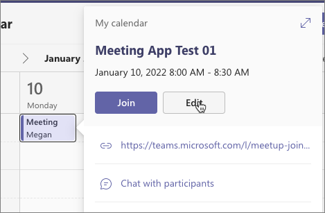

1. Select the plus icon in the meeting header to install a new app:

    

1. In the **Add a tab** dialog, select **Manage apps** in the lower-right corner.
1. In the **Manage apps** screen, select **Upload a custom app** in the lower-right corner.
1. When prompted, select the **./package/standupagenda.zip** Microsoft Teams app package generated from building the app.
1. Microsoft Teams will display some details about our meeting app. Select **Add** to add the app to Microsoft Teams.

    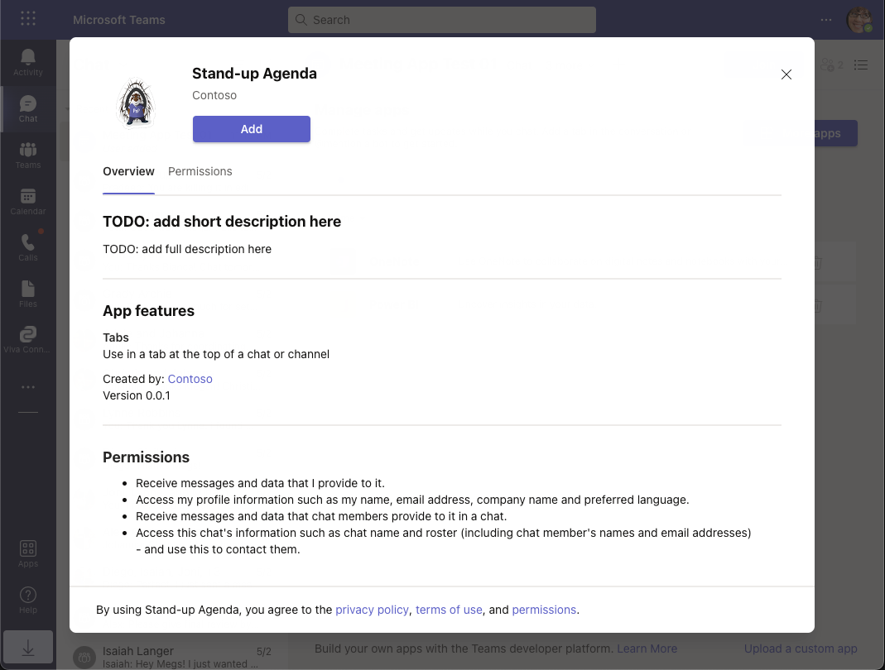

1. Now, go back to the meeting and repeat the steps to add a meeting. Except this time, select the newly added **Stand-up Agenda** app from the list of apps on the **Add a tab** screen:

    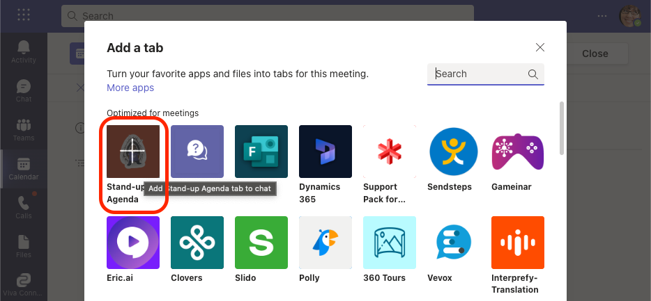

1. When prompted to configure the tab, ignore the input and select **Save**. We didn't do anything with the configuration page for this app.

Now, when you are editing the meeting, you can select the new **Stand-Up Agenda** tab to launch the app:

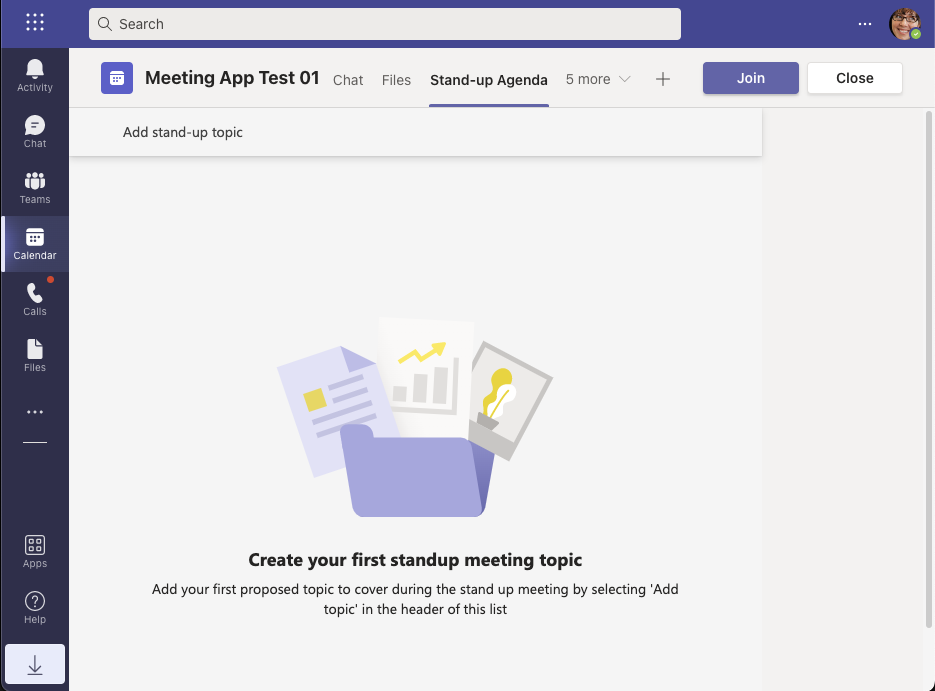

What you see is the pre-meeting experience. We haven't added any stand-up topics to our meeting so the list is showing the empty state.

### Add stand-up topics to the meeting

As the meeting organizer, add a few stand-up topics to address. Do this by selecting the **Add stand-up topic** option in the toolbar of the meeting. Selecting that option will shrink the list to display the form. Use the form to add three topics, as shown:

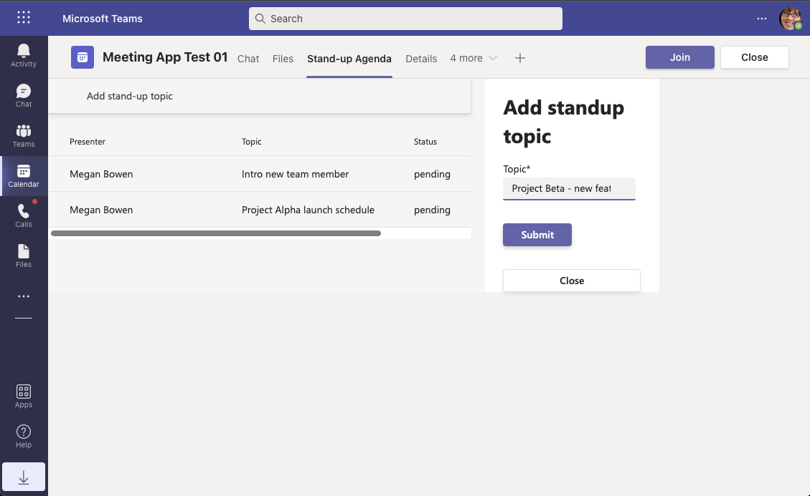

Now, sign out and sign in into the Microsoft Teams client with the other user that was invited to the meeting. As that user, add a few stand-up topics to present during the meeting.


At this point, our meeting app supports meeting attendees to submit topics to present during the meeting. These topics are submitted and available to view within the pre-meeting experience.

Repeat the steps to install and add topics for the other meeting that you created before moving on.
