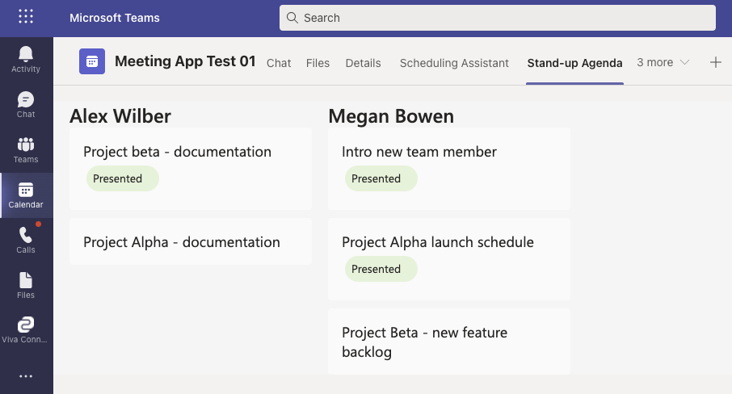

The final stage of a Microsoft Teams meetings app is the post-meeting experience. In this scenario, meeting attendees can view a custom app experience in a tab from the meeting invite details.

In this unit, you'll learn how you can implement the post-meeting experience for attendees.

## Implement a meeting stage

Developers can create unique experiences in their meeting app that can be used as the presentation during the meeting.

For example, consider the scenario you're implementing in the exercises of this module. The meeting stage can display a summary of all the topics from all meeting attendees and indicate if they've been presented so far in the meeting:


An attendee of the meeting with the meeting presenter role can trigger this view by selecting the present button in the header of the app's side-panel experience as shown in the previous figure.

This same experience could even be used as the post-meeting experience:



In our scenario, this works because the meeting stage is used to show the current presentation status of all approved stand-up topics submitted by the meeting attendees.

The conditional logic to display the same view can simply reuse the two user interfaces:

```tsx
let mainContentElement: JSX.Element | JSX.Element[] | null = null;
switch (frameContext) {
  case microsoftTeams.FrameContexts.content:
    if (onlineMeeting.startDateTime) {
      mainContentElement = ((new Date(onlineMeeting.startDateTime as string)).getTime() < Date.now())
        ? getPreMeetingUX()
        : getMeetingStageUX();
    }
    break;
  case microsoftTeams.FrameContexts.sidePanel:
    mainContentElement = getSidepanelUX();
    break;
  case microsoftTeams.FrameContexts.meetingStage:
    mainContentElement = getMeetingStageUX();
    break;
  default:
    mainContentElement = null;
}

return (
  <Provider theme={theme}>
    <RTProvider themeName={TeamsTheme[themeString.charAt(0).toUpperCase() + themeString.slice(1)]} lang="en-US">
      {mainContentElement}
    </RTProvider>
  </Provider>
);
```

## Meeting events

Developers can create bots that, when added to a meeting, can receive real-time meeting events.

For example, the bot can receive notifications when the meeting starts or ends. This can be used to summarize information collected by your app during the meeting and post it to the meeting's chat.

```typescript
class BotActivityHandler extends TeamsActivityHandler {
  constructor(conversationState) {
    super();
  }

  async onTurnActivity(context) {
    if (context.activity.type == 'event' && context.activity.name == "application/vnd.microsoft.meetingStart") {
      await context.sendActivity("Meeting started.");
    }

    if (context.activity.type == 'event' && context.activity.name == "application/vnd.microsoft.meetingEnd") {
      await context.sendActivity("Meeting ended.");
    }
  };
}

module.exports.BotActivityHandler = BotActivityHandler;
```
