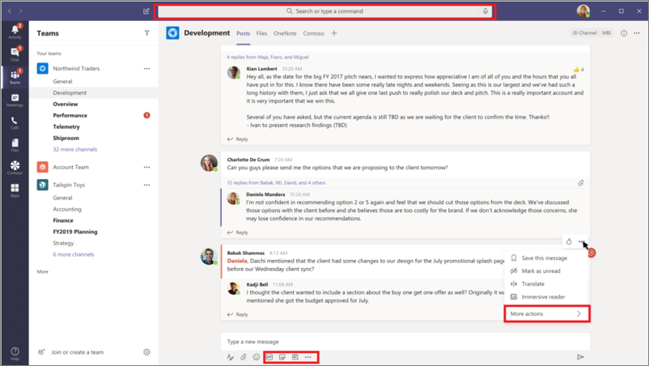
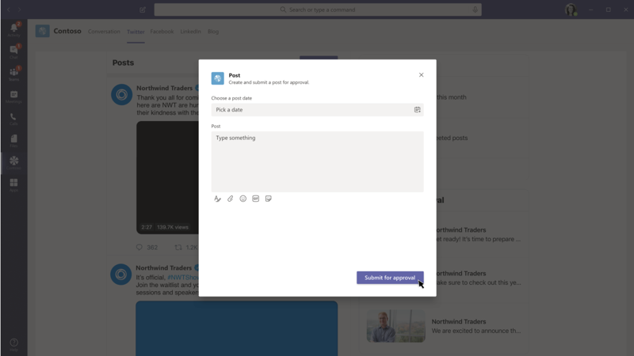

A messaging extension consists of a web service you host and your Microsoft Teams app manifest that defines where your web service can be invoked from in the Microsoft Teams client. They take advantage of the Bot Framework's messaging schema and secure communication protocol, so you'll also need to register your web service as a bot in the Bot Framework.

In this unit, you’ll learn what messaging extensions are, what scenarios where they can be used and the different types of messaging extensions available to developers. This unit will focus on one type of messaging extension: the action command. Action commands allow you present your users with a modal popup (called a task module in Teams) to collect or display information, then process their interaction and send information back to Teams.

## What are messaging extensions?

Messaging extensions allow users to interact with your web service through buttons and forms in the Microsoft Teams client. They can search, or initiate actions, in an external system from the compose message area, the command box, or directly from a message. You can then send the results of that interaction back to the Microsoft Teams client, typically in the form of a richly formatted card.



### Messaging extension scenarios

What kind of scenarios do messaging extensions enable?

One example is that the user needs to perform an action in an external system and have the results added to the conversation. For instance, when two employees are chatting about a customer issue, it can be helpful if the customer's history or issue details are added to the conversation timeline from data in an external bug tracking or CRM system.

Another example is when you need to complete a complex task or one that involves multiple steps and share the results. For instance, consider a user that wants to request approval for a business trip. This involves finding a flight, hotel, and transportation options. After finding the wanted options, they need to submit out of office and expense approval requests to their manager. A messaging extension can be used to guide the user through a wizard experience to collect information, then use that to start an approval process and display a summary in the conversation.

### How messaging extensions work

Messaging extensions are registered in your custom Microsoft Teams app's manifest that specifies where the extension can be invoked from in the Microsoft Teams client. The three locations that can invoke a messaging extension include:

- **command box**: this is the area at the top of the Microsoft Teams client
- **compose message box**: this is the area at the bottom of a 1:1 or group chat and at the bottom of the **Conversations** tab in a channel
- **message's "More Actions" menu**: the **More Actions** menu item is accessible from the **...** when you hover over a message in a conversation

Messaging extensions are implemented as web services registered as a bot using the Bot Framework. When a messaging extension is invoked, Microsoft Teams will call your web service via the Bot Framework's messaging schema and secure communication protocol.

While you can create the messaging extension web service by hand, you can also use the Bot Framework SDKs that simplify implementing the protocol and expected message types sent from the Bot Framework.

> [!NOTE]
> While messaging extensions are registered using the Bot Framework, you don't need to register the bot in the Microsoft Teams app's manifest file. Creating a messaging extension in the app's manifest file enables Microsoft Teams to expose the customization as a messaging extension and not as an installable bot.

A messaging extension can have up to 10 different commands registered with it. Each command defines a type of messaging extension it supports and the locations within the Microsoft Teams client where it can be invoked from.

When the messaging extension is invoked, Microsoft Teams will send, via the Bot Framework, an HTTPS message with a JSON payload that includes all relevant information. Your web service will respond with a JSON payload, via the Bot Framework, that informs the Microsoft Teams client what interaction to enable next.

Microsoft Teams supports two types of messaging extensions: action commands and search commands.

## Action commands

Action commands allow you present your users with a modal popup to collect or display information. When a user submits the form, your web service can respond by inserting a message direction into the conversation, or insert a message into the compose message area allowing the user to submit the message.

## Developing action commands

Action commands can be triggered from the compose message area, the command box, or from a message. When invoked from a message, the initial JSON payload sent to your web service will include the entire message it was invoked from.



The modal popup triggered by the messaging extension is implemented as a task module in Microsoft Teams. Task modules, when triggered from an action command messaging extension, can be implemented in one of three ways:

- **embedded web view**: an HTML page enables developers complete control over the UI and controls in the task module
- **Adaptive card**: an Adaptive card simplifies implementing the UI, but provides less control over the UI, formatting options and available controls
- **static parameters**: the messaging extension in the app manifest includes a static list of parameters that will be rendered in the task module, but developers have no control over the formatting or UI.

> [!NOTE]
> The last option for implementing a task module, *static parameters*, is unique to messaging extensions.

If you use either the embedded web view or Adaptive card option to implement your task module, your web service must respond to the invoice event from the user with the task module that the Microsoft Teams client will render for the user.

### Registering action command messaging extensions

To register an action command messaging extension, add it to the `composeExtensions` array property in the Microsoft Teams app manifest:

```json
"composeExtensions": [
  {
    "botId": "<REPLACE_WITH_MICROSOFT_APP_ID>",
    "canUpdateConfiguration": false,
    "commands": [
      {
        "id": "planetExpanderAction",
        "type": "action",
        "title": "Planet Expander",
        "description": "Lookup the details of a planet.",
        "context": [
          "compose",
          "message"
        ],
        "parameters": [...],
        "fetchTask": true
      }
    ]
  }
]
```

The `type` property specifies this is an `action` command.

The `context` property defines where the messaging extension can be invoked.

The `fetchTask` property should be set to `true` when implementing the task module as an embedded web view or Adaptive card. Set it to `false` when you're using a static list of parameters.

### Decide how the message will be set

After registering the messaging extension, you need to decide how the final message will be set. For example, will the final message be inserted into the compose message box, or should it respond directly to the conversation?

If you respond directly to the conversation, you'll need to also register your messaging extension as a bot. This option will also allow you to update the response because the reply was initiated by the bot.

### Create and send the task module

If you aren't using the static list of parameters to implement the task module, you'll need to create and return the task module from your messaging extension's web service.

The Bot Framework will send an `Activity` object to your web service of type `composeExtension/fetchTask` with the command id that you need to respond to with a `task` object.

The following code demonstrates a messaging extension web service, implemented using the Bot Framework SDK, that responds when an action command is invoked. This example implements the task module using an Adaptive card:

```typescript
export class PlanetBot extends TeamsActivityHandler {
  protected handleTeamsMessagingExtensionFetchTask(context: TurnContext, action: MessagingExtensionAction): Promise<MessagingExtensionActionResponse> {
    // load card template
    const adaptiveCardSource: any = require("./planetSelectorCard.json");
    // load the adaptive card
    const adaptiveCard = CardFactory.adaptiveCard(adaptiveCardSource);

    let response: MessagingExtensionActionResponse = <MessagingExtensionActionResponse>{
      task: {
        type: "continue",
        value: {
          card: adaptiveCard,
          title: 'Planet Selector',
          height: 150,
          width: 500
        }
      }
    };

    return Promise.resolve(response);
  }
}
```

The method `handleTeamsMessagingExtensionFetchTask()` is called by the Bot Framework SDK when a message of type `composeExtension/fetchTask` is received.

## Handling the messaging extension task module submission

When a user submits the messaging extension's task module, the Bot Framework will send another `Activity` object to your web service of type `composeExtension/submitAction` with the command id and parameter values set.

You have multiple options when receiving this message, including:

- **no response**: don't respond with any feedback to the user, such as when the submission triggers a long-running action
- **another task module**: you can respond with another task module as part of a multi-step interaction
- **card response**: respond with a card that the user can interact with or insert into a message
- **Adaptive card from a bot**: respond with a card that is added as a reply to a message, enabling a bot to update the message in the future

The following code demonstrates a messaging extension web service, implemented using the Bot Framework SDK, that responds with a card that is either added as a response to a message, or added to the compose message box:

```typescript
export class PlanetBot extends TeamsActivityHandler {
  protected handleTeamsMessagingExtensionSubmitAction(context: TurnContext, action: MessagingExtensionAction): Promise<MessagingExtensionActionResponse> {
    switch (action.commandId) {
      case 'planetExpanderAction':
        // get the selected planet
        const adaptiveCard = this.getPlanetDetailCard(action.data.planetSelector);

        // generate the response
        return Promise.resolve(<MessagingExtensionActionResponse>{
          composeExtension: {
            type: "result",
            attachmentLayout: "list",
            attachments: [adaptiveCard]
          }
        });
        break;
      default:
        throw new Error('NotImplemented');
    }
  }
}
```

The method `handleTeamsMessagingExtensionSubmitAction()` is called by the Bot Framework SDK when a message of type `composeExtension/submitAction` is received.

## Summary

In this unit, you learned what messaging extensions are, what scenarios where they can be used and the different types of messaging extensions available to developers.

This unit focused on one type of messaging extension: the action command. Action commands allow you present your users with a modal popup (called a task module in Teams) to collect or display information, then process their interaction and send information back to Teams.
