In this exercise, you'll create an action command messaging extension for a custom Microsoft Teams app. Action commands allow you present your users with a modal popup to collect or display information, then process their interaction and send information back to Teams.

> [!NOTE]
> This exercise requires a valid Azure subscription in order to create a bot using Bot Framework. However, if you do not have an Azure subscription, you can use the legacy Bot Framework Registration Portal. Refer to the following docs for more information: [Create a bot for Microsoft Teams](https://docs.microsoft.com/microsoftteams/platform/bots/how-to/create-a-bot-for-teams)

## Prerequisites

Developing Microsoft Teams apps requires an Office 365 tenant, Microsoft Teams configured for development, and the necessary tools installed on your workstation.

For the Office 365 tenant, follow the instructions on [Microsoft Teams: Prepare your Office 365 tenant](https://docs.microsoft.com/microsoftteams/platform/get-started/get-started-tenant) for obtaining a developer tenant if you don't currently have an Office 365 account. Make sure you have also enabled Microsoft Teams for your organization.

Microsoft Teams must be configured to enable custom apps and allow custom apps to be uploaded to your tenant to build custom apps for Microsoft Teams. Follow the instructions on the same **Prepare your Office 365 tenant** page mentioned above.

You'll use Node.js to create a custom Microsoft Teams app in this module. The exercises in this module assume you have the following tools installed on your developer workstation.

> [!IMPORTANT]
> In most cases, installing the latest version of the following tools is the best option. The versions listed here were used when this module was published and last tested.

- [Node.js](https://nodejs.org/) - v10.\* (or higher)
- NPM (installed with Node.js) - v6.\* (or higher)
- [Gulp](https://gulpjs.com/) - v4.\* (or higher)
- [Yeoman](https://yeoman.io/) - v3.\* (or higher)
- [Yeoman Generator for Microsoft Teams](https://github.com/OfficeDev/generator-teams) - v2.16.0 (or higher)
- [Visual Studio Code](https://code.visualstudio.com)

You must have the minimum versions of these prerequisites installed on your workstation.

## Register a new bot in Microsoft Azure

The first step is to create a new Microsoft Teams bot for your messaging extension. Adding a bot to the Teams app involves two steps:

1. Register the bot with Microsoft Azure's Bot Framework
1. Add a bot to the project codebase

### Register the bot with Microsoft Azure's Bot Framework

Open a browser and navigate to the [Azure portal](https://portal.azure.com). Sign in using a **Work or School Account** that has rights to create resources in your Azure subscription.

Select **Create a resource** in the left-hand navigation:

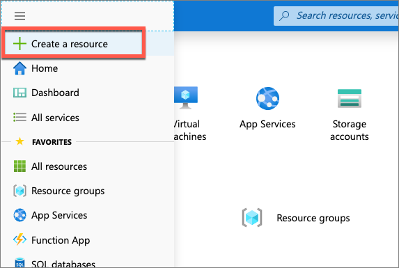

Enter **resource group** in the **Search the marketplace** input box, and select **Resource group**.

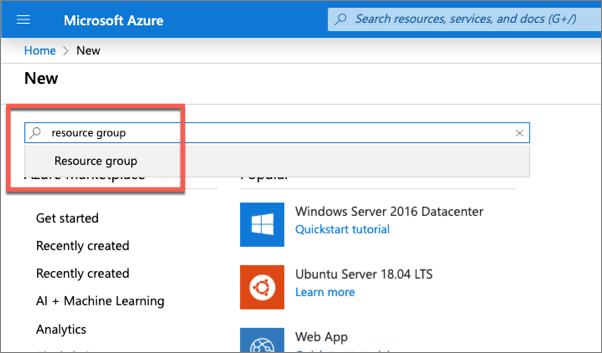

On the **Resource Group** page, select the **Create** button to create a new resource group.

Select a valid subscription, enter a name for the resource group, and select the wanted region. *None of these choices will impact the bot registration and are up to you.*

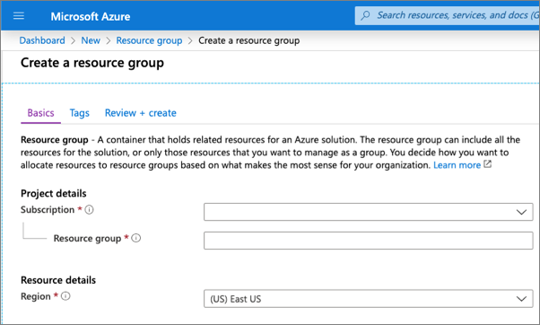

Complete the wizard to create the resource group. Once Azure has completed the resource group creation process, navigate to the resource group.

From the resource group, select the **Add** or **Create resources** button.

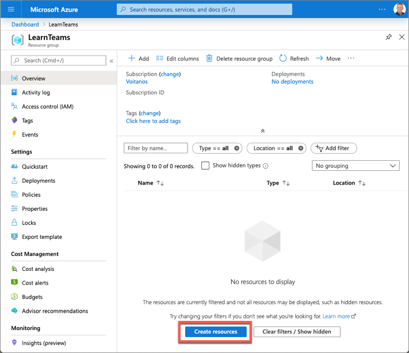

Enter **bot** in the **Search the marketplace** input box, and select **Bot Channels Registration** from the list of resources returned. Then select **Create** on the next page to start the process of registering a new bot resource:


In the **Bot Channels Registration** blade, enter the following values and then select **Create**:

- **Bot handle**: *Enter a globally unique name for the bot*
- **Subscription**: *Select the subscription you selected previously when creating the resource group*
- **Resource group**: *Select the resource group you created previously*
- **Location**: *Select your preferred Azure region*
- **Pricing tier**: *Select a preferred pricing tier; the F0 tier is free*
- **Messaging endpoint**: https://REPLACE_THIS.ngrok.io/api/messages

    > The bot registration needs to know the endpoint of the web service where the bot is implemented. This will change each time you start the ngrok utility used in previous exercises.

- **Application Insights**: Off
- **Microsoft App ID and password**: Auto create App ID and password

Azure will start to provision the new resource. This will take a moment or two. Once it's finished, navigate to the bot resource in the resource group.

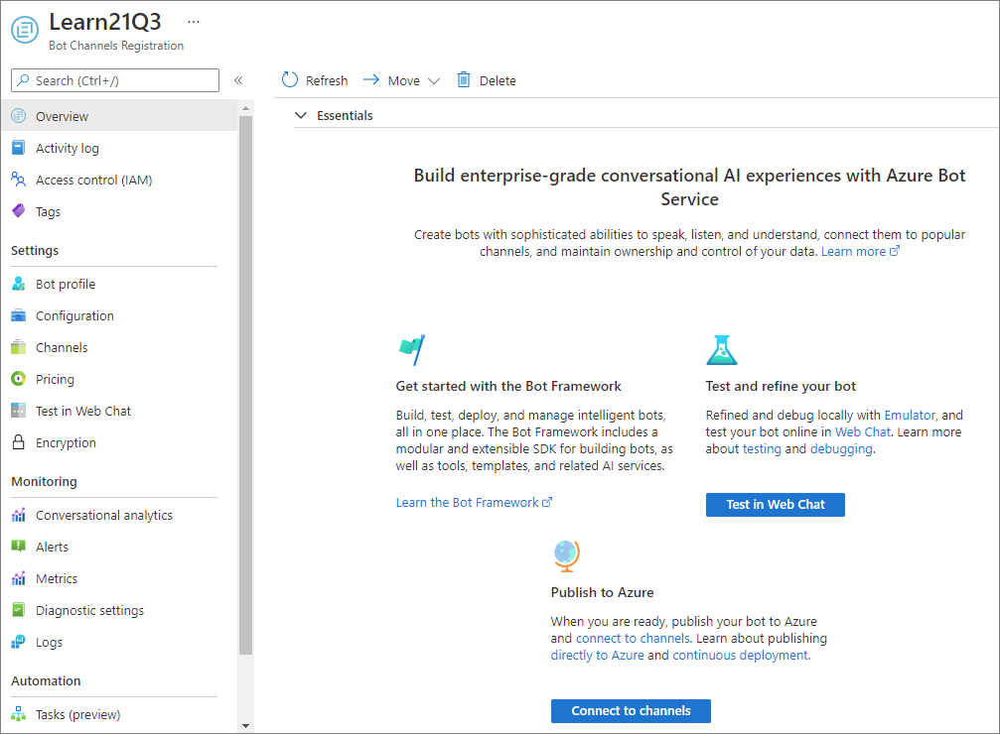

### Enable the Microsoft Teams channel for the bot

In order for the bot to interact with Microsoft Teams, you must enable the Teams channel.

From the bot resource in Azure, select **Channels** in the left-hand navigation.

On the **Connect to channels** pane, select the Microsoft Teams channel, then select **Save** to confirm the action.

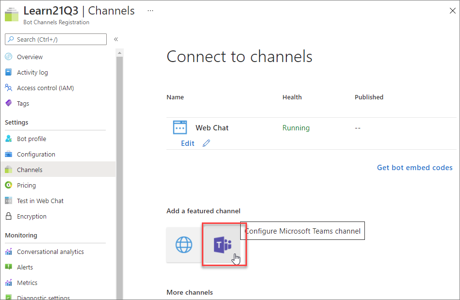

Once this process is complete, you should see both the **Web Chat** and **Microsoft Teams** listed in your enabled channels:


### Retrieve the bot app ID and password

When Azure created the bot, it also registered a new Azure AD app for the bot. You need to generate this new bot app a secret and copy the app's credentials.

Select **Settings** from the left-hand navigation. Scroll down to the **Microsoft App ID** section.

Copy the ID of the bot as you'll need it later.

Select **Manage** to navigate to the Azure AD app blade:

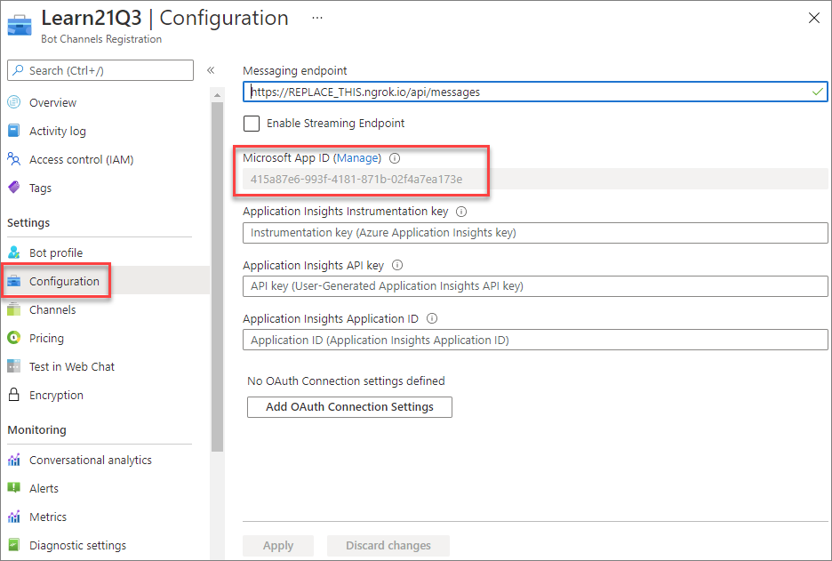

### Create a client secret for the app

In order for the daemon app to run without user involvement, it will sign in to Azure AD with an application ID and either a certificate or secret. In this exercise, you'll use a secret.

Select **Certificates & secrets** from the left-hand navigation panel.

Select the **New client secret** button:

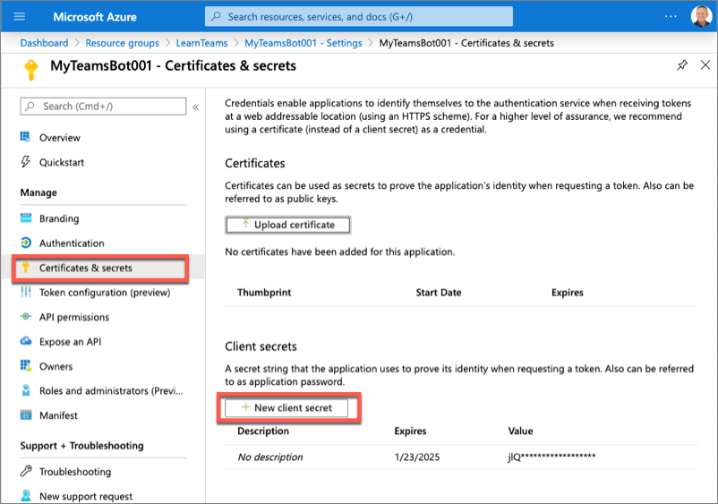

When prompted, give the secret a description and select one of the expiration duration options provided and select **Add**. *What you enter and select doesn't matter for the exercise.*

The **Certificate & Secrets** page will display the new secret. It's important you copy this value as it's only shown this one time; if you leave the page and come back, it will only show as a masked value.

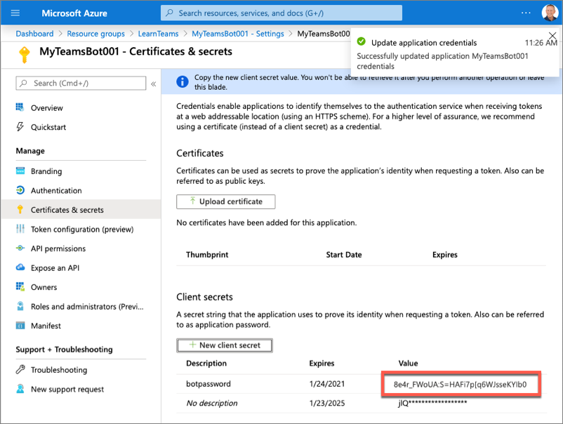

Copy the value of the secret as you'll need it later.

## Create Microsoft Teams app

In this section, you will create a new Node.js project.

> [!NOTE]
> At the time of publication of this module, there are plans to update the Yeoman generator for Microsoft Teams to scaffold new bot projects using the  the Bot Framework v4 SDK. However, at the time of publication of this module, the default project uses an older version of the Bot Framework SDK.
>
> Therefore, the steps in this section may change over time because the Yeoman generator may simplify the creation of bots. This exercise will guide you through creating a bot and configuring the project manually to use the Bot Framework v4 SDK because this is the current recommended approach.

Open your command prompt, navigate to a directory where you want to save your work, create a new folder **learn-msteams-bots**, and change directory into that folder.

Run the Yeoman Generator for Microsoft Teams by running the following command:

```console
yo teams
```

Yeoman will launch and ask you a series of questions. Answer the questions with the following values:

- **What is your solution name?**: MessagingExt
- **Where do you want to place the files?**: Use the current folder
- **Title of your Microsoft Teams App project?**: Planet Messaging
- **Your (company) name? (max 32 characters)**: Contoso
- **Which manifest version would you like to use?**: v1.8
- **Enter your Microsoft Partner Id, if you have one?**: (Leave blank to skip)
- **What features do you want to add to your project?**: *(uncheck the default option **A Tab** using the <kbd>space</kbd> key and press <kbd>enter</kbd>)*
- **The URL where you will host this solution?**: (Accept the default option)
- **Would you like show a loading indicator when your app/tab loads?**: No
- **Would you like personal apps to be rendered without a tab header-bar?** No
- **Would you like to include Test framework and initial tests?**: No
- **Would you like to use Azure Applications Insights for telemetry?**: No

> [!NOTE]
> Most of the answers to these questions can be changed after creating the project. For example, the URL where the project will be hosted isn't important at the time of creating or testing the project.

After answering the generator's questions, the generator will create the scaffolding for the project and then execute `npm install` that downloads all the dependencies required by the project.

### Add a bot to the project

In this section, you'll manually add a bot to the project.

Create a new folder **planetBot** in the **./src/app** folder.

Create a new file **planetBot.ts** in this new folder **./src/app/planetBot/planetBot.ts**.

Add the following code to the **planetBot.ts** file:

```typescript
import {
  TeamsActivityHandler,
  TurnContext,
  MessageFactory
} from "botbuilder";

import * as Util from "util";
const TextEncoder = Util.TextEncoder;

import * as debug from "debug";
const log = debug("msteams");

export class PlanetBot extends TeamsActivityHandler {
  constructor() {
    super();
  }
}
```

### Expose the bot as part of the Node.js app's REST API

After creating the bot, the next step is to expose it as part of the app's REST API.

First, add the bot to the **./src/app/TeamsAppsComponents.ts** file by adding the following code to the end of that file:

```typescript
export * from "./planetBot/planetBot";
```

This file is used in the core web server file. This file needs to be updated to expose the bot to the app's API and to configure a bot adapter for the app.

Locate and open the web server file, **./src/app/server.ts**.

Add the following two `import` statements after the existing `import` statements in the file:

```typescript
import { BotFrameworkAdapter } from "botbuilder";
import { PlanetBot } from "./planetBot/planetBot";
```

> [!TIP]
> Locate the following lines in the **server.ts** file. These lines load all the components and registers them with the web server's REST API routing. Because you added the planet bot as an export to the **TeamsAppsComponents.ts** file, it will be added to the web server's API routing by the following code.
>
> ```typescript
> import * as allComponents from "./TeamsAppsComponents";
> ...
> express.use(MsTeamsApiRouter(allComponents));
> ```

The last step is to configure the bot framework and call the bot when requests are received through the `/api/messages` path. Add the following code to the end of the **./src/app/server.ts** file:

```typescript
// register and load the bot
const botAdapter = new BotFrameworkAdapter({
  appId: process.env.MICROSOFT_APP_ID,
  appPassword: process.env.MICROSOFT_APP_PASSWORD
});

// configure what happens when there is an unhandled error by the bot
botAdapter.onTurnError = async (context, error) => {
  console.error(`\n [bot.onTurnError] unhandled error: ${error}`);
  await context.sendTraceActivity("OnTurnError Trace", `${error}`, "https://www.botframework.com/schemas/error", "TurnError");
  await context.sendActivity("bot error");
};

// run the bot when messages are received on the specified path
const bot = new PlanetBot();
express.post("/api/messages", (request, response) => {
  botAdapter.processActivity(request, response, async (context) => {
    await bot.run(context);
  });
});
```

In the code above, the first section initializes the Bot Framework adapter with the Azure AD app credentials created when you registered the bot in the Azure portal. These two properties, the Azure AD app's ID and secret, are pulled from an environment variable. This project contains a file, **./.env** that is used to set environment variables when it runs. You need to set these two values for the bot to work:

Locate and open the file **./.env**.

Locate the following section in the file, and set the values of the two properties that you obtained when registering the bot:

```txt
# App Id and App Password for the Bot Framework bot
MICROSOFT_APP_ID=
MICROSOFT_APP_PASSWORD=
```

## Register the messaging extension in the Microsoft Teams app

The last step to configure your project to host a messaging extension is to add it to the Microsoft Teams app manifest.

Locate and open the **./src/manifest/manifest.json**.

Locate the property `version`. Change its value to **1.0.0**.

Locate the property `id`. Change its value to match the GUID of the Azure AD app that was created when creating the bot in the Azure portal.

Locate the property `composeExtensions`. Add a new action command messaging extension to the collection of extensions registered with this Microsoft Teams app by updating the `composeExtensions` property the following JSON. This code will add our action command to the compose box and the action command in a message when its installed.

```json
"composeExtensions": [
  {
    "botId": "<REPLACE_WITH_MICROSOFT_APP_ID>",
    "canUpdateConfiguration": false,
    "commands": [
      {
        "id": "planetExpanderAction",
        "type": "action",
        "title": "Planet Expander",
        "description": "Lookup the details of a planet.",
        "context": [
          "compose",
          "message"
        ],
        "fetchTask": true
      }
    ]
  }
]
```

> [!IMPORTANT]
> Ensure you replace the `botId` property's value with the Azure AD app ID you obtained when registering the bot.

At this point, your project is configured to host a messaging extension and your Microsoft Teams app has a single action command registered. Now you can code the action command.

## Update the Teams SDK

Run the npm command to install the latest version of the SDK

```console
npm install @microsoft/teams-js -S
```

## Code the messaging extension

In this section, you'll code the action command for the messaging extension. Your action command, when triggered, will present the user with a modal dialog where they can select a planet from our solar system. The modal dialog is implemented using an Adaptive Card. After submitting the dialog, the action command will use another adaptive card to add details about the selected planet.

### Add a data set of planet details

A production application would typically retrieve data from an external source such as a REST API or a database. However, for simplicity in this exercise, you'll use an in-memory dataset.

Add a new file **planets.json** to the **./src/app/planetBot** folder and add the following JSON to it:

```json
[
  {
    "id": "1",
    "name": "Mercury",
    "summary": "Mercury is the smallest and innermost planet in the Solar System. Its orbit around the Sun takes 87.97 days, the shortest of all the planets in the Solar System. It is named after the Roman deity Mercury, the messenger of the gods.",
    "solarOrbitYears": 0.24,
    "solarOrbitAvgDistanceKm": 57909050,
    "numSatellites": 0,
    "wikiLink": "https://en.wikipedia.org/wiki/Mercury_(planet)",
    "imageLink": "https://upload.wikimedia.org/wikipedia/commons/d/d9/Mercury_in_color_-_Prockter07-edit1.jpg",
    "imageAlt": "NASA/Johns Hopkins University Applied Physics Laboratory/Carnegie Institution of Washington [Public domain]"
  },
  {
    "id": "2",
    "name": "Venus",
    "summary": "Venus is the second planet from the Sun. It is named after the Roman goddess of love and beauty. As the second-brightest natural object in the night sky after the Moon, Venus can cast shadows and, rarely, is visible to the naked eye in broad daylight. Venus lies within Earth's orbit, and so never appears to venture far from the Sun, setting in the west just after dusk and rising in the east a bit before dawn.",
    "solarOrbitYears": 0.62,
    "solarOrbitAvgDistanceKm": 108208000,
    "numSatellites": 0,
    "wikiLink": "https://en.wikipedia.org/wiki/Venus",
    "imageLink": "https://upload.wikimedia.org/wikipedia/commons/e/e5/Venus-real_color.jpg",
    "imageAlt": "&quot;Image processing by R. Nunes&quot;, link to http://www.astrosurf.com/nunes [Public domain]"
  },
  {
    "id": "3",
    "name": "Earth",
    "summary": "Earth is the third planet from the Sun and the only astronomical object known to harbor life. According to radiometric dating and other sources of evidence, Earth formed over 4.5 billion years ago. Earth's gravity interacts with other objects in space, especially the Sun and the Moon, which is Earth's only natural satellite. Earth orbits around the Sun in 365.256 days, a period known as an Earth sidereal year. During this time, Earth rotates about its axis about 366.256 times.",
    "solarOrbitYears": 1.00,
    "solarOrbitAvgDistanceKm": 149597500,
    "numSatellites": 1,
    "wikiLink": "https://en.wikipedia.org/wiki/Earth",
    "imageLink": "https://upload.wikimedia.org/wikipedia/commons/9/97/The_Earth_seen_from_Apollo_17.jpg",
    "imageAlt": "Apollo 17 [Public domain]"
  },
  {
    "id": "4",
    "name": "Mars",
    "summary": "Mars is the fourth planet from the Sun and the second-smallest planet in the Solar System after Mercury. In English, Mars carries a name of the Roman god of war and is often referred to as the 'Red Planet'. The latter refers to the effect of the iron oxide prevalent on Mars' surface, which gives it a reddish appearance distinctive among the astronomical bodies visible to the naked eye.",
    "solarOrbitYears": 1.88,
    "solarOrbitAvgDistanceKm": 134935000,
    "numSatellites": 2,
    "wikiLink": "https://en.wikipedia.org/wiki/Mars",
    "imageLink": "https://upload.wikimedia.org/wikipedia/commons/0/02/OSIRIS_Mars_true_color.jpg",
    "imageAlt": "ESA - European Space Agency &amp; Max-Planck Institute for Solar System Research for OSIRIS Team ESA/MPS/UPD/LAM/IAA/RSSD/INTA/UPM/DASP/IDA [CC BY-SA 3.0-IGO (https://creativecommons.org/licenses/by-sa/3.0-igo)]"
  },
  {
    "id": "5",
    "name": "Jupiter",
    "summary": "Jupiter is the fifth planet from the Sun and the largest in the Solar System. It is a gas giant with a mass one-thousandth that of the Sun, but two-and-a-half times that of all the other planets in the Solar System combined. Jupiter is one of the brightest objects visible to the naked eye in the night sky, and has been known to ancient civilizations since before recorded history. It is named after the Roman god Jupiter. When viewed from Earth, Jupiter can be bright enough for its reflected light to cast shadows, and is on average the third-brightest natural object in the night sky after the Moon and Venus.",
    "solarOrbitYears": 11.86,
    "solarOrbitAvgDistanceKm": 445336000,
    "numSatellites": 78,
    "wikiLink": "https://en.wikipedia.org/wiki/Jupiter",
    "imageLink": "https://upload.wikimedia.org/wikipedia/commons/5/50/Jupiter%2C_image_taken_by_NASA%27s_Hubble_Space_Telescope%2C_June_2019_-_Edited.jpg",
    "imageAlt": "NASA, ESA, and A. Simon (NASA Goddard), edited by PlanetUser [Public domain]"
  },
  {
    "id": "6",
    "name": "Saturn",
    "summary": "Saturn is the sixth planet from the Sun and the second-largest in the Solar System, after Jupiter. It is a gas giant with an average radius about nine times that of Earth. It has only one-eighth the average density of Earth; however, with its larger volume, Saturn is over 95 times more massive. Saturn is named after the Roman god of wealth and agriculture; its astronomical symbol (♄) represents the god's sickle.",
    "solarOrbitYears": 29.46,
    "solarOrbitAvgDistanceKm": 1433525000,
    "numSatellites": 82,
    "wikiLink": "https://en.wikipedia.org/wiki/Saturn",
    "imageLink": "https://upload.wikimedia.org/wikipedia/commons/c/c7/Saturn_during_Equinox.jpg",
    "imageAlt": "NASA / JPL / Space Science Institute [Public domain]"
  },
  {
    "id": "7",
    "name": "Uranus",
    "summary": "Uranus is the seventh planet from the Sun. It has the third-largest planetary radius and fourth-largest planetary mass in the Solar System. Uranus is similar in composition to Neptune, and both have bulk chemical compositions which differ from that of the larger gas giants Jupiter and Saturn. For this reason, scientists often classify Uranus and Neptune as \"ice giants\" to distinguish them from the gas giants.",
    "solarOrbitYears": 84.02,
    "solarOrbitAvgDistanceKm": 2883000000,
    "numSatellites": 27,
    "wikiLink": "https://en.wikipedia.org/wiki/Uranus",
    "imageLink": "https://upload.wikimedia.org/wikipedia/commons/3/3d/Uranus2.jpg",
    "imageAlt": "NASA/JPL-Caltech [Public domain]"
  },
  {
    "id": "8",
    "name": "Neptune",
    "summary": "Neptune is the eighth and farthest known planet from the Sun in the Solar System. In the Solar System, it is the fourth-largest planet by diameter, the third-most-massive planet, and the densest giant planet. Neptune is 17 times the mass of Earth, slightly more massive than its near-twin Uranus. Neptune is denser and physically smaller than Uranus because its greater mass causes more gravitational compression of its atmosphere.",
    "solarOrbitYears": 164.80,
    "solarOrbitAvgDistanceKm": 4500000000,
    "numSatellites": 14,
    "wikiLink": "https://en.wikipedia.org/wiki/Neptune",
    "imageLink": "https://upload.wikimedia.org/wikipedia/commons/6/63/Neptune_-_Voyager_2_%2829347980845%29_flatten_crop.jpg",
    "imageAlt": "Justin Cowart [CC BY (https://creativecommons.org/licenses/by/2.0)]"
  }
]
```

### Add an Adaptive Card to display the modal dialog

Add a new file **planetSelectorCard.json** to the **./src/app/planetBot** folder and add the following JSON to it. This file contains the Adaptive Card used to display the modal dialog:

```json
{
  "$schema": "http://adaptivecards.io/schemas/adaptive-card.json",
  "type": "AdaptiveCard",
  "version": "1.0",
  "body": [
    {
      "type": "Container",
      "items": [
        {
          "type": "TextBlock",
          "size": "medium",
          "isSubtle": true,
          "text": "Select a planet to insert into the message:"
        }
      ]
    },
    {
      "type": "Input.ChoiceSet",
      "id": "planetSelector",
      "choices": []
    }
  ],
  "actions": [
    {
      "type": "Action.Submit",
      "title": "Insert selected planet",
      "data":
      {
        "submitLocation": "messagingExtensionFetchTask"
      }
    }
  ]
}
```

### Add the lodash utility library to the project

To simplify working with collections, install the Lodash library by executing the following commands in the command line from the root folder of the project:

```console
npm install lodash -S
npm install @types/lodash -D
```

In the **./src/app/planetBot/planetBot.ts** file, add the following `import` statement to import two functions from Lodash into the bot:

```typescript
import { find, sortBy } from "lodash";
```

### Add the action command fetch handler to the bot

Implement the action command messaging extension by implementing a well-known method to the bot. Within the **./src/app/planetBot/planetBot.ts** file, update the `import` statement for the **botbuilder** package to include the objects `CardFactory`, `MessagingExtensionAction`, `MessagingExtensionActionResponse`, & `MessagingExtensionAttachment`:

```typescript
import {
  TeamsActivityHandler,
  TurnContext,
  MessageFactory,
  CardFactory, MessagingExtensionAction, MessagingExtensionActionResponse, MessagingExtensionAttachment
} from "botbuilder";
```

Next, add the following method to the `PlanetBot` class:

```typescript
protected handleTeamsMessagingExtensionFetchTask(context: TurnContext, action: MessagingExtensionAction): Promise<MessagingExtensionActionResponse> {
  // load planets & sort them by their order from the sun
  const planets: any = require("./planets.json");
  const sortedPlanets: any = sortBy(planets, ["id"])
    .map((planet) => {
      return { value: planet.id, title: planet.name };
    });

  // load card template
  const adaptiveCardSource: any = require("./planetSelectorCard.json");
  // locate the planet selector
  const planetChoiceSet: any = find(adaptiveCardSource.body, { id: "planetSelector" });
  // update choice set with planets
  planetChoiceSet.choices = sortedPlanets;
  // load the adaptive card
  const adaptiveCard = CardFactory.adaptiveCard(adaptiveCardSource);

  const response: MessagingExtensionActionResponse = {
    task: {
      type: "continue",
      value: {
        card: adaptiveCard,
        title: "Planet Selector",
        height: 150,
        width: 500
      }
    }
  } as MessagingExtensionActionResponse;

  return Promise.resolve(response);
}
```

This method will first load the planets and sort them by their order from the sun. It then loads the Adaptive Card for the modal and updates the `planetSelector` dropdown box with the sorted planets. Finally, it returns an object of type `MessagingExtensionActionResponse` that defines the task module, implemented using an Adaptive Card, to the Bot Framework. The Bot Framework will communicate with Microsoft Teams to display the card.

At this point, the first part of the action command is complete that will prompt the user to select a planet with the messaging extension is triggered. The second part of the messaging extension is to use the selected planet to reply to the message that triggered the extension with the planet's details or, if the extension was triggered from the compose box, it will add the planet's details to a new message.

### Add an Adaptive Card to display the modal dialog

Add a new file **planetDisplayCard.json** to the **./src/app/planetBot** folder and add the following JSON to it. This file contains the Adaptive Card used to generate the details of the planet:

```json
{
  "$schema": "http://adaptivecards.io/schemas/adaptive-card.json",
  "type": "AdaptiveCard",
  "version": "1.0",
  "body": [
    {
      "id": "cardHeader",
      "type": "Container",
      "items": [
        {
          "id": "planetName",
          "type": "TextBlock",
          "weight": "bolder",
          "size": "medium"
        }
      ]
    },
    {
      "type": "Container",
      "id": "cardBody",
      "items": [
        {
          "id": "planetSummary",
          "type": "TextBlock",
          "wrap": true
        },
        {
          "id": "planetDetails",
          "type": "ColumnSet",
          "columns": [
            {
              "type": "Column",
              "width": "100",
              "items": [
                {
                  "id": "planetImage",
                  "size": "stretch",
                  "type": "Image"
                }
              ]
            },
            {
              "type": "Column",
              "width": "250",
              "items": [
                {
                  "type": "FactSet",
                  "facts": [
                    {
                      "id": "orderFromSun",
                      "title": "Order from the sun:"
                    },
                    {
                      "id": "planetNumSatellites",
                      "title": "Known satellites:"
                    },
                    {
                      "id": "solarOrbitYears",
                      "title": "Solar orbit (*Earth years*):"
                    },
                    {
                      "id": "solarOrbitAvgDistanceKm",
                      "title": "Average distance from the sun (*km*):"
                    }
                  ]
                }
              ]
            }
          ]
        },
        {
          "id": "imageAttribution",
          "type": "TextBlock",
          "size": "medium",
          "isSubtle": true,
          "wrap": true
        }
      ]
    }
  ],
  "actions": [
    {
      "type": "Action.OpenUrl",
      "title": "Learn more on Wikipedia"
    }
  ]
}
```

### Add the action command submit handler to the bot

Next, add a handler to process the message when the messaging extension's Adaptive Card is submitted. Add the following method to the `PlanetBot` class in the **./scr/app/planetBot/planetBot.ts**:

```typescript
protected handleTeamsMessagingExtensionSubmitAction(context: TurnContext, action: MessagingExtensionAction): Promise<MessagingExtensionActionResponse> {
  switch (action.commandId) {
    case "planetExpanderAction":
      // load planets
      const planets: any = require("./planets.json");
      // get the selected planet
      const selectedPlanet: any = planets.filter((planet) => planet.id === action.data.planetSelector)[0];
      const adaptiveCard = this.getPlanetDetailCard(selectedPlanet);

      // generate the response
      return Promise.resolve({
        composeExtension: {
          type: "result",
          attachmentLayout: "list",
          attachments: [adaptiveCard]
        }
      } as MessagingExtensionActionResponse);
      break;
    default:
      throw new Error("NotImplemented");
  }
}
```

The `handleTeamsMessagingExtensionSubmitAction()` method first retrieves the planet selected in the selector Adaptive Card from the in-memory planets data set. It then uses a utility function to load and update the display Adaptive Card with the planet's details. Finally, it returns a `MessagingExtensionActionResponse` object that sets the Adaptive Card on the `composeExtension` property. Microsoft Teams will use this to display the details of the planet selected.

Lastly, add the utility method `getPlanetDetailCard()` to the `PlanetBot` class in the **./scr/app/planetBot/planetBot.ts**:

```typescript
private getPlanetDetailCard(selectedPlanet: any): MessagingExtensionAttachment {
  // load display card
  const adaptiveCardSource: any = require("./planetDisplayCard.json");

  // update planet fields in display card
  adaptiveCardSource.actions[0].url = selectedPlanet.wikiLink;
  find(adaptiveCardSource.body, { id: "cardHeader" }).items[0].text = selectedPlanet.name;
  const cardBody: any = find(adaptiveCardSource.body, { id: "cardBody" });
  find(cardBody.items, { id: "planetSummary" }).text = selectedPlanet.summary;
  find(cardBody.items, { id: "imageAttribution" }).text = "*Image attribution: " + selectedPlanet.imageAlt + "*";
  const cardDetails: any = find(cardBody.items, { id: "planetDetails" });
  cardDetails.columns[0].items[0].url = selectedPlanet.imageLink;
  find(cardDetails.columns[1].items[0].facts, { id: "orderFromSun" }).value = selectedPlanet.id;
  find(cardDetails.columns[1].items[0].facts, { id: "planetNumSatellites" }).value = selectedPlanet.numSatellites;
  find(cardDetails.columns[1].items[0].facts, { id: "solarOrbitYears" }).value = selectedPlanet.solarOrbitYears;
  find(cardDetails.columns[1].items[0].facts, { id: "solarOrbitAvgDistanceKm" }).value = Number(selectedPlanet.solarOrbitAvgDistanceKm).toLocaleString();

  // return the adaptive card
  return CardFactory.adaptiveCard(adaptiveCardSource);
}
```

## Test the conversation bot

From the command line, navigate to the root folder for the project and execute the following command:

```console
gulp ngrok-serve
```

This gulp task will run many other tasks all displayed within the command-line console. The **ngrok-serve** task builds your project and starts a local web server (http://localhost:3007). It then starts ngrok with a random subdomain that creates a secure URL to your local webserver.

> [!NOTE]
> Microsoft Teams requires all content displayed within a tab be loaded from an HTTPS request. In development, can be done using the tool [ngrok](https://www.ngrok.com) that creates a secure rotatable URL to your local HTTP webserver. Ngrok is included as a dependency within the project so there is nothing to setup or configure.


Note the URL of the Ngrok URL displayed in the console. In the previous screenshot, NGrok has created the temporary URL **ec7d937d.ngrok.io** that will map to our locally running web server. In order for the Bot Framework to route messages from Microsoft Teams to our locally running bot, you need to update the bot's messaging endpoint in the Azure portal.

Open a browser and navigate to the [Azure portal](https://portal.azure.com) and sign in using a **Work or School Account** that has rights to create resources in your Azure subscription.

Locate the bot by selecting the Azure Resource Group and Bot Channels Registration resource you created at the beginning of this exercise.

Using the left-hand navigation, select **Bot management** > **Settings**.

Locate the property **Configuration** > **Messaging endpoint** and set the domain to the NGrok domain.

Finally, save your changes to the bot configuration using the **Save** button at the top of the page.

> [!IMPORTANT]
> The free version of Ngrok will create a new URL each time you restart the web server. Make sure you update the **Messaging endpoint** of your URL each time you restart the web server when you are testing the app.

### Install the custom app in Microsoft Teams

Now let's install the app in Microsoft Teams. In the browser, navigate to **https://teams.microsoft.com** and sign in with the credentials of a Work and School account.

> [!NOTE]
> Microsoft Teams is available for use as a web client, desktop client and a mobile client. In this module, we will use the web client but any of the clients can be used.

Using the app bar navigation menu, select the **More added apps** button. Then select **Browse all apps** followed by **Upload for me or my teams**.


In the file dialog that appears, select the Microsoft Teams package in your project. This app package is a ZIP file that can be found in the project's **./package** folder.

Once the package is uploaded, Microsoft Teams will display a summary of the app. Here you can see some "todo" items to address. *None of these "todo" items are important to this exercise, so you'll leave them as is.*

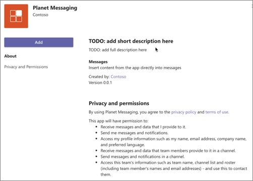

Select the **Add** button to install the app.

After installing the app, Microsoft Teams will take you to the 1:1 chat with the Microsoft Teams app and show the first dialog:

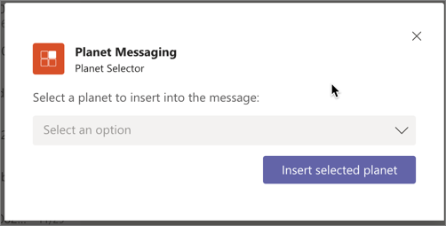

Cancel this dialog by selecting the **X** close icon in the upper-right corner.

Now, in the compose box in the chat, select either the **Planet Messaging** icon or the **...** icon below the chat box. If you select the **...** icon, enter **planet** in the search box and select the **Planet Messaging** extension:

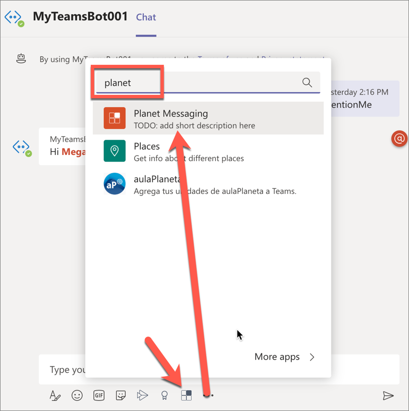

When the messaging extension's task module is displayed, select a planet and then select the **Insert selected planet** button. The messaging extension's submit action handler is called which will add the updated Adaptive Card to the compose box:

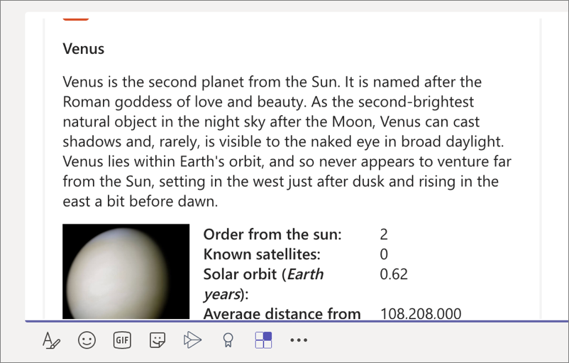

You can also trigger the messaging extension from an existing message in the chat using the **...** menu in the upper-right corner of the message. Select **Mode actions** and then select the **Planet Expander** option.

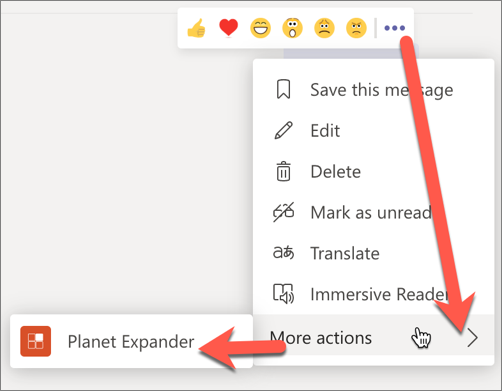

## Summary

In this exercise, you created an action command messaging extension for a custom Microsoft Teams app.