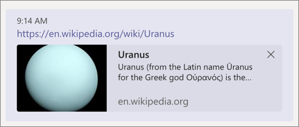

> [!VIDEO https://www.microsoft.com/videoplayer/embed/RE4OFZG]

In this exercise, you’ll learn how to add link unfurling to your Microsoft Teams app and how to implement this type of messaging extension.

> [!IMPORTANT]
> This exercise assumes you have created the Microsoft Teams app project with the Yeoman generator.

## Add a new search messaging extension to the Teams app

In a previous exercise, you created an action messaging extension that enabled a user to add the details of a planet to a message as well as search for a planet.

In this section, you'll add the link unfurling ability to the app

### Update the app's configuration

First, update app's manifest to add the new messaging extension. Locate and open the **./src/manifest/manifest.json** file.

You must increment the version of the app to upgrade an existing installed version. Locate the property `version` and increment the version to something greater than the existing value.

Next, locate the `composeExtensions` property. Add the following property after the `commands` property to add the link unfurling messaging extension:

```json
"messageHandlers": [
  {
    "type": "link",
    "value": {
      "domains": [
        "*.wikipedia.org"
      ]
    }
  }
]
```

Next, locate the `validDomains` property. Add the following domain to the array of valid domains: `"*.wikipedia.org"`

### Update the bot's code to support link unfurling

The next step is to update the bot's code.

Locate and open the bot in the file **./src/server/planetBot/planetBot.ts**.

Update the `import` statement for the **botbuilder** package to include the object `AppBasedLinkQuery`:

```typescript
import {
  TeamsActivityHandler,
  TurnContext,
  MessageFactory,
  CardFactory, MessagingExtensionAction, MessagingExtensionActionResponse, MessagingExtensionAttachment,
  MessagingExtensionQuery, MessagingExtensionResponse,
  AppBasedLinkQuery
} from "botbuilder";
```

Next, add the following method to the `PlanetBot` class:

```typescript
protected handleTeamsAppBasedLinkQuery(context: TurnContext, query: AppBasedLinkQuery): Promise<MessagingExtensionResponse> {
  // load planets
  const planets: any = require("./planets.json");
  // get the selected planet
  const selectedPlanet: any = planets.filter((planet) => planet.wikiLink === query.url)[0];
  const adaptiveCard = this.getPlanetDetailCard(selectedPlanet);

  // generate the response
  return Promise.resolve({
    composeExtension: {
      type: "result",
      attachmentLayout: "list",
      attachments: [adaptiveCard]
    }
  } as MessagingExtensionActionResponse);
}
```

This method is called by the Bot Framework when a URL matching the domain listed in the app's manifest. It will find a planet with the matching URL and return a `MessagingExtensionActionResponse` object that contains the updated card matching the URL to the existing message.

### Test the updated messaging extension

From the command line, navigate to the root folder for the project and execute the following command:

```console
gulp ngrok-serve
```

> [!IMPORTANT]
> Recall from a previous exercise, Ngrok will create a new subdomain. You need to update your bot registration's **Messaging endpoint** in the Azure portal (*shown in a previous exercise*) with this new domain before testing it.

First, update the existing installed version of the bot.

In the browser, navigate to **https://teams.microsoft.com** and sign in with the credentials of a Work and School account.

Using the app bar navigation menu, select the **More added apps** button. Then select **Browse all apps**, select the menu in the top-right corner of the **Planet Messaging** and select **Update**.

After updating the app, go back to the 1:1 chat where you tested the messaging extension in the previous exercise. Copy and paste the URL of one of the planets from the **planets.json** file into the compose box. Notice the message has been updated to include the card, which is also included when you send the message:



## Summary

In this exercise, you learned how to add link unfurling to your Microsoft Teams app and how to implement this type of messaging extension.
