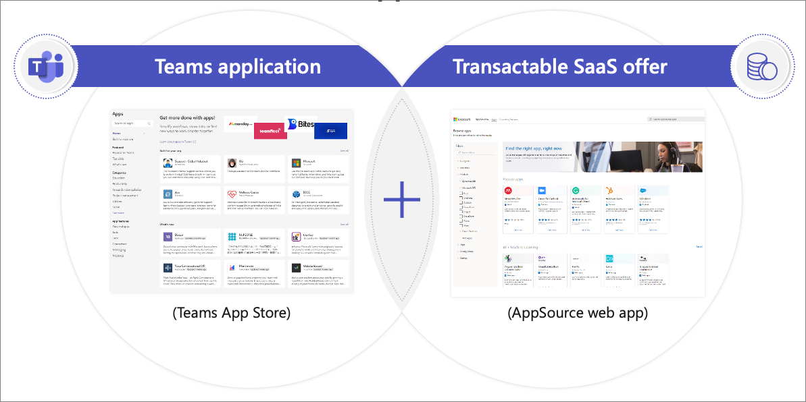

Custom Microsoft Teams apps that incorporate user data protected by Azure AD will need to implement an authentication process. Single sign-on (SSO) provides a seamless way for your Microsoft Teams apps to authenticate users.

In this unit, you'll learn what a monetized Microsoft Teams app is.

## What is a monetized Microsoft Teams app?

Most users are familiar with apps they can get from the Microsoft Teams App Store.

Initially when Microsoft Teams was released, developers could publish apps to [Microsoft AppSource](https://appsource.microsoft.com/) as a *transactable* software-as-a-service (SaaS) offer where apps could be purchased on a subscription basis. These are web apps that developers, partners, and independent software vendors (ISVs) create.

Since then, Microsoft has unified this process where today monetized apps published through Partner Center are discoverable and transactable through additional surface areas. Once an app is published from Partner Center and its transactable SaaS offer is linked, it's added to the Teams App Store and Teams Admin Center.

## Ideal ISV candidates for Teams monetization

What makes an ideal partner or ISV candidate for building a Microsoft Teams app and what might result in more success for you with your app development?

The Microsoft Teams app is the starting point. When planning and building your app, think about the value that you're giving to your users. One thing to keep in mind is the *stickiness* of the app. Users are more inclined to pay for an app if it's something they can't live without or if it's something that helps them with their productivity.

### Per-user vs. flat-rate pricing models

Today, Microsoft Teams supports a per-user model, meaning that it doesn't support a flat-rate price. But Microsoft AppSource does support flat-rate offers.

> [!NOTE]
> Support for site-wide and flat-rate pricing models will be supported and available in the future.

This doesn't mean that you're unable to publish a Teams app with a flat-rate offer that you want to monetize. It means your users won't be able to purchase the subscription from the Teams App Store. Instead, users will have to download and install the Teams app, and then purchase the subscription from Microsoft AppSource.

### Free vs. paid in-app experiences

As previously mentioned, stickiness of an app is a key point you want to focus on for your app, but also think about the value of a free Teams app, also known as the *freemium* model, compared to a paid Teams app.

The freemium model vs the paid model are considerations you should think through when designing & building your app.

### App management

Another aspect of your app to consider is the management of it. You'll need to assign licenses that you're building on a per-user basis.

### Existing SaaS offers expedite the process

Having an existing SaaS offer will expedite the process of monetizing a Teams app, but this isn't a requirement. But having one help shorten the time to market for your app.
