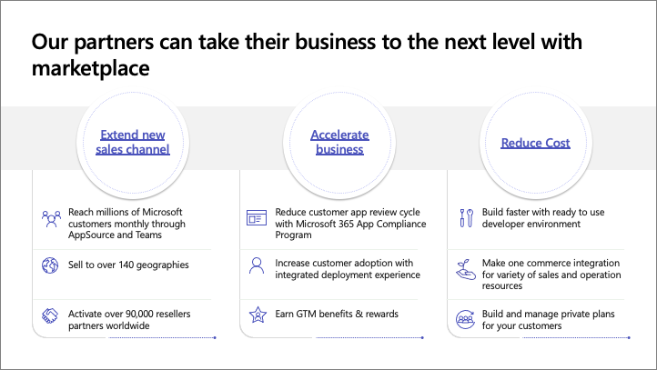

In this unit, you'll learn how you can get your apps into the hands of customers with the Microsoft Commercial Marketplace.

## Microsoft Commercial Marketplace

From the eyes of the partner, you have one place to enter: [Partner Center](https://partner.microsoft.com/). Once you sign-in to your Partner Center account, you'll have access to all the apps you've published.

Once a partner publishes an app through Partner Center, it's connected to distribution channels.

### Direct app acquisition

Customers can acquire published apps through one of the three direct storefronts:

- **[Microsoft AppSource](https://appsource.microsoft.com)** enables customers to find solutions that enable innovation, drive business outcomes, and help you get more done with what they already have.
- **Microsoft Teams App Store** is part of the Microsoft Teams clients and enables customers to acquire apps directly from the app. Users purchase subscriptions via credit card.
- **Microsoft Teams Admin Center** is the third option for app acquisition. The admin center enables IT administrators to acquire and install apps on behalf of their users. Administrators can purchase subscriptions via credit card or invoice billing.

### Cloud Solution Providers

A Cloud Solution Provider (CSP) is a company that provides businesses with cloud-based infrastructure, networks, and software applications. Microsoft has designed a program to allow CSPs to offer Microsoft's popular products directly, along with their own value-added products and services.

Microsoft's CSPs sell Microsoft 365 and Microsoft Azure licenses and can resell your Microsoft Teams apps that you've published through Partner Center without you having to package the apps in a different format.

There are additional steps you will need to take to enable reselling via CSPs. Once you have published your monetized Teams app, to get started .

### Microsoft field

The third distribution channel is the Microsoft field sellers. Microsoft field sellers talk to and engage enterprise size customers. They help ensure enterprises are aware of your solutions

## Benefits of Microsoft marketplaces

Let's look the benefits of using the different Microsoft marketplaces to distribute your Microsoft Teams apps. These benefits fall into one of three of the following pillars:

### Extend new sales channels

You can reach millions of Microsoft customers through Microsoft AppSource or the Microsoft Teams App Store.

Microsoft has over 90,000 CSPs and field sales people who have visibility into of your app to promote and sell it to existing Microsoft customers. These apps can be purchased by customers in over 140 geographies and transactions can be completed in 17 different currencies. for more information, see [Geographic availability and currency support for the commercial marketplace](/azure/marketplace/marketplace-geo-availability-currencies).

### Accelerate business

There are many companies, especially large organizations, who need to have intense compliance checks for the apps the acquire. The buyers can review Microsoft's checks as part of the Microsoft 365 App Compliance program and elect to use this program. If there are any gaps in compliance requirements, the company can focus only on the gap and not the entire compliance check. Developers and ISVs that rely on the Microsoft 365 App Compliance checks reduces many the compliance checks the company will need to do. For more information on the Microsoft 365 App Compliance Program, see [Microsoft 365 App Compliance Program](/microsoft-365-app-certification/overview).

Microsoft also wants to make it easier for the buyer to find free Microsoft Teams apps and paid SaaS offers. With integrated deployment experience, the apps are connected to each so that the buyer can find the apps more easily.

Marketplace rewards will allow you to grow your business. As you have transactable offers in the marketplace and grow your business, there's a benefit from the marketing, sales, and technical points of view.

### Reduce cost

The third pillar is reducing cost. By utilizing the [Microsoft 365 Developer Program](https://developer.microsoft.com/microsoft-365/dev-program?ocid=MSlearn), developers get a free sandbox environment, tools, and other resources developers need to build solutions for the Microsoft 365 platform.

The Microsoft Commercial Marketplace has many sales and operation resources, and it's growing! Developers and app creators can use those resources to reduce the cost of operation.

As a publisher, you may need to have custom pricing and/or terms & conditions. The Microsoft Commercial Marketplace can also handle custom pricing & unique terms and conditions.

In this unit, you learned how you can get your apps into the hands of customers with the Microsoft Commercial Marketplace.
