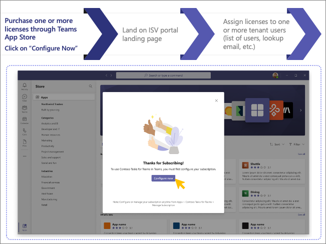
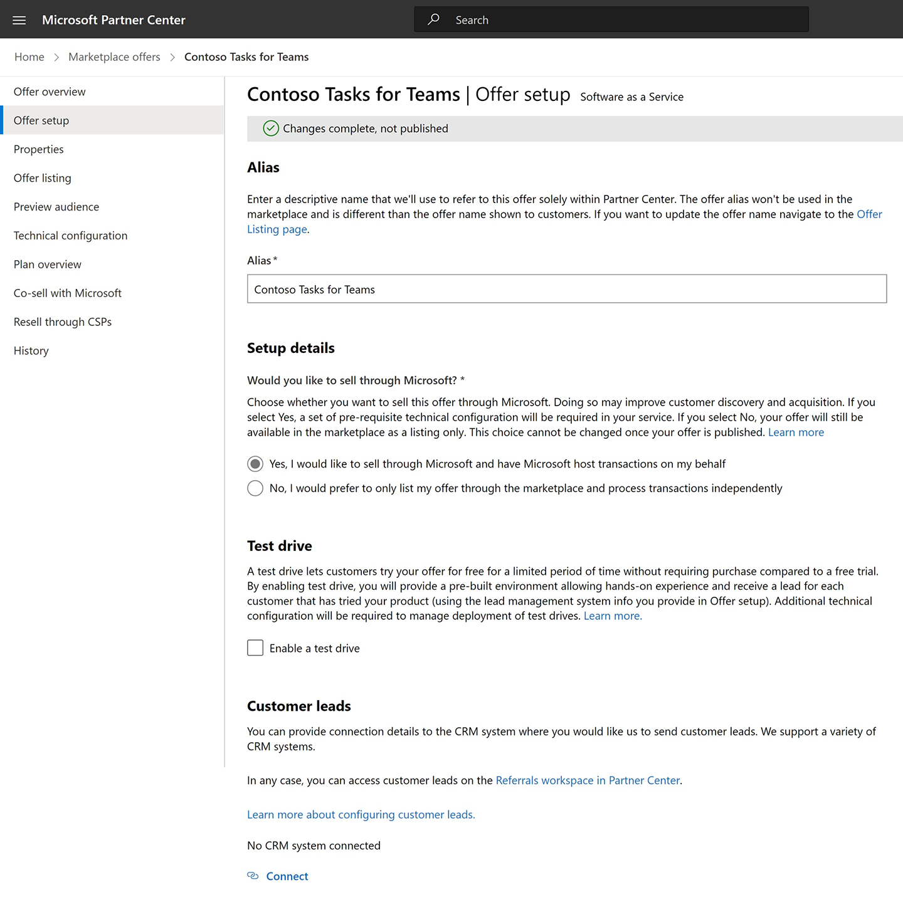
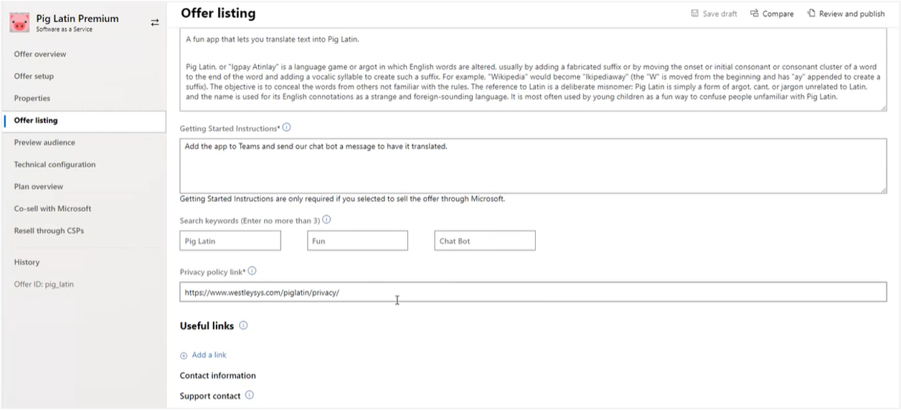
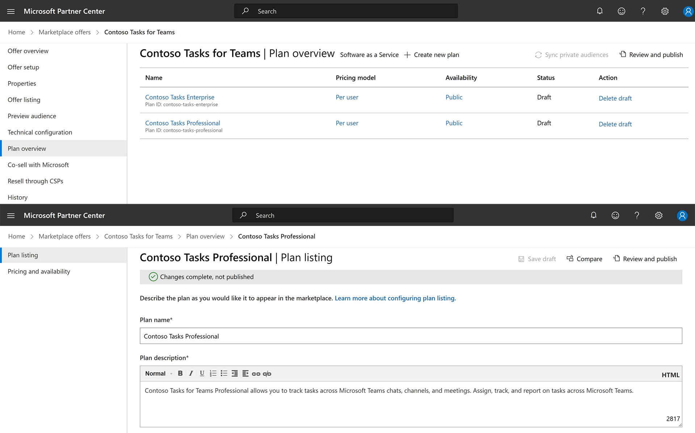
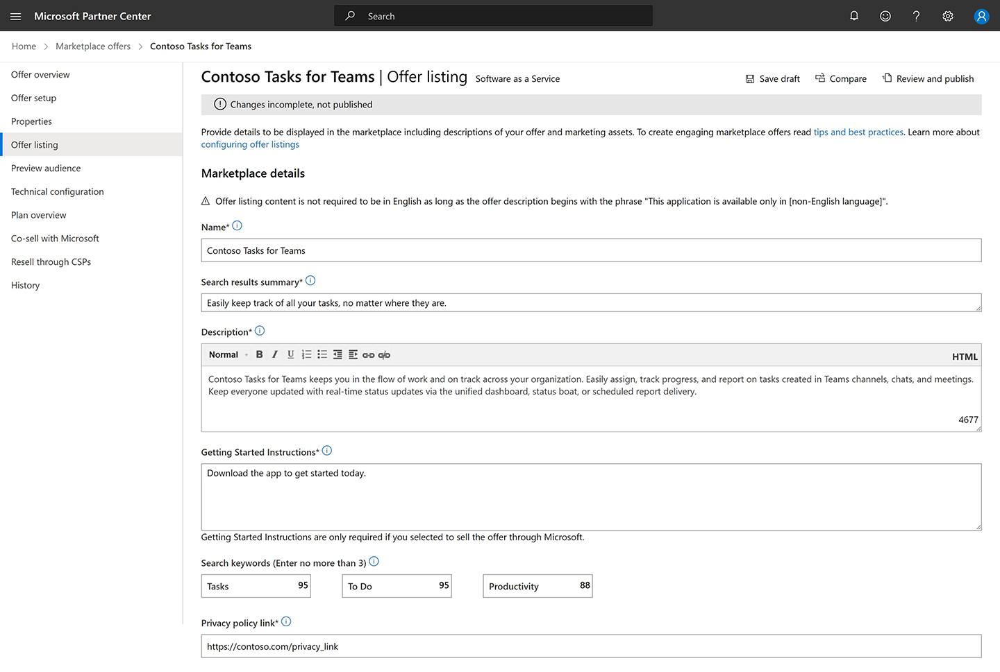
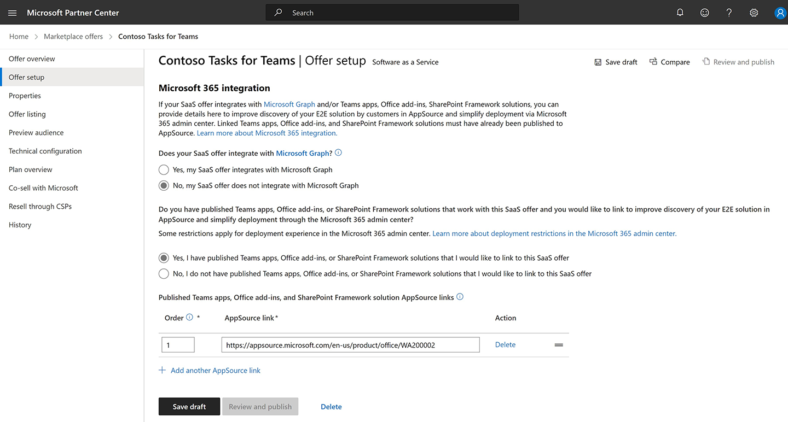
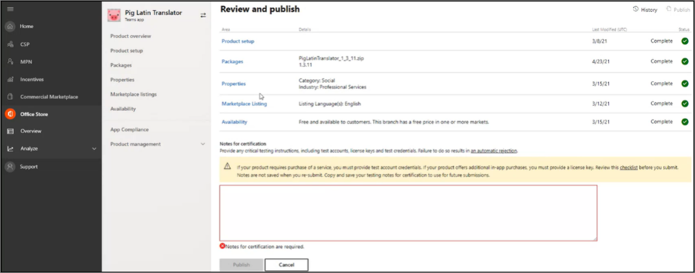

In this unit, you'll learn what the technical requirements for creating a Microsoft Teams app you can monetize.

There are five steps in order for you to monetize your Microsoft Teams app.

1. Create a free Microsoft Teams app
1. Integrate with your SaaS fulfillment APIs
1. Create a transactable SaaS offer
1. Link your SaaS offer to the Microsoft Teams app
1. Submit your app for validation & publication in Partner Center

## Step 1 - Create a Microsoft Teams app


The first step of monetization is to have a free Microsoft Teams app. If you already have an app, then you can start from there, or you can create a new app.

The rest of this unit assumes you've already created a Microsoft Teams app.

## Step 2 - Integrate with SaaS fulfillment APIs

The second step of app monetization is to build the landing page and webhooks to integrate with commerce APIs.


Integration with these APIs by publishers is required to allow the subscription lifecycle to be managed by the marketplace. While this is one of the most resource-intensive steps for ISVs during the process, it's well documented and few ISVs encounter issues performing this step.

ISVs must complete two requirements for creating a transactable SaaS offering.

### Create & publish a landing page

Microsoft AppSource requires ISVs to create and publish a landing page. This is where Microsoft will send people to when they've purchased, or transacted, the offer. For example, when a customer has checked out and entered their credit card or billing information, Microsoft AppSource will send the customer to this landing page.

The landing page is where people are going to end up and be presented with information about how to provision their services.

For more information, see [Build the landing page for your transactable SaaS offer in the commercial marketplace](https://docs.microsoft.com/azure/marketplace/azure-ad-transactable-saas-landing-page).

### Create & publish a webhook to handle marketplace requests

The second requirement is to create and publish a webhook. This webhook is how Microsoft will communicate with you, the app provider, after the customer has purchased the app.

For example, consider if the customer of the app has a billing change, or a credit card has expired or was compromised and was updated by the customer. Microsoft needs to communicate with you, the app provider about any changes that were made to the subscription. This is done through the webhook you'll create & maintain.

For more information on creating the webhook, see:

- [Azure AD and transactable SaaS offers in the commercial marketplace](https://docs.microsoft.com/azure/marketplace/azure-ad-saas)
- [Commercial marketplace general listing and offer policies](https://docs.microsoft.com/legal/marketplace/certification-policies)

### Understand the landing page and webhook in the app acquisition and provisioning process

Let's look at how the landing page and webhook fit into the app acquisition process with a customer.


From the user's perspective, the user completes the purchase and is redirected to the landing page (#1 in the figure above). Part of that redirection includes a token that the ISV can use to submit requests to the Microsoft commerce APIs to receive details about the purchase (#2 in the figure above).

The landing page is where you can include instructions to your customer what they need to do in order to use the app. For example, maybe the tenant admin needs to consent to certain permissions for the app to connect to the SaaS offer.

Once this process has completed, you as the publisher will internally provision the subscription and notify Microsoft's commerce APIs that the onboarding process has been completed so Microsoft can begin the billing process for the app (#3 in the figure above).

After the app has been provisioned by the publisher and Microsoft has begun the billing the customer, the user is redirected back to the marketplace to resume the flow (#4 in the figure above) by redirecting them to the app.

This means that the customer isn't either going to download the app or they'll repeat the process of signing-in via single sign-on (SSO) and complete any extra requirements for the subscription. This done either through the Microsoft Admin Center or through your webhook (#5 in the figure above).

### Thoroughly validate the end-to-end experience before submitting for approval

While the APIs required to implement the webhook can be deceptively simple, ISVs should thoroughly validate the end-to-end experience before submitting your app for validation in to Microsoft AppSource.

For example, the license management component only supports the per-user license at this time. Microsoft requires ISVs have a license management component where end users are able to have licenses assigned to them.

Admins can assign, remove, or reassign licenses as necessary.

The first step in creating the webhook is to provide a landing URL for the market place to pass the token:

```csharp
// STEP 1:
[HttpGet]
[Route("api/subscription/signup")]
public async Task<HttpResponseMessage> Signup(string token) {
  var resolve = await SaasFulfillmentUtility.ResolvePurchase(token);
  // here is where publisher would need to integrate with their own license management systems to configure, provision
  await ActivateSubscription(resolve.subscription.id, resolve.subscription.planId, resolve.quantity);

  return Request.CreateResponse(System.Net.HttpStatusCode.OK, "Subscription setup complete");
}
```

Next, use the token to retrieve subscription details via the commerce APIs:

```csharp
// STEP 2:
public static async Task<ResolveResponse> ResolvePurchase(string token) {
  Uri requestUrl = new Uri($"https://marketplaceapi.microsoft.com/api/saas/subscriptions/resolve?api-version=2018-08-31");

  // ...

  httpRequestMessage.Headers.Add("x-ms-marketplace-token", token);
  HttpResponseMessage response = await httpClient.SendAsync(httpRequestMessage).ConfigureAwait(false);

  // ...

  return JsonConvert.DeserializeObject<ResolveResponse>(await response.Content.ReadAsStringAsync());
}
```

Finally, you'll then notify the commerce APIs that the subscription is activated and Microsoft should now start the billing process.

```csharp
// STEP 3:
public static async Task ActivateSubscription(Guid subscriptionId, string plan, int quantity) {
  Uri requestUrl = new Uri($"https://marketplaceapi.microsoft.com/api/saas/subscriptions/{subscriptionId}/activate?api-version=2018-08-31");
  var body = new { planId = plan, quantity = quantity };
  HttpRequestMessage httpRequestMessage = new HttpRequestMessage(HttpMethod.Post, requestUrl) {
      Content = new StringContent(JsonConvert.SerializeObject(body), Encoding.UTF8, "application/json"),
  };

  // ...

  HttpResponseMessage response = await httpClient.SendAsync(httpRequestMessage).ConfigureAwait(false);
}
```

### Landing page and license management best practices

Let's look a bit more at that landing page and some best practices in creating one to monetize your Microsoft Teams app.



The first step is when the user purchases one or more licenses through the Microsoft Teams App Store. Then they're presented with a **Configure Now** button.

Consider the following best practices when you create the landing page:

- Microsoft Teams monetization capabilities are designed to support per-user assigned licenses; site-wide/tenant licenses will require extra work/logic implementation on behalf of the ISV and aren't recommended at this time.
- Multiple users who purchase subscriptions should be able to assign licenses and manage subscriptions for individual users within their tenant.
- ISVs should support the ability for multiple users to assign license as part of the same tenant (multiple admins).
- ISVs can provide the opportunity for the user to cancel their subscription via the ISV portal (and submits call to MarketplaceAPI to cancel the subscription via commerce systems).


The user will then land on the ISV's hosted landing page on their website where they can assign the license to those users, get information on extra configuration steps, and information on app support.

Consider the following best practices on the landing page:

- Provide introduction to subscriber on how to use the product.
- Allow the subscriber to assign licenses.
- Provide way to engage with support for issues (FAQ, knowledgebase, and/or email address).


Consider the following best practices when the user is assigning app licenses to their users:

- Validate users don’t already have license assigned via another user.
- If different license types are available, subscribers should be able to manage and assign appropriately.
- Alert users they've been assigned a license (including how to add the app to Teams and get started) via Teams chat bot and/or email.
- Provide link back to the license management page for subscriber to manage in the future.

## Step 3 - Create the transactable SaaS offer

The third step of app monetization is to create the transactable SaaS offer.


The creation of the transactable SaaS offer is done by defining it within Partner Center to specify the offer details including the following things:

- description
- pricing
- URL of landing page
- URL of webhook

In Partner Center, start by creating a new **Software as a Service** (SaaS) offer. Then enter a free-form offer ID that will serve as a unique name to refer to the offer in later steps, so make sure it's clear and easy to understand.

The next step is to configure the offer in Partner Center. In the first part of configuring the offer, make sure you select the option **Yes, I would like to sell through Microsoft and have Microsoft host transactions on my behalf**.



Next, configure discoverability properties of the SaaS offer, such as the category and industry or vertical that's most appropriate for your app:


The third step of configuring your offer is where you start to bring your app to life, using iconography, and using descriptions. These are areas that are going to be searchable in the Microsoft Teams App Store and Microsoft AppSource.

Be sure to use specific keywords that will help users find your app.



ISVs can also specify the preview audience for the SaaS offer. The **Preview Audience** page of a SaaS offer is where you can add users who can access the app as a preview once the app has been published. Only the users listed on this page, either with their Work and School or Microsoft Account email addresses, will be able to access the app as a preview.

The preview audience enables you to test and validate the app without having to create an offer with a $0 price just to test the app and license management flow. Setting the price of the offer to $0 would make that price available to everyone, so this preview audience is the preferred way to test your app.


The next step is where you'll define the URLs for the landing page of your app, the app's webhook that has been previously covered in this module, the Azure AD app details such as the tenant ID and app ID (also known as the *client ID*).

Recall the landing page is where users will be directed to by the marketplace for license assignment and configuration. The webhook is used to handle marketplace requests such as changes to the subscription or cancellations.


If your offer is available under multiple SKUs, you'll define them in the next step. Even if your app is available as a single license where it's available as an all-or-nothing, you'll configure it on this page.

ISVs can elect to offer different licenses, such as a basic, professional or enterprise license. Partner Center and the offer configuration support this capability.



As part of the offer SKU, you can define different price points, if you offer trials, and which markets the SKU is available within:

As part of the market selection, notice some markets include an icon next to the name. Microsoft can remit tax on your behalf on these indicated markets and Microsoft will cover everything related to tax remittance for these markets and included. The costs for this processing are included as part of the transaction fee Microsoft charges.


When defining the pricing details, you configure the offer to charge one price for one user limit and a different price for another user limit. For example, you might charge one price for 1-99 licenses but offer a better pricing for 100-500 licenses.

The offer pricing also supports billing users on a monthly or annually, all subscription money is collected at the time of purchase, and you can elect to offer a free trial for your app.

> [!NOTE]
> For more information on the transaction fee Microsoft charges for SaaS offers, see [Plan a SaaS offer for the commercial marketplace: SaaS billing](https://docs.microsoft.com/azure/marketplace/plan-saas-offer#saas-billing)

### Best practices - selling flat-rate transactable offers

While Microsoft Teams doesn't currently support flat-rate pricing models, ISVs can still sell their app as a flat-rate offer via Microsoft AppSource.

To do this, first create a flat-rate transactable SaaS offer and publish it to Microsoft AppSource. Then, link your Microsoft Teams app to the offer in Partner center but don't add the offer to the app's manifest.

> [!WARNING]
> The Microsoft Teams app validation will fail if the flat-rate offer is included in the app's manifest.

Next, to promote the flat-rate offer in Microsoft AppSource, consider adding in-app messaging in the app that a subscription is needed and provides a hyperlink to the transactable SaaS offer in Microsoft AppSource.

Once the Microsoft Teams marketplace supports flat-rate pricing, you can update your app manifest with your Office ID and Publisher ID and submit it for validation.

For more information, see:

- [Create a SaaS offer](https://docs.microsoft.com/azure/marketplace/create-new-saas-offer)
- [Configure SaaS offer properties](https://docs.microsoft.com/azure/marketplace/create-new-saas-offer-properties)
- [How to test and publish a SaaS offer to the commercial marketplace](https://docs.microsoft.com/azure/marketplace/test-publish-saas-offer)

### Publish app offer in the marketplace

The last step in Partner Center is to publish your offer. When you're ready to submit your offer, it will go through a series of manual and automated validation checks. The status of all these checks is displayed on the **Offer Overview** page:


Once you complete the review process of publishing an offer, while the offer is live in the marketplace, it's not yet linked to the actual Microsoft Teams app.

That's the next part of the process.

## Step 4 - Link SaaS offer to Microsoft Teams app


The next part of the technical requirements in creating a transactable offer for Microsoft Teams apps is to link the offer to the Microsoft Teams app.

There are two ways to link an offer to a Microsoft Teams app:

1. Microsoft Teams Developer Portal
1. Microsoft Teams app manifest

> [!IMPORTANT]
> The following steps assume you've already uplaoded your Microsoft Teams app to the Microsoft Teams Developer Portal site.

### Microsoft Teams Developer Portal: link offer to apps

The first option ISVs can use to link their approved transactable SaaS offer to a Microsoft Teams app is using the [Microsoft Teams Developer Portal](https://dev.teams.microsoft.com/).

Once you sign-in to the Microsoft Teams Developer Portal, locate the Microsoft Teams app and open its configuration.

From the **Plans and Pricing** page, connect the app to your Publisher ID and the Offer ID found in Partner Center. The Publisher ID can be found in the legal information in your Partner Center account while the Offer ID is what you specified when you previously created the offer.

Once you've entered these two values, you can preview the offer to ensure the correct offer details were loaded from Microsoft Partner Center.

### Microsoft Teams app manifest: link offer to apps

The second option ISVs can use to link their approved transactable SaaS offer to a Microsoft Teams app is by specifying the Publisher ID and Offer ID within the Microsoft Teams app's manifest.

In the Microsoft Teams manifest, you need to create a string that contains both your Publisher ID and Offer ID separated by a dot. For example, if your Publisher ID is `abcd12345` and the Offer ID is `my_offer`, you would add the following to the `subscriptionOffer` object in the app manifest:

```json
{
  "name": {
    "short": "..",
    "full": ".."
  },
  "description": {
    "short": "..",
    "full": ".."
  },
  "bots": [ .. ],
  ...
  "subscriptionOffer": {
    "offerId": "abcd12345.my_offer"
  }
  ...
  "permissions": [ .. ]
}
```

Once you add this to your app manifest, you need to go into Partner Center and update the offer.

First, get the link to the app from either from within the Microsoft Teams client or from the Microsoft AppSource site when you published it:



Next, in Partner Center, select the offer and select the **Offer Setup** page. Select the **Yes, I have published Teams apps. Office add-ins, or SharePoint Framework solutions that I would like to link to this SaaS Offer** option and paste in the link to the Microsoft Teams app you copied in the previous step



This is done from the **Offer Setup** page Partner Center.

For more information on linking your app to the offer, see:

- [Include a SaaS offer with your Microsoft Teams app: Configure your app for the SaaS offer](https://docs.microsoft.com/microsoftteams/platform/concepts/deploy-and-publish/appsource/prepare/include-saas-offer#configure-your-app-for-the-saas-offer)
- [Include a SaaS offer with your Microsoft Teams app: Link published Microsoft 365 App consumption clients](https://docs.microsoft.com/azure/marketplace/create-new-saas-offer#link-published-microsoft-365-app-consumption-clients)

## Step 5 - Submit for validation & publication


The last step in the technical requirements is to submit the app for validation and publication.

To start the app validation process, go back to Partner Center and upload your Microsoft Teams app package.


During this phase you can also include notes for the certification process.



This is a good place to include a link to a video or an explanation that you'd like the app reviewers to be aware of when reviewing your app. For example, maybe your app requires some sort of a certification provisioning process, or a particular section that requires extra details, or a service the test team would need to validate the service.

Finally, select the **Publish** button to start the verification process.


- [Publish your app to the Microsoft Teams store (Overview)](https://docs.microsoft.com/microsoftteams/platform/concepts/deploy-and-publish/appsource/publish)
- [Publish your apps to the Microsoft Teams store (Microsoft 365 Developer Blog)](https://devblogs.microsoft.com/microsoft365dev/publish-your-apps-to-the-microsoft-teams-store/)

In this unit, you learned what the technical requirements for creating a Microsoft Teams app you can monetize.
