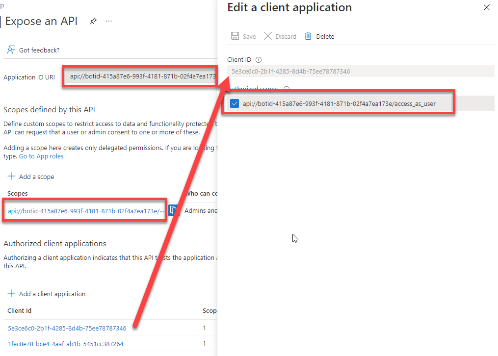
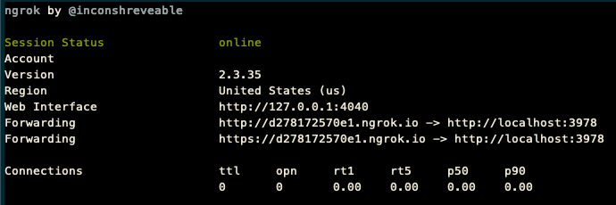
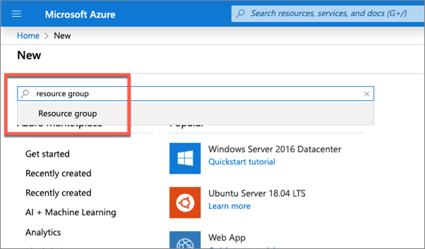
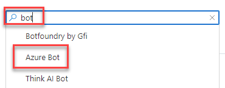
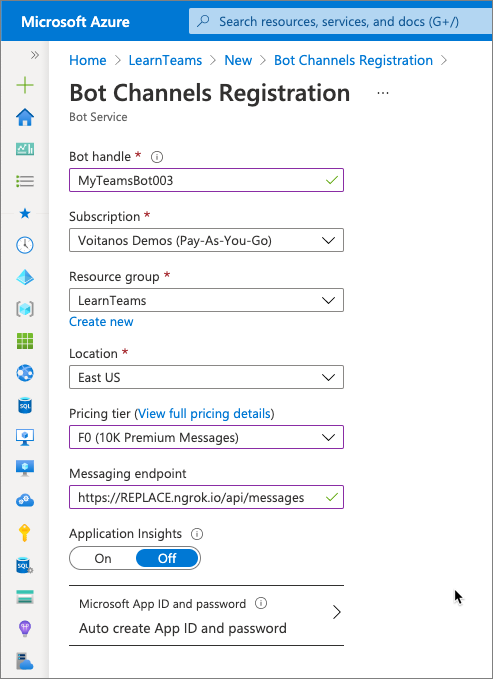
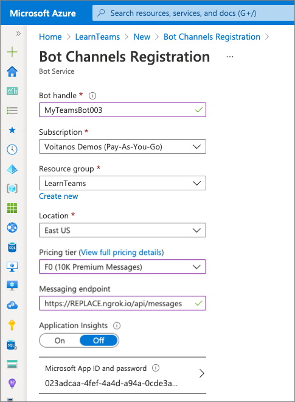
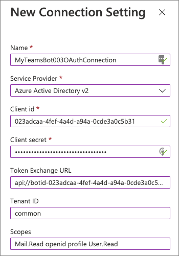

In this exercise, you'll add a custom bot in a new existing Microsoft Teams app and use single sign-on (SSO) to obtain an access token to submit requests to Microsoft Graph.

> [!IMPORTANT]
> This exercise assumes you have created the Azure AD app from the previous exercise in this module.

> [!NOTE]
> This exercise requires a valid Azure subscription in order to create a bot using Bot Framework. However, if you do not have an Azure subscription, you can use the legacy Bot Framework Registration Portal. For more information, see [Create a bot for Microsoft Teams](https://docs.microsoft.com/microsoftteams/platform/bots/how-to/create-a-bot-for-teams)

## Prerequisites

Developing Microsoft Teams apps requires a Microsoft 365 tenant, Microsoft Teams configured for development, and the necessary tools installed on your workstation.

For the Microsoft 365 tenant, follow the instructions on [Microsoft Teams: Prepare your Microsoft 365 tenant](https://docs.microsoft.com/microsoftteams/platform/get-started/get-started-tenant) for obtaining a developer tenant if you don't currently have a Microsoft 365 account. Make sure you have also enabled Microsoft Teams for your organization.

Microsoft Teams must be configured to enable custom apps and allow custom apps to be uploaded to your tenant to build custom apps for Microsoft Teams. Follow the instructions on the same **Prepare your Microsoft 365 tenant** page mentioned above.

You'll use Node.js to create a custom Microsoft Teams app in this module. The exercises in this module assume you have the following tools installed on your developer workstation.

> [!IMPORTANT]
> In most cases, installing the latest version of the following tools is the best option. The versions listed here were used when this module was published and last tested.

- [Node.js](https://nodejs.org/) - v10.\* (or higher)
- NPM (installed with Node.js) - v6.\* (or higher)
- [ngrok](https://www.ngrok.com)
- [Visual Studio Code](https://code.visualstudio.com)
- [Microsoft Teams Toolkit for Visual Studio Code](https://docs.microsoft.com/microsoftteams/platform/toolkit/visual-studio-code-overview)

You must have the minimum versions of these prerequisites installed on your workstation.

## Create your Microsoft Teams app project

Let's start by creating a Microsoft Teams app project. To do this, you'll use the Microsoft Teams Toolkit for Visual Studio Code.

Start by launching Visual Studio Code, and then select the **Microsoft Teams Toolkit** from the activity bar:


From the list of **Microsoft Teams: Commands**, select **Create a new Teams app**.

The Teams Toolkit will prompt you to sign in to your Microsoft account. This will be used to register the Teams app in both your Microsoft 365 tenant's Microsoft Teams app store and Azure Active Directory (Azure AD). Select **Allow** and sign-in using your Microsoft 365 Work & school account.


After signing in, the toolkit prompts you to select a project type to create. Because this project will use the Microsoft Graph, which requires all requests to include OAuth2 access token for authorization, create a new bot project using the single sign-on (SSO) capability supported by Microsoft Teams. Select the **JavaScript** option for **Conversation Bot SSO quick-start** app type:


On the **Configure project** screen, you're prompted for the **Application name** and **Azure AD single sign-on** domain name:


Set the **Application name** to **My SSO Bot** and select **Finish**

## Update the Azure AD app

The next step is to update an Azure AD app you created in a previous exercise of this module. The  Azure AD app will be associated with the bot you'll register in the next step.

Open a browser and navigate to the [Azure Active Directory admin center (https://aad.portal.azure.com)](https://aad.portal.azure.com). Sign in using a **Work or School Account** that has global administrator rights to the tenancy.

Select **Manage > App registrations** in the left-hand navigation and select the **My Teams SSO App**.

### Update authentication settings

Next, select **Manage > Authentication** in the left-hand navigation.

Change the **RedirectURI** to `https://token.botframework.com/.auth/web/redirect`.

### Update the exposed API settings

Next, select **Manage > Expose API** in the left-hand navigation.

Currently, the **Application ID URI** looks similar to the following:

```text
api://d4fa28c4e203.ngrok.io/023adcaa-4fef-4a4d-a94a-0cde3a0c5b31
```

Remove the dynamic subdomain and slash and replace them with `botid-`. For example:

```txt
api://botid-023adcaa-4fef-4a4d-a94a-0cde3a0c5b31
```

Notice that the values of the **Scopes defined by this API** and **Authorized client applications** will now reflect this change as well:



With the Azure AD app configuration updated, the next step is to register the bot with Azure Bot Framework.

## Register the bot with the Microsoft Azure Bot Framework

Before registering the bot with the Azure Bot Framework, you need to get the URL where the bot will run. Bots, like tabs, must be served from a publicly accessible domain served over HTTPS. Like the previous exercises in this module, you'll use ngrok to expose the local web server to the Azure Bot Framework.

In the console, run the following command to start ngrok:

```console
ngrok http host-header=rewrite 3978
```

When ngrok starts, it will display the temporary subdomain. In this case, the URL `https://d278172570e1.ngrok.io` is forwarding all requests to `https://localhost:3978` that you'll start later in the exercise.



Copy this dynamic URL as you'll need it when registering your bot.

> [!IMPORTANT]
> Each time ngrok is started, it will generate a new dynamic subdomain for the URL. **If you restart ngrok, you'll need to update anywhere you've referenced the dynamic subdomain.** The optional licensed version of ngrok allows you to define and reuse the same subdomain.

Open a browser and navigate to the [Azure portal](https://portal.azure.com). Sign in using a **Work or School Account** that has rights to create resources in your Azure subscription.

Select **Create a resource** in the left-hand navigation:


Enter **resource group** in the **Search the marketplace** input box, and select **Resource group**.



On the **Resource Group** page, select the **Create** button to create a new resource group.

Select a valid subscription, enter a name for the resource group, and select your preferred region. *None of these choices will affect the bot registration and are up to you.*


Complete the wizard to create the resource group. Once Azure has completed the resource group creation process, navigate to the resource group.

From the resource group, select the **Add** or **Create resources** button.


Enter **bot** in the **Search the marketplace** input box, and select **Bot Channels Registration** from the list of resources returned. Then select **Create** on the next page to start the process of registering a new bot resource:



In the **Bot Channels Registration** screen, enter the following values, but don't select **Create**:

- **Bot handle**: *Enter a globally unique name for the bot*
- **Subscription**: *Select the subscription you selected previously when creating the resource group*
- **Resource group**: *Select the resource group you created previously*
- **Location**: *Select your preferred Azure region*
- **Pricing tier**: *Select a preferred pricing tier; the F0 tier is free*
- **Messaging endpoint**: `https://REPLACE_THIS.ngrok.io/api/messages`

  > The bot registration needs to know the endpoint of the web service where the bot is implemented. This will change each time you start the ngrok utility used in previous exercises.

- **Application Insights**: Off



Select the **Microsoft App ID and password** option to change it from it's default setting. By default, the registration process will register a new Azure AD app. We want to use the Azure AD app created in a previous exercise and updated in this exercise.

- On the **Create Microsoft App ID** page, select **Create New**.
- When prompted, enter the Azure AD app's credentials from the previous exercise in this module:
  - **Microsoft App ID**: this is the application ID, or client ID
  - **Password**: this is the client secret
- Select **OK**.

Select **Create** to start the bot provisioning process.



Azure will start to provision the new resource. This will take a moment or two. Once it's finished, navigate to the bot resource in the resource group.

After the bot has been provisioned, select it from within the new resource group you previously created.

### Configure the bot service connection (token store)

Define the OAuth connection setting for the bot.

Select **Settings > Configuration** from the left-hand menu.

Select the **Add OAuth Connection Settings** button on the **Configuration** screen.


Use the following values to create a new connection setting, and then select **Save**:

- **Name**: *enter a name for your connection, but copy this as you'll need it later when updating the project*
- **Service Provider**: Azure Active Directory v2
- **Client ID**: *use the Azure AD app's client ID from the previous exercise*
- **Client secret**: *use the Azure AD app's client secret from the previous exercise*
- **Token exchange URL**: *use the Azure AD app's application ID URI you updated previously in this exercise*
- **Tenant ID**: common
- **Scopes**: Mail.Read openid profile User.Read
  - *This is a space-delimited list of all permissions the bot needs that have also been added to the Azure AD app you previously. The list contains a subset of the permissions listed in the Azure AD app from the exercises in this module that the bot will use.*



### Enable the Microsoft Teams channel for the bot

In order for the bot to interact with Microsoft Teams, you must enable the Teams channel.

From the bot resource in Azure, select **Channels** in the left-hand navigation.

On the **Connect to channels** pane, select the Microsoft Teams channel, then select **Save** to confirm the action.


Once this process is complete, you should see both the **Web Chat** and **Microsoft Teams** listed in your enabled channels:


## Update the bot code project

With the bot registration complete, now you can go back to the bot project and update it to use the new bot registration.

### Update the project's environment variables

In Visual Studio Code, locate and open the **./.env** file. Set the three environment variables to the following values:

- **MicrosoftAppId**: Azure AD app's client ID associated with the bot
- **MicrosoftAppPassword**: Azure AD app's client secret associated with the bot
- **connectionName**: Bot's OAuth connection setting name

For example, the following is what the **.env** file looks like matching the same values used throughout this module:

```text
MicrosoftAppId=023adcaa-4fef-4a4d-a94a-0cde3a0c5b31
MicrosoftAppPassword=4fKuf8W.EnY-KV4YbsXcw_-~-6U1dz3Sn1
connectionName=MyTeamsBot003OAuthConnection
```

### Update the Microsoft Teams app's manifest

Next, update the Microsoft Teams app's manifest file to register the bot with the app.

Locate and open the **./appPackage/manifest.json** file.

Locate the `bots` array in the manifest file - it contains a single bot. Set the `botId` property to the Azure AD app's client ID associated with the bot:

```json
"bots": [
  {
    "botId": "023adcaa-4fef-4a4d-a94a-0cde3a0c5b31",
    "scopes": [
      "personal"
    ],
    "supportsFiles": false,
    "isNotificationOnly": false
  }
],
```

Locate the `webApplicationInfo` property. Change the `id` and `resource` properties on the `webApplicationInfo` element to use the values from the Azure AD app registered in the previous exercise:

```json
"webApplicationInfo": {
  "id": "023adcaa-4fef-4a4d-a94a-0cde3a0c5b31",
  "resource": "api://botid-023adcaa-4fef-4a4d-a94a-0cde3a0c5b31"
}
```

## Build and test the application

To test the application you have two steps:

1. Install the dependencies & start the web API project
1. Install the custom Microsoft Teams tab

> [!TIP]
> The following steps assume ngrok is still running from a previous step. If not, make sure you start ngrok following the same process outlined above. The ngrok URL points to the React web app project.
>
> Remember, if you restart the ngrok process, the dynamic subdomain will change and you'll need to make the appropriate updates in the registered Azure AD application, custom Microsoft Teams app, environment variables in the web API project, and environment variables in the React web app project.

### Install the dependencies & start the bot project

Open a new console, change to root folder for the project and install all dependencies by running the executing command:

```console
npm install
```

After all dependencies are installed, run the following command to start the project:

```console
npm start
```

You'll know it's working when returns the following in the console:

```console
Get Bot Framework Emulator: https://aka.ms/botframework-emulator

To talk to your bot, open the emulator select "Open Bot"
```

> [!TIP]
> If you need to stop the process in the future, press <kbd>CTRL</kbd>+<kbd>C</kbd>

### Install the custom Microsoft Teams bot

Now let's install the bot in Microsoft Teams. In the browser, go to [Microsoft Teams](https://teams.microsoft.com). Sign in with the credentials of a Work and School account.

In the app bar on the left, select the **More added apps** button. Then select **More apps**.

On the **Browse available apps and services** page, select **Upload a custom app** > **Upload for me or my teams**.


In the file dialog box that appears, select the Microsoft Teams package in your project. This app package is a zip file in the project's **./appPackage** folder.

After the package is uploaded, select it to display a summary of the app. Here you can see some todo items to address. You'll update the todo items later in the exercise.


Select the **Add** button.

Microsoft Teams will install the bot and take you to the 1:1 chat experience for the bot. To start the login process using the support for SSO, send any message to the bot, such as **hello**.

After a few seconds, the bot will respond with an authentication prompt to Microsoft Teams. Microsoft Teams will display a message requesting permissions.

Select the **Continue** button.


The bot will authenticate with Azure AD and obtain an access token to call Microsoft Graph. It then uses the access token to request information about the currently signed in user from Microsoft Graph:


