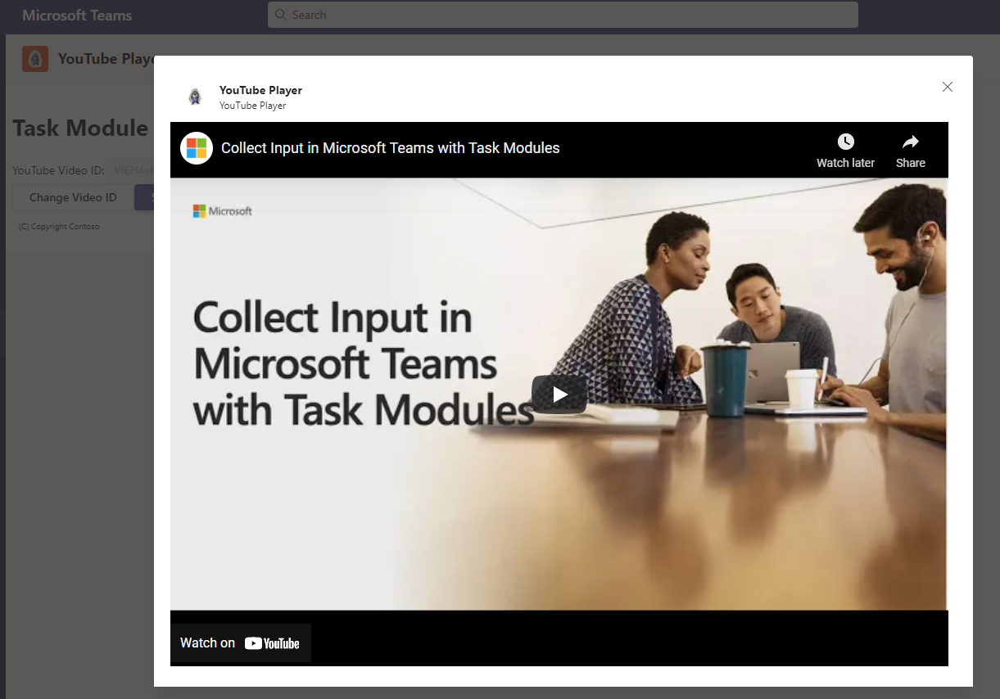

> [!VIDEO https://www.microsoft.com/videoplayer/embed/RE4OAOL]

In this unit, you’ll learn the basics of task modules in Microsoft Teams and how to collect input from users in a custom Teams tab.

## Overview

Task modules allow you to create modal popup experiences in your Teams application. Inside the popup you can run your own custom HTML/JavaScript code, show an `<iframe>`-based widget such as a YouTube or Microsoft Stream video or display an Adaptive Card. They're especially useful for starting and completing tasks or displaying rich information like videos or Power BI dashboards. A popup experience is often more natural for users starting and completing tasks compared to a tab or a conversation-based bot experience.

Task modules build on the foundation of Microsoft Teams tabs; they're essentially a tab inside a popup window. They use the same SDK, so if you've built a tab you're already 90% of the way to creating a task module.



Task modules can be invoked in three ways:

- **Channel and/or personal tabs**: Using the Microsoft Teams SDK, you can invoke task modules from buttons, links, or menus on your tab. Creating task modules for custom Microsoft Teams tabs is covered in this unit.
- **Bots**: Buttons on cards sent from your bot can invoke task modules. This technique is useful when you don't need everyone in a channel to see what you are doing with a bot. For example, when having users respond to a poll in a channel it's not terribly useful to see a record of that poll being created. Creating task modules for bots is covered in another unit within this module.
- **Outside of Teams from a deep link**: You can also create URLs to invoke a task module from anywhere using Microsoft Teams' support for deep links.

## Invoking Task Modules

Task modules can be invoked from tabs, bots, or deep links and what appears in one can be either HTML or an Adaptive Card. This implementation provides many options in how they're invoked and how to deal with the result of a user's interaction.

To invoke a task module, use the Microsoft Teams client SDK:

```javascript
microsoftTeams.tasks.startTask(taskInfo, callback);
```

The `taskInfo` object contains properties that tell Microsoft Teams about the task module. This object includes the following properties:

- `title` (string): Appears below the app name and to the right of the app icon.
- `height` & `width` (number | string): These properties can be a number representing the task module's dimensions, or one of the predefined sizes (small, medium, or large).

    The named sizes are predefined percentages of the available space to display the task module. For the width, they're 20%, 50% & 60% while the height values are 20%, 50%, and 66%.

- `url` (string): The URL of the page loaded as an `<iframe>` inside the task module. The URL's domain must be in the app's `validDomains` array in your app's manifest.
- `failbackUrl` (string): If a client doesn't support the task module feature, this URL is opened in a browser tab.

> [!NOTE]
> These are the properties that are used when working with task modules in tabs. Additional properties apply to other scenarios, such as using task modules with Adaptive Cards or when invoking task modules from bots. These two scenarios are covered in additional units in this module.

The second parameter of the `startTask()` method is a callback. This callback can receive two parameters: `error: string, result: string | any`. Microsoft Teams will execute the callback if there's an error or when the task module triggers it.

## Dismissing task modules

From within the task module, you can submit the data collected from the user by calling the `submitTask()` method:

```javascript
microsoftTeams.tasks.submitTask(result);
```

The `result` can be either a string or an object. This method will call the registered callback defined in the `startTask()` method.

If the user closes the task module, or an error occurs, Microsoft Teams will close the task module, invoke the provided callback with an error object.

## Task module invocation errors

If an error object is passed to the callback, it will be one of the following values:

- **"Values for both card and url were specified. One or the other, but not both, are allowed."**: The `taskInfo` object contains values for both the `url` and `card` property. *These are mutually exclusive and only one should be specified.*
- **"You must specify a value for either card or url."**: This error is the inverse of the previous one. Either the `url` or `card` properties are required.
- **"Invalid appId."**: The `taskInfo.appId` property isn't valid.
- **"User cancelled/closed the task module."**: The user closed the task module.

## Summary

In this unit, you learned the basics of task modules in Microsoft Teams and how to collect input from users in a custom Teams tab.
