> [!VIDEO https://www.microsoft.com/videoplayer/embed/RE4OIwK]

In this exercise, you'll learn how to use task modules with bots in Microsoft Teams.

The first step will be to create a bot and add it to our existing Microsoft Teams app. You'll then extend the bot to support the existing task modules to display a video and change the selected video.

> [!NOTE]
> This exercise requires a valid Azure subscription in order to create a bot using Bot Framework. However, if you don't have an Azure subscription, you can use the legacy Bot Framework Registration Portal. For more information, see [Create a bot for Microsoft Teams](/microsoftteams/platform/bots/how-to/create-a-bot-for-teams).

> [!IMPORTANT]
> This exercise assumes you have created the Microsoft Teams app project with the Yeoman generator that contains a personal tab from the previous exercise in this module. You'll update the project to add a new task module that uses an Adaptive Card.

## Register a new bot in Microsoft Azure

The first step is to create a new Microsoft Teams bot. Adding a bot to the Teams app involves two steps:

1. Register the bot with Microsoft Azure's Bot Framework
1. Add a bot to the project codebase

### Register the bot with Microsoft Azure's Bot Framework

Open a browser and navigate to the [Azure portal](https://portal.azure.com). Sign in using a **Work or School Account** that has rights to create resources in your Azure subscription.

Select **Create a resource** in the left-hand navigation:

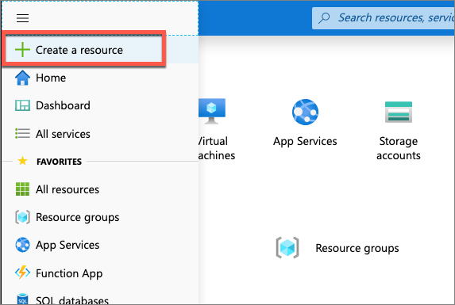

Enter **resource group** in the **Search the marketplace** input box, and select **Resource group**.


On the **Resource Group** page, select the **Create** button to create a new resource group.

Select a valid subscription, enter a name for the resource group, and select the wanted region. *None of these choices will impact the bot registration and are up to you.*

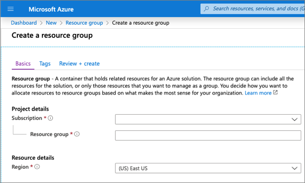

Complete the wizard to create the resource group. Once Azure has completed the resource group creation process, navigate to the resource group.

From the resource group, select the **Add** or **Create resources** button.

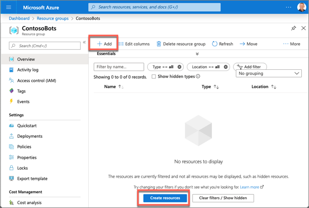

Enter **bot** in the **Search the marketplace** input box, and select **Azure Bot** from the list of resources returned. Then select **Create** on the next page to start the process of registering a new bot resource:


In the **Create an Azure Bot** blade, enter the following values and then select **Review + create**:

- **Bot handle**: *Enter a globally unique name for the bot*
- **Subscription**: *Select the subscription you selected previously when creating the resource group*
- **Resource group**: *Select the resource group you created previously*
- **Pricing tier**: *Select a preferred pricing tier; the F0 tier is free*
- **Type of App**: *Select Multi Tenant*
- **Microsoft App ID**: Create new Microsoft App ID

Select **Create**.

Azure will start to provision the new resource. This will take a moment or two. Once it's finished, navigate to the bot resource in the resource group.

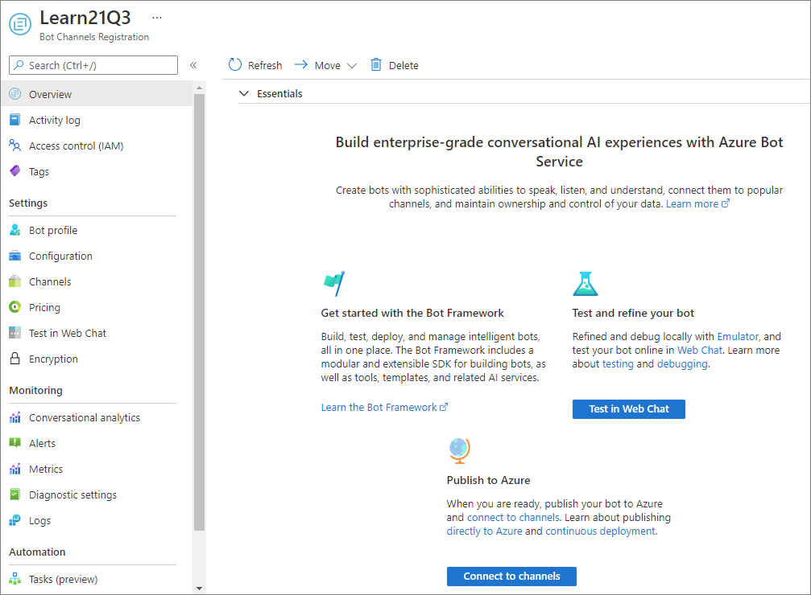

### Enable the Microsoft Teams channel for the bot

In order for the bot to interact with Microsoft Teams, you must enable the Teams channel.

From the bot resource in Azure, select **Channels** in the left-hand navigation. On the **Channels** pane, select the Microsoft Teams channel. Select **Microsoft Teams Commercial** then select **Apply** to confirm the action.

Once this process is complete, you should see both the **Web Chat** and **Microsoft Teams** listed in your enabled channels:


### Set Messaging Endpoint and retrieve the bot app ID and password

Select **Configuration** from the left-hand navigation.

On the **Configuration** pane, enter the **Messaging endpoint**: `https://REPLACE_THIS.ngrok.io/api/messages`

Select **Apply**.

When Azure created the bot, it also registered a new Azure AD app for the bot. You need to generate this new bot app a secret and copy the app's credentials.

Select **Configuration** from the left-hand navigation. Copy the **Microsoft App ID** of the bot as you'll need it later.

Select **Manage** to navigate to the Azure AD app blade:


### Create a client secret for the app

In order for your code to connect to the bot framework service, it will sign in to Azure AD with an application ID and either a certificate or secret. In this exercise, you'll use a secret.

Select **Certificates & secrets** from the left-hand navigation panel.

Select the **New client secret** button:


When prompted, give the secret a description and select one of the expiration duration options provided and select **Add**. *What you enter and select doesn't matter for the exercise.*

The **Certificate & Secrets** page will display the new secret. It's important you copy this value as it's only shown this one time; if you leave the page and come back, it will only show as a masked value.


Copy the value of the secret as you'll need it later.

### Update the Microsoft Teams app project with the app details

Open the project you created in previous exercises in Visual Studio Code.

Locate the **./.env** file. This is an environment variable helper file used during development.

Locate the properties **MICROSOFT_APP_ID** and **MICROSOFT_APP_PASSWORD** and copy the values of the bot's application ID and secret to these values.

At this point, the bot has been registered with the Azure Bot service. The next step is to implement the bot and add it to Microsoft Teams.

## Add a bot to the project

The first step is to add the bot to the app's manifest file. Locate and open the file **./src/manifest/manifest.json**.

Locate the `id` property and change its value to the same ID as the Azure AD application created for the bot.

Locate the section `"bots": [],` in the **manifest.json** file. Replace this empty collection with the following. Ensure you use the same Azure AD app ID for the `botId` in the following code:

```json
"bots": [
  {
    "botId": "{{MICROSOFT_APP_ID}}",
    "scopes": [
      "personal"
    ],
    "supportsFiles": false,
    "isNotificationOnly": false,
    "commandLists": [
      {
        "scopes": [ "personal" ],
        "commands": [
          {
            "title": "MentionMe",
            "description": "Sends message with @mention of the sender"
          }
        ]
      }
    ]
  }
],
```

This registers a new bot that only exists in the personal scope and has a single command **MentionMe**. You'll use this to ensure the bot is working.

The next step is to add the code to implement the bot.

### Code the bot

Create a new folder **learningTeamsBot** in the **./src/server** folder.

Create a new file **learningTeamsBot.ts** in the new folder: **./src/server/learningTeamsBot**

Add the following code to the **learningTeamsBot.ts** file:

```typescript
import { BotDeclaration, } from "express-msteams-host";
import {
  ActionTypes,
  CardFactory, MemoryStorage, MessageFactory,
  TeamsActivityHandler, TaskModuleTaskInfo,
  TurnContext, TaskModuleRequest, TaskModuleResponse
} from "botbuilder";
import * as Util from "util";

const TextEncoder = Util.TextEncoder;

@BotDeclaration(
  "/api/messages",
  new MemoryStorage(),
  // eslint-disable-next-line no-undef
  process.env.MICROSOFT_APP_ID,
  // eslint-disable-next-line no-undef
  process.env.MICROSOFT_APP_PASSWORD)
export class LearningTeamsBot extends TeamsActivityHandler {
  constructor() {
    super();

    // create handlers
    this.onMessage(async (context: TurnContext): Promise<void> => {
      switch (context.activity.text.trim().toLowerCase()) {
        case "mentionme": {
          await this.mentionActivity(context);
          return;
        }
        default: {
          const card = CardFactory.heroCard("Learn Microsoft Teams", undefined, []);
          await context.sendActivity({ attachments: [card] });
        }
      }
    });
  }

  private async mentionActivity(context: TurnContext) {
    const mention = {
      mentioned: context.activity.from,
      text: `<at>${new TextEncoder().encode(context.activity.from.name)}</at>`,
      type: "mention"
    };

    const replyActivity = MessageFactory.text(`Hi ${mention.text}`);
    replyActivity.entities = [mention];
    await context.sendActivity(replyActivity);
  }
}
```

Add the bot to the app components file (**./src/server/TeamsAppsComponents.ts**) so the bot will be loaded when the web server starts up. Add the following line to the **./src/server/TeamsAppsComponents.ts** file:

```typescript
export * from "./learningTeamsBot/learningTeamsBot";
```

### Test the bot in Microsoft Teams

Increment the `version` property in the app's **./manifest/manifest.json** file so you can update the previously deployed Teams app. (Alternatively, use the npm program to update the version of the solution: `npm version patch`.)

From the command line, navigate to the root folder for the project and execute the following command:

```console
gulp ngrok-serve
```

In the console, locate the dynamic URL created by ngrok:


Go back to the bot registration in the Azure portal.

Select **Configuration** from the left-hand navigation. Update the **Messaging endpoint** of the bot to match the ngrok URL. The resulting URL should be **https://{{REPLACE_THIS}}.ngrok.io/api/messages**.


Now you're ready to add the bot to Microsoft Teams. In the browser, navigate to **https://teams.microsoft.com** and sign in with the credentials of a Work and School account.

> [!NOTE]
> Microsoft Teams is available for use as a web client, desktop client and a mobile client. In this module, we will use the web client but any of the clients can be used.

Using the app bar navigation menu, select the **More added apps** button. Then select **More apps**.


On the **Apps** page, select **Manage your apps** > **Publish an app** > **Upload a custom app**.

> [!NOTE]
> If Developer Preview is turned on for Teams, the button is labelled **Upload an app** instead of **Publish an app**.

In the file dialog that appears, select the Microsoft Teams package in your project. This app package is a ZIP file that can be found in the project's **./package** folder.

Once the package is uploaded, Microsoft Teams will display a summary of the app. Here you can see some "todo" items to address. *None of these "todo" items are important to this exercise, so you'll leave them as is.*


Notice Microsoft Teams recognizes there's a bot associated with the app.

Select the **Add** button to install the app, adding a new personal tab to your **More added apps** dialog:

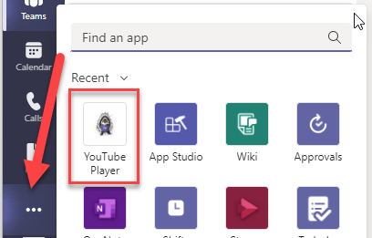

Select the app to navigate to the tab:

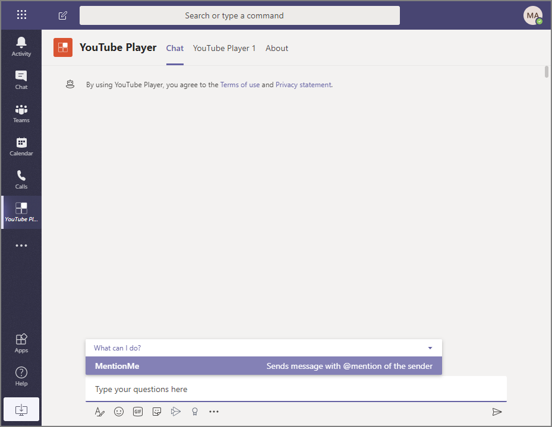

Notice there's a new **Chat** tab. Focus on the message box at the bottom of the user interface. Microsoft Teams is displaying the things this bot can do, including the **MentionMe** action. Let's try that out.

Enter `MentionMe` following in the message box and press <kbd>enter</kbd>.

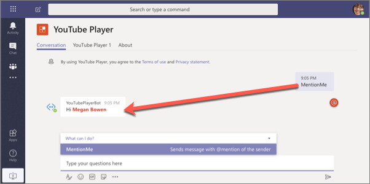

Next, enter some random text. Because the bot is looking for specific text, it will display the default message:


At this point, the bot is working. Move onto the next section to add task module support.

## Add the video player task module

> [!VIDEO https://www.microsoft.com/videoplayer/embed/RE4OAON]

In this section, you'll add a task module to the bot. First, let's update the Hero card to add a button the user can select.

In the bot file, **./src/server/learningTeamsBot/learningTeamsBot.ts**, locate the class constructor. Locate Hero card statement in the `switch` statement's `default` path in the `onMessage()` handler:

```typescript
const card = CardFactory.heroCard("Learn Microsoft Teams", undefined, [ ]);
```

Update this statement to add a new action to the card. The type of this action is special: `invoke`.

```typescript
const card = CardFactory.heroCard("Learn Microsoft Teams", undefined, [
  {
    type: "invoke",
    title: "Watch 'Task-oriented interactions in Microsoft Teams with messaging extensions'",
    value: { type: "task/fetch", taskModule: "player", videoId: "aHoRK8cr6Og" }
  }
]);
```

The project's **ngrok-serve** task will detect the code change, rebuild & restart the web server. After a moment, enter another random string in the **Conversations** tab for the bot and notice the new card:

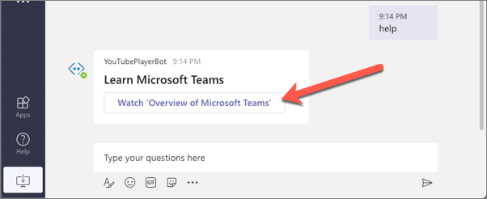

The bot framework is looking for messages of type `invoke` with their `value.type` property set to `task/fetch`. For each one it finds, it passes it into a handler `handleTeamsTaskModuleFetch()`. To handle what happens when you select the action, implement the method.

Add the following code to the `LearningTeamsBot` class:

```typescript
protected handleTeamsTaskModuleFetch(context: TurnContext, request: TaskModuleRequest): Promise<TaskModuleResponse> {
  let response: TaskModuleResponse;

  switch (request.data.taskModule) {
    case "player":
        response = ({
          task: {
            type: "continue",
            value: {
              title: "YouTube Player",
              url: `https://${process.env.PUBLIC_HOSTNAME}/youTubePlayer1Tab/player.html?vid=${request.data.videoId}`,
              width: 1000,
              height: 700
            } as TaskModuleTaskInfo
          }
        } as TaskModuleResponse);
        break;
      default:
        response = ({
          task: {
            type: "continue",
            value: {
              title: "YouTube Player",
              url: `https://${process.env.PUBLIC_HOSTNAME}/youTubePlayer1Tab/player.html?vid=X8krAMdGvCQ&default=1`,
              width: 1000,
              height: 700
            } as TaskModuleTaskInfo
          }
        } as TaskModuleResponse);
      break;
  };

  console.log("handleTeamsTaskModuleFetch() response", response);
  return Promise.resolve(response);
}
```

### Test the video player task module

After saving the page, let the project rebuild itself and restart the web server. Once that's happened, select the **Watch 'Task-oriented interactions in Microsoft Teams with messaging extensions'** button in the Hero card. Notice the task module from the previous exercise is displayed:

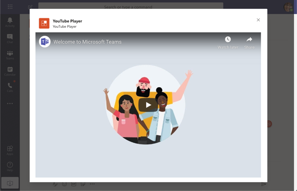

Create a few more buttons to the Hero card that reference different videos by duplicating the existing button. Make sure to create one that has the `value.taskModule` property set to something other than `player` so the handler takes the default path:

```typescript
const card = CardFactory.heroCard("Learn Microsoft Teams", undefined, [
  {
    type: "invoke",
    title: "Watch 'Task-oriented interactions in Microsoft Teams with messaging extensions'",
    value: { type: "task/fetch", taskModule: "player", videoId: "aHoRK8cr6Og" }
  },
  {
    type: "invoke",
    title: "Watch 'Microsoft Teams embedded web experiences'",
    value: { type: "task/fetch", taskModule: "player", videoId: "AQcdZYkFPCY" }
  },
  {
    type: "invoke",
    title: "Watch a invalid action...",
    value: { type: "task/fetch", taskModule: "something", videoId: "hello-world" }
  }
]);
```


The next step is to add a task module that submits data.

## Add the video selector Adaptive Card task module

In this section, you'll add an action to the Hero card that displays a task module using an Adaptive Card. This task module will submit data back to the bot that will use the value to display the specified video in the player task module.

In the bot file, **./src/server/learningTeamsBot/learningTeamsBot.ts**, locate the code in the `learningTeamsBot` class constructor that created the Hero card. Add another action to the end, but notice this action specifies a different `value.taskModule` property:

```typescript
{
  type: "invoke",
  title: "Watch Specific Video",
  value: { type: "task/fetch", taskModule: "selector", videoId: "QHPBw7F4OL4" }
}
```

You'll chain two task modules together. The first will display the Adaptive Card selector. Within the `handleTeamsTaskModuleFetch()` method, add the following `case` statement to the existing `switch` statement:

```typescript
case "selector":
  response = ({
    task: {
      type: "continue",
      value: {
        title: "YouTube Video Selector",
        card: this.getSelectorAdaptiveCard(request.data.videoId),
        width: 350,
        height: 250
      } as TaskModuleTaskInfo
    }
  } as TaskModuleResponse);
  break;
```

Add the following method to the `LearningTeamsBot` class. This will create an Adaptive Card with an input control. This is the programmatic way of creating the same adaptive card from a previous exercise.

```typescript
private getSelectorAdaptiveCard(defaultVideoId: string = "") {
  return CardFactory.adaptiveCard({
    type: "AdaptiveCard",
    version: "1.0",
    body: [
      {
        type: "Container",
        items: [
          {
            type: "TextBlock",
            text: "YouTube Video Selector",
            weight: "bolder",
            size: "extraLarge"
          }
        ]
      },
      {
        type: "Container",
        items: [
          {
            type: "TextBlock",
            text: "Enter the ID of a YouTube video to show in the task module player.",
            wrap: true
          },
          {
            type: "Input.Text",
            id: "youTubeVideoId",
            value: defaultVideoId
          }
        ]
      }
    ],
    actions: [
      {
        type: "Action.Submit",
        title: "Update"
      }
    ]
  });
}
```

Next, add the handler for the Adaptive Card handler method. Similar to the `task/fetch`, we need to handle a submit, or `task/submit`. Do this by adding the following method to the `LearningTeamsBot` class:

```typescript
protected handleTeamsTaskModuleSubmit(context: TurnContext, request: TaskModuleRequest): Promise<TaskModuleResponse> {
  const response: TaskModuleResponse = {
    task: {
      type: "continue",
      value: {
        title: "YouTube Player",
        url: `https://${process.env.PUBLIC_HOSTNAME}/youTubePlayer1Tab/player.html?vid=${request.data.youTubeVideoId}`,
        width: 1000,
        height: 700
      } as TaskModuleTaskInfo
    }
  } as TaskModuleResponse;
  return Promise.resolve(response);
}
```

This handler will fetch the submitted video ID from the Adaptive Card and use it to present the player task module.

### Test the video selector Adaptive Card task module

After saving your changes and giving the project a moment to rebuild and restart the webserver, enter another message into the bot **Conversation** tab:

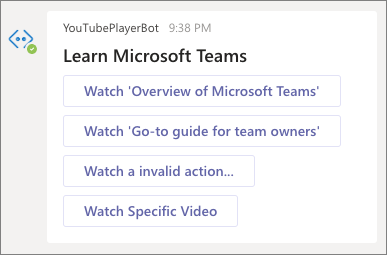

Select the **Watch Specific Video** button. When the Adaptive Card task module loads, either accept the default value or enter the ID of a video on YouTube.

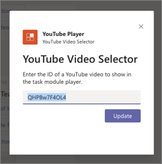

Select the **Update** button. Notice the Adaptive Card task module disappears and the player task module loads with the specified video.

Stop the local web server by pressing <kbd>CTRL</kbd>+<kbd>C</kbd> in the console to stop the running process.

## Summary

In this exercise, you learned how to use task modules with bots in Microsoft Teams. After creating and adding it to our existing Microsoft Teams app, then extend the bot to support the existing task modules to display a video and change the selected video.
