> [!VIDEO https://www.microsoft.com/videoplayer/embed/RE4OIwO]

In this exercise, you’ll learn how to create a project using the Yeoman Generator for Microsoft Teams and configure the custom Microsoft Teams app with single sign-on to submit requests to Microsoft Graph.

## Prerequisites

Developing Microsoft Teams apps requires a Microsoft 365 tenant, Microsoft Teams configured for development, and the necessary tools installed on your workstation.

For the Microsoft 365 tenant, follow the instructions on [Microsoft Teams: Prepare your Microsoft 365 tenant](/microsoftteams/platform/concepts/build-and-test/prepare-your-o365-tenant) for obtaining a developer tenant if you don't currently have a Microsoft 365 account. Make sure you've also enabled Microsoft Teams for your organization.

Microsoft Teams must be configured to enable custom apps and allow custom apps to be uploaded to your tenant to build custom apps for Microsoft Teams.

You'll use Node.js to create custom Microsoft Teams tabs in this module. The exercises in this module assume you have the following tools installed on your developer workstation.

> [!IMPORTANT]
> In most cases, installing the latest version of the following tools is the best option. The versions listed here were used when this module was published and last tested.

- [Node.js](https://nodejs.org/) - v12.\* (or higher)
- NPM (installed with Node.js) - v6.\* (or higher)
- [Visual Studio Code](https://code.visualstudio.com)
- [Yeoman](https://yeoman.io/) - v3.\* (or higher)
- [Yeoman Generator for Microsoft Teams](https://github.com/OfficeDev/generator-teams) - v3.0.3 (or higher)

You must have the minimum versions of these prerequisites installed on your workstation.

## Register an Azure AD application to support single sign-on (SSO)

Open a browser and navigate to the [Azure Active Directory admin center (https://aad.portal.azure.com)](https://aad.portal.azure.com). Sign in using a **Work or School Account** that has global administrator rights to the tenancy.

Select **Manage > App registrations** in the left-hand navigation and then select **New registration**.

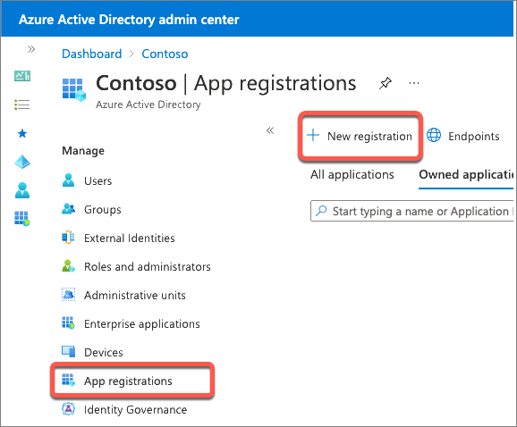

On the **Register an application** page, set the values as follows, and then select **Register**:

- **Name**: My Teams SSO App
- **Supported account types**: Accounts in any organizational directory (Any Azure AD directory - Multitenant)
- **Redirect URI**: Web & `https://REPLACE.ngrok.io`

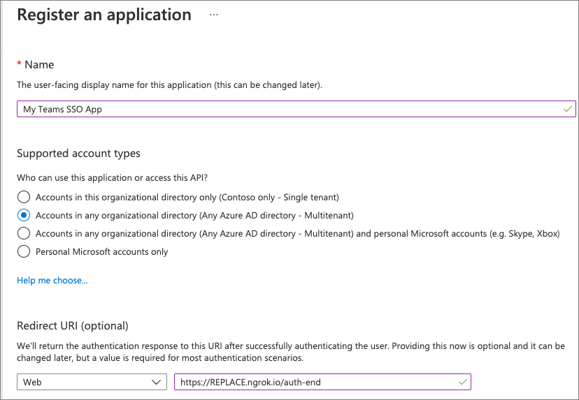

> [!NOTE]
> The **Redirect URL** will need to be updated once you know the dynamic subdomain of the proxy URL created by ngrok, a tool you'll use to simplify testing and debugging your Microsoft Teams app.
>
> In fact, you'll need to come back and update the Azure AD app registration in a few places where you'll enter the **REPLACE.ngrok.io** domain.
>
> For now, we'll just use this temporary domain.

On the **My Teams SSO App** page, copy the value of the **Application (client) ID**; you'll need this later when you create the Microsoft Teams app in a future exercise.

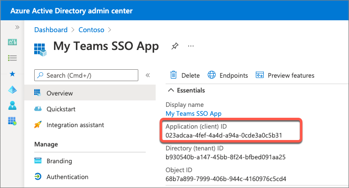

### Configure authentication

Next, configure the app's authentication settings. Select **Manage > Authentication** from the left-hand navigation.

In the **Implicit grant and hybrid flows** section, select both of the following options, and then select **Save** at the top of the screen:


### Create a client secret

For an app to authenticate with Azure AD, it needs both the client ID and a client secret.

Select **Manage > Certificates & secrets** from the left-hand navigation.

In the **Client Secrets** section, select **New client secret**. Add a description and select an expiration duration, then select **Add**.

When the secret is created, it will be shown one time so make sure you copy this for use in a later exercise. If you don't copy this value, you'll have to create a new secret as you can't ever view a previously created secret.

### Configure API permissions

Now configure the API permissions the app will need. Select **Manage > API permissions** from the left-hand navigation.

By default, the app has the **User.Read** permission. When Microsoft Teams requests an access token from Azure AD for the currently signed in user, it can only get basic permissions that identify who the user is. To enable this, you'll need to add the basic OpenID permissions.

- Select **Add a permission > Microsoft Graph > Delegated permissions**.
- Find and select the following permissions and then select **Add permissions** to add them to the app:
  - email
  - offline_access
  - openid
  - profile


Once you've added the permissions, select the **Grant admin consent for ...** to consent these permissions for all users in the tenant.


### Expose an API for the app

The next step is to configure the app's API for Microsoft Teams. Select **Manage > Expose an API** from the left-hand navigation.

On the **Expose an API** page, select the **Set** link next to the **Application ID URI**. This will default the app's ID to `api://<app-id>`. This needs to include the domain where the Microsoft Teams app will be hosted. Add `REPLACE.ngrok.io/` to the start of the address after the protocol and select **Save**

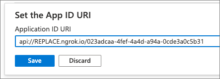

Next, select **Add a scope** to add a new permission for the app. Create a new scope using the following settings and then select **Add scope**:

- **Scope name:** access_as_user
- **Who can consent?** Admins and users
- **Admin consent title:** Teams can access the user’s profile.
- **Admin consent description:** Teams can call the app’s web APIs as the current user.
- **User consent title:** Teams can access the user profile and make requests on the user's behalf.
- **User consent description:** Teams can call this app’s APIs with the same rights as the user.
- **State**: Enabled


The last step is to preauthorize the Microsoft Teams clients that the app's API will trust. This means users won't be asked to consent to specific permissions, or scopes, exposed by the API.

Add the following client applications by selecting the **Add a client application** link. For each, select the **api://REPLACE.ngrok.io/<app-id>/access_as_user** scope you previously created:

- `1fec8e78-bce4-4aaf-ab1b-5451cc387264`
  - *Microsoft Teams mobile & desktop clients*
- `5e3ce6c0-2b1f-4285-8d4b-75ee78787346`
  - *Microsoft Teams web client*

## Create your Microsoft Teams app project

> [!VIDEO https://www.microsoft.com/videoplayer/embed/RE4ODbw]

Open your command prompt, navigate to a directory where you want to save your work, create a new folder **learn-msteams-teamwork**, and change directory into that folder.

Run the Yeoman Generator for Microsoft Teams by running the following command:

```console
yo teams
```

Yeoman will launch and ask you a series of questions. Answer the questions with the following values:

- **What is your solution name?**: learn-msteams-teamwork
- **Where do you want to place the files?**: Use the current folder
- **Title of your Microsoft Teams App project?**: MSGraph Playground
- **Your (company) name? (max 32 characters)**: Contoso
- **Which manifest version would you like to use?**: v1.8
- **Quick scaffolding**: Yes
- **What features do you want to add to your project?**: A Tab
- **The URL where you will host this solution?**: `https://REPLACE.ngrok.io`
- **Would you like to show a loading indicator when your app/tab loads?** No
- **Default Tab name? (max 16 characters)**: MSGraph Teamwork
- **What kind of Tab would you like to create?**: Configurable
- **What scopes do you intend to use for your Tab?**: In a Team
- **Do you require Azure AD Single-Sign-On support for the tab?** Yes
- **What is the Application ID to associate with the SSO Tab?**: *Enter the **Application (Client) ID** for the Azure AD application you registered above*
- **What is the Application ID URI to associate with the SSO Tab?**: *Enter the **Application ID URI** for the Azure AD application you registered above*

> [!NOTE]
> Most of the answers to these questions can be changed after creating the project. For example, the URL where the project will be hosted and Application ID URI must be changed when you start debugging your project using the ngrok utility.

After answering the generator's questions, the generator will create the scaffolding for the project and then execute `npm install` that downloads all the dependencies required by the project.

### Build and test the application

Before customizing the tab, let's test the tab to see the initial developer experience for testing.

From the command line, navigate to the root folder for the project and execute the following command:

```console
gulp ngrok-serve
```

This gulp task will run many other tasks all displayed within the command-line console. The **ngrok-serve** task builds your project and starts a local web server (http://localhost:3007). It then starts ngrok with a random subdomain that creates a secure URL to your local webserver.

> [!NOTE]
> Microsoft Teams requires all content displayed within a tab be loaded from an HTTPS request. In development, can be done using the tool [ngrok](https://www.ngrok.com) that creates a secure rotatable URL to your local HTTP webserver. Ngrok is included as a dependency within the project so there is nothing to setup or configure.

> [!IMPORTANT]
> Each time ngrok starts, it generates a new dynamic subdomain for the URL. If you have to restart ngrok, you will need to repackage and and update the app in Microsoft Teams to make the installed app aware of the new URL. The optional licensed version of ngrok allows you to define and reuse the same subdomain.

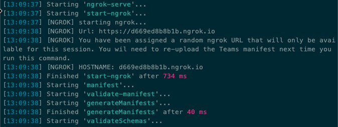

Before testing the Microsoft Teams app, you need to update all locations where you entered the URL `REPLACE.ngrok.io` in both your project and the Azure AD app you registered. For example:

- **Visual Studio Code project**
  - Locate and open the **./.env** file
  - Find & replace all instances of `REPLACe.ngrok.io`
- **Azure AD Application > Authentication > Redirect URIs**
- **Azure AD Application > Expose an API > Application ID URI**

In the browser, navigate to **https://teams.microsoft.com** and sign in with the credentials of a Work and School account.

Select a team that you want to install and test your custom teams app in and then select the team's **General** channel.

Next, select the plus icon to the right of the existing tabs to add a new tab:

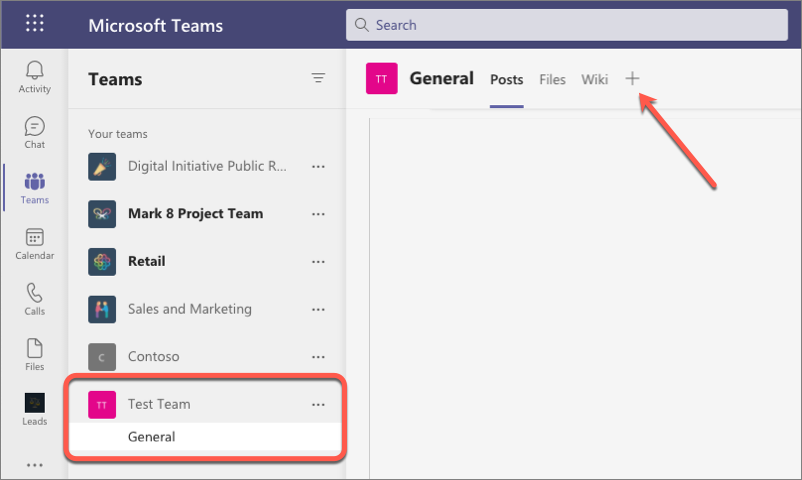

The app containing our new tab isn't installed yet, so in the **Add a tab** dialog, select **Manage apps** in the lower-right corner.

On the next screen, select the **Upload a custom app** link in the lower right corner of the screen below the list of existing installed apps.

Locate and select the Microsoft Teams app package, found in the **./package** folder in your Visual Studio Code project to upload the app.

Microsoft Teams will display the details of the app in a dialog. Select the **Add** button to install the app into the current team:

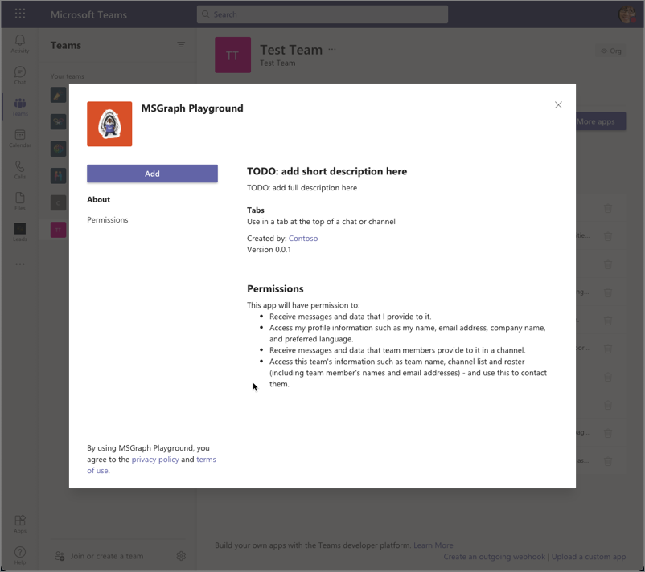

After installing the app, select the team's **General** channel, and then the plus icon to the right of the existing tabs in the channel. When prompted to select the tab, select the **MSGraph Playground**:

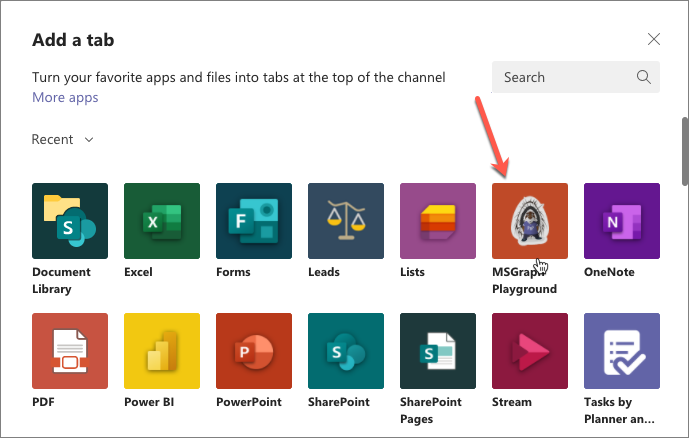

When you select the tab to add to the channel, Microsoft Teams will present the tab's configuration screen. Enter anything into the provided input box and select **Save** to add the tab.

When the tab loads, it will initiate the SSO process with Azure AD and obtain an ID token. This token contains the basic identification information about the current user. The current user's display name is included in this token and is displayed in the tab:

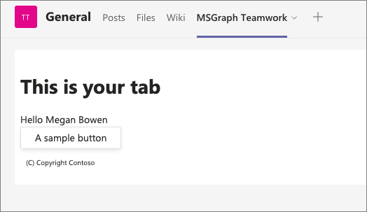

### Explore the code

Let's explore how this works. Within the Visual Studio Code project, locate and open the tab's code file: **./src/client/msGraphTeamworkTab/MsGraphTeamworkTab.tsx**

The tab is implemented as a React app with React Hooks. Locate the following `useEffect()` hook:

> [!NOTE]
> Some code in the following snippet has been omitted for brevity.

```tsx
useEffect(() => {
  if (inTeams === true) {
    microsoftTeams.authentication.getAuthToken({
      successCallback: (token: string) => {
        const decoded: { [key: string]: any; } = jwtDecode(token) as { [key: string]: any; };
        setName(decoded!.name);
        microsoftTeams.appInitialization.notifySuccess();
      },
      failureCallback: (message: string) => { /* ... */ },
      resources: [process.env.MSGRAPHTEAMWORK_APP_URI as string]
    });
  } else {
    setEntityId("Not in Microsoft Teams");
  }
}, [inTeams]);
```

This hook will run when the component loads. If the page is loaded in a Microsoft Teams client, as it is when it's in a tab, it calls the `getAuthToken()` method on the Microsoft Teams JavaScript SDK. When successful, it extracts the ID token Microsoft Teams received from Azure AD and provided to the tab to retrieve the currently signed in user's display name. The user's name is then set, using the `setName()` method, to the React state `name` property.

Changing the state triggers React to rerender the component. The code in the `return` statement within the React component will render the updated user experience that includes the user's name from the React state property as shown in the following code.

> [!NOTE]
> Some code in the following snippet has been omitted for brevity.

```tsx
return (
  <Provider theme={theme}>
    <Flex fill={true} column>
      <Flex.Item>
        <div>
          <div>
            <Text content={`Hello ${name}`} />
          </div>
        </div>
      </Flex.Item>
    </Flex>
  </Provider>
);
```

At this point, the tab is successfully using Microsoft Teams' support for SSO, but it's limited to using the ID token.

## Add support to submit requests to Microsoft Graph

> [!VIDEO https://www.microsoft.com/videoplayer/embed/RE4OIwN]

In this section, we'll update the Microsoft Teams app to add support for submitting requests to Microsoft Graph building off the SSO support currently in place.

When submitting requests to Microsoft Graph, you must include an OAuth access token in the header of each request. This is not the same ID token Microsoft Teams received previously as part of the SSO support, but that same ID token can be used to obtain an access token for use with Microsoft Graph.

This is done by implementing the [OAuth2 On-Behalf-Of (OBO) flow](/azure/active-directory/develop/v2-oauth2-on-behalf-of-flow), but this can't be done client-side, rather it must be done server-side.

### Update the Azure AD app credentials and permissions

Before implementing the server-side logic, we need to make a few changes to the Azure AD application previously registered.

Open a browser and navigate to the [Azure Active Directory admin center (https://aad.portal.azure.com)](https://aad.portal.azure.com). Sign in using a **Work or School Account** that has global administrator rights to the tenancy.

#### Create a client secret

For an app to authenticate with Azure AD, it needs both the client ID and a client secret.

Select **Manage > Certificates & secrets** from the left-hand navigation.

In the **Client Secrets** section, select **New client secret**. Add a description and select an expiration duration, then select **Add**.

When the secret is created, it will be shown one time so make sure you make a copy of it. If you don't copy this value, you'll have to create a new secret as you can't ever view a previously created secret.

#### Configure API permissions

Now configure the API permissions the app will need. Select **Manage > API permissions** from the left-hand navigation.

By default, the app has the **User.Read** permission. When Microsoft Teams requests an access token from Azure AD for the currently signed in user, it can only get basic permissions that identify who the user is. To enable this, you'll need to add the basic OpenID permissions.

- Select **Add a permission > Microsoft Graph > Delegated permissions**.
- Find and select the following permissions and then select **Add permissions** to add them to the app:
  - email
  - offline_access
  - openid
  - profile

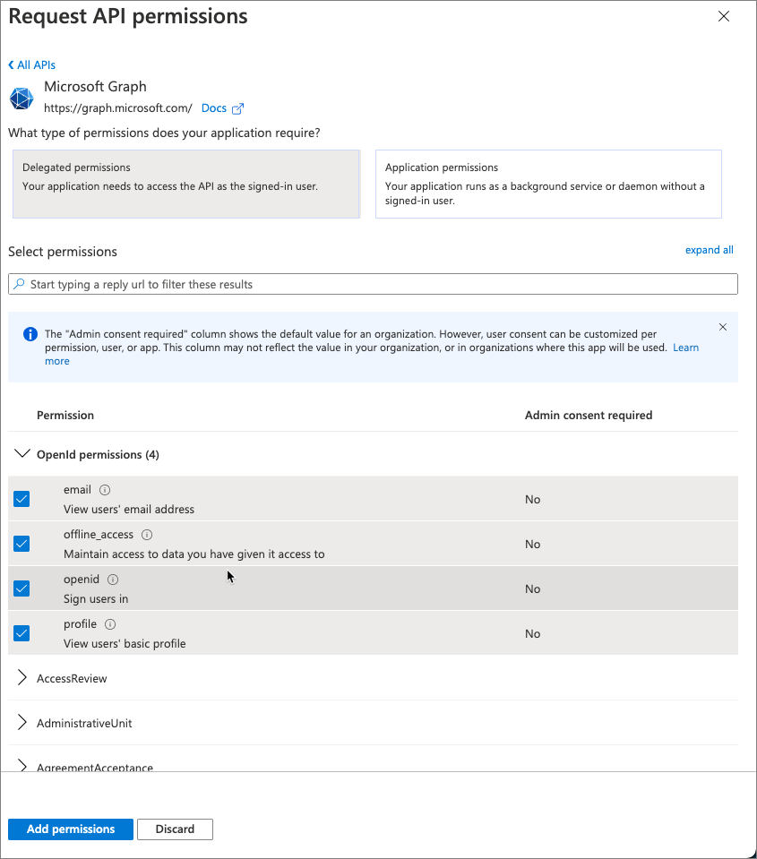

Once you've added the permissions, select the **Grant admin consent for ...** to consent these permissions for all users in the tenant.


### Update project to obtain access tokens for Microsoft Graph via the OAuth2 OBO flow

Now that the Azure AD application is updated, let's apply those changes to the app project.

In your Microsoft Teams app project, locate and open the **./.env** file. At the end of the file, there are two environment variables that were set by the Yeoman generator when you created the project. Their names are based on the name of the project:

```text
MSGRAPHTEAMWORK_APP_ID=...
MSGRAPHTEAMWORK_APP_URI=...
```
Add the following two properties after these two existing properties. Set the first to the Azure AD app's client secret you created, and the second to the permissions defined by the app, separated by spaces:

```text
MSGRAPHTEAMWORK_APP_SECRET=1ZAI.Qm-g3_bQCSh31WO~81bX-z1_4gK~K
MSGRAPHTEAMWORK_APP_SCOPES=https://graph.microsoft.com/User.Read email openid profile offline_access
```

The next step is to update the server-side API to add support for using the ID token, obtained by Microsoft Teams, for an OBO access token that can be used to submit requests to Microsoft Graph.

First, install a new dependencies into the project. This is used to submit an HTTP request (*Axios*):

```console
npm install axios -SE
```

Next, locate, and open the **./src/server/server.ts** file.

Add the following two `import` statements after the existing `import` statements:

```typescript
import jwtDecode from "jwt-decode";
import Axios, { AxiosResponse } from "axios";
```

Now, add a route that takes the SSO ID token from the request and submits a request to Azure AD using the OAuth OBO flow to exchange it for an OAuth access token that can be used to authenticate requests to Microsoft Graph.

Locate the following lines near the end of the **server.ts** file:

```typescript
// Set the port
express.set("port", port);
```

Add the following code before the lines you just found that set the listening port on the solution. The comments within the code explain the relevant parts

```typescript
express.get("/exchangeSsoTokenForOboToken", async (req, res) => {
  log("getting access token for Microsoft Graph...");

  const clientId = process.env.MSGRAPHTEAMWORK_APP_ID as string;
  const clientSecret = process.env.MSGRAPHTEAMWORK_APP_SECRET as string;
  const ssoToken = req.query.ssoToken as string;

  // build Azure AD OAuth2 token endpoint
  const aadTokenEndpoint = `https://login.microsoftonline.com/${jwtDecode<any>(ssoToken).tid}/oauth2/v2.0/token`;

  // build body of request to obtain an access token using the OAuth2 OBO flow
  const oAuthOBOParams = {
    grant_type: "urn:ietf:params:oauth:grant-type:jwt-bearer",
    client_id: clientId,
    client_secret: clientSecret,
    assertion: ssoToken,
    requested_token_use: "on_behalf_of",
    scope: process.env.MSGRAPHTEAMWORK_APP_SCOPES
  };

  // convert params to URL encoded form body payload
  const oAuthOboRequest = Object.keys(oAuthOBOParams)
    .map((key, index) => `${key}=${encodeURIComponent(oAuthOBOParams[key])}`)
    .join("&");

  const HEADERS = {
    accept: "application/json",
    "content-type": "application/x-www-form-urlencoded"
  };

  try {
    // submit request
    const response = await Axios.post(aadTokenEndpoint, oAuthOboRequest, { headers: HEADERS });

    // check response
    if (response.status === 200) {
      // on successful response, return full object to client
      res.status(200).send(response.data);
    } else {
      // else on non-success...
      if ((response.data.error === "invalid_grant") || (response.data.error === "interaction_required")) {
        // if consent required... reply with 403: Forbidden
        res.status(403).json({ error: "consent_required" });
      } else {
        // else, some other error occurred... fail
        res.status(500).json({ error: "Could not exchange access token" });
      }
    }
  } catch (error) {
    // for all others, fail
    res.status(400).json({ error: `Unknown error: ${error}` });
  }
});
```

### Update the SSO tab to display the user's profile photo

> [!VIDEO https://www.microsoft.com/videoplayer/embed/RE4OAOP]

With the server-side API updated, we can now update the SSO tab to request and display the current user's profile photo. To do this, the tab will first exchange the ID token obtained by Microsoft Teams and it's SSO support for an access token that can be used to authenticate requests for Microsoft Graph.

Locate and open the file **./src/client/msGraphTeamworkTab/MsGraphTeamworkTab.tsx**.

Locate the `import` statement for the `@fluentui/react-northstar` package and add the `Avatar` to the list of objects imported:

```typescript
import { Provider, Flex, Text, Button, Header, Avatar } from "@fluentui/react-northstar";
```

Next, locate the `import` statement for the `react` package and add the `useCallback` hook to the list of imports:

```typescript
import { useState, useEffect, useCallback } from "react";
```

This file contains a single functional component exported to the caller. Near the top of this component's declaration, locate a collection of `const` declarations that configure the initial state of the React component.

Add the following to add a few more properties to the component's state. These will be used to store the ID token, access token, and user's profile photo.

```typescript
const [ssoToken, setSsoToken] = useState<string>();
const [msGraphOboToken, setMsGraphOboToken] = useState<string>();
const [photo, setPhoto] = useState<string>();
```

Now locate the `useEffect()` hook (*the first one in the file*) that the tab is using to obtain the ID token from Microsoft Teams. When the request to authenticate with the Microsoft Teams SDK is successful, it parses the returned ID token to obtain the signed in user's name and sets it to the component's state property `name`. This triggers React to re-render the component and display the user's name.

Let's update this to save the ID token to the component's `ssoToken` state property. Locate the following line in the success callback:

```typescript
microsoftTeams.appInitialization.notifySuccess();
```

Add the following line immediately before the `notifySuccess()` call:

```typescript
setSsoToken(token);
```

In order to submit requests to Microsoft Graph, it needs to exchange this SSO obtained ID token for an access token. This is an asynchronous request to the server-side API endpoint you previously implemented. Add the following `useCallback()` hook to implement token exchange request:

```typescript
const exchangeSsoTokenForOboToken = useCallback(async () => {
  const response = await fetch(`/exchangeSsoTokenForOboToken/?ssoToken=${ssoToken}`);
  const responsePayload = await response.json();
  if (response.ok) {
    setMsGraphOboToken(responsePayload.access_token);
  } else {
    if (responsePayload!.error === "consent_required") {
      setError("consent_required");
    } else {
      setError("unknown SSO error");
    }
  }
}, [ssoToken]);
```

To initiate this process, add another `useEffect()` hook that's triggered when the `ssoToken` state property is updated by the call to `setSsoToken()` we previously added:

```typescript
useEffect(() => {
  // if the SSO token is defined...
  if (ssoToken && ssoToken.length > 0) {
    exchangeSsoTokenForOboToken();
  }
}, [exchangeSsoTokenForOboToken, ssoToken]);
```

At this point, the tab has an access token that will authenticate requests to Microsoft Graph, so the next step is to request the current user's profile photo and display it.

Start by adding another `useCallback()` hook to implement the Microsoft Graph request for the user's profile photo. Add the following code to the component, just after the `useEffect()` hook you just added:

```typescript
const getProfilePhoto = useCallback(async () => {
  if (!msGraphOboToken) { return; }
  const endpoint = "https://graph.microsoft.com/v1.0/me/photo/$value";
  const requestObject = {
    method: "GET",
    headers: {
      accept: "image/jpg",
      authorization: `bearer ${msGraphOboToken}`
    }
  };
  const response = await fetch(endpoint, requestObject);
  if (response.ok) {
    setPhoto(URL.createObjectURL(await response.blob()));
  }
}, [msGraphOboToken]);
```

This code will set the profile photo, once received from the request to Microsoft Graph, on the React component's `photo` state property. Instruct the React component to initiate this hook when the access token is received by adding the following react hook:

```typescript
useEffect(() => {
  getProfilePhoto();
}, [msGraphOboToken]);
```

Now that our component has the photo, the last step is to display it! Within the component's `return` statement, locate the following code that displays the current user's name:

```tsx
<div>
  <Text content={`Hello ${name}`} />
</div>
```

Immediately following the closing `</div>` element, add the following code that will render the `<Avatar>` control if the `photo` state property has been set:

```tsx
{photo && <div><Avatar image={photo} size='largest' /></div>}
```

### Test the application

Go back to the browser and navigate back to the tab you added earlier in this exercise. Notice it's now displaying the current user's profile photo:

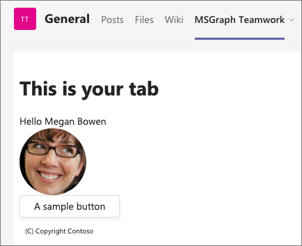

> [!IMPORTANT]
> If the **ngrok-serve** stopped for any reason, remember when you start/restart the **gulp ngrok-serve** task, the dynamic ngrok URL will change.
>
> You'll need to update all the locations where you set the URL in your project as well as in the Azure AD app registration as previously explained.
>
> In addition, you'll need to reinstall your app package because the Microsoft Teams app manifest contains the URL. To do this, you'll first need to increment the `version` property in the app's **./manifest/manifest.json** file. This value is dynamically set using the `version` property from the **./package.json** file. When you repeat the installation process of the app, it will update the existing installation.

With everything working, let's update the tab and Azure AD application to display a list of all teams the current user as joined.

## Display the teams the current user has joined

> [!VIDEO https://www.microsoft.com/videoplayer/embed/RE4OAOQ]

In this step, you'll update the project to use a different Microsoft Graph endpoint to display a list of all teams the current user has joined.

### Add the Team.ReadBasic.All permission to the Azure AD application

Before you do this, your Azure AD application registration needs a new permission to call this endpoint.

Open a browser and navigate to the [Azure Active Directory admin center (https://aad.portal.azure.com)](https://aad.portal.azure.com). Sign in using a **Work or School Account** that has global administrator rights to the tenancy.

Select **Azure Active Directory** in the left-hand navigation.

Select **Manage > App registrations** in the left-hand navigation.

On the **App registrations** page, select the app **My Teams SSO App**.

In the left-hand navigation, select **Manage > API permissions**.

Select **Add a permission**, then select **Microsoft Graph > Delegated permissions**.

Search for, and select the permission **Team.ReadBasic.All**, then select the **Add permissions** button:


To simplify the testing process, select **Grant admin consent for Contoso** to consent this new permission for all users in your tenant.

### Update the list of permissions requested by the tab

With the permission added to the Azure AD app, you now need to update the list of permissions the server-side API will include in the request for the access token.

Locate and open the **./.env**. At the end of the file, locate the environment variable that contains the space-delimited permissions and add the following permission you just added so it now looks like the following:

```txt
MSGRAPHTEAMWORK_APP_SCOPES=https://graph.microsoft.com/User.Read https://graph.microsoft.com/Team.ReadBasic.All email openid profile offline_access
```

In order for this to get picked up and included in the environment variables, you'll need to stop the **gulp ngrok-serve** task by pressing <kbd>CTRL</kbd>+<kbd>C</kbd> and restart it.

> [!IMPORTANT]
> When you restart ngrok, remember the dynamic subdomain will change. Therefore, you'll need to not only update all the places where you've entered the ngrok URL in your project and registered Azure AD app, but also reinstall the Microsoft Teams app package as well.

Locate and open the file **./src/client/msGraphTeamworkTab/MsGraphTeamworkTab.tsx**.

Locate the `import` statement for the `@fluentui/react-northstar` package and add the `List` to the list of objects imported:

```typescript
import { Provider, Flex, Text, Button, Header, Avatar, List } from "@fluentui/react-northstar";
```

Locate the collection of `const` declarations you previously added in this exercise. Add the following to add one more property to the component's state. This will be used to store the collection of teams the user has joined:

```typescript
const [joinedTeams, setJoinedTeams] = useState<any[]>();
```

Next, add the following `useCallback()` hook that will be used to submit a request to Microsoft Graph for all the teams the current user has joined:

```typescript
const getJoinedTeams = useCallback(async () => {
  if (!msGraphOboToken) { return; }
  const endpoint = "https://graph.microsoft.com/v1.0/me/joinedTeams";
  const requestObject = {
    method: "GET",
    headers: {
      accept: "application/json",
      authorization: `bearer ${msGraphOboToken}`
    }
  };
  const response = await fetch(endpoint, requestObject);
  const responsePayload = await response.json();
  if (response.ok) {
    const listFriendlyJoinedTeams = responsePayload.value.map((team: any) => ({
      key: team.id,
      header: team.displayName,
      content: `Team ID: ${team.id}`
    }));
    setJoinedTeams(listFriendlyJoinedTeams);
  }
}, [msGraphOboToken]);
```

We want to get the list of teams the user is a member of once we have an access token that can be used to authenticate with Microsoft Graph. Because we've already added that code, we just need to update the `useEffect()` hook that runs when the `msGraphOboToken` state property is updated.

Locate the existing `useEffect()` hook:

```typescript
useEffect(() => {
  getProfilePhoto();
}, [msGraphOboToken]);
```

Update this code to include another call to the `getJoinTeams` you just added to the component:

```typescript
useEffect(() => {
  getJoinedTeams();
  getProfilePhoto();
}, [msGraphOboToken]);
```

The last step is to update the rendering in the component's `return` statement to include the list of teams if they've been set. Locate the code you added to display the profile photo and add the following code immediately after it:

```tsx
{joinedTeams && <div><h3>You belong to the following teams:</h3><List items={joinedTeams} /></div>}
```

### Test the application

Go back to the browser and navigate back to the tab you added earlier in this exercise. Notice it's now displaying the current user's profile photo:

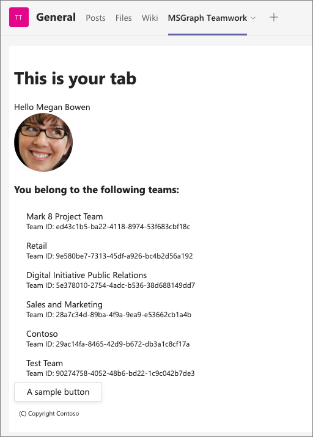

You can now stop the web project and web API projects in their respective consoles by pressing <kbd>CTRL</kbd>+<kbd>C</kbd> in each one. However, you can leave the ngrok process running so the dynamic subdomain won't change for future exercises in this module.
