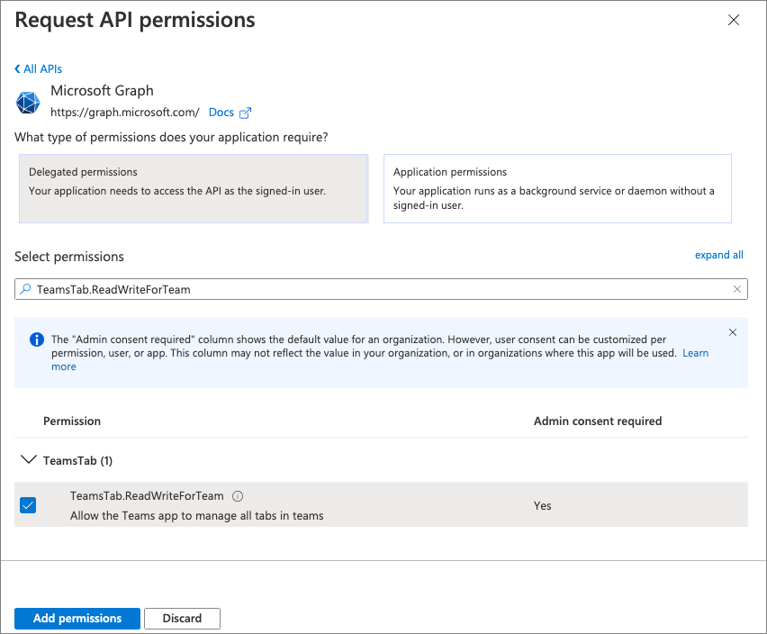
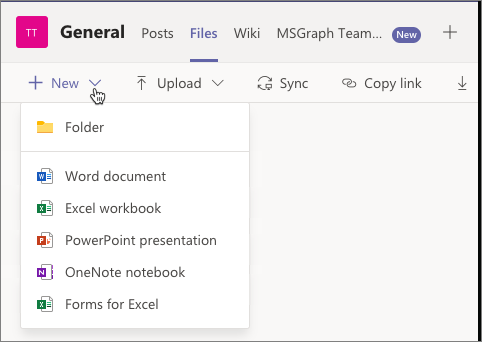
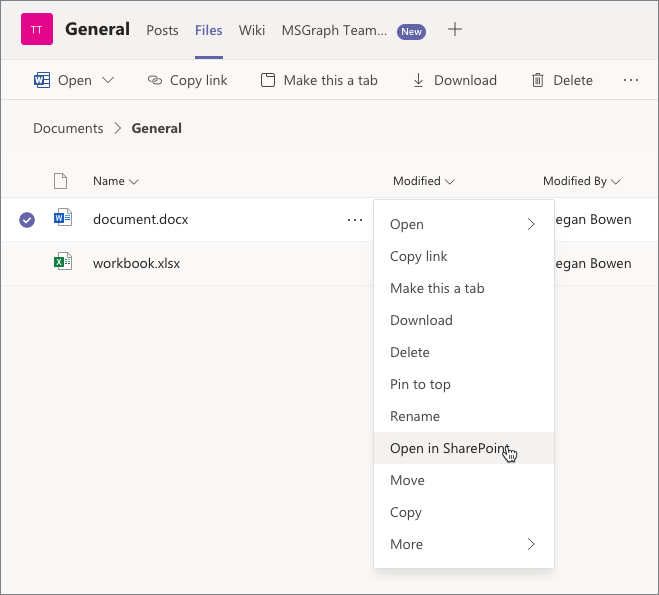
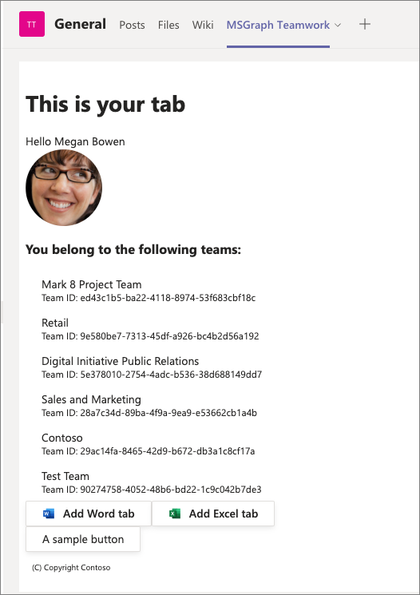

In this exercise, you'll add a few built-in tabs to a channel in a Microsoft Teams team with the Microsoft Graph's teamwork endpoint.

> [!IMPORTANT]
> This exercise assumes you have created the Microsoft Teams app project from the previous exercise in this module. You'll update the project to add buttons ot the tab that add new pre-configured tabs to the current channel.

## Add the TeamsTab.ReadWriteForTeam permission to the Azure AD application

The Microsoft Graph teamwork endpoint supports modifying the tabs in an existing channel. The user that executes the code that calls the tabs endpoint must consent to one of the **TeamsTab.\*** permissions. In this exercise, you'll create tabs using this endpoint, so you need to consent to the permission that enables reading and writing tabs: **TeamsTab.ReadWriteForTeam**.

Let's start by adding and pre-consenting this permission for our existing Azure AD application.

Open a browser and navigate to the [Azure Active Directory admin center (https://aad.portal.azure.com)](https://aad.portal.azure.com). Sign in using a **Work or School Account** that has global administrator rights to the tenancy.

Select **Azure Active Directory** in the left-hand navigation.

Select **Manage > App registrations** in the left-hand navigation.

On the **App registrations** page, select the app **Toolkit SSO: MSGraph Playground**. This is the name of the app you entered when creating the project with the toolkit, prefixed with **Toolkit SSO:**.

In the left-hand navigation, select **Manage > API permissions**.

Select **Add a permission**, then select **Microsoft Graph > Delegated permissions**.

Search for, and select the permission **TeamsTab.ReadWriteForTeam**, then select the **Add permissions** button:



To simplify the testing process, select **Grant admin consent for Contoso** to consent this new permission for all users in your tenant.

## Add documents to the channel

Before adding the tabs that will load the Word and Excel files, you need a Word document and Excel workbook first!

In the browser, navigate back the channel where you installed the team in the previous exercise. Select the **Files** tab and then use the **New** button to add a new Word and Excel file to the library:



Keep track of the names of these files. For the purposes of this exercise, we'll assume they're called **document.docx** and **workbook.docx**.

### Get document IDs and URLs

When creating a new tab as one of the Office built-in tabs, you'll need to know two important things about each of the files you want to display in the tabs:

- document ID
- document URL

Both of these values can be retrieved via the Microsoft Graph API, but you can also get them from the URL. Select one of the files, such as **document.docx**, in the **Files** tab and select **Open in SharePoint**.



This file is located in the **Documents** library that's named **Shared Documents** inside SharePoint. Its also located in the **General** subfolder within the library that matches the name of the Microsoft Teams channel you were just in. Look at the URL of the **General** folder in the **Documents library**... it should look similar to the following:

```text
https://m365x285179.sharepoint.com/sites/TestTeam/Shared%20Documents/Forms/AllItems.aspx
    ?RootFolder=%2Fsites%2FTestTeam%2FShared%20Documents%2FGeneral
    &FolderCTID=0x012000A794675CEBE1A542BFB9E3500689BAEE
```

> [!NOTE]
> Line breaks have been added for readability.

From this, you get the URL of the document library: `https://m365x285179.sharepoint.com/sites/TestTeam/Shared%20Documents`. From this, you can also see the folder is **General**, so the URL to this folder is: `https://m365x285179.sharepoint.com/sites/TestTeam/Shared%20Documents`.

Now, select the Word document to load it in the Microsoft Office Word web client. If you look at the URL in the browser's address bar, it should look similar to the following:

```text
https://m365x285179.sharepoint.com/:w:/r/sites/TestTeam/_layouts/15/Doc.aspx
    ?sourcedoc=%7B5E12B0DE-AD44-43D3-BD00-53C9BDD5609D%7D
    &file=document.docx
    &action=default
    &mobileredirect=true
```

> [!NOTE]
> Line breaks have been added for readability.

From this, you can get the ID of the document from the `sourcedoc` URL parameter. In this case that's `5E12B0DE-AD44-43D3-BD00-53C9BDD5609D` after you remove the escaped `{` and `}` characters (*respectively: `%7B` and `%7D`*).

Now you have what you need to create the Word tab:

- **document ID:** `5E12B0DE-AD44-43D3-BD00-53C9BDD5609D`
- **document URL:** `https://m365x285179.sharepoint.com/sites/TestTeam/Shared%20Documents/document.docx`

Repeat this process to get the same values for the Excel file.

## Update the tab to add a Word tab

Now, let's update the project's existing tab. This button will create a new tab that will load a Microsoft Word document from the team in the tab.

In Visual Studio Code, locate and open the **./src/components/tab.tsx** file.

At the top of the file, update the `import` statement for the **@fluentui/react-northstar** package to import a **Button** control in addition to the other controls:

```typescript
import { Avatar, Loader, List, Button } from '@fluentui/react-northstar'
```

Next, add the following code immediately after the existing `import` statements to import the icons for Word and Excel:

```typescript
import { WordIcon, ExcelIcon } from "@fluentui/react-icons-northstar";
```

Next, let's add two event handlers. These will get executed when the user selects a button that you'll add to the user interface of the tab in a moment. Each one submits a request to Microsoft Graph's **tab** endpoint to create a new tab.

Notice each one uses a specific `teamsApp@odata.bind` string for each tab type.

Also notice how each one's `configuration` property sets the file's document ID to the `entityId` property of the tab, and the `contentUrl` property is set to the document's fully qualified URL.

Locate the `render()` method and add the following code immediately before it:

```typescript
_handleWordOnClick = async () => {
  let endpoint = `https://graph.microsoft.com/v1.0/teams/${this.state.context?.groupId}/channels/${this.state.context?.channelId}/tabs`;
  let graphRequestParams = {
    method: 'POST',
    headers: {
      'Content-Type': 'application/json',
      "authorization": "bearer " + this.state.graphAccessToken
    },
    body: JSON.stringify({
      "displayName": "Word",
      "teamsApp@odata.bind" : "https://graph.microsoft.com/v1.0/appCatalogs/teamsApps/com.microsoft.teamspace.tab.file.staticviewer.word",
      "configuration": {
          "entityId": "CA2E9D19-3FE7-4E60-82DF-F73BD3B8D302",
          "contentUrl": "https://m365x285179.sharepoint.com/sites/TestTeam/Shared Documents/General/sample.docx",
          "removeUrl": null,
          "websiteUrl": null
      }
    })
  };

  // submit request to Microsoft Graph
  let response = await fetch(endpoint, graphRequestParams).catch(this.unhandledFetchError);

  if (response) {
    if(!response.ok){
      console.error("ERROR: ", response);
      this.setState({error:true});
    }
  }
}

_handleExcelOnClick = async () => {
  let endpoint = `https://graph.microsoft.com/v1.0/teams/${this.state.context?.groupId}/channels/${this.state.context?.channelId}/tabs`;
  let graphRequestParams = {
    method: 'POST',
    headers: {
      'Content-Type': 'application/json',
      "authorization": "bearer " + this.state.graphAccessToken
    },
    body: JSON.stringify({
      "displayName": "Excel",
      "teamsApp@odata.bind" : "https://graph.microsoft.com/v1.0/appCatalogs/teamsApps/com.microsoft.teamspace.tab.file.staticviewer.excel",
      "configuration": {
          "entityId": "2A451F2C-5BC0-4EEF-B986-671705798A54",
          "contentUrl": "https://m365x285179.sharepoint.com/sites/TestTeam/Shared Documents/General/Book.xlsx",
          "removeUrl": null,
          "websiteUrl": null
      }
    })
  };

  // submit request to Microsoft Graph
  let response = await fetch(endpoint, graphRequestParams).catch(this.unhandledFetchError);

  if (response) {
    if(!response.ok){
      console.error("ERROR: ", response);
      this.setState({error:true});
    }
  }
}
```

Now add the buttons to the user interface that will execute these methods. Locate the following line in the `render()` method:

```tsx
<List items={joinedTeams} />
```

Add the following lines to add two buttons after the list of teams the current user has joined:

```tsx
<Button icon={<WordIcon />} content="Add Word tab" onClick={this._handleWordOnClick} />
<Button icon={<ExcelIcon />} content="Add Excel tab" onClick={this._handleExcelOnClick} />
```

Finally, save all your edits to the **tab.tsx** file.

## Build and test the application

To test the application, you must do the following:

1. Start the web API project
1. Start the React web app project

> [!TIP]
> The following steps assume ngrok is still running from a previous exercise. If not, make sure you start ngrok following the same process outlined above. The ngrok URL points to the React web app project.
>
> Remember, if you restart the ngrok process, the dynamic subdomain will change and you'll need to make the appropriate updates in the registered Azure AD application, custom Microsoft Teams app, environment variables in the web API project, and  environment variables in the React web app project.

### Start the web API project

Open a new console, change to current folder to the **./api-server** folder in the project and execute the following command to start the web API project:

```console
npm start
```

You'll know it's working when returns the following in the console:

```console
API server is listening on port 5000
```

> [!TIP]
> If you need to stop either processes in the future, press <kbd>CTRL</kbd>+<kbd>C</kbd> in the console.

### Start the React web app project

Open a new console, change to current folder to the **./** folder in the project and execute the following command to start the React web app project:

```console
npm start
```

You'll know it's working when returns the following in the console:

```console
Compiled successfully!

You can now view microsoft-teams-app in the browser.

  Local:            https://localhost:3000
  On Your Network:  https://###.###.###.###:3000

Note that the development build is not optimized.
To create a production build, use npm run build.
```

Once the app starts, go back to the browser and navigate back to your tab that you previously installed. You'll now see the two buttons appear below the list of joined teams:



Select each of the two tabs and wait a few seconds. After a few seconds, you should see two new tabs appear in the channel:


Select each of the tabs to see them load the specified Office file in each one respectively.
