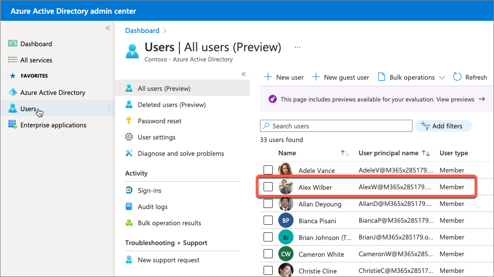
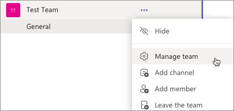
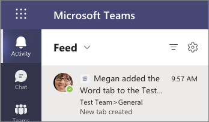

In this exercise, you'll learn how to use Microsoft Graph to submit notifications to the Microsoft Teams activity feed.

> [!IMPORTANT]
> This exercise assumes you have created the Microsoft Teams app project from the previous exercises in this module. You'll update the project to add code to notify a user when a new tab is added to the channel.

## Add the TeamsActivity.Send permission to the Azure AD application

The Microsoft Graph teamwork endpoint supports modifying the tabs in an existing channel. The user that executes the code that calls the tabs endpoint must consent to one of the **TeamsActivity.\*** permissions. In this exercise, you'll create tabs using this endpoint, so you need to consent to the permission that enables reading and writing tabs: **TeamsActivity.Send**.

Let's start by adding and pre-consenting this permission for our existing Azure AD application.

Open a browser and navigate to the [Azure Active Directory admin center (https://aad.portal.azure.com)](https://aad.portal.azure.com). Sign in using a **Work or School Account** that has global administrator rights to the tenancy.

Select **Azure Active Directory** in the left-hand navigation.

Select **Manage > App registrations** in the left-hand navigation.

On the **App registrations** page, select the app **Toolkit SSO: MSGraph Playground**. This is the name of the app you entered when creating the project with the toolkit, prefixed with **Toolkit SSO:**.

In the left-hand navigation, select **Manage > API permissions**.

Select **Add a permission**, then select **Microsoft Graph > Delegated permissions**.

Search for, and select the permission **TeamsActivity.Send**, then select the **Add permissions** button:


To simplify the testing process, select **Grant admin consent for Contoso** to consent this new permission for all users in your tenant.

## Add a user to the team

Activity feed notifications can't be sent from a user to themselves. So for this exercise, you'll need to sign into Microsoft Teams in another browser session as a different user than you've been using.

While you're in the Azure Active Directory admin center, let's get the details on another user. Select **Manage > Users** from the left-hand menu and find a user in the list. For this exercise, we'll use Alex Wilber as an example. Select a user from the list:



When you use Microsoft Graph to send a notification to a user's activity feed, you specify the user by their unique object ID. To simplify the exercise code and to focus on the activity feed, we'll specify the exact user rather dynamically looking up the user.

Copy the user's **Object ID** value as you'll need this when you update the tab's code.


## Update the Microsoft Teams app manifest

Now, let's update the app's manifest to register support for an activity.

Locate and open the **./appPackage/manifest.json** file.

At the end of this file, find the `webApplicationInfo` element. Immediately after the `webApplicationInfo` element, add the following JSON. This adds a new activity type `userMention` to the app's registration with Microsoft Teams:

```json
"activities": {
  "activityTypes": [
    {
      "type": "userMention",
      "description": "Personal Mention Activity",
      "templateText": "{actor} added the {tabName} tab to the {teamName}'s | {channelName} channel"
    }
  ]
}
```

After making this change, you'll have to reinstall the app so Microsoft Teams is aware of this activity. You'll do this when testing the app at the end of this exercise.

## Update the tab's code

The last step is to add code to call Microsoft Graph. Locate the method `_handleWordOnClick()` you added in the previous exercise. At the end of the method, locate the code the handles the response to creating a new tab for Microsoft Word:

```typescript
if (response) {
  if (!response.ok){
    console.error("ERROR: ", response);
    this.setState({error:true});
  }
}
```

In the inner `if` statement, add an else statement and update the value of the `endpoint` parameter:

```typescript
if (response) {
  if (!response.ok){
    console.error("ERROR: ", response);
    this.setState({error:true});
  } else {
    endpoint = `https://graph.microsoft.com/beta/teams/${this.state.context?.groupId}/sendActivityNotification`;
    // TODO
  }
}
```

> [!CAUTION]
> At the time of writing, the activity feed support in Microsoft Graph is only available in Microsoft Graph's beta endpoint. This means the syntax and format may change in the future.
>
> This exercise will be updated in the future when support for the activity feed is prompted to the Microsoft Graph v1 endpoint.

Next, replace the `// TODO` commend with the following code. This code creates the request that's submitted to Microsoft Graph.

```typescript
graphRequestParams = {
  method: 'POST',
  headers: {
    'Content-Type': 'application/json',
    "authorization": "bearer " + this.state.graphAccessToken
  },
  body: JSON.stringify({
    "topic": {
      "source": "entityUrl",
      "value": `https://graph.microsoft.com/beta/teams/${this.state.context?.groupId}`
    },
    "activityType": "userMention",
    "previewText": {
      "content": "New tab created"
    },
    "recipient": {
      "@odata.type": "microsoft.graph.aadUserNotificationRecipient",
      "userId": "97c431bf-2437-4154-acee-6865979eed54"
    },
    "templateParameters": [
      { "name": "tabName", "value": "Word" },
      { "name": "teamName", "value": `${this.state.context?.teamName}` },
      { "name": "channelName", "value": `${this.state.context?.channelName}` }
    ]
  })
};

// submit request to Microsoft Graph
await fetch(endpoint, graphRequestParams).catch(this.unhandledFetchError);
```

Notice a few things from this code:

- The `activityType` of the activity matches the type we previously registered in the app's **manfest.json** file.
- The `recipient` object contains the **Object ID** of the use the notification is intended for. In a real world application, you would likely want to look up the user the notification is intended for to make this value dynamic.
- The `templateParameters` array contains objects that match the template strings we specified in the `templateText` property of the activity that we registered in the app's **manfest.json** file.

At this point, you're ready to test the activity feed notification code. Save your changes to the **tab.tsx** file.

## Build and test the application

To test the application, you must do the following:

1. Start the web API project
1. Start the React web app project

> [!TIP]
> The following steps assume ngrok is still running from a previous exercise. If not, make sure you start ngrok following the same process outlined above. The ngrok URL points to the React web app project.
>
> Remember, if you restart the ngrok process, the dynamic subdomain will change and you'll need to make the appropriate updates in the registered Azure AD application, custom Microsoft Teams app, environment variables in the web API project, and  environment variables in the React web app project.

### Start the web API project

Open a new console, change to current folder to the **./api-server** folder in the project and execute the following command to start the web API project:

```console
npm start
```

You'll know it's working when returns the following in the console:

```console
API server is listening on port 5000
```

> [!TIP]
> If you need to stop the process in the future, press <kbd>CTRL</kbd>+<kbd>C</kbd>

### Start the React web app project

Open a new console, change to current folder to the **./** folder in the project and execute the following command to start the React web app project:

```console
npm start
```

You'll know it's working when returns the following in the console:

```console
Compiled successfully!

You can now view microsoft-teams-app in the browser.

  Local:            https://localhost:3000
  On Your Network:  https://###.###.###.###:3000

Note that the development build is not optimized.
To create a production build, use npm run build.
```

### Update the Microsoft Teams app

Before you can test the new activity feed code, the installed app must be updated to register support for the new activity feed.

Once the processes app starts, go back to the browser and navigate back to the team and channel where you previously installed the tab from an earlier exercise.

From the list of teams select the **...** menu for your team, then select **Manage Team**:



On the team management screen, select the **Apps** tab and then select **Upload a custom app**. Even though the app is already uploaded and installed, this will overwrite the existing app and effectively update the existing installation.


Select the ZIP file from the project's **./appPackage** folder and install the app.

### Test the activity feed

Activity feed notifications can't be sent from a user to themselves, so for this exercise, you'll need to sign into Microsoft Teams in another browser session with the user you selected earlier (*for example: Alex Wilber*).

In the original browser session where you updated the installed application as the team owner, navigate back to the team and channel where the tab is installed. Select the **Add Word tab** button in the tab and watch the Microsoft Teams instance that the other user (*for example: Alex Wilber in this case*) is signed into.

You'll notice after a moment, a notification will appear for Alex from the team owner (Megan):


Next, select the **Activity feed** from the activity bar to see the entry listed in Alex's Activity feed:


