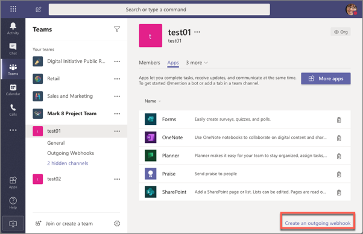
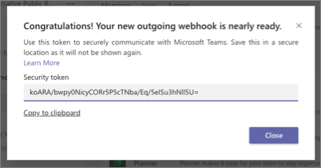
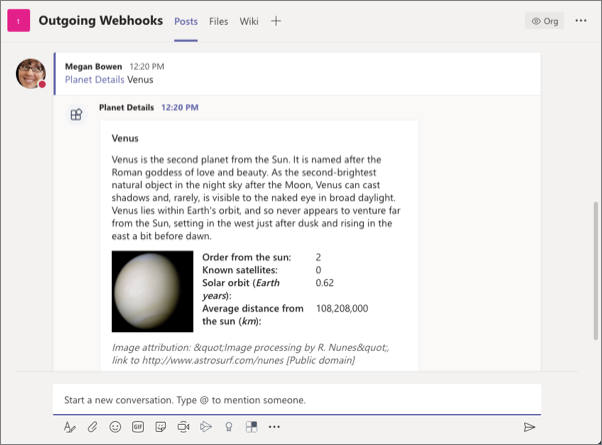

> [!VIDEO https://www.microsoft.com/videoplayer/embed/RE4ODcZ]

Webhooks are a great way for Microsoft Teams to integrate with external apps. A webhook is an HTTP POST request sent to a callback URL. In Microsoft Teams, outgoing webhooks provide a simple way to allow users to send messages to your web service without having to go through the process of creating bots via the Microsoft Bot Framework.

In this unit, you’ll learn how to create a web service and register it as an outgoing webhook in the Microsoft Teams client.

## Integrate existing services with Microsoft Teams using webhooks and connectors

Webhooks and connectors are a simple way to connect your web services to channels and teams inside Microsoft Teams. This extensibility option enables you to either respond to channel messages sent to your web service from Microsoft Teams, or send a proactive message to a channel.

Let's look at the first approach: responding to channel messages sent from Microsoft Teams: outgoing webhooks.

### Process channel messages with outgoing webhooks

An outgoing webhook allows your users to send messages from a channel to your web service. Once configured, your users can @mention your outgoing webhook to have Microsoft Teams send the message to your service. Your service has five seconds to respond to the message and optionally include a text-based message or a card.

Outgoing webhooks are manually configured on a per-team basis; they aren't included in custom Microsoft Teams apps.

### Send channel messages with incoming webhooks and Office 365 Connectors

The other approach to integrating your app is to send messages proactively to a channel inside a team. Microsoft Teams supports inbound messages: incoming webhooks and Office 365 Connectors.

An incoming webhook is the simplest of the two options, but requires more work to configure. You manually configure an incoming webhook on a per-channel basis and like outbound webhooks, can't be included in custom Microsoft Teams apps.

After creating an incoming webhook, Microsoft Teams displays a webhook endpoint that your web service can submit an HTTP POST to.

Like incoming webhooks, Office 365 Connectors enable you to proactively send messages to a channel. Connectors can be installed in Microsoft Teams app and even published to the App Store for broader distribution.

Unlike an incoming webhook, the setup process is less of a manual process. When you add a Connector to a channel, you're presented with a configuration screen. A developer can use this screen to send the webhook URL and any other configuration information collected in the configuration screen to the web service.

## Outgoing webhooks

Users interact with outgoing webhooks in a similar way as they do with bots. Like a bot, users send a message to an outgoing webhook by @mentioning it. Also like bots, outgoing webhooks can respond to messages sent from Microsoft Teams channels with rich messages that can include cards and images.

However, unlike bots, outgoing webhooks are simpler to set up as they don't require registering and configuring the bot via the Microsoft Bot Framework.

### Key features

Let's look at some of the key features of outgoing webhooks:

- **Scoped Configuration**: Webhooks are scoped at the team level. You’ll need to go through the setup process for each team you want to add your outgoing webhook to.
- **Reactive Messaging**: Users must use @mention for the webhook to receive messages.
- **Standard HTTP message exchange**: Responses will appear in the same chain as the original request message and can include any Bot Framework message content (rich text, images, cards, and emojis).
- **Microsoft Teams API method support**: Outgoing webhooks send an HTTP POST to a web service and process the web service's response. They can't access any other APIs like retrieve the roster or list of channels in a team.

Outgoing webhooks are scoped to the entire team and are visible to all members of the team. Like a bot, users are required to @mention the name of the outgoing webhook to invoke it in a channel.

## How to add outgoing webhooks to Microsoft Teams

The first step is to create a web service that accepts HTTP POST requests with a JSON payload. You're responsible for hosting this web service.

### Register the outgoing webhook

From a team, add an app by selecting the **Create outgoing webhook** link on the channel's installed apps page:

Microsoft Teams will display a security token after you register the outgoing webhook that your web service will use to validate messages it receives are sent from Microsoft Teams:

### Authenticate messages

Messages sent from Microsoft Teams to outgoing webhooks include a hash-based message authentication code (HMAC) in the HTTP request's authorization header.

The HMAC is generated by hashing the message with a secret key. Your web service should use the HMAC from the received request to authenticate and verify the message was sent from Microsoft Teams.

Your web service should use the body of the message to generate the HMAC token using the provided security key unique to your outgoing webhook registration. Compare your generated HMAC token to the one included in the request's authorization header value. If they match, you've validated the message was sent from Microsoft Teams.

### Respond with success or failure

The last step in your web service is to respond to the Microsoft Teams request message with a success or failure. Outgoing webhook messages sent from Microsoft Teams are sent synchronously and your web service must respond within five seconds. The response from your web service will be added to the same reply chain as the original message. The reply can be a text string, or a rich message that includes images or a card.

## Summary

In this unit, you learned how to create a web service and register it as an outgoing webhook in the Microsoft Teams client.
