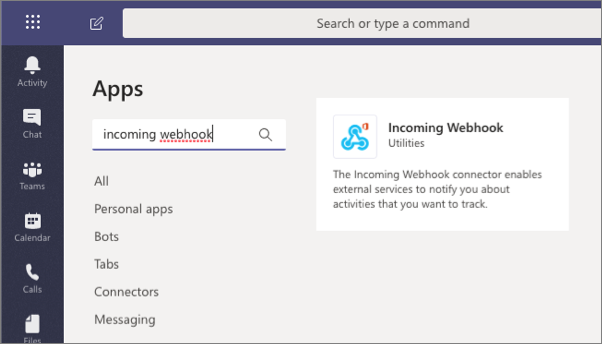
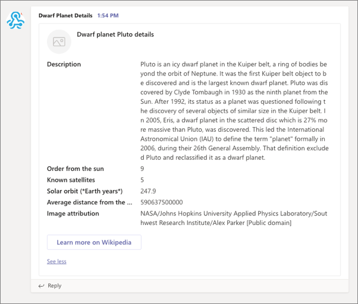

A previous unit addressed outgoing webhooks, which are web services registered with a team in Microsoft Teams that receive messages from channels when @mentioned. The other type of webhook is a *Connector* that is a web service or app that can send messages proactively to a channel without being prompted by Microsoft Teams.

Microsoft Teams supports two types of Connectors: incoming webhooks and Office 365 Connectors.

In this unit, you’ll learn how to register an incoming webhook in a Microsoft Teams channel and post a message to it.

## Overview incoming webhooks

Incoming webhooks are special type of Connector in Microsoft Teams that provide a simple way for an external app to share content in team channels. This type of Connector is often used for tracking and notification messages.

Microsoft Teams provides a unique endpoint when you register an incoming webhook that your web service will you send a JSON payload with the message that you want to send to the channel. These messages can be text-based messages or rich messages that consist of images or a card.

A card is a user-interface container that contains content and actions related to a specific topic. These cards enable you to present message data in a consistent way. Cards are used in multiple ways across the Microsoft Client, including:

- bot messages
- messaging extensions
- task modules
- Connectors

## Key features

Let's look at some of the key features of incoming webhooks:

- **Scoped Configuration**: Incoming webhooks are scoped and configured at the channel level, unlike outgoing webhooks that are scoped and configured at the *team* level.
- **Secure resource definitions**: Messages are formatted as JSON payloads. This declarative messaging structure prevents the injection of malicious code as there's no code execution on the client.
- **Actionable messaging support**: If you choose to send messages via cards, you must use the actionable message card format. Actionable message cards are supported in all Office 365 groups including Microsoft Teams.
- **Independent HTTPS messaging support**: Cards are a great way to present information in a clear and consistent way. Any tool or framework that can send HTTPS POST requests can send messages to Microsoft Teams via an incoming webhook.
- **Markdown support**: All text fields in actionable messaging cards support basic Markdown. Don't use HTML markup in your cards. HTML is ignored and treated as plain text.

## How to add incoming webhooks to Microsoft Teams

The first step is to create a web service or application that can send HTTP POST requests that include a JSON payload to an HTTPS endpoint.

### Register the incoming webhook

Your incoming webhook will submit its HTTP POST request to a unique endpoint provided by Microsoft Teams. The endpoint is generated when you register the incoming webhook to a channel.

Navigate to the channel where you want to add the webhook and select the More Options menu, or add the app to the team's installed apps.

The next configuration screen prompts you for the channel where you want to register the incoming webhook.

After registering the incoming webhook, a dialog will display the unique endpoint your web service will submit HTTP POST requests to:

Finally, update the web service to submit its request to this endpoint.

## Sending messages to channels from incoming webhooks

When the incoming webhook sends a message to the registered endpoint, Microsoft Teams will add it to the **Conversations** tab in the configured channel:

## Summary

In this unit, you learned how to register an incoming webhook in a Microsoft Teams channel and post a message to it.
