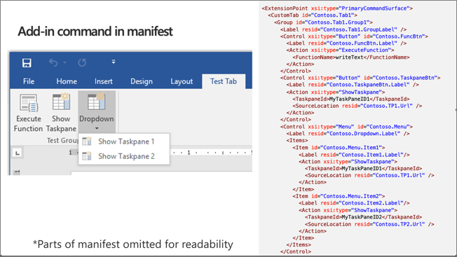

In this unit, you'll learn how to work with worksheets in Excel workbooks. You'll also learn how to create and use add-in commands for your custom solutions.

## Worksheets and a workbook

A workbook is the root object when working with the Excel APIs.


A workbook is a property of the Excel add-in context, `context.workbook`, and contains a collection of worksheets.

A worksheet contains collections for `charts`, `tables`, and `pivotTables` among other properties.

### Basic worksheets operations

Interacting with worksheets is a fundamental operation of building an Excel add-in.

The Office.js API can iterate worksheets in a workbook object or you can select specific worksheets based on the worksheet's name, ID, or active status.

Developers can create worksheets using the `workbook.worksheets.add()` method.

### Advanced worksheets operations

There are many advanced worksheet operations, including worksheet events for `onActivated`, `onAdded`, `onDeactivated`, and `onDeleted`.

Developers can also freeze worksheet panes and protect or unprotect worksheets.

The following code examples demonstrate common operations developers can do from custom Excel add-ins using the Office.js API:

- Get the active worksheet

    ```javascript
    var worksheet = context.workbook.worksheets.getActiveWorksheet();
    ```

- Get worksheet by name

    ```javascript
    var worksheet = context.workbook.worksheets.getItem("MyNewWorksheet");
    ```

- Set the active worksheet

    ```javascript
    someWorksheet.activate();
    ```

- Create a worksheet

    ```javascript
    var worksheet = context.workbook.worksheets.add("MyNewWorksheet");
    ```

- Delete a worksheet

    ```javascript
    someWorksheet.delete();
    ```

- Wire into the ondeactivated event

    ```javascript
    currWorksheet.onDeactivated.add((args) => {
      console.log("Worksheet " + args.worksheetId + " deactivated");
    });
    ```

- Freeze first row of worksheet

    ```javascript
    currWorksheet.freezePanes.freezeRows(1);
    ```

- Toggle worksheet protection

    ```javascript
    currWorksheet.load("protection/protected");
    return context.sync().then(() => {
      if (currWorksheet.protection.protected)
        currWorksheet.protection.unprotect();
      else
        currWorksheet.protection.protect();
    }).then(context.sync);
    ```

## Add-in commands

Add-in commands provide an easy way to customize the default Office user interface (UI) with specified UI elements that do actions.

Add-in commands are configured in the `VersionOverrides` element of an add-in manifest.

Add-in commands can extend existing context menus, ribbon tabs and groups, or create new custom ribbon tabs and groups.

### ExtensionPoint element

The `ExtensionPoint` element defines where add-in commands should appear in the Office UI, including in an existing ribbon tab (*OfficeTab*), a custom tab (*CustomTab*), or in a context menu available by right-clicking in the Office UI (*OfficeMenu*).

Add-in commands support button and menu controls. Buttons do a single action and menus provide a submenu of actions.

### Commands actions

The `ShowTaskpane()` action is the most common for an add-in command. It's used to launch the add-in in a task pane. Using an add-in command to launch an add-in is considered a best practice and is incorporated in most Office Add-in templates and generators.

The `ExecuteFunction` action allows an add-in command to execute some script in the background without displaying any UI. This type of command requires a `FunctionFile` to be defined in the manifest.

## Add-in command in manifest

Let's explore how the different elements in the add-in manifest map to the rendered elements in the Excel user experience.

The following image includes contains an image of an Office client application on the left and a condensed version of an add-in manifest file on the right:



The manifest starts with the `ExtensionPoint` element that contains all customizations defined for the Office ribbon:


The entire contents of the `ExtensionPoint` element define the custom tab in the ribbon and all buttons in the tab:


Each button in the ribbon is defined using a `Control` element. A control can be different types, defined in the `xsi:type` property. All the controls in this ribbon are buttons:


Within a control, developers can define *actions* or *items*. An `Action` element is used to do an action, such as showing a task pane or executing a custom function.

The `Items` collection allows developers to add more menu items to the ribbon button as shown in the following image. Notice each sub menu item also has a `Action` element as well:


### ExecuteFunction add-in command

The `ExecuteFunction` add-in command action enables developers to create custom functions, defined in JavaScript, to execute when a button is selected in the ribbon.

First, define the function in a script file. For example, add the following code to a new file in your add-in named **fnFile.html**:

```javascript
<script>
(function () {
  // must call Office.initialize
  Office.initialize => (reason) {
    // Initialize add-in
  };
})();
// function must be global
function doStuff(event) {
  // do stuff with Office.js
}
</script>
```

To call the function, use the `ExecuteFunction` action type in the add-in manifest to call the function when the custom button is selected:

```xml
<FunctionFile resid="Contoso.FnFile.Url" />
...
<Control xsi:type="Button" id="Contoso.FnBtn">
  <Label resid="Contoso.FnBtn.Label" />
  <Icon>
    <bt:Image size="16" resid="Contoso.FnBtn.Icon" />
    <bt:Image size="32" resid="Contoso.FnBtn.Icon" />
    <bt:Image size="80" resid="Contoso.FnBtn.Icon" />
  </Icon>
  <Action xsi:type="ExecuteFunction">
    <FunctionName>doStuff</FunctionName>
  </Action>
  </Control>
...
<Resources>
  <bt:Urls>
    <bt:Url id="Contoso.FnFile.Url"
            DefaultValue="https://REPLACE_ADD-IN_APP_URL/FnFile.html" />
      ...
```

## Summary

In this unit, you learned how to work with worksheets in Excel workbooks. You also learned how to create and use add-in commands for your custom solutions.
