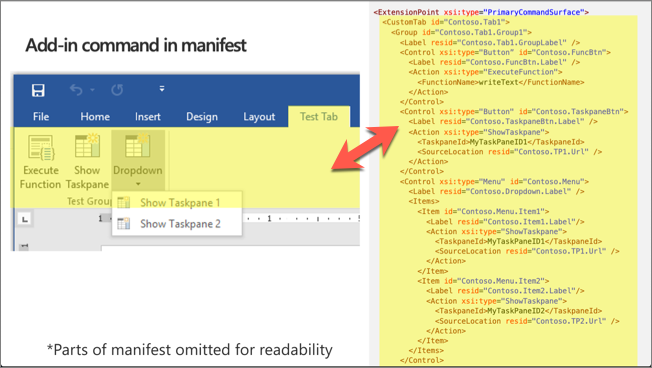
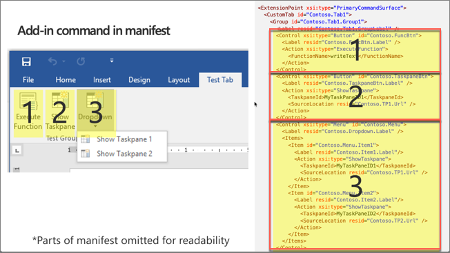
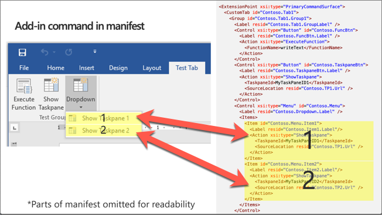

In this unit, you'll learn how to create add-in commands and work with dialogs to display information, or prompt the user for input.

## Add-in commands

Add-in commands provide an easy way to customize the default Office user interface (UI) with specified UI elements that do actions.

Add-in commands are configured in the `VersionOverrides` element of an add-in manifest.

Add-in commands can extend existing context menus, ribbon tabs and groups, or create new custom ribbon tabs and groups.

### ExtensionPoint element

The `ExtensionPoint` element defines where add-in commands should appear in the Office UI, including in an existing ribbon tab (*OfficeTab*), a custom tab (*CustomTab*), or in a context menu available by right-clicking in the Office UI (*OfficeMenu*).

Add-in commands support button and menu controls. Buttons do a single action and menus provide a submenu of actions.

### Commands actions

The `ShowTaskpane()` action is the most common for an add-in command. It's used to launch the add-in in a task pane. Using an add-in command to launch an add-in is considered a best practice and is incorporated in most Office add-in templates and generators.

The `ExecuteFunction` action allows an add-in command to execute some script in the background without displaying any UI. This type of command requires a `FunctionFile` to be defined in the manifest.

## Add-in command in manifest

Let's explore how the different elements in the add-in manifest map to the rendered elements in the Outlook user experience.

The following image includes contains an image of an Office client application on the left and a condensed version of an add-in manifest file on the right:


The manifest starts with the `ExtensionPoint` element that contains all customizations defined for the Office ribbon:


The entire contents of the `ExtensionPoint` element define the custom tab in the ribbon and all buttons in the tab:



Each button in the ribbon is defined using a `Control` element. A control can be different types, defined in the `xsi:type` property. All the controls in this ribbon are buttons:



Within a control, developers can define *actions* or *items*. An `Action` element is used to do an action, such as showing a task pane or executing a custom function.

The `Items` collection allows developers to add additional menu items to the ribbon button as shown in the following image. Notice each sub menu item also has a `Action` element as well:



### ExecuteFunction add-in command

The `ExecuteFunction` add-in command action enables developers to create custom functions, defined in JavaScript, to execute when a button is selected in the ribbon.

First, define the function in a script file. For example, add the following code to a new file in your add-in named **fnFile.html**:

```javascript
<script>
(function () {
  // must call Office.initialize
  Office.initialize => (reason) {
    // Initialize add-in
  };
})();
// function must be global
function doStuff(event) {
  // do stuff with Office.js
}
</script>
```

To call the function, use the `ExecuteFunction` action type in the add-in manifest to call the function when the custom button is selected:

```xml
<FunctionFile resid="Contoso.FnFile.Url" />
...
<Control xsi:type="Button" id="Contoso.FnBtn">
  <Label resid="Contoso.FnBtn.Label" />
  <Icon>
    <bt:Image size="16" resid="Contoso.FnBtn.Icon" />
    <bt:Image size="32" resid="Contoso.FnBtn.Icon" />
    <bt:Image size="80" resid="Contoso.FnBtn.Icon" />
  </Icon>
  <Action xsi:type="ExecuteFunction">
    <FunctionName>doStuff</FunctionName>
  </Action>
  </Control>
...
<Resources>
  <bt:Urls>
    <bt:Url id="Contoso.FnFile.Url"
            DefaultValue="https://REPLACE_ADD-IN_APP_URL/FnFile.html" />
      ...
```

## Dialogs

The Dialog API is an extension of the user experience developers can customize in Office. Developers can use it to open dialogs from custom add-ins that interact with the user and the custom add-in user experience.

The primary scenario for the Dialog API is authentication with third-party providers. Most identity providers prevent their sign-in experiences from being displayed in an Iframe due to click-jacking concerns. This is troublesome with an add-in as they are displayed in Iframes in some of the clients such as the web versions of Office client applications.

Another challenge with authentication scenarios is predicting the domains that will need to load. In federated sign-in scenarios, the potential list of domains could be endless, which again is troublesome in an add-in where all domains need to be registered in the manifest.

It's important to note that Office offers a single sign-on experience specific for Microsoft identities. If your add-in requires data about the Office user or their resources accessible through Microsoft Graph, such as Office 365 or OneDrive, Microsoft recommends you use the single sign-on API whenever you can. If you use the APIs for single sign-on, then you won't need the Dialog API.

Beyond authentication, the Dialog API can provide additional screen real estate for elements difficult to display in a traditional task pane of content add-in. A good example would be hosting a video that would be too small if confined to a task pane

The Dialog API can display any HTTPS web page, but it must be launched to an app domain first and then redirect.

## Open dialogs

Open a dialog using the `diaplayDialogAsync()` method from an Office add-in:

```javascript
Office.context.ui.displayDialogAsync("<URL />", options, optionalCallback);
```

The `displayDialogAsync()` method accepts three parameters:

- The `<URL />` is the page to be displayed in the dialog. It most initially is a page hosted from an app domain as defined in the manifest. However, the page can immediately redirect to a different page.
- The `options` parameter allows the developer to modify the size of the dialog. By default, the dialog will display as 80% of the height and width of the device screen. The values for height and width are expressed as percentage of the device screen.

    Developers can optionally set the `displayInIframe` property in the options. Setting this to `true` will cause the dialog to display as a floating Iframe rather than an independent window (in clients that support this), which makes it open faster.

- The `optionalCallback` allows the add-in's host page to respond to messages and events from the dialog.

## Dialog input and output

The primary way to pass information to a dialog is through the browser's local storage (`window.localStorage`) or through URL parameters in the dialog URL. In this sample, the host page is passing an ID of "123" to the dialog via a url parameter.

```javascript
/******* START Host page script *******/

// Open the dialog passing the parameter id=123
let dialog = null;
Office.context.ui.displayDialogAsync(
  'https://domain/popup.html?id=123',
  {
    height: 45,
    width: 55
  },
  function(result) {
    dialog = result.value;
    // Listen for messages coming from the dialog
    dialog.addEventHandler(
      Microsoft.Office.WebExtension.EventType.DialogMessageReceived,
      processMessage
    );
  }
);
function processMessage(arg) {
  // Log the message send from the dialog and close the dialog
  console.log(arg.message);
  dialog.close();
}
/******* End Host page script *******/

/******* Start Dialog page script *******/
// dialog must call Office.initialize
Office.initialize = function() {
  // send the parent/host a message
  Office.context.ui.messageParent('Hello from the dialog!!!');
}
```

A dialog can pass messages back to the host by calling `Office.context.ui.messageParent` to send either a Boolean value or a string message to the host page. At the bottom of the sample, you can see the dialog script where it's passing the message "Hello from the dialog!!!" to the parent.

The `messageParent()` method can only be called on a page with the same domain (including protocol and port) as the host page.

The host page must listen for messages by subscribing to the `DialogMessageReceived` handler. In the sample, the host page registers this handler using the `processMessage` function, where it logs the message to the console.

## Summary

In this unit, you'll learn how to create add-in commands and work with dialogs to display information, or prompt the user for input.
