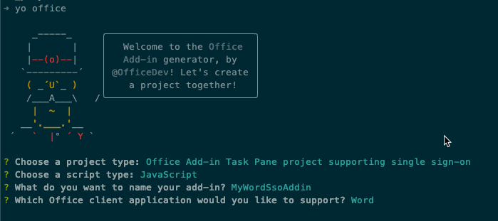
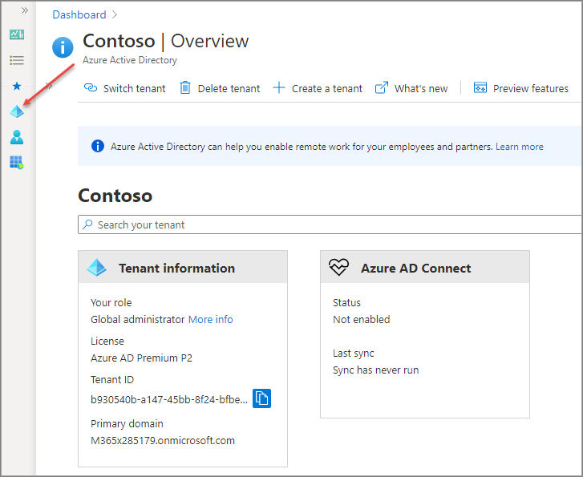
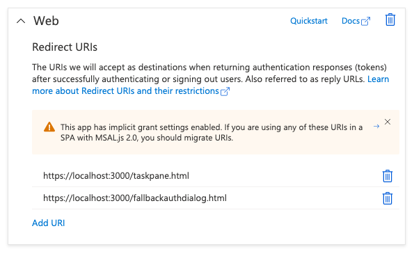
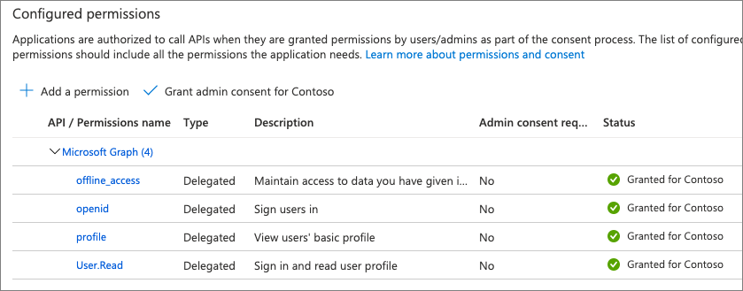
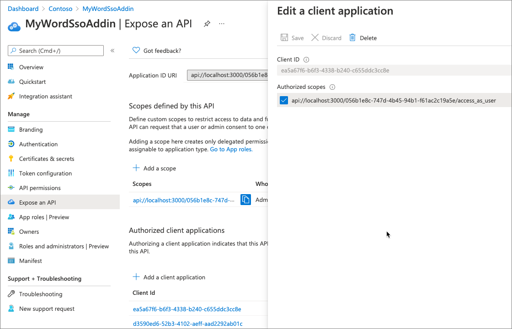
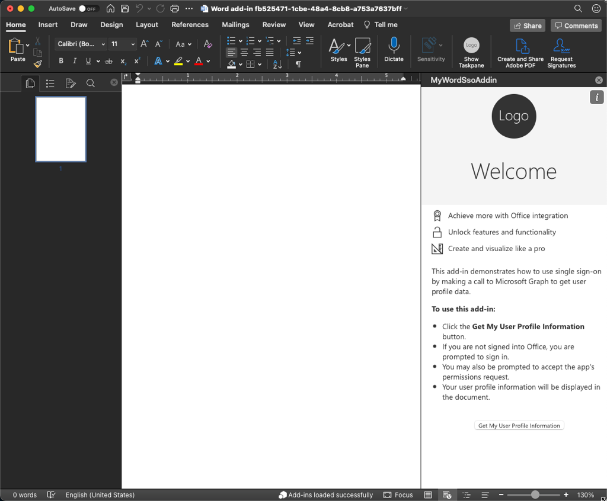
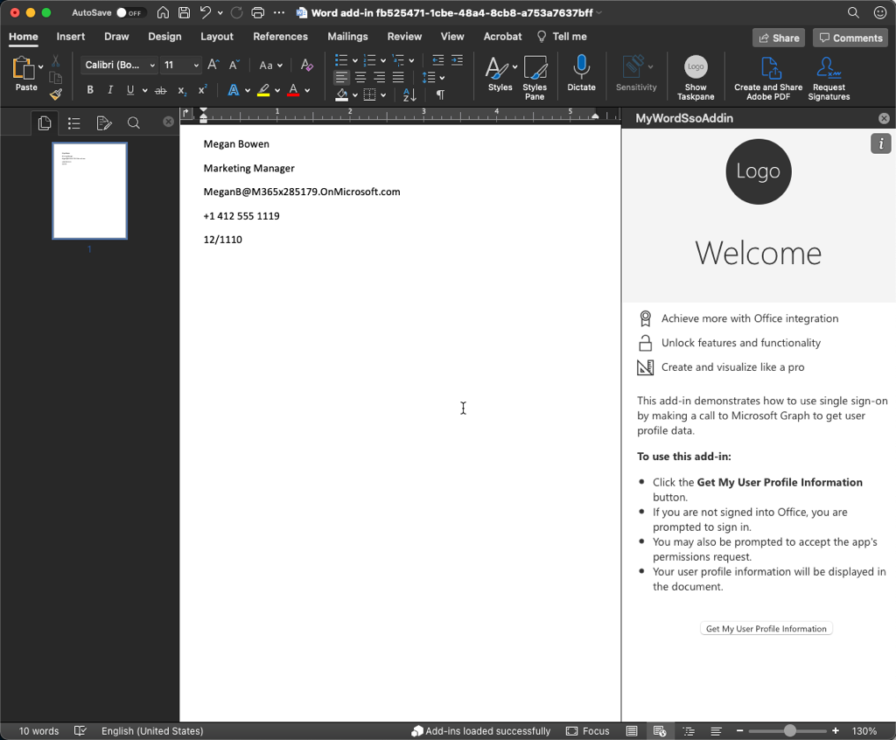

In this exercise, you'll build a Word add-in that inserts details about the currently logged in user with Microsoft Graph. This process uses the single sign-on (SSO) authentication scheme.

## Prerequisites

Developing Office add-ins for Microsoft Word requires the web client or the following desktop clients:

- Windows v16.0.12215.20006 (*or higher*)
- macOS v16.32.19102902 (*or higher*)

You'll use Node.js to create the custom Word add-in in this module. The exercises in this module assume you have the following tools installed on your developer workstation:

> [!IMPORTANT]
> In most cases, installing the latest version of the following tools is the best option. The versions listed here were used when this module was published and last tested.

- [Node.js](https://nodejs.org/) - (*the latest [LTS](https://nodejs.org/about/releases) version*)
- NPM (installed with Node.js) - v6.x (or higher)
- [Yeoman](https://yeoman.io/) - v3.x (or higher)
- [Yeoman Generator for Microsoft Office](https://github.com/OfficeDev/generator-office) - v1.7.x (or higher)
- [Visual Studio Code](https://code.visualstudio.com)

You must have the minimum versions of these prerequisites installed on your workstation.

## Create your add-in project

Run the following command to create an add-in project using the Yeoman generator:

```console
yo office
```

> [!NOTE]
> When you run the `yo office` command, you may receive prompts about the data collection policies of Yeoman and the Office Add-in CLI tools. Use the information that's provided to respond to the prompts as you see fit.

When prompted, provide the following information to create your add-in project:

- **Select a project type:** Office Add-in Task Pane project supporting single sign-on
- **Select a script type:** JavaScript
- **What do you want to name your add-in?** MyWordSsoAddin
- **Which Office client application would you like to support?** Word



After you complete prompts, the generator creates the project and installs supporting Node components.

> [!TIP]
> When installing dependencies, you can ignore any warnings or errors the Yeoman generator displays. The remainder of this unit include all the steps you'll need to follow.

## Explore the initial project

All Word Add-in projects include various folders and files that implement an add-in for Microsoft Word. The add-in is mostly implemented in the **./src/commands** and **./src/taskpane** folders. The files in these two folders implement the basic task pane add-in and optional commands to trigger the add-in.

Let's take a look at some of the other files added to the project that support implementing an SSO experience for users. These files can be found in the **./src/helpers** folder.

- **documentHelper.js**: This file uses the Office JavaScript API library to retrieve data from Microsoft Graph and add it to the Word document.
- **fallbackauthdialog.html**: This file is the UI-less page that loads the JavaScript for the fallback authentication strategy.
- **fallbackauthdialog.js**: This file contains the JavaScript for the authentication strategy that uses the Microsoft Authentication Library for JavaScript (MSAL.js) to sign in the user.
- **fallbackauthhelper.js**: This file contains the JavaScript for the task pane that invokes the fallback authentication strategy in scenarios when SSO authentication isn't supported.
- **ssoauthhelper.js**: This file contains the JavaScript that calls the SSO API, `getAccessToken()`, receives the bootstrap token, initiates the exchange of the bootstrap token for an access token that can be used to call Microsoft Graph. This file also includes the code to call the Microsoft Graph endpoint.

## Register the Azure Active Directory (Azure AD) app

You learned in a previous unit that an Office Add-in must have an associated Azure AD application registration in order for the user to sign in and obtain an access token to call Microsoft Graph.

Before you can test the project, you'll need to register the Azure AD application and then update the project to use the Azure AD application.

> [!TIP]
> For details on registering the Azure AD application manually refer to the following in the Office Add-in developer documentation: **[Create a Node.js Office Add-in that uses single sign-on: Register the add-in with Azure AD v2.0 endpoint](https://docs.microsoft.com/office/dev/add-ins/develop/create-sso-office-add-ins-nodejs#register-the-add-in-with-azure-ad-v20-endpoint)**.

The Office Add-in project includes a utility that can create the Azure AD app registration and update the project.

From the command prompt, ensure you're currently in the root folder of the project. Then execute the following command:

```console
npm run configure-sso
```

The command will launch a browser and prompt you to log in to Azure AD. Ensure you log in as a user that has permissions to register an Azure AD application, such as a user assigned to the **Global Administrator** role.

After authenticating, the script will perform the following tasks:

1. Register the Azure AD application
1. Configure the application's audience and permissions settings
1. Create a new client secret and save it to your developer workstations secret store
1. Update the project with the Azure AD application's client ID


> [!WARNING]
> The **configure-sso** command will fail if your Azure AD tenant is configured for multi-factor authentication (MFA)/two-factor authentication. In this case, you'll need manually create the Azure AD app registration as outlined in the **[Create a Node.js Office Add-in that uses single sign-on: Register the add-in with Azure AD v2.0 endpoint](https://docs.microsoft.com/office/dev/add-ins/develop/create-sso-office-add-ins-nodejs#register-the-add-in-with-azure-ad-v20-endpoint)** article.

Let's examine the work the **configure-sso** script performed.

Open a browser and navigate to the [Azure Active Directory admin center (https://aad.portal.azure.com)](https://aad.portal.azure.com). Sign in using a **Work or School Account** that has global administrator rights to the tenancy.

Select **Azure Active Directory** in the leftmost navigation.

### App registration

Select **Manage > App registrations** in the leftmost navigation.

  

On the **App registrations** page, select the app **MyWordSsoAddin**. This is the same name of the app that you created with the Yeoman Generator for Microsoft Office previously.

On the **MyWordSsoAddin** page, take note of the **Application ID**. The **configure-sso** script that created this Azure AD application set this value in your project's **.ENV** file:

```text
CLIENT_ID=056b1e8c-747d-4b45-94b1-f61ac2c19a5e
GRAPH_URL_SEGMENT=/me
NODE_ENV=development
PORT=3000
QUERY_PARAM_SEGMENT=
SCOPE=User.Read
```

### Authentication

Next, in the leftmost navigation, select **Manage > Authentication**. Notice the **Redirect URIs** are set to the **taskpane.html** and **fallbackauthdialog.html** pages in our app.



Also note the section **Implicit grand and hybrid flows** has been updated to ensure Azure AD returns access tokens and ID tokens when a user authenticates to the app:


### Certificates & secrets

Next, in the leftmost navigation, select **Manage > Authentication**. Notice the **Redirect URIs** are In the leftmost navigation, select **Manage > Certificates & secrets**.

The **configure-sso** script created a client secret for the app. This was displayed in the command prompt as you saw previously, and added your developer workstation's secret store.

### API permissions

In the leftmost navigation, select **Manage > API permissions**. Notice how multiple delegated permissions have been configured for the app. The **console-sso** script also granted admin consent to all users in the tenant so they won't be prompted to consent the app the first time they use the app.



### Expose an API: Application ID URI

Finally, select **Manage > Expose an API** in the leftmost navigation. There are multiple things to take note of on this page:

First, notice the application ID URI. This is the unique ID of our application. Notice it has the ID of the application in the full string.

### Expose an API: Scopes defined by the API

The next section contains the scopes defined by the API. These can be custom scopes that enable you to restrict access to data and functionality protected by the API. In our case, the **configure-sso** app, it added the following scope:

```text
api://localhost:3000/056b1e8c-747d-4b45-94b1-f61ac2c19a5e/access_as_user
```

The ID of the scope will match the ID of your application. Notice the end of the scope. This scope, **access_as_user** enables the Office client applications to use the add-in's web APIs with the same rights as the currently signed in user.

### Expose an API: Authorized client applications

The last section indicates the API will automatically trust these specific applications and not prompt the user for consent when the application calls this API.

This effectively authorizes the Office desktop and web applications to call your add-in's API.

The applications listed are as follows:

- **Microsoft Office**: `d3590ed6-52b3-4102-aeff-aad2292ab01c`
- **Microsoft Office**: `ea5a67f6-b6f3-4338-b240-c655ddc3cc8e`
- **Office on the web**: `57fb890c-0dab-4253-a5e0-7188c88b2bb4`
- **Office on the web**: `08e18876-6177-487e-b8b5-cf950c1e598c`
- **Outlook on the web**: `bc59ab01-8403-45c6-8796-ac3ef710b3e3`

If you select one of these apps, each of them has the scope defined above as an authorized scope.



## Build and test the application

Run the following command in a command prompt to transpile and start the debugging process:

```console
npm start
```

The **start** script will do three things:

1. build the add-in project
1. start a local web server to host the add-in on your local workstation
1. start the Office client and sideload the Office Add-in in it

> [!TIP]
> Be sure to monitor the command prompt. You may be prompted to enter your password to complete the startup, sideloading, and debugging process.

### Test the add-in in the Word desktop client

After a moment, the Word will load with the add-in's button in the button and loaded in the task pane.



To test the add-in, select the **Get my user profile information** button.

If you aren't already signed in with your Office client, you'll be prompted to sign in.


After signing in, the add-in will retrieve your basic profile information from Microsoft Graph and add it to the document.



### Test the add-in in the Word web client

To see SSO in action, try the add-in in the Office web client from OneDrive.

Open a browser and navigate to the [OneDrive (https://onedrive.com)](https://onedrive.com). Sign in using a **Work or School Account**.

Add a new Word document by selecting the **New** button and then select **Word document**.

Install the Word add-in by sideloading it. From the ribbon, select **Insert > Add-ins**.

In the **Office Add-ins** dialog, select **Upload My Add-in**.

Select the **manifest.xml** file in the root of your project and select **Upload**.

Microsoft Word will sideload the add-in and display the **Show Taskpane** button in the ribbon, just like the desktop client.

Select the **Show Taskpane** button, then select the **Get my user profile information** button.

Because you're already signed in, after a moment, you'll see the same profile information appear in the document without having to sign in.

## Explore the project

Now let's explore how the Word Add-in uses SSO to connect to Microsoft Graph and display the currently signed in user's profile information in the document.

Open the project you created at the beginning of this exercise in Visual Studio Code.

Locate and open the **./manifest.xml** file. Within the add-in manifest, locate the following element: `OfficeApp` > `DefaultSettings` > `SourceLocation`. The value in this element tells the hosting Office client the URL to load in the task pane IFRAME.

Locate and open the **./src/taskpane/taskpane.html** file. There are two things to notice in this file:

1. Within the page's `<head>` section, notice the `<script>` reference to the **office.js** file. This is the Office JavaScript SDK that your add-in can use to communicate with the host Office client.
1. Scroll to the bottom of the file to the `<button id="getGraphDataButton">` button. This is the button that starts the process of obtaining an access token for the user to request the currently signed in user's profile information from Microsoft Graph.

Locate and open the **./src/taskpane/taskpane.js** file. Once the hosting Office client has loaded the add-in, it attaches the `ssoAuthHelper.getGraphData()` method to the task pane's button's click event.

Locate and open the **./src/helpers/ssoauthhelper.js** file. This file contains the code that does most the work of authenticating the user using SSO and obtaining the user's profile data from Microsoft Graph. All of this is implemented in the `getGraphData()` method. This method does the following things:

1. Signs in the user by obtaining an access token from Azure AD. This access token, referred to as the `bootstrapToken`, contains an ID token and an access token.
1. Exchange the access token with Azure AD for one that can be used to call Microsoft Graph.

    The `bootstrapToken` obtained in the first step doesn't contain the necessary scopes to call Microsoft Graph as it's used to authenticate the user and obtain an ID token.

    > [!NOTE]
    > The `sso.getGraphToken()` method called in this step calls the **https://graph.microsoft.com/v1.0/auth** endpoint to obtain an access token that can be used for Microsoft Graph.

1. Submit an HTTP request to Microsoft Graph's REST API to obtain the user's profile data. This is done by calling the `sso.makeGraphApiCall()` method.

    > [!NOTE]
    > The `sso.makeGraphApiCall()` method calls the **https://graph.microsoft.com/v1.0/getuserdata** endpoint to retrieve the user's profile information.

If any point the authentication process fails, the code uses a fallback authentication process using the **./src/helpers/fallbackauth\*.\*** files.

The code added by the Yeoman Generator for Microsoft Office to the initial add-in project retrieves the user's profile information from Microsoft Graph. The other exercises in this module will demonstrate how to request additional information from Microsoft Graph.
