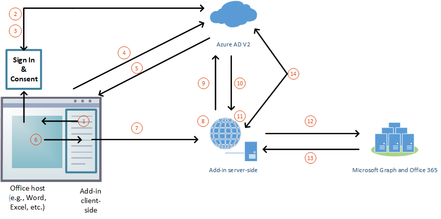
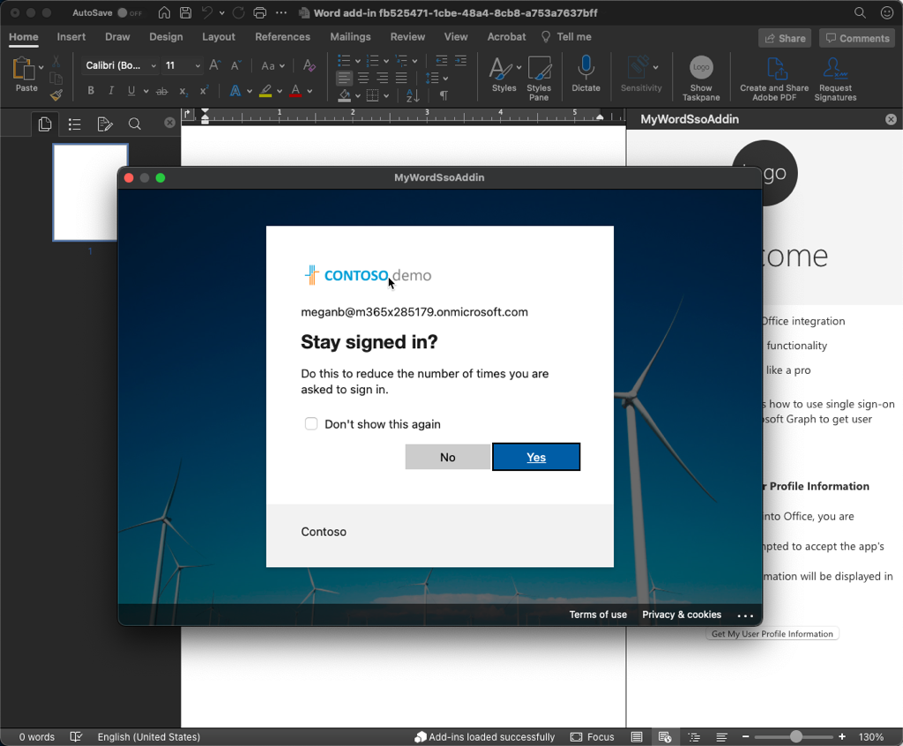

Users sign in to Office (online, mobile, and desktop platforms) using either their personal Microsoft account or their Microsoft 365 Education or work account.

The best way for an Office Add-in to get authorized access to Microsoft Graph is to use the credentials from the user's Office sign-on. This enables them to access their Microsoft Graph data without needing to sign in a second time.

In this unit, you'll learn how to implement SSO in an Office Add-in to submit requests and retrieve information from Microsoft Graph.

## Office Add-ins, SSO, and Microsoft Graph

Let's start by taking a look at how the authentication flow works at runtime when an Office Add-in implements SSO with the end goal to access Microsoft Graph.



1. In the add-in, JavaScript calls the Office.js API method `getAccessToken()`. This method tells the Office client application to obtain an access token to the add-in.

    > [!NOTE]
    > This token is commonly called the **bootstrap access token** because it is replaced with a second token later in the process.

1. If the user isn't signed in, the Office client application opens a pop-up window for the user to sign in.
1. If this is the first time the current user has used your add-in, they're prompted to consent.
1. The Office client application requests the bootstrap access token from the Azure AD v2.0 endpoint for the current user.
1. Azure AD returns the bootstrap token to the Office client application.
1. The Office client application sends the bootstrap access token to the add-in as part of the result object returned by the `getAccessToken()` call.
1. JavaScript in the add-in makes an HTTP request to a web API that is hosted at the same fully qualified domain as the add-in, and it includes the bootstrap access token as proof of authorization.
1. Server-side code validates the received bootstrap access token.
1. Server-side code uses the [OAuth2 On-Behalf-Of (OBO) flow](https://docs.microsoft.com/azure/active-directory/develop/v2-oauth2-on-behalf-of-flow) to obtain an access token for Microsoft Graph in exchange for the bootstrap access token.
1. Azure AD returns the access token to Microsoft Graph, *and a refresh token, if the add-in requests **offline_access** permission*, to the add-in.
1. Server-side code caches the access token to Microsoft Graph.
1. Server-side code makes requests to Microsoft Graph and includes the access token to Microsoft Graph.
1. Microsoft Graph returns data to the add-in, which can pass it on to the add-in's UI.
1. When the access token to Microsoft Graph expires, the server-side code can use its refresh token to get a new access token to Microsoft Graph.

### Office can't prompt for to consent Microsoft Graph permissions

The steps outlined above state that Office can prompt the user to consent the add-in permissions to sign them in. However, it's worth noting that Office can only prompt for consent for the OpenID `profile` scope. Office can't prompt the user to consent any of the Microsoft Graph permissions.

This can introduce a challenge with your add-in because it can't know if this initial bootstrap token can be used in the OBO OAuth2 to obtain an access token to call Microsoft Graph.

If your code needs permissions to Microsoft Graph, or more permissions that the user hasn't consented to yet, when Microsoft Graph receives the bootstrap token, it will fail with a specific error code: **AADSTS65001**. This error code indicates consent to the requested Microsoft Graph permissions hasn't been granted yet.

In this scenario, your add-in should gracefully handle this scenario with a fallback authorization system that prompts the user to consent the necessary Microsoft Graph permissions.

### Avoid multiple round trips: fail fast

One thing you'll notice from these steps is the many round trips to Azure AD. This is especially true when requesting an access token to use with Microsoft Graph. Your add-in will need to start multiple round trips before it can find out if the user needs to consent to more permissions for Microsoft Graph.

The `getAccessToken()` method in the Office.js SDK accepts an options object that you can use to implement a *fail fast* approach. If you pass `{ forMSGraphAccess: true }` to this method, Azure AD will do an extra check before returning the bootstrap token.

If the user has consented to the requested Microsoft Graph permissions, your add-in will receive the bootstrap token that you can use to exchange with Microsoft Graph using the OAuth2 OBO flow to obtain an access token that can be used to call Microsoft Graph.

However, if the user hasn't consented to the requested Microsoft Graph permissions, Azure AD will respond with a **13012** error. Your code can handle this error by falling back to the alternative authorization system. This alternate process will open a dialog and prompt the user to consent for the necessary Microsoft Graph permissions.

This way, your add-in can avoid multiple round trips just to find out the user needs to consent to Microsoft Graph permissions.

The code in the default Office Add-in SSO project includes boilerplate code necessary to implement this fallback authorization process. These are all found as **./helpers/fallbackauth\*.\*** files, a collection of HTML and JavaScript files that implement the popup dialog.

## Call Microsoft Graph from the client-side code

To submit a request to Microsoft Graph, you first call the `getAccessToken()` method as follows. In this example, we're passing in the `allowSignInPrompt: true` option that you can use if the add-in can be used when the add-in launches and no signed-in user is present.

```javascript
const sso = require("office-addin-sso");

// ...

let bootstrapToken = await OfficeRuntime.auth.getAccessToken({ allowSignInPrompt: true });
```



Next, you'll try to exchange this bootstrap token for an access token that can be used to call Microsoft Graph. It's this part that starts the OAuth2 OBO flow:

```javascript
let exchangeResponse = await sso.getGraphToken(bootstrapToken);
```

Assuming the user has consented the necessary Microsoft Graph permissions, you can request the user's profile information from Microsoft Graph by calling the `makeGraphApiCall()` method that's included with the provided **office-addin-sso** JavaScript package:

```javascript
const response = await sso.makeGraphApiCall(exchangeResponse.access_token);
```

If you need more control over the request to Microsoft Graph, including calling a specific endpoint or providing more control over the URL parameters, you can use the `getGraphData()` method:

```javascript
const endpoint = "/me/messages";
const urlParams = "?$select=receivedDateTime,subject,isRead&$orderby=receivedDateTime&$top=10";
const response = await sso.getGraphData(exchangeResponse.access_token, endpoint, urlParams);
```

As previously mentioned, if the user hasn't granted consent to Microsoft Graph for the necessary permissions, or if they need to sign in, all the code snippets above can be wrapped in a `try-catch` block that handles authentication and authorization errors returned by Azure AD. In those cases, it implements the fallback authorization dialog system:

```javascript
const fallbackAuthHelper = require("./fallbackAuthHelper");

// ...

try {
  // 1. get bootstrap token
  // 2. exchange bootstrap token for access token
  // 3. call Microsoft Graph
} catch (exception) {
  if (exception.code) {
    if (sso.handleClientSideErrors(exception)) {
      fallbackAuthHelper.dialogFallback();
    }
  } else {
    sso.showMessage("EXCEPTION: " + JSON.stringify(exception));
  }
}
```
