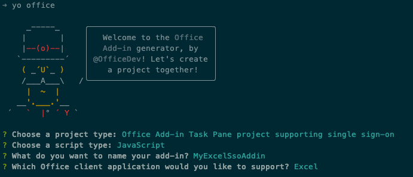
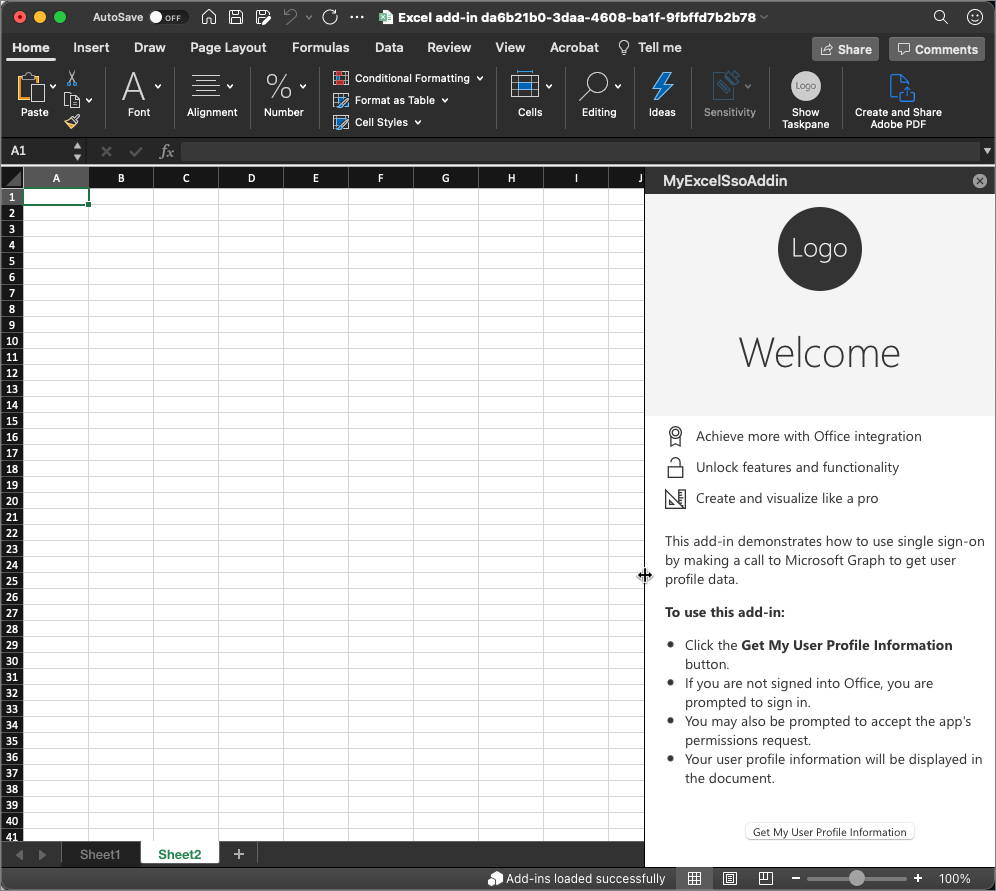
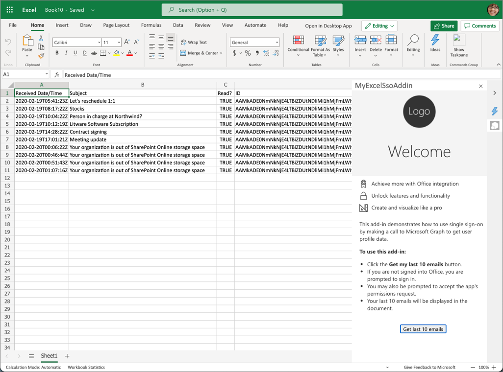

In this exercise, you'll build an Excel add-in that adds a list of the recent emails received by the currently logged in user with Microsoft Graph in a worksheet. This process uses the single sign-on (SSO) authentication scheme.

## Prerequisites

Developing Office Add-ins for Microsoft Excel requires the web client or the following desktop clients:

- Windows v16.0.12215.20006 (*or higher*)
- macOS v16.32.19102902 (*or higher*)

You'll use Node.js to create the custom Excel add-in in this module. The exercises in this module assume you have the following tools installed on your developer workstation:

> [!IMPORTANT]
> In most cases, installing the latest version of the following tools is the best option. The versions listed here were used when this module was published and last tested.

- [Node.js](https://nodejs.org/) - (*the latest [LTS](https://nodejs.org/about/releases) version*)
- NPM (installed with Node.js) - v6.x (or higher)
- [Yeoman](https://yeoman.io/) - v3.x (or higher)
- [Yeoman Generator for Microsoft Office](https://github.com/OfficeDev/generator-office) - v1.8.x (or higher)
- [Visual Studio Code](https://code.visualstudio.com)

You must have the minimum versions of these prerequisites installed on your workstation.

## Create your add-in project

Run the following command to create an add-in project using the Yeoman generator:

```console
yo office
```

> [!NOTE]
> When you run the `yo office` command, you may receive prompts about the data collection policies of Yeoman and the Office Add-in CLI tools. Use the information that's provided to respond to the prompts as you see fit.

When prompted, provide the following information to create your add-in project:

- **Select a project type:** Office Add-in Task Pane project supporting single sign-on
- **Select a script type:** JavaScript
- **What do you want to name your add-in?** MyExcelSsoAddin
- **Which Office client application would you like to support?** Excel



After you complete prompts, the generator creates the project and installs supporting Node components.

## Register the Azure Active Directory (Azure AD) app

Next, register the Azure AD application and update the project to use the Azure AD application.

> [!TIP]
> For details on registering the Azure AD application manually, see: **[Create a Node.js Office Add-in that uses single sign-on: Register the add-in with Azure AD v2.0 endpoint](/office/dev/add-ins/develop/create-sso-office-add-ins-nodejs#register-the-add-in-with-azure-ad-v20-endpoint)**.

From the command prompt, ensure you're currently in the root folder of the project. Then execute the following command:

```console
npm run configure-sso
```

The command will launch a browser and prompt you to sign in to Azure AD. Ensure you sign in as a user that has permissions to register an Azure AD application, such as a user assigned to the **Global Administrator** role.

After authenticating, the script will do the following tasks:

1. Register the Azure AD application
1. Configure the application's audience and permissions settings
1. Create a new client secret and save it to your developer workstations secret store
1. Update the project with the Azure AD application's client ID


> [!WARNING]
> The **configure-sso** command will fail if your Azure AD tenant is configured for multi-factor authentication (MFA)/two-factor authentication. In this case, you'll need manually create the Azure AD app registration as outlined in the **[Create a Node.js Office Add-in that uses single sign-on: Register the add-in with Azure AD v2.0 endpoint](/office/dev/add-ins/develop/create-sso-office-add-ins-nodejs#register-the-add-in-with-azure-ad-v20-endpoint)** article.

## Build and test the application

Run the following command in a command prompt to transpile and start the debugging process:

```console
npm start
```

### Test the add-in in the Excel desktop client

After a moment, the Excel will load with the add-in's button in the ribbon and loaded in the task pane.



To test the add-in, select the **Get my user profile information** button.

If you aren't already signed in with your Office client, you'll be prompted to sign in.

After signing in, the add-in will retrieve your basic profile information from Microsoft Graph and add it to the document.


## Update the app to show recent emails

Now, let's update the task pane app to add a list of the recent emails received by the currently logged in user with Microsoft Graph.

### Update the Azure AD app's permissions

The registered Azure AD app must first be granted permissions to the app.

Open a browser and navigate to the [Azure Active Directory admin center (https://aad.portal.azure.com)](https://aad.portal.azure.com). Sign in using a **Work or School Account** that has global administrator rights to the tenancy.

In the leftmost navigation, select **Manage > API permissions**.

Add a new permission by selecting **Add a permission**.

On the **Select an API** screen, select **Microsoft Graph**, then select **Delegated permissions**. Search for and select permission **Mail.Read** and select **Add permissions**.


Next, select the **Grant admin consent for Contoso** followed by accepting the confirmation prompt by selecting **Yes**.

## Update the Excel task pane add-in

The next step is to update the code in the add-in.

### Update the task pane

Locate and open the **./src/taskpane/taskpane.html**.

Locate the following HTML element in the task pane:

```html
<div class="ms-firstrun-instructionstep__welcome-body">
```

Locate the first bullet in the HTML and change `span` element's contents to:

```html
<span class="ms-ListItem-primaryText">Click the <b>Get my last 10 emails</b> button.</span>
```

Locate the last bullet in the HTML and change `span` element's contents to:

```html
<span class="ms-ListItem-primaryText">Your last 10 emails will be displayed in the document.</span>
```

Locate the button and change the text to: `Get last 10 emails`.

### Update the task pane's code

Now, update the code that will get the user's last 10 emails.

Locate and open the **./src/helpers/ssoauthhelper.js** file.

Find the following line in the `getGraphData()` method:

```javascript
const response = await sso.makeGraphApiCall(exchangeResponse.access_token);
```

Delete this line and replace it with the following code. This code uses a different method in the SSO helper to submit a specific request to Microsoft Graph:

```javascript
const endpoint = "/me/messages";
const urlParams = "?$select=receivedDateTime,subject,isRead&$orderby=receivedDateTime&$top=10";
const response = await sso.getGraphData(exchangeResponse.access_token, endpoint, urlParams);
```

Next, locate and open the **./src/helpers/documentHelper.js** file.

Find the method `writeDataToExcel()`. You'll replace most the code in this method, but you do want to keep the basic structure. Delete the contents of the method and replace it with the following code:

```javascript
return Excel.run(function(context) {
  const sheet = context.workbook.worksheets.getActiveWorksheet();

  // TODO

  return context.sync();
});
```

First, replace the `// TODO` with the following code to create a few column headings in the sheet:

```javascript
const rangeHeading = sheet.getRange("A1:D1");
rangeHeading.values = [["Received Date/Time", "Subject", "Read?", "ID"]];
```

Next, add the following code after the previous code you just added. This will take the results from the Microsoft Graph request and convert them to a multi-dimensional array to write it to the worksheet.

It then writes the results to the worksheet and formats the columns so all the data will be visible:

```javascript
// convert data to a list
const mailResults = result.value;
for (let i = 0; i < mailResults.length; i++) {
  if (mailResults[i] !== null) {
    let innerArray = [];
    innerArray.push(mailResults[i].receivedDateTime);
    innerArray.push(mailResults[i].subject);
    innerArray.push(mailResults[i].isRead);
    innerArray.push(mailResults[i].id);

    let data = [];
    data.push(innerArray);
    let rangeData = sheet.getRange(`A${i+2}:D${i+2}`);
    rangeData.values = data;
  }
}

rangeHeading.format.autofitColumns();
```

## Build and test the application

Run the following command in a command prompt to transpile and start the debugging process:

```console
npm start
```

### Test the add-in in Excel

After a moment, the Excel will load with the add-in's button in the ribbon and loaded in the task pane. Let's test this in the Excel web client.

Open a browser and navigate to the [OneDrive (https://onedrive.com)](https://onedrive.com). Sign in using a **Work or School Account**.

Add a new Excel workbook by selecting the **New** button and then select **Excel workbook**.

Install the Excel add-in by sideloading it. From the ribbon, select **Insert > Add-ins**.

In the **Office Add-ins** dialog, select **Upload My Add-in**.

Select the **manifest.xml** file in the root of your project and select **Upload**.

Microsoft Word will sideload the add-in and display the **Show Taskpane** button in the ribbon, just like the desktop client.

Select the **Show Taskpane** button, then select the **Get last 10 emails** button.

Because you're already signed in, after a moment, you'll see the recent emails appear in the worksheet without having to sign in.


