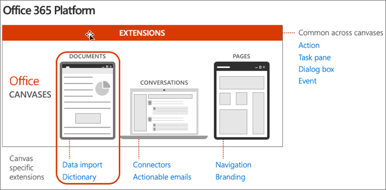
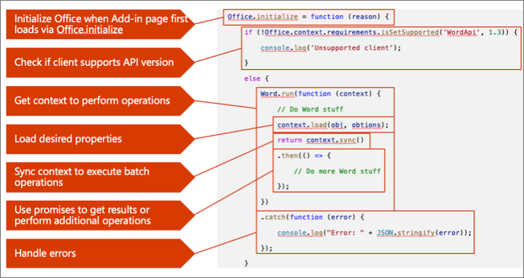
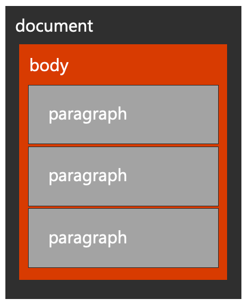

The Word JavaScript API enables programmatic control over text, formatting, selections, and ranges in Word documents. In this unit, you'll learn how to work with text, paragraphs, apply styles and formatting to text, and how to work with selections and ranges of text from a custom Word add-in.

## Office 365 Platform Overview

The Microsoft Office 365 platform offers a number of canvases for developers to embed customizations and Office add-ins are one of three canvases: documents, conversations  and pages.

Microsoft Teams makes conversations between users and enables developers to extend the experience using messaging extensions, conversational bots, and other customization options.

Developers customize pages in SharePoint Server and SharePoint online using the SharePoint Framework.

Office clients, such as Word, Excel, PowerPoint, OneNote, and Outlook can also be extended to implement custom task panes, actions, and additional customizations using add-ins.



## Anatomy of Office.js add-in for Microsoft Word

We'll start by looking at an anatomy of an Office.js for Microsoft Word:



- All Office add-ins must call off the `Office.initialize()` method when a page first loads the add-in.
- If you're using a newer Office.js capability in your add-in, it's important to check if the client supports those extensions using the `requirements` API.
- For the Word JavaScript APIs, you'll use the `Word.run()` method to get an instance of the current document `context`.
- Once you have a reference to the current Word document's `context`, you can load any properties on the context using the `load()` method. This method will add the request queue, allowing you to chain multiple requests together for performance reasons.
- When you're ready to retrieve the properties you queued, or to do any queued actions, use the`context.sync()` method to execute the batch of queued operations defined using the `load()` method.
- The `context.sync()` method returns a JavaScript promise that can be used to get results or a previous operation and do new operations.
- As a best practice, you should listen for, catch, and handle any errors that might occur when working with the Word JavaScript APIs.

## Text and paragraphs

Word add-in developers should understand a Word document's hierarchy and how that relates to the objects in Office.js.



Office.js provides context to a Word document through Word.run and the `context.document` property.
The document contains a body, which contains a number of collections, including paragraphs, tables, and more.

The relationships in this hierarchy are exposed as properties in the API allowing traversal up (ex: `paragraph.parentBody`), down (ex: `body.paragraphs`), and horizontal (ex: `paragraph.getNext()` or `paragraph.getPrevious()`).

Office.js allows you to insert new paragraphs and edit, delete, clear existing paragraphs, and how they appear in a document.

Paragraphs are aware of their siblings using `getNext()` and `getPrevious()` operations and when inserting a paragraph relative to itself using `before` of `after` location.

The following code snippets demonstrate working examples of working text and paragraphs using the Word JavaScript API:

- obtain reference to the document body:

    ```javascript
    const docBody = context.document.body;
    ```

- insert a paragraph at the start of the document body:

    ```javascript
    docBody.insertParagraph('Hello World', 'Start');
    ```

- get a reference to the first paragraph in a document body:

    ```javascript
    const paragraph = context.document.body.paragraphs.getFirst();
    ```

- get a reference to the second paragraph in a document body:

    ```javascript
    const paragraph = context.document.body.paragraphs.getFirst().getNext();
    ```

- get a reference to the last paragraph in a document body:

    ```javascript
    const paragraph = context.document.body.paragraphs.getLast();
    ```

- insert a paragraph after the current paragraph location:

    ```javascript
    paragraph.insertParagraph('Hello World', 'After');
    ```

- clear the contents of a paragraph:

    ```javascript
    paragraph.clear();
    ```

- delete the first paragraph in a document:

    ```javascript
    const paragraph = context.document.body.paragraphs.items[0].delete();
    ```

- insert a page break after a paragraph:

    ```javascript
    paragraph.insertBreak('page', 'After');
    ```

- iterate through all paragraphs in a document:

    ```javascript
    const paragraphs = context.document.body.paragraphs;
    context.load(paragraphs, 'text');
    return context.sync().then(() => {
      for (var i = 0; i < paragraphs.items.length; i++) {
        // do something with paragraph (paragraphs.items[i])
      }
    }).then(context.sync);
    ```

## Styles and text formatting

Styles and formatting are what make an attractive document. Office.js allows you to easily work with styles and formatting from your custom Word add-in.


### Styles

Styles in Microsoft Word are similar to a CSS class in HTML. They provide a pre-configured and reusable set of formatting to be applied to a paragraph or range of text.

Office.js can apply both default styles and custom styles to paragraphs and ranges of text.

### Fonts

Modifying a font is similar to applying an inline style in HTML. Setting a font allows you to manipulate the font family, weight, size, colors, and more.

Like styles, fonts can be applied to an entire paragraph or range of text.

### Paragraph formatting

In addition to styles and fonts, paragraphs offer additional formatting through Office.js such as alignment, indention, and line spacing.

The following code snippets demonstrate working examples of applying styles and formatting to text and paragraphs using the Word JavaScript API:

- apply a well-known Word style to a paragraph:

    ```javascript
    paragraph.styleBuiltIn = Word.Style.intenseReference;
    ```

- apply a custom style to a paragraph:

    ```javascript
    paragraph.style = 'MyCustomStyle';
    ```

- set the paragraph alignment property using `left`, `centered`, `right`, or `justified`:

    ```javascript
    paragraph.alignment = 'centered';
    ```

- change the font of a range of text:

    ```javascript
    range.font.set({
        name: 'Courier New',
        bold: true,
        size: 18,
        color: '#0000ff',
        highlightColor: '#ffff00'
    });
    ```

## Selections and ranges

When working with Office add-ins, developers will often hear the term *range*. A range is any contiguous area of a document in Microsoft Word.

Ranges can be established through a number of ways, including search, selection, or through a conversion. For example, the `paragraph.getRange()` method will return the paragraph as a range.


*Selections* allow you to manipulate both the content and location of focus in a document.

You can get the selection of a range or set the selection on a range

The following code snippets demonstrate working examples of obtaining and working with selections of text using the Word JavaScript API:

- get a selected range of text:

    ```javascript
    const originalRange = document.getSelection();
    ```

- append text to a range of text:

    ```javascript
    originalRange.insertText('added to the end', 'End');
    ```

- select a range of text using the section modes of `Select`, `Start`, or `End`:

    ```javascript
    someRange.select('Select');
    ```

- search the current paragraph for a range of text and replace it:

    ```javascript
    var ranges = paragraph.search('office', {matchCase: true, ignoreSpace: true});
    context.load(ranges);
    return context.sync().then(() => {
      for (var i = 0; i < ranges.items.length; i++) {
        ranges.items[i].insertText("Office", "Replace");
      }
    }).then(context.sync);
    ```

## Summary

The Word JavaScript API enables programmatic control over text, formatting, selections, and ranges in Word documents. In this unit, you'll learn how to work with text, paragraphs, apply styles and formatting to text, and how to work with selections and ranges of text from a custom Word add-in.
