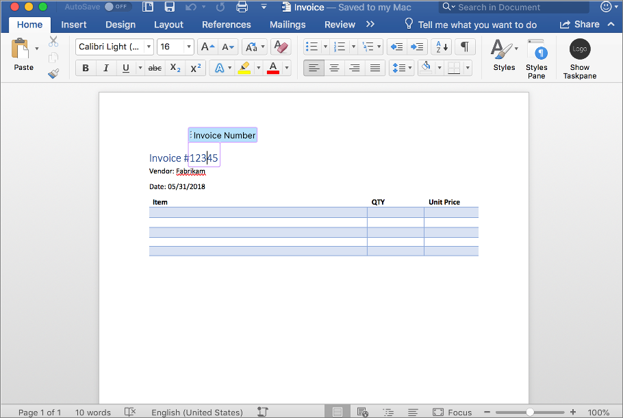

In this unit, you'll learn what content controls are and how you can use them in Microsoft Word documents.

## What are content controls

Content controls are bounded in a document that serve as containers for specific types of content (similar to a field). Authors can label content controls to indicate to consumers how to use the content.



Content controls are used to add structure to an otherwise unstructured range on text. They're especially useful in document templates.

Individual content controls may contain contents such as images, tables, or paragraphs of formatted text. Developers can interact with rich text content controls using the Word JavaScript API, Office.js.

### Insert content controls in Word documents

The document body and any table, inline picture, paragraph, or range can be wrapped in a content control.

Create a content control by first getting reference to a supported object and using the `insertContentControl()` method. This method returns an instance of the `ContentControl` object.

Content controls have a number of properties that make them easier to use and to reference or update their contents at a later date.

### Update content in content controls

Content controls are accessed through the `contentControls` collection of an object and filtered specific to `ID`, `Tag`, `Title`, or `Type`.

The content in a content control can be accessed using `get*()` and `insert*()` methods on the corresponding object, such as `getHtml()` and `insertTable()`.

## ContentControl object properties

The following table contains a list of properties available to developers on the `ContentControl` object. Each of these properties can be set using Office.js.

Notice a number of the properties determine the appearance of the content. Many of the properties are used to easily reference the control, such as the `tag` property.

|      Property       |                                                                    Description                                                                     |
| ------------------- | -------------------------------------------------------------------------------------------------------------------------------------------------- |
| `appearance`        | Appearance of content control can be `boundingBox`, `tags`, or `hidden`                                                                            |
| `cannotDelete`      | Indicates whether the user can delete content control                                                                                              |
| `cannotEdit`        | Indicates whether the user can edit contents of the content control                                                                                |
| `color`             | Optional color in `#RRGGBB` or name format                                                                                                         |
| `placeholderText`   | Placeholder text of the content control                                                                                                            |
| `removedWhenEdited` | Indicates if control is removed after its edited                                                                                                   |
| `style`             | Style name for the content control using a custom style                                                                                            |
| `styleBuiltIn`      | Built-in style name for the content control                                                                                                        |
| `subtype`           | Subtype can be `RichTextInline`, `RichTextParagraphs`, `RichTextTableCell`, `RichTextTableRow`, and `RichTextTable` for rich text content controls |
| `tag`               | Tag to identify a content control                                                                                                                  |
| `text`              | Text of the content control                                                                                                                        |
| `title`             | Title for a content control                                                                                                                        |
| `type`              | Content control type, only `RichText` supported                                                                                                    |

The following code examples include common scenarios developers will come across when using Office.js and content controls:

- get all content controls in a document:

    ```javascript
    const ctrl = context.document.contentControls;
    ```

- get first content control by tab name:

    ```javascript
    const ctrl = context.document.contentControls.getByTag("MyContentControl").getFirst();
    ```

- get the HTML representation of content in a content control:

    ```javascript
    var html = ctrl.getHtml();
    ```

- insert a content control based on the selection within a document:

    ```javascript
    const selectionRange = context.document.getSelection();
    const ctrl = selectionRange.insertContentControl();
    ctrl.title = "Invoice Number";
    ctrl.tag = "InvoiceNumber";
    ctrl.appearance = "BoundingBox";
    ctrl.color = "#FF9900";
    ```

## Summary

In this unit, you learned what content controls are and how you can use them in Microsoft Word documents.
