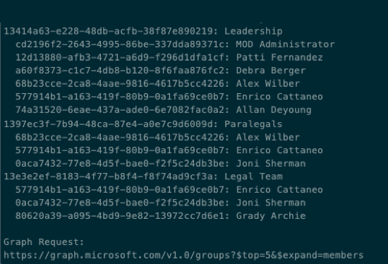
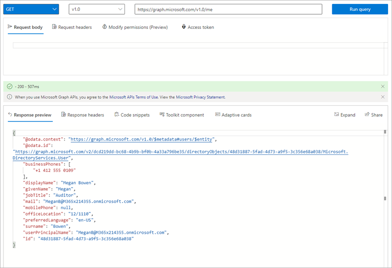

In this exercise, you'll use the Azure AD application and .NET console application you previously created to find related entities and search for users by using the $expand and $search query parameters.

> [!IMPORTANT]
> This exercise assumes you have created the Azure AD application and .NET console application from the previous unit in this module. You'll edit the existing Azure AD application and .NET console application created in that exercise in this exercise.

### Update the Azure AD application permissions to Microsoft Graph

In this exercise, you'll use the `$expand` query parameter to retrieve the contents of a user's OneDrive [for Business] account. For this query to work, you need to add a permission grant to the Azure AD application created in the previous exercise.

Open a browser and navigate to the [Azure Active Directory admin center (https://aad.portal.azure.com)](https://aad.portal.azure.com). Sign in using a **Work or School Account**.

Select **Azure Active Directory** in the left-hand navigation.

Select **Manage > App registrations** in the left-hand navigation.

On the **App registrations** page, select the application you previously created. For example, **Graph Console App**.

Select **API Permissions** in the left-hand navigation panel.


Select the **Add a permission** button.


In the **Request API permissions** panel that appears, select **Microsoft Graph** from the **Microsoft APIs** tab.


When prompted for the type of permission, select **Application permissions**.

Enter **Group.R** in the **Select permissions** search box and select the **Group.Read.All** permission, followed by the **Add permission** button at the bottom of the panel.

At the bottom of the **API Permissions** panel, select the button **Grant admin consent for [tenant]**, followed by the **Yes** button to grant all users in your organization this permission.

### Update the console app to use the $expand query parameter

You'll modify the code that follows this line to obtain a list of all groups in your Office 365 tenancy. In addition, you'll leverage the `$top` query parameter and the `$expand` parameter to expand a nested collection of members of the group. Using this technique, you're optimizing the app so it does not have to request the members for each group as it iterates through the collection.

Open the .NET console app in Visual Studio Code and then open the **Program.cs** file.

Locate the line in the `Main()` method that was obtaining an instance of the Graph client:

```cs
var client = GetAuthenticatedGraphClient(config);
```

The code that immediately follows this line creates a collection of `QueryOption` objects. Remove all items in this collection except the `$top` parameter. Set the value of the `$top` parameter to **5**.

Next, update the query that previously retrieved users to request groups. Notice the addition of the `.Expand()` method that instructs Microsoft Graph to include the members collection for each group:

```cs
var graphRequest = client.Groups.Request().Top(5).Expand("members");
```

Update the `foreach` loop to output the group details, and for each group write the members:

```cs
foreach(var group in results)
{
  Console.WriteLine(group.Id + ": " + group.DisplayName);
  foreach(var member in group.Members)
  {
    Console.WriteLine("  " + member.Id + ": " + ((Microsoft.Graph.User)member).DisplayName);
  }
}
```

Rebuild and rerun the console application by executing the following commands in the command line:

```shell
dotnet build
dotnet run
```

Notice how the name of each group is written to the console, and the names of the members:



This example focuses on using the Microsoft Graph .NET SDK to create queries. In the previous screenshot, notice the query endpoint submitted to Microsoft Graph after the results are written to the console.

## Use the Graph Explorer to search for content

The tool Graph Explorer enables developers to create and test queries using the Microsoft Graph REST API. You'll use the Graph Explorer to create and test a query that uses the `$search` query parameter

Open a browser and navigate to https://developer.microsoft.com/graph/graph-explorer


The Graph Explorer will execute the query entered at the top of the page and display the results in the lower half of the page.

Select the **Run Query** button to execute the default query **https://graph.microsoft.com/v1.0/me/**:



Without logging in, the Graph Explorer will query a sample data collection.

The `$search` query parameter is supported on the **people** endpoint. Enter the following endpoint into the Graph Explorer and select **Run Query**: **https://graph.microsoft.com/v1.0/me/people**.

Notice you can scroll through many results in the **Response Preview** window after executing the query.

Now enter the following query that will search for a user with the name *"wilke"* and select the **Run Query** button. This time the query will only return a single user: **https://graph.microsoft.com/v1.0/me/people?search="wilke"**.

The `$search` query parameter also supports wildcards. Execute the following query to see many more people were found in the same data collection: **https://graph.microsoft.com/v1.0/me/people?search="wil\*"**.

## Summary

In this exercise, you modified the existing Azure AD application and.NET console application to use the `$expand` query parameter. The `$expand` parameter allows developers to limit multiple requests for data, such as enumerating through many groups to retrieve a list of group members.

You also used the Graph Explorer utility to use the `$search` query parameter to find specific users. This query parameter also enables developers to optimize queries by not enumerating through large data collections to find a single entity, and instead leverage the more efficient search capability.
