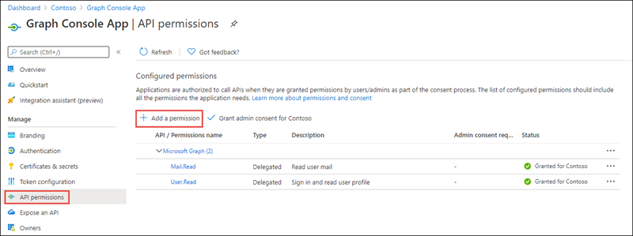
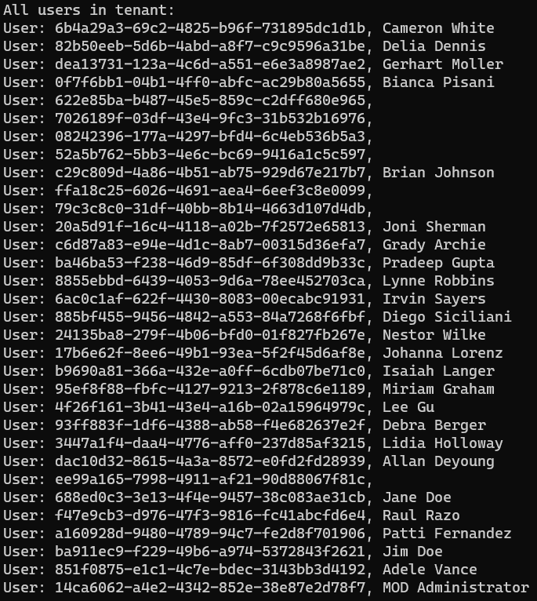
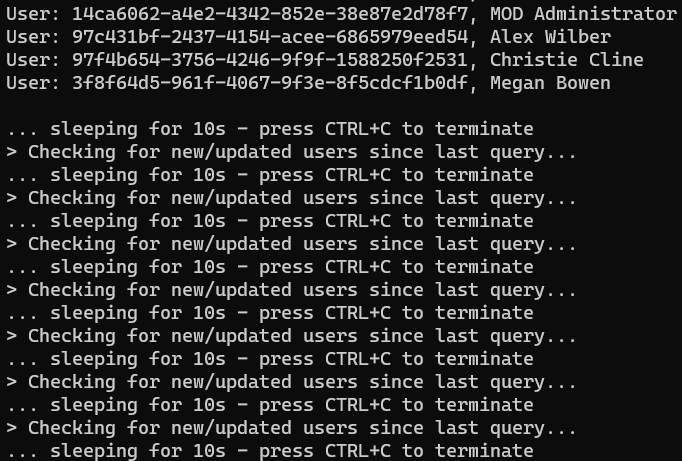
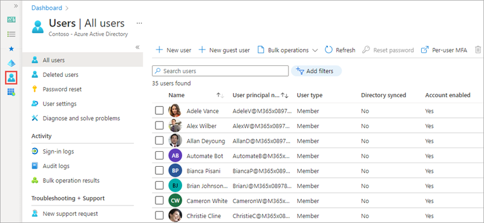

In this exercise, you'll use the Azure AD application and .NET console application you previously created and modify them to demonstrate using the delta query feature of Microsoft Graph. An application can leverage the delta query feature to avoid costly requests to poll for changes in Microsoft Graph that can trigger requests to be throttled.

## Add an additional permission the Azure AD application

In this exercise, you'll update the application to get a list of all the users in the tenant. To do this task, the Azure AD application needs additional permissions.

Open a browser and navigate to the [Azure Active Directory admin center (https://aad.portal.azure.com)](https://aad.portal.azure.com). Sign in using a **Work or School Account**.

Select **Azure Active Directory** in the left-hand navigation.

  

Select **Manage > App registrations** in the left-hand navigation.

On the **App registrations** page, select the **Graph Console App**, or the name of the application you created in this module in a previous exercise.

Select **API Permissions** in the left-hand navigation panel.



Select the **Add a permission** button.

In the **Request API permissions** panel that appears, select **Microsoft Graph** from the **Microsoft APIs** tab.


When prompted for the type of permission, select **Delegated permissions** and search for the permission **User.Read.All**, select it and then select the **Add permission** button at the bottom of the panel.

In the **Configured Permissions** panel, select the button **Grant admin consent for [tenant]**, and then select the **Yes** button in the consent dialog to grant all users in your organization this permission.

## Update the console application to use delta query

Now you'll update the application to retrieve and then display all users in the tenant with Microsoft Graph. After displaying the list of users, the application will sleep for 10 seconds and repeat the same query, but instead only display the users who have been added or updated.

First, add the following two members to the class, immediately before the `Main` method:

```csharp
private static object _deltaLink = null;
private static IUserDeltaCollectionPage _previousPage = null;
```

### Add a Method to Display Users

Within the **Program.cs** file, add the following method to write all users to the console:

```csharp
private static void OutputUsers(IUserDeltaCollectionPage users)
{
  foreach (var user in users)
  {
    Console.WriteLine($"User: {user.Id}, {user.GivenName} {user.Surname}");
  }
}
```

## Add a method to retrieve users

Next, add a method to retrieve users with Microsoft Graph. This method will use the delta link feature in Microsoft Graph.

If this is the first time the request is made, indicated by the `_previousPage == null`, you'll request all users but also request a delta link using the `Delta()` method. The code will return the current page of users.

Otherwise, if there are more pages of users, it will start a request for the next page using the delta link string that you'll obtain later.

Add the following method to the `Program` class:

```csharp
private static IUserDeltaCollectionPage GetUsers(GraphServiceClient graphClient, object deltaLink)
{
  IUserDeltaCollectionPage page;

  // IF this is the first request (previous=null), then request all users
  //    and include Delta() to request a delta link to be included in the
  //    last page of data
  if (_previousPage == null)
  {
      page = graphClient.Users
                        .Delta()
                        .Request()
                        .Select("Id,GivenName,Surname")
                        .GetAsync()
                        .Result;
  }
  // ELSE, not the first page so get the next page of users
  else
  {
    _previousPage.InitializeNextPageRequest(graphClient, deltaLink.ToString());
    page = _previousPage.NextPageRequest.GetAsync().Result;
  }

  _previousPage = page;
  return page;
}
```

## Add a method to check for new and changed users

The next method will be used to check for new and changed users. The first time it runs, it will get all users and display them page by page until it reaches the last page of the response from Microsoft Graph.

Add the following method to the `Program` class:

```csharp
private static void CheckForUpdates(IConfigurationRoot config, string userName, SecureString userPassword)
{
  var graphClient = GetAuthenticatedGraphClient(config, userName, userPassword);

  // get a page of users
  var users = GetUsers(graphClient, _deltaLink);

  OutputUsers(users);

  // go through all of the pages so that we can get the delta link on the last page.
  while (users.NextPageRequest != null)
  {
    users = users.NextPageRequest.GetAsync().Result;
    OutputUsers(users);
  }
}
```

The last thing this method needs to do is retrieve the delta link from the last page of results. This delta link, a string, will be used in future requests that will signal to Microsoft Graph to only return users who have been added or changed since the previous request.

Add the following code to the end of the `CheckForUpdates` method:

```csharp
object deltaLink;

if (users.AdditionalData.TryGetValue("@odata.deltaLink", out deltaLink))
{
  _deltaLink = deltaLink;
}
```

## Update the application to use the new `CheckForUpdates` method

Locate the following code in the `Main` method:

```csharp
var userName = ReadUsername();
var userPassword = ReadPassword();
```

Remove all the existing code in this method after these two lines.

Next, add the following code to after the previous two lines above. This will use the `CheckForUpdates` method to get a list of all users. It will then go into an infinite loop, sleeping for 10 seconds, and issue the same request again:

```csharp
Console.WriteLine("All users in tenant:");
CheckForUpdates(config, userName, userPassword);
Console.WriteLine();
while (true)
{
  Console.WriteLine("... sleeping for 10s - press CTRL+C to terminate");
  System.Threading.Thread.Sleep(10 * 1000);
  Console.WriteLine("> Checking for new/updated users since last query...");
  CheckForUpdates(config, userName, userPassword);
}
```

The first request will result in the application obtaining the delta link that will be used in future requests to include only the new and changed users. Each time users are requested, the delta link will be refreshed.

### Build and test the application

Run the following command in a command prompt to compile the console application:

```console
dotnet build
```

Run the following command to run the console application:

```console
dotnet run
```

After entering the username and password for the current user, the application will write all the users in the tenant to the console:



If you let the app run for a few moments without doing anything, notice it will keep requesting users, but not display anyone as no users have been created in your tenant:



Now, add a new user to your tenant.

Open a browser and navigate to the [Azure Active Directory admin center (https://aad.portal.azure.com)](https://aad.portal.azure.com). Sign in using a **Work or School Account**.

Select **Users** in the left-hand navigation.



On the **Users - All Users** page, select **New User**.

Create a new user by entering the values in the **Identity** section of the **New User** page and select **Create** at the bottom of the form.


Watch the running application in the console. The next time it runs, it will display the new user that you created:


Press <kbd>CTRL</kbd>+<kbd>C</kbd> to stop the application.

## Summary

In this exercise, you used the Azure AD application and .NET console application you previously created and modified them to demonstrate using the delta query feature of Microsoft Graph. An application can leverage the delta query feature to avoid costly requests to poll for changes in Microsoft Graph that can trigger requests to be throttled.
