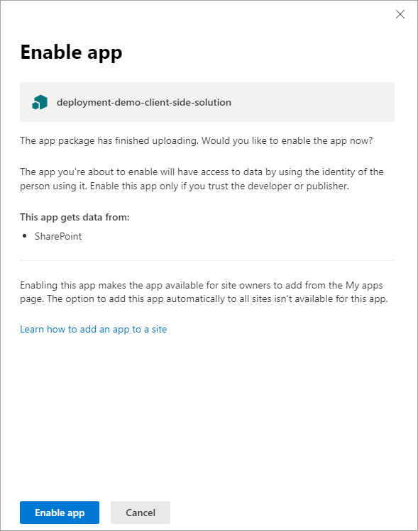
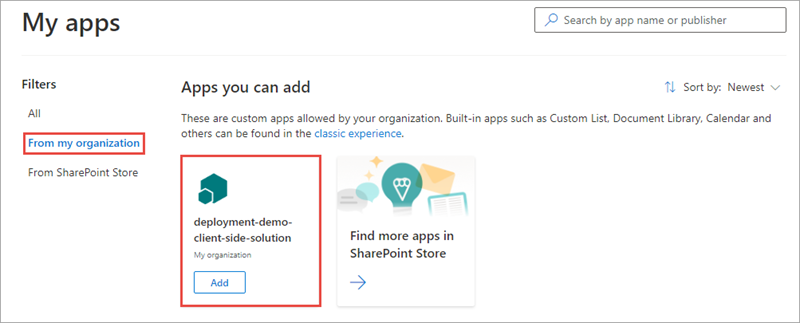
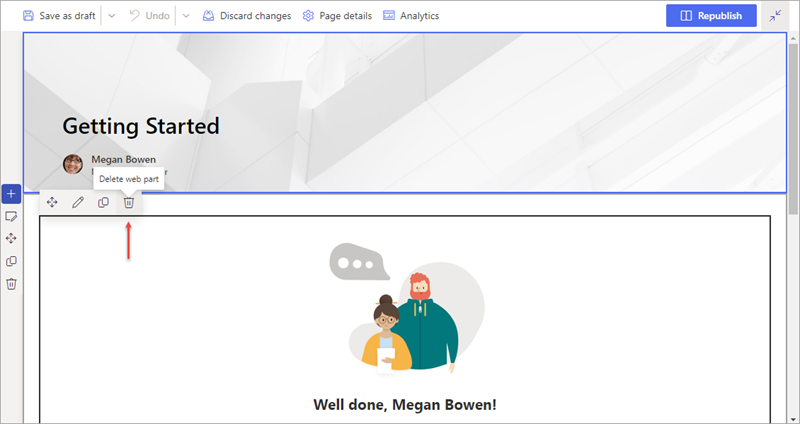
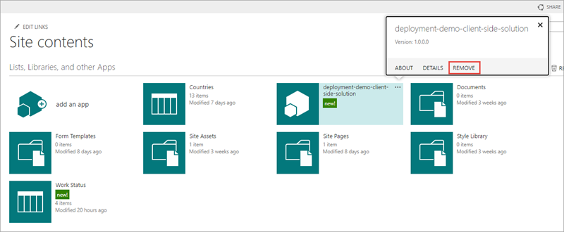
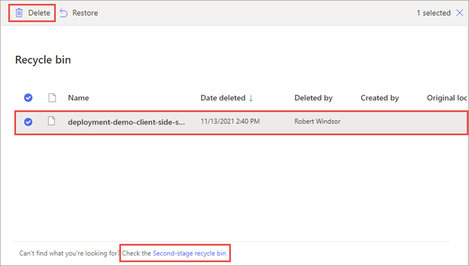
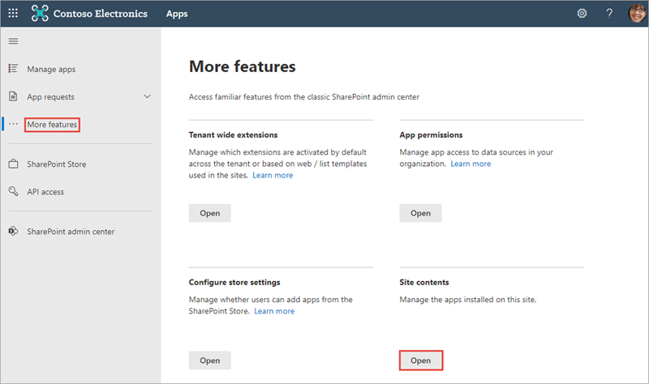

In this exercise, you'll create a SharePoint Framework (SPFx) client-side web part that will be used to try different deployment configurations.

> [!IMPORTANT]
> The instructions below assume you're using v1.14.0 of the SharePoint Framework Yeoman generator. For more information on the use of the SharePoint Framework Yeoman generator, see [Yeoman generator for the SharePoint Framework](https://aka.ms/spfx-yeoman-info).

Open a command prompt and change to the folder where you want to create the project. Run the SharePoint Yeoman generator by executing the following command:

```console
yo @microsoft/sharepoint
```

Use the following to complete the prompt that is displayed (*if more options are presented, accept the default answer)*:

- **What is your solution name?**: DeploymentDemo
- **Which type of client-side component to create?**: WebPart
- **What is your Web part name?**: Deployment Demo
- **Which framework would you like to use?**: No framework

After provisioning the folders required for the project, the generator will install all the dependency packages by running `npm install` automatically. When npm completes downloading all dependencies, open the project folder in **Visual Studio Code**.

## Disable tenant wide deployment

For the exercises in this module, you'll be manually adding the app contained in the SharePoint package to the sites where it will be used. That is, you don't want to give the administrator the option to immediately enable the app and add it to all sites when they upload the package to the app catalog. This can be done by setting the value of the `skipFeatureDeployment` property in the **./config/package-solution.json** file to **false**.

Locate and open the **./config/package-solution.json** file. Verify the `solution` object has a property named `skipFeatureDeployment` and ensure that the value of this property is set to **false**.

## Crnpme a deployment package for the project

Build the project by running the following command on the command line from the root of the project:

```console
gulp build
```

Next, create a production bundle of the project by running the following command on the command line from the root of the project:

```console
gulp bundle --ship
```

Finally, create a deployment package of the project by running the following command on the command line from the root of the project:

```console
gulp package-solution --ship
```

## Deploy the package to a SharePoint site

In a browser, navigate to your SharePoint tenant's App Catalog site.

Microsoft is in the process of transitioning from the classic app catalog user experience to a modern app catalog user experience. If you see the classic app catalog, you can select the **Try the new Manage Apps page** link displayed at the top of the page, or you can add **/_layouts/15/tenantAppCatalog.aspx** to the end of the app catalog site URL. Either option should take you to the modern app catalog (i.e. the **Manage Apps** page).


Drag the package created in the previous steps, located in the project's **./sharepoint/solution/deployment-demo.sppkg**, into the **Apps for SharePoint** library.

In the **Enable app** panel, select **Enable app**:



In the **This app has been enabled** panel, select **Close**.

## Install the SharePoint package in a site collection

Navigate to an existing site collection, or create a new one.

Select **Site Contents** from the left-hand navigation.

From the **New** menu, select **App**.


In the filters, select **From my organization**.

Select the **Add** button in the **deployment-demo-client-side-solution** tile to add your web part.



## Add the web part to a page

Navigate to a SharePoint page.

Put it in edit mode by selecting the **Edit** button in the top-right portion of the content area on the page.

Select the web part icon button to open the list of available web parts:


Select the **Sort and filter** dropdown under the **Search** box, and select **Advanced** under **Filter by category**.

Select the **Deployment Demo** web part in the **Advanced** section.


## Examine the deployed web part files

Once the page loads, open the browser's developer tools and navigate to the **Sources** tab.

Refresh the page and examine where the JavaScript bundle is being hosted.

If you haven't enabled the Office 365 CDN, then the bundle will be hosted from a document library named **ClientSideAssets** in the App Catalog site.


If you've enabled the Office 365 CDN, then the bundle will be automatically hosted from the CDN.


## Remove the deployed web part

### Remove the web part from the page

Select the trash can icon in the toolbar to the left of the web part:



### Remove the SharePoint app

Navigate back to the site's **Site Contents** page.

Select the context menu for the installed package and select the **Remove** action:


In the **Action isn't supported in this view** dialog, select the **Return to classic SharePoint** button:


Select the context menu for the installed package and select the **Remove** action:



In the left-hand navigation menu, select the **Exit classic experience** link.

### Delete the SharePoint app from the recycle bin

Navigate back to the site's **Site Contents** page.

Select **Recycle bin** in the command bar.


Select **deployment-demo-client-side-solution** and select **Delete** in the command bar. Select **Delete** in the pop-up dialog to confirm you wish to delete the file.



Select **Second-stage recycle bin** at the bottom of the page to navigate to the second-stage recycle bin.

Select **deployment-demo-client-side-solution** and select **Delete** in the command bar. Select **Delete** in the pop-up dialog to confirm you wish to delete the file.


### Retract the SharePoint package

Navigate back to the tenant's modern **App Catalog**.

Select the deployed package and then select **Delete** from the command bar:


### Delete the SharePoint package from the recycle bin

Select **More features** from the left-hand navigation, then select **Open** under **Site contents**.



Select **Recycle bin** in the command bar. Delete the SharePoint package **deployment-demo.sppkg** from both the first and second-stage recycle bins using the same steps described above.

## Summary

In this exercise, you created a SharePoint Framework (SPFx) client-side web part that is used to try different deployment configurations.
