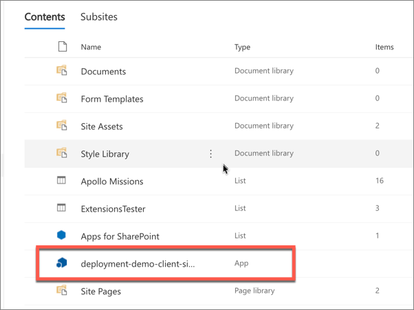
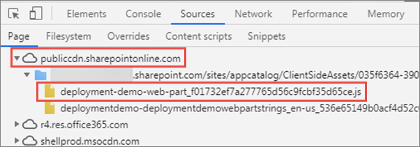

In this exercise, you'll create a SharePoint Framework (SPFx) client-side web part that will be used to try different deployment configurations.

Open a command prompt and change to the folder where you want to create the project. Run the SharePoint Yeoman generator by executing the following command:

```shell
yo @microsoft/sharepoint
```

Use the following to complete the prompt that is displayed (*if additional options are presented, accept the default answer)*:

- **What is your solution name?**: DeploymentDemo
- **Which baseline packages do you want to target for your component(s)?**: SharePoint Online only (latest)
- **Where do you want to place the files?**: Use the current folder
- **Do you want to allow the tenant admin the choice of being able to deploy the solution to all sites immediately without running any feature deployment or adding apps in sites?**: No
- **Will the components in the solution require permissions to access web APIs that are unique and not shared with other components in the tenant?**: No
- **Which type of client-side component to create?**: WebPart
- **What is your Web part name?**: Deployment Demo
- **What is your Web part description?**: Deployment Demo description
- **Which framework would you like to use?**: No JavaScript framework

After provisioning the folders required for the project, the generator will install all the dependency packages by running `npm install` automatically. When NPM completes downloading all dependencies, test the default project provisioned by the generator.

## Create a deployment package for the project

When NPM completes downloading all dependencies, build the project by running the following command on the command line from the root of the project:

```shell
gulp build
```

Next, create a production bundle of the project by running the following command on the command line from the root of the project:

```shell
gulp bundle --ship
```

Finally, create a deployment package of the project by running the following command on the command line from the root of the project:

```shell
gulp package-solution --ship
```

## Deploy the package to a SharePoint site

In a browser, navigate to your SharePoint tenant's App Catalog site.

Select the **Apps for SharePoint** link in the left-hand navigation.

Drag the package created in the previous steps, located in the project's **./sharepoint/solution/deployment-demo.sppkg**, into the **Apps for SharePoint** library.

SharePoint will launch a dialog asking if you want to trust the package:


Select **Deploy**.

## Install the SharePoint package in a site collection

Navigate to an existing site collection, or create a new one.

Select **Site Contents** from the left-hand navigation.

From the **New** menu, select **App**.


Locate the solution you previously deployed and select it.


SharePoint will start to install the application. At first it will be grayed out, but after a few moments you should see it listed as in the following screen capture:



## Add the web part to a page

Navigate to a SharePoint page.

Put it in edit mode by selecting the **Edit** button in the top-right portion of the content area on the page.

Select the web part icon button to open the list of available web parts:


Select the expand icon, a diagonal line with two arrows in the top-right corner, to expand the web part toolbox.

Scroll to the bottom, locate, and select the **Deployment Demo** web part.


## Examine the deployed web part files

Once the page loads, open the browser's developer tools and navigate to the **Sources** tab.

Refresh the page and examine where the JavaScript bundle is being hosted.

If you have not enabled the Office 365 CDN, then the bundle will be hosted from a document library named **ClientSideAssets** in the App Catalog site.


If you have enabled the Office 365 CDN, then the bundle will be automatically hosted from the CDN.



## Remove the deployed web part

### Remove the web part from the page

Select the trash can icon in the toolbar to the left of the web part:


### Uninstall the SharePoint package

Navigate back to the site's **Site Contents** page.

Select the context menu for the installed package and select the **Remove** action:


### Retract the SharePoint package

Navigate back to the tenant's App Catalog site.

Select the **Apps for SharePoint** option from the left-hand navigation.

Select the menu for the deployed package, open the extra actions, and then select **Delete** as shown in the following figure:


## Summary

In this exercise, you created a SharePoint Framework (SPFx) client-side web part that is used to try different deployment configurations.
