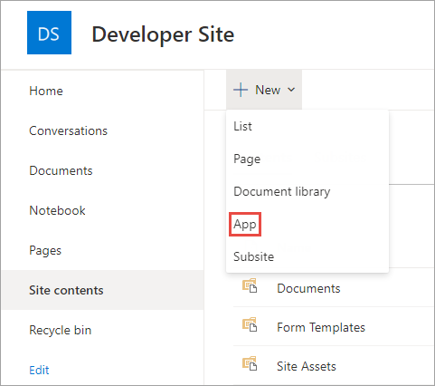
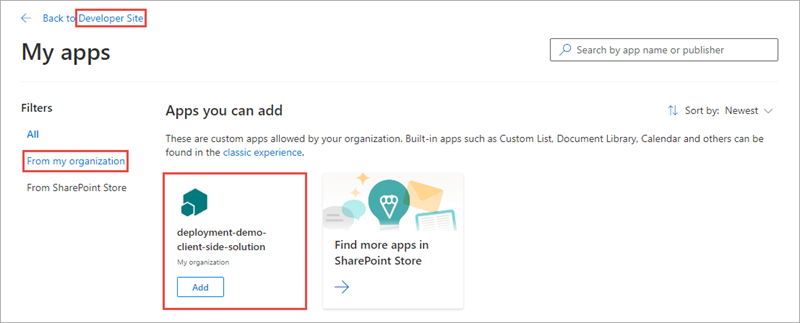

In this exercise, you'll learn how to enable a site collection-scoped App Catalog and deploy an app to it.

## Enable a site collection App Catalog

Navigate to an existing site collection and select **Site Contents** from the left-hand navigation.

In the set of lists on the **Site Contents** page, look for a library named **Apps for SharePoint**. If it's present, you can skip to the next step of this exercise. Otherwise you'll need to create the site collection App Catalog.

Depending on your development platform, create a new site collection App Catalog:

If you're using Windows, you can use the [SharePoint Online Management Shell](https://www.microsoft.com/download/details.aspx?id=35588) PowerShell module:

```console
# login as a tenant admin to the SharePoint Online tenant admin site
# replace the URL shown below with the URL of your SharePoint Online tenant admin site
PS> Connect-SPOService -Url https://contoso-admin.sharepoint.com

# create site collection app catalog
# replace the URL shown below with the URL of a site collection within your SharePoint Online tenant
PS> Add-SPOSiteCollectionAppCatalog -Site https://contoso.sharepoint.com/sites/dev01
```

Instead, you can use the [CLI for Microsoft 365](https://pnp.github.io/office365-cli/). This is a good option when your development environment isn't Windows.

```console
# login as a tenant admin to the SharePoint Online tenant admin site
# replace the URL shown below with the URL of your SharePoint Online tenant admin site
$ spo connect https://contoso-admin.sharepoint.com

# create site collection app catalog
# replace the URL shown below with the URL of a site collection within your SharePoint Online tenant
$ spo site appcatalog add --url https://contoso.sharepoint/sites/dev01
```

A few moments after executing the command to create a new site collection App Catalog, you should see the library **Apps for SharePoint** in the **Site Contents** page.

## Deploy a package to the site collection App Catalog

Locate the ***.sppkg** you created in the previous exercise.

In a browser, navigate to the site collection containing the site collection App Catalog from the previous step.

Select **Site Contents** in the left-hand navigation.

Select the library **Apps for SharePoint** in the list of site contents.

Drag the ***.sppkg** created in the previous steps, into the **Apps for SharePoint** library.

SharePoint will launch a dialog asking if you want to trust the package:


Select **Deploy**.

## Verify the app is only available in the current site collection

Select **Site Contents** from the left-hand navigation.

From the **New** menu, select **App**.



Locate the solution you previously deployed. We'll need the application to be installed for the next exercise so select it to start that process.



Now, navigate to a different site collection.

Select **Site Contents** from the left-hand navigation.

From the **New** menu, select **App**.


Notice the solution you deployed to the other site collection isn't shown.


## Summary

In this exercise, you learned how to enable a site collection-scoped App Catalog and deploy an app to it.
