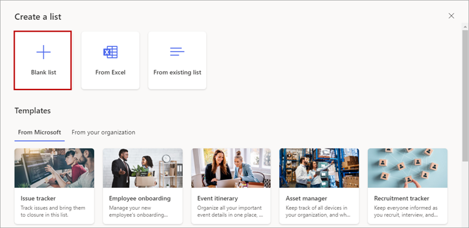
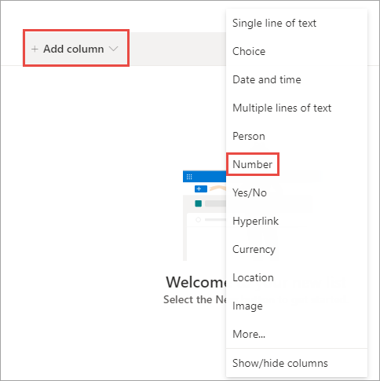
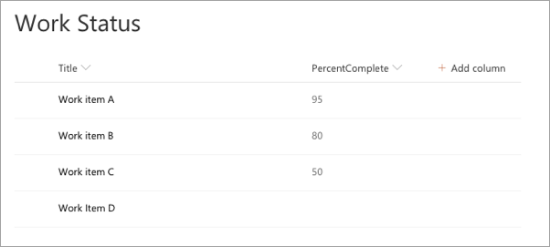

In this exercise, you'll create a SharePoint Framework (SPFx) field customizer extension that will display a colored bar in a column with a percentage of the bar filled depending on the value in the field.

> [!IMPORTANT]
> The instructions below assume you are using v1.11.0 of the SharePoint Framework Yeoman generator.

Open a command prompt and change to the folder where you want to create the project.

Run the SharePoint Yeoman generator by executing the following command:

```console
yo @microsoft/sharepoint
```

Use the following to complete the prompt that is displayed (*if additional options are presented, accept the default answer)*:

- **What is your solution name?**: SPFxFieldCustomizer
- **Which baseline packages do you want to target for your component(s)?**: SharePoint Online only (latest)
- **Where do you want to place the files?**: Use the current folder
- **Do you want to allow the tenant admin the choice of being able to deploy the solution to all sites immediately without running any feature deployment or adding apps in sites?**: No
- **Will the components in the solution require permissions to access web APIs that are unique and not shared with other components in the tenant?**: No
- **Which type of client-side component to create?**: Extension
- **What type of client-side extension to create?**: Field Customizer
- **What is your Field Customizer name?**: HelloFieldCustomizer
- **What is your Field Customizer description?**: HelloFieldCustomizer description
- **Which framework would you like to use?**: No JavaScript Framework

After provisioning the folders required for the project, the generator will install all the dependency packages by running `npm install` automatically. When NPM completes downloading all dependencies, open the project folder in **Visual Studio Code**.

## Update the SCSS styles

The field customizer you'll create applies specific colors to the cell that you'll modify. Implement these custom styles before coding the extension.

Locate and open the **./src/extensions/helloFieldCustomizer/HelloFieldCustomizerFieldCustomizer.module.scss** file. Replace the contents of the file with the following styles:

```scss
.HelloFieldCustomizer {
  .cell {
    display: 'inline-block';
  }
  .filledBackground {
    background-color: #cccccc;
    width: 100px;
  }
}
```

## Code the field customizer

Locate and open the **./src/extensions/helloFieldCustomizer/HelloFieldCustomizerFieldCustomizer.ts** file.

Locate the interface `IHelloFieldCustomizerFieldCustomizerProperties` and update its properties to the following code:

```typescript
greenMinLimit?: string;
yellowMinLimit?: string;
```

Locate the method `onRenderCell()` and update the contents to match the following code. This code looks at the existing value in the field and builds the relevant colored bars based on the value entered in the completed percentage value.

```typescript
event.domElement.classList.add(styles.cell);

// determine color and text to use
const fieldValue = parseInt(event.fieldValue);
let filledColor: string = '';

if (isNaN(fieldValue) || fieldValue === 0) {
  event.domElement.innerHTML = `
    <div class="${styles.HelloFieldCustomizer}">
      <div class="">
        <div style="width: 100px; color:#000000;">
          &nbsp; no progress
        </div>
      </div>
    </div>
  `;
} else {
  if (fieldValue >= parseInt(this.properties.greenMinLimit)) {
    filledColor = '#00ff00';
  } else if (fieldValue >= parseInt(this.properties.yellowMinLimit)) {
    filledColor = '#ffff00';
  } else {
    filledColor = '#ff0000';
  }

  event.domElement.innerHTML = `
    <div class="${styles.HelloFieldCustomizer}">
      <div class="${styles.filledBackground}">
        <div style="width: ${fieldValue}px; background:${filledColor}; color:#000000;">
          &nbsp; ${fieldValue}% completed
        </div>
      </div>
    </div>`;
}
```

## Create a SharePoint list to use during testing

In a browser, navigate to a SharePoint Online modern site collection where you want to test the field customizer.

Select the **Site contents** link in the left-hand navigation and then select **New > List** in the toolbar. Select the **Blank list** template.



Set the list name to **Work Status** and select **Create**.


When the list loads, select the **Add column > Number** to create a new column.



In the **Create a column** dialog, set Name to **PercentComplete** and select **Save**.

Add a few items to the list, such as the following figure:



## Update the testing and deployment configuration

Field customizers, when deployed to production, are implemented by creating a new site column who's rendering is tied to the custom script defined in the field customizer's bundle file.

Locate and open the **./sharepoint/assets/elements.xml** file.

Add the following property to the `<Field>` element, setting the values on the public properties on the field customizer:

```xml
ClientSideComponentProperties="{&quot;greenMinLimit&quot;:&quot;85&quot;,&quot;yellowMinLimit&quot;:&quot;70&quot;}"
```

Locate and open the **./config/serve.json** file.

Copy in the full URL (including **AllItems.aspx**) of the list you created into the `serveConfigurations.default.pageUrl` property.

Locate the `serveConfigurations.default.properties` object.

Change the name of the property `serveConfigurations.default.fieldCustomizers.InternalFieldName` to `serveConfigurations.default.fieldCustomizers.PercentComplete`. This property tells the SharePoint Framework which existing field to associate the field customizer with.

Change the value of the `properties` object to the following JSON:

```json
"properties": {
  "greenMinLimit": "85",
  "yellowMinLimit": "70"
}
```

> [!NOTE]
> You do not need to change the value of the `id` property.

The JSON for the default serve configuration should look similar to the following code:

```json
"default": {
  "pageUrl": "https://contoso.sharepoint.com/sites/mySite/Lists/Work%20Status/AllItems.aspx",
  "fieldCustomizers": {
    "PercentComplete": {
      "id": "6a1b8997-00d5-4bc7-a472-41d6ac27cd83",
      "properties": {
        "greenMinLimit": "85",
        "yellowMinLimit": "70"
      }
    }
  }
}
```

## Test the field customizer

Run the project by executing the following command:

```console
gulp serve
```

When prompted, select the **Load debug scripts** button.

When the page loads, notice how the rendering has changed according to the code in your field customizer:


Stop the local web server by pressing <kbd>CTRL</kbd>+<kbd>C</kbd> in the console/terminal window.

## Summary

In this exercise, you'll create a SharePoint Framework (SPFx) field customizer extension that will display a colored bar in a column with a percentage of the bar filled depending on the value in the field.
