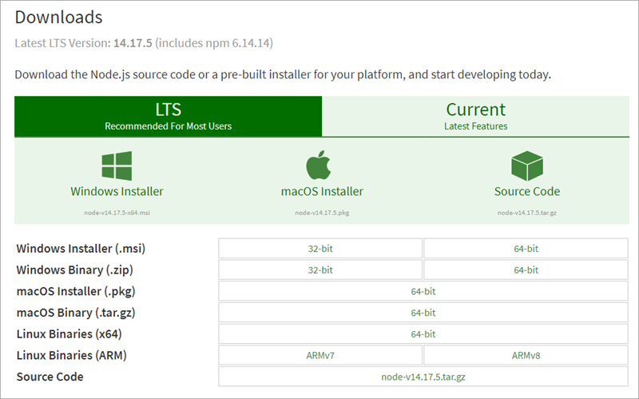
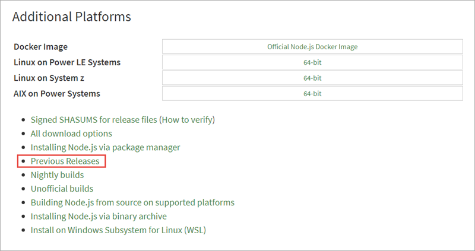
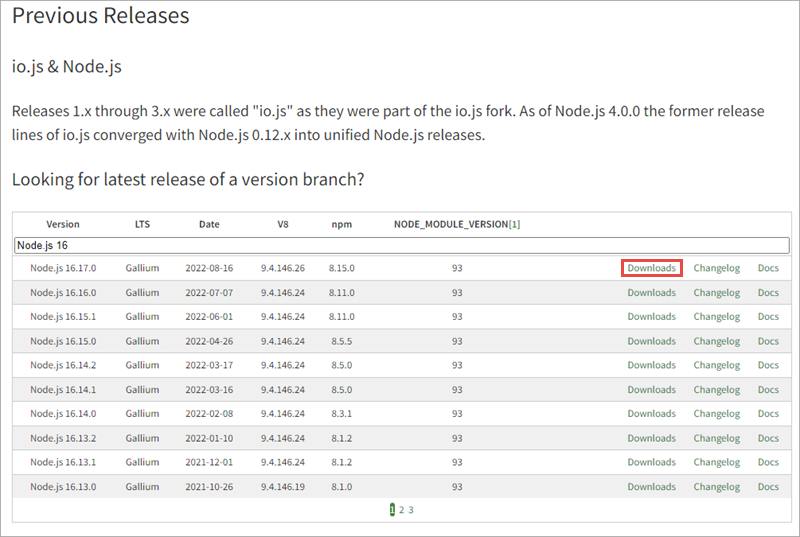

In this exercise, you'll set up your local developer environment with everything you need to start creating SharePoint Framework components.

## Install a code editor

You'll need a text editor to edit your code files. There are no requirements for what you need in a text editor.

The rest of this lab, and most of the examples you'll find from Microsoft, use [Visual Studio Code](https://code.visualstudio.com/).

## Install Node.js

The tools used in compiling, debugging, and packaging SharePoint Framework projects are built using Node.js, which is a runtime that enables JavaScript to run locally versus in a browser. So, the first step is to install the runtime, Node.js, before installing the required tools.

> Node.js is available in two different releases: the long term support release (aka: LTS) is the most stable version that is recommended for most users while the current version contains the latest features.
> Before installing Node.js, you should verify that you haven't installed it previously. Open a command prompt or terminal (depending on your developer platform) and execute the following command:
>
> ```console
> node -v
> ```
>
> If a version number is returned, you already have Node.js. The version(s) of Node.js you may use depends on the environment(s) you'll be targeting.
>
> If you are building projects for SharePoint 2016, then you should not use a version of Node.js later than v8.x. If you do you'll not be able to debug SharePoint 2016 projects in the local or SharePoint-hosted workbenches. This means that the maximum version of the SharePoint Framework Yeoman generator you may use is v1.10.0.
>
> If you are building projects for SharePoint 2019 and/or SharePoint Online, then it is recommended that you install the latest version of Node.js v14.x and the latest version of the SharePoint Framework (which is currently v1.12.1).

### SharePoint Framework / Node.js Compatibility

| SPFx    | Node.js                         |
| ------- | ------------------------------- |
| v1.12.1 | v10.13.0+, v12.13.0+, v14.15.0+ |
| v1.11.0 | v10.x                           |
| v1.10.0 | v8.x, v10.x                     |
| v1.9.1  | v8.x, v10.x                     |
| v1.9.0  | v8.x, v10.x                     |
| v1.8.2  | v8.x, v10.x                     |
| v1.8.1  | v8.x                            |
| v1.8.0  | v8.x                            |
| v1.7.1  | v8.x                            |
| v1.7.0  | v8.x                            |
| v1.6.0  | v6.x, v8.x                      |
| v1.5.1  | v6.x, v8.x                      |
| v1.5.0  | v6.x, v8.x                      |
| v1.4.1  | v6.x, v8.x                      |
| v1.4.0  | v6.x, v8.x                      |
| v1.2.0  | v6.x, v8.x                      |
| v1.1.1  | v6.x, v8.x                      |
| v1.1.0  | v6.x                            |

> For SharePoint Framework v1.1.1 through 1.4.0, a workaround is required when debugging in the local or hosted workbench if you have Node.js v8.x installed. Please see the following GitHub issue for more information: [Run gulp serve with 'NODE_NO_HTTP2=1' when using SPFx on node v8](https://github.com/SharePoint/sp-dev-docs/issues/1002).

If you already have a version of Node.js that's compatible with the environment(s) you'll be targeting, then skip to the next section.

Open a browser and navigate to the Node.js Foundation site: https://www.nodejs.org.

### To install the current LTS version of Node.js

Select **Downloads** from the top menu navigation, ensure the **LTS** tab is selected, and download the appropriate installer or binary for the platform you're using.



Run the installer, accepting all the default options. This will install Node.js and NPM (*a package manager that Node.js uses, similar to .NET's NuGet*).

### To install a previous version of Node.js 

To install a previous version of Node.js, you'll need to navigate further into the site to find the appropriate installer.

Select **Downloads** from the top menu navigation then scroll to the bottom of the page and select **Previous Releases**.



In the Previous Releases page, select the version of Node.js you wish to install.



Download the appropriate installer or binary for the platform you're using.


Run the installer, accepting all the default options. This will install Node.js and NPM (*a package manager that Node.js uses, similar to .NET's NuGet*).

## Install required tools

The SharePoint Framework development experience uses a set of tools built on Node.js that are popular among web developers. These tools are built on Node.js, which means they can be used on any platform and will work the same way. This includes Windows, macOS, and Linux.

### Install Yeoman

Yeoman is a scaffolding engine, which executes *generators* that prompt the user with questions. Based on the answers to these questions, Yeoman then creates the folders and files defined by the generator.

Open a command prompt / terminal window and execute the following command to install Yeoman globally with NPM:

```console
npm install --global yo
```

### Install Gulp

Gulp is a task runner utility. It's similar to MSBuild, a tool used by .NET developers and Visual Studio to compile projects, package solutions, and start a debugging experience.

Open a command prompt / terminal window and execute the following command to install Gulp globally with NPM:

```console
npm install --global gulp
```

> [!IMPORTANT]
> If you're using Node.js v12.x or higher, you must use Gulp v4.x. If you're using a version of Node.js lower than v12.x, you must use Gulp v3.x. For more information, see: [SharePoint Framework v1.12.1 release notes | Gulp versions & Node.js v12+](/sharepoint/dev/spfx/release-1.12.1#gulp-versions--nodejs-v12).

### Install the SharePoint Framework Yeoman generator

Microsoft has created a Yeoman generator for scaffolding SharePoint Framework projects.

To install the latest version of the SharePoint Framework Yeoman generator globally with NPM, open a command prompt / terminal window and execute the following command:

```console
npm install --global @microsoft/generator-sharepoint
```

To install a specific version of the SharePoint Framework Yeoman generator globally with NPM, open a command prompt / terminal window and execute the following command:

```console
npm install --global @microsoft/generator-sharepoint@[version number]
```

For example:

```console
npm install --global @microsoft/generator-sharepoint@1.9.1
```

## Summary

In this exercise, you set up your local developer environment with everything you need to start creating SharePoint Framework components.
